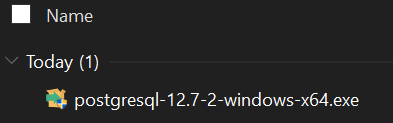

# Installing pgAdmin and Postgres on Windows

SQL requires us to use a code editor with the ability to execute the scripts that are created by developers. This section guides you through the process of installing pgAdmin and Postgres on a Windows machine. 

## Before You Begin

* Remember to choose the installation package specific to your operating system and download the latest version.

* Be prepared to record your password—you will need it later!

## Download Link

* [PostgreSQL]( https://www.enterprisedb.com/downloads/postgres-postgresql-downloads)

* [Installation Instructions](https://www.enterprisedb.com/docs/supported-open-source/postgresql/installer/)

## Installation Instructions

* After downloading the latest version of PostgreSQL 12.11, double-click the `postgresql-12.11-1-windows-x64.exe` file.

* **Note:** The exact file version may be slightly different.

  

* Go through the Setup Wizard and install PostgreSQL. Keep the default location `C:\Program Files\PostgreSQL\12`.

* Select the components to be installed. Uncheck the option to install Stack Builder.

  

* Add your data directory. Keep the default location `C:\Program Files\PostgreSQL\12\data`.

* Enter `postgres` as the password. **Be sure to record this password for future use.**

* Keep the default port as `5432`. In the Advanced Options, set the locale as  `[Default locale]`.

* The final screen will be the `Pre Installation Summary`.

* When the process is complete, you can access the `Postgres 12` folder from the Start menu of your computer.

  * This folder contains the `pgAdmin 4` application. 

  * To confirm the installation, start `pgAdmin` (it will open in a new browser window). Connect to the default server by clicking on it and entering the password if prompted.

- - - 

Copyright 2022 2U. All Rights Reserved.