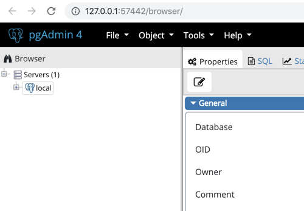
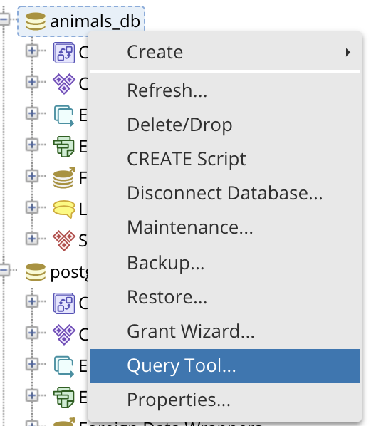
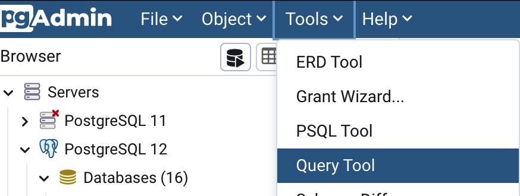
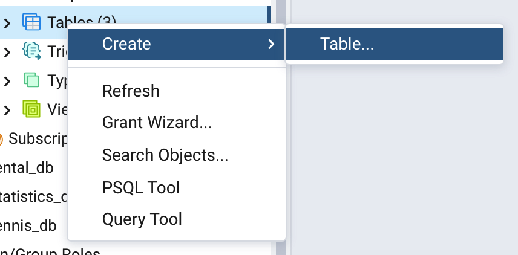
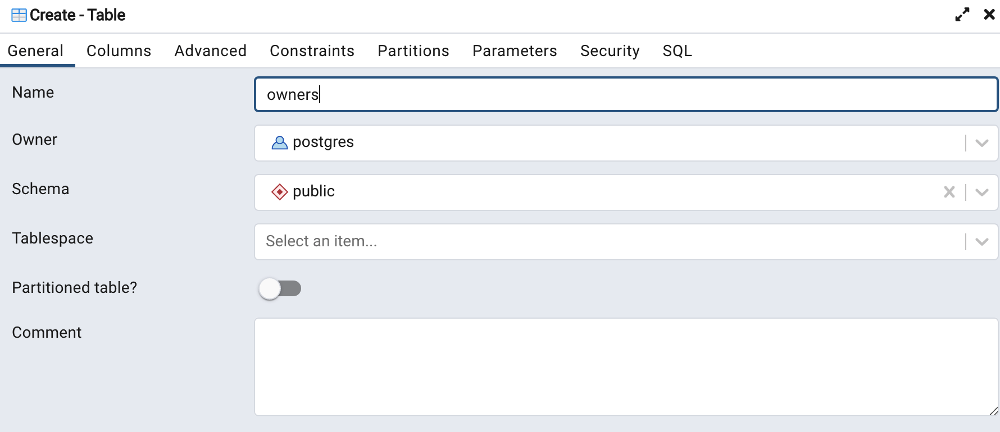
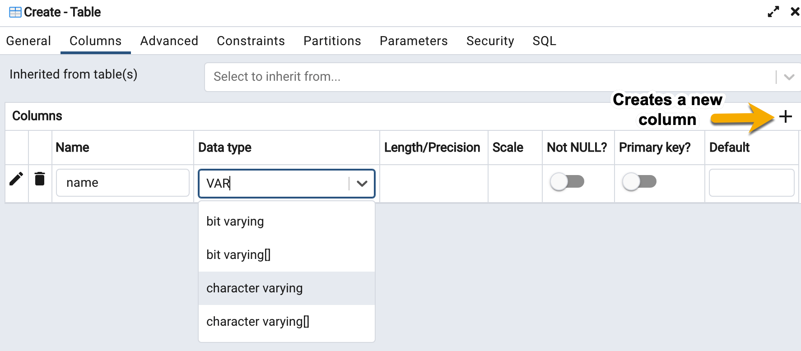
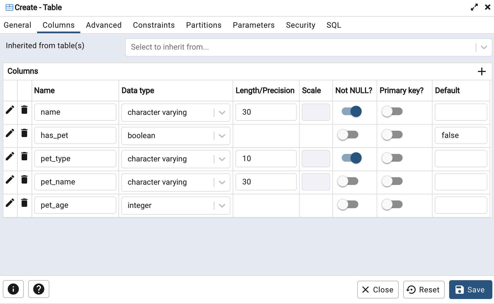
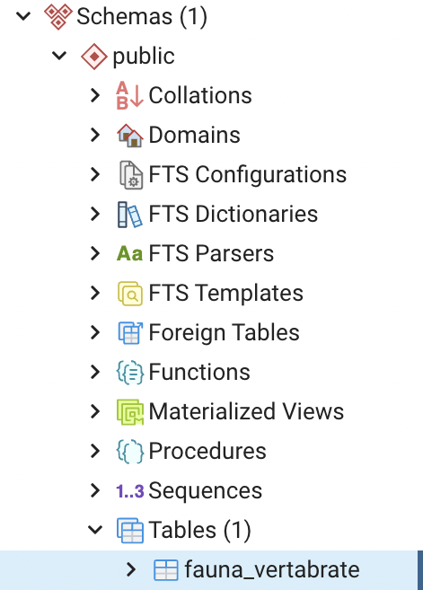

# Module 1, Lesson 1: Introduction to the Course and SQL

## Overview

In today's class, the students will gain a basic understanding of SQL databases and will learn how to create tables and simple queries.

## Class Objectives

By the end of this lesson, the students will be able to:

* Verify the successful installation of Postgres and pgAdmin on their computers.

* Create a database and tables by using pgAdmin.

* Define SQL data types, primary keys, and unique values.

* Load CSV files into a database and query the data.

* Perform basic SQL queries.

---

## Activity Outline

| Activity | Time | 
| -- | -- | 
| [1. Welcome to the Course](#Section1) | 35 minutes |
| [2. Introduction to SQL and Installation Check](#Section2) | 20 minutes |
| [3. Break](#Section3) | 15 minutes |
| [4. Creating a Database and Tables](#Section4) | 50 minutes |
| [5. Making and Using an ID](#Section5) | 30 minutes |
| [6. Hide and Seek](#Section6) | 30 minutes |

---

## Instructor Prep

This section covers notes for this course, notes for this lesson, and a slideshow for this lesson.

<details>
 <summary><strong>🗒️ Notes for This Course</strong></summary>

* Welcome to the Netflix Pathways Advanced Data Science Bootcamp, the second in a series of bootcamp courses developed in partnership with Netflix. Remember that some students may not have taken the first course, Data Science Foundations Bootcamp, which covered exploratory data analysis and visualization by using Excel, Python and Pandas, Matplotlib, Plotly, and statistics. 

* In the first half of the course, the students will learn data engineering skills including, data modeling, basic and advanced SQL programming, then they'll learn how to extract and transform raw data and load the clean data into a database. Next, they'll learn to use PySpark and SparkSQL to analyze big data sets and build and test a ETL pipeline. Then, they'll apply what they have learned in the first half of the class by working in groups on a midterm project. 

* In the second half of the course, the students will learn how to make predictions, provide recommendations, and determine patterns or group data with machine learning algorithms, then they'll learn how to analyze numerical data, natural voice, text, and images using neural networks and learn how to process text and language using natural language processing (NLP). Then, they'll apply what they have learned in the course by working in groups on a final project. 

* The students have been given [pre-work instructions](https://coding-bootcamp-netflix-data-sci-adv-prework.readthedocs-hosted.com/en/latest) to installing the tools they'll need for the course through Canvas, which include, VS Code, Git, Git Bash (Windows only), pgAdmin and Postgres, Python, and Anaconda. We have set aside time in some lessons to check the installation of pgAdmin and Postgres in this lesson, and Anaconda in module 3.

* For each module, you’ll have a lesson plan (this document), activity folders to accompany each activity (including solved and unsolved versions of the activities), and slides to facilitate the presentation for the day. We encourage you to use the slideshow to help the students follow along with the activities and to engage those students whose learning styles are more visual.

* Feel free to distribute these slides to the students before or after class, but be aware that the **links to the slideshows** are for instructor use only. To distribute slide content to the students, please export the slides to a PDF file. You can then send the PDF to the students.

* It's important to set the right tone on the first day, so come to class prepared. We encourage you to practice aloud at home and to carefully think through your presentation. This doesn't mean that you need to memorize the lesson word for word, but you should be comfortable with the material. Be sure to develop a rapport with the class to establish a fun and inviting learning atmosphere. 

* The students will be able to download the unsolved versions of the activity files from Canvas. When the lesson plan calls for you to send files that the students don’t have access to in Canvas, we recommend that you use Slack to distribute the files.

* Have fun and enjoy the experience!

</details>

<details>
 <summary><strong>🗒️ Notes for This Lesson</strong></summary>

* In this lesson, a series of activities will introduce the students to programming with SQL by using Postgres and pgAdmin. Check in with the students during the student activities to assist those who appear frustrated or stuck. Remind them that SQL experience is highly valuable, so the steep learning curve is worth the effort.

* Before the break, there’s time for the instructional staff to help any students who had trouble installing Postgres and pgAdmin, or who have not yet installed them.

* **Important:** Be sure to send out the [installation instructions](Installation) to the students before today’s class. They will have time to install both in the [Introduction to SQL and Installation Check](#Section2) section.

</details>


### <a name="slideshow"></a> Slideshow

You can find the [Introduction to the Course and SQL](https://docs.google.com/presentation/d/1_0vDxhk26yRETmSIEZI1iSGLTIa80vDSYSLbZWBXChw/edit?usp=sharing) slides for this lesson on Google Drive.

---

## Activities

This lesson plan has six activities, which the following sections describe.

### 1. <a name="Section1"></a> Welcome to the Course (35 minutes)

<details>
  <summary><strong>📣 1.1 Instructor Do: Course and Instructor Introductions (15 minutes)</strong></summary>
<br>

In this section, there will be introductions from the university program director, instructor, and TAs.

After you and the TAs have introduced yourselves, ask each student to introduce themselves. Keep things lighthearted yet respectful as the students share their backgrounds.

</details>

<details>
  <summary><strong>📣 1.2 Instructor Do: Introduction to Data Engineering and Data Science (10 minutes)</strong></summary>
<br>

After the introductions, begin the lesson by briefly reviewing the past 20 years of data science in industry. Using the slides, cover the following points:

* In the past 20 years, the collection, storage, and analysis of data has accelerated and changed tremendously. So much is different that it doesn't even make sense for us to focus on anything data-related before the early 2000s.

  * From the early 2000s to the 2010s, data science seemed like a free-for-all. Everyone had their favorite language, tool kit, proprietary data solution, analysis pipeline, and more.

  * During this time, data scientists used whichever language had the most robust solution. They often needed multiple programming languages to complete a simple data workflow. For example, a data scientist might have started with a Java or R script to manipulate Structured Query Language (SQL) queries, moved to a C or C++ program to perform statistical modeling, and then gone back to Java or R (which at the time were cutting-edge technology) to create a visualization or generate a report.

  * Collaborative, open-community forums for programmers, such as Stack Overflow, did not exist. Programmers would spend hours reviewing documentation and then testing every step of the way.

  * As of 2020, these top 20 skills include computer science, data modeling, data science (data scientists), natural language processing (or NLP), data visualization, data management, machine learning, data structure, deep learning, analytics, Python, computer vision, SQL, predictive modeling, statistical modeling, big data, neural networks, data mining, and artificial intelligence.

</details>

<details>
  <summary><strong>📣 1.3 Instructor Do: Course Syllabus and Grading Expectations (10 minutes)</strong></summary>
<br>

After reviewing the evolution of data science over the past 20 years, go through the course syllabus and establish the expectations:

* This course covers all the relevant skills and techniques currently used in tech industry jobs. The students will gain understanding and proficiency through:

  * In-class programming exercises

  * Take-home assignments and unit assessments

  * Midterm and final portfolio group projects

* In addition to technical, statistical, machine learning, and database design skills, this course will also cover critical soft skills, including:

  * Collaborative design and Agile software development using Git and GitHub.

  * Technical presentation and public speaking skills

Next, review the course structure, which comprises:

* Take-home assignments after every module, except during project weeks

* A midterm and a final project

**Note:** We recommend that you make each assignment due 48 hours after the end of its module. Make each unit assessment due by the end of the week that you assign it.

Send out the [current course syllabus](Resources/Non-branded_Syllabus-NFLX_Pathways_Advanced_Data_Science_Boot_Camp.pdf) to the students.

Review the high-level descriptions and objectives of each module.

* The following factors will determine the grades for the course:

  * Attendance and participation (10%)

  * 11 assignments, with pass/fail grading (20%)

    * Each assignment will have its own grading rubric.

      **Note:** You can open the [Data Modeling Rubric](Resources/Data_Modeling_Rubric.pdf) and review the grading scheme.

    * Let the students know that they’ll get a PDF of the rubric in the assignment folder in Canvas. 

    * Point out that the students can get partial credit points for each graded deliverable. The instructor or grader will enter the partial credit points in the Points column.

  * Four unit assessments (20%)

    * Each assessment is graded on a scale of 50 points and will be pass/fail, with passing being greater than or equal to 35 points.

  * Project participation and deliverables (50%)

    **Note:** The project grade is based on project submission and group presentation criteria.

    * The midterm project is worth 20% of a student's total grade.

      * [Midterm Project Grading Rubric](Resources/Midterm_Project_Grading_Rubric.pdf)

    * The final project is worth 30% of a student's total grade.

      * [Final Project Grading Rubric](Resources/Final_Project_Grading_Rubric.pdf) 

Review each rubric, and then point out a sampling of criteria that will be used to grade the students’ submissions.

</details>

---

### 2. <a name="Section2"></a> Introduction to SQL and Installation Check (20 minutes)

<details>
  <summary><strong>📣 2.1 Instructor Do: Introduction to Databases and SQL (10 minutes)</strong></summary>

* Vast amounts of data are generated and stored every day. Because of the speed, size, and dynamic nature of this data, companies and other organizations need tools to store and access the data in an organized way. Databases can store and organize large amounts of data, which then makes it possible to analyze the data.

* **SQL** is a query language that was designed to help manage and analyze data in databases. It can also be used with programming languages like Python to build applications that interact with databases. SQL has become a standard language for people that work with data.

 * Databases are similar to CSV files in that they’re designed to store, access, and analyze data. 

* Databases offer a wide range of benefits. These include the ability to handle vast amounts of data spread across many computers and networks.

* The two most commonly used types are relational databases and NoSQL databases.

  * **Relational databases** are the most mature of all the database structures. In a relational database, every piece of information has a relationship to every other piece. Additionally, a relational database stores data records as tables, with every table consisting of rows and columns. The rows in a single table relate to each other via a **primary key**. The tables relate to each other via a **foreign key**. Because of the formal organizational structure of relational databases, we can understand and navigate them by using SQL.

  * Instead of keeping data in tables, a **NoSQL database** uses a simpler, horizontal design. One of the most popular forms of NoSQL databases, MongoDB, holds data in **documents**. When a document is added to the database, MongoDB assigns it an identification number, or **key**. The key allows us to access that document. Because of its less rigid structure, some people consider NoSQL databases to be more flexible than relational databases. And NoSQL databases often respond faster to queries. The downside is that the lack of a rigid structure can more easily create duplicated, messy, or missing data.

* Although NoSQL databases are popular, no database structure comes close to the popularity of relational databases and the SQL language.

* In this unit, we’ll work with a specific type of relational database called PostgreSQL. All relational databases and SQL languages are similar, so the concepts you’ll learn in this SQL unit can apply to any relational database, including SQLite, MySQL, and more.

* In a professional environment, you'll likely access databases via the organization's computer network or the Internet. On a small scale, such as our classroom setting or a small tech company, you may find databases stored on a single computer. With larger companies that create and manage more data, you will likely see databases stored in a cloud infrastructure, like Amazon Web Services (AWS), Microsoft Azure, or Google Cloud Platform (GCP). 


#### What Is SQL?

* SQL (either pronounced as "sequel" or by reading each letter individually as "S-Q-L") stands for Structured Query Language. It’s a powerful programming tool that enables us to create, populate, manipulate, and access databases.

* Using SQL we can search and analyze data stored in tables on a server, much like using Microsoft Excel to search and analyze data stored in spreadsheets.

* In this unit, we'll use the following tools:
  
  * PostgreSQL (usually referred to as "Postgres") is a relational database system that uses the SQL language.
  
  * pgAdmin is a tool that provides a visual interface for managing databases. We'll first set up pgAdmin to connect to our PostgreSQL database, and then use it to write SQL queries to analyze data in our database.

* Send out the [SQL Reference Guide](../Supplemental/SQL_reference_guide.pdf) for the students to use as a reference during the activities.

</details>

<details>
  <summary><strong>🎉 2.2 Everyone Do: PostgreSQL and pgAdmin Installation Check (10 minutes)</strong></summary>

Now that we've covered some basics of databases and SQL, we'll check that everyone has installed PostgreSQL and pgAdmin on their computers.

#### Installation of Postgres and pgAdmin on Local Machine Demonstration

* Send out the installation instructions for both Windows and Mac to all students. The students should follow the installation instructions for their operating system:

    * [Mac Installation Instructions](Installation/pgAdmin_and_Postgres_for_Mac.md)

    * [Windows Installation Instructions](Installation/pgAdmin_and_Postgres_for_Windows.md)

* Send out the PostgreSQL download link to all students. This linked page contains downloads for both operating systems:

    * [PostgreSQL Download](https://www.enterprisedb.com/downloads/postgres-postgresql-downloads)

* Let the students know that we’ll be downloading the latest version of PostgreSQL 12 server, which also installs the latest compatible version of pgAdmin. 

* Point out the correct download buttons for Windows and Mac operating systems:

    

* Tell the students to include all the optional components except for **Stack Builder** when they are installing components from their Postgres download file.

* Tell the students to follow the remaining steps in the installation README to configure their password and ports. Encourage the students to use the default settings, which are suitable for our purposes.

Confirm that all students have completed this process. Address any issues and questions before moving on.

</details>

---

### 3. <a name="Section3"><a name="Break"></a> Break (15 minutes)

---

### 4. <a name="Section4"></a>Creating a Database and Tables (50 minutes)

<details>
  <summary><strong>🎉 4.1 Everyone Do: Creating a Database (10 minutes)</strong></summary>
<br>

* Use the slides(#slideshow) to show the students how to create a database in pgAdmin.

  * Open pgAdmin in a new browser window and ensure that everyone is able to follow along and view their PostgreSQL server in the pgAdmin user interface.

    

* Demonstrate the steps to create a database by using pgAdmin.

  * In the pgAdmin editor, right-click the newly established server to create a new database.

  * From the menu, select Create, and then select Database to create a new database.

    

  * Enter “animals_db” as the database name. Make sure that the owner is set as “postgres” (default setting), and then click Save.

    

* At this point, show the students that there is a new database listed in the left-hand menu. Explain that pgAdmin is not yet connected to the new database, `animals_db`. Clicking `animals_db` will initiate a connection from pgAdmin to the database.

  

* Answer any questions before moving on.

</details>

<details>
  <summary><strong>📣 4.2 Instructor Do: Create a Table (15 minutes)</strong></summary>

* Now that we have created a database on the server, it's time to explore SQL and start creating tables within the new database!

* Use the slides to assist the students in understanding how to create tables in SQL.

* There are two options for creating tables in pgAdmin: (1) Run a SQL query that contains the table schema, or (2) create the table by using pgAdmin menus. 

* First, demonstrate how to create a table by using a SQL query. 

  * From the left-hand menu in pgAdmin, right-click animals_db and select Query Tool.

    

    **Note:** You can also select the Query Tool from the Tools dropdown menu at the top of the screen.

    

  * Tell the students that you will demonstrate how to access the code editor.

  * Type the following lines of code while explaining each line:

    ```sql
    CREATE TABLE people (
      name VARCHAR(30) NOT NULL,
      has_pet BOOLEAN DEFAULT false,
      pet_type VARCHAR(10) NOT NULL,
      pet_name VARCHAR(30),
      pet_age INT
    );
    ```

    * `CREATE TABLE people (<COLUMNS>);` creates a table called `people` with the columns listed within the parentheses.

    * `name VARCHAR(30) NOT NULL` creates a `name` column that holds character strings of up to 30 characters. The column will not allow null fields.

    * The `NOT NULL` constraint requires you to specify a value for every row in the column.

    * `pet_type VARCHAR(10) NOT NULL` creates a `pet_type` in the same manner that the `name` column is created. The only difference is the number of characters allowed in the column.

    * `has_pet BOOLEAN DEFAULT false` creates a `has_pet` column that holds either true or false values. Here, we've set the default value to false.

    * `pet_name VARCHAR(30)` creates a `pet_name` column that holds character strings of up to 30 characters and will allow null values.

    * `pet_age INT` creates a `pet_age` column that holds integers.

    * **Note:** Be sure to point out that a semicolon marks the end of a SQL statement. You can run multiple SQL statements at the same time If you separate them with semicolons. 
    
* **Important:** Avoid the use of spaces or capital letters in table names or column names in Postgres (and other versions of SQL). SQL requires you to place double quotes around any names with capital letters or spaces, and it is easy to forget them when you are writing queries.

  * After reviewing the code, click the play icon to run the script.

    

  * Point out that the Messages tab at the bottom of the screen shows that the "CREATE TABLE" function was successful.  

* Next, demonstrate how to create a table by using pgAdmin menus. 

  * In pgAdmin, right-click “animals_db,” scroll down to and select “Tables,” select “Create,” and then select “Table.”

    

  * In the "Create Table" menu, add the name of your table. 

    

  * Next, add a column via the following steps.

   * Click the "Columns" tab.

   * Click the "+" sign.

   * Enter the name of the column.

   * Select the data type from the drop-down menu options

   * Select any additional parameters, such as the length of the data type, whether it is null, and if it is a primary key.

    

  * Demonstrate creating all columns so that the "owners" table looks like the following image:

    

  * Send out the following [pgAdmin table dialog documentation](https://www.pgadmin.org/docs/pgadmin4/development/table_dialog.html) on how to create or modify tables manually in pgAdmin.

* Finally, demonstrate that the structure of a "people" table can be visualized by typing and running `SELECT * FROM people;` below the table creation code in the query editor.

* When we run all the code in the query editor and include our SELECT statement, pgAdmin displays an error message: `ERROR:  relation "people" already exists`. 

  * Explain that SQL data is persistent, meaning that it is not deleted or overwritten when we run identical commands. When we create a database or table with a name identical to one that already exists, an error message will tell us that the database or table already exists.

  * Ask the class how to avoid this kind of error. The students may respond that they can simply delete the offending line of code and then run the commands again. Explain that while this method would work, deleting working code is not a best practice.

  * Show the class an alternative method: Highlight the lines of code to run, and then click the play icon to run only the highlighted selection. This method of running SQL code is preferable to deleting previous code.

    

    * Tell the students that other methods include opening a new query window or commenting out any lines that shouldn't be run again. Feel free to show students the "Command + /" and "Control + /" comment shortcuts for macOS and Windows, respectively.

  * Explain that using the asterisk in the `SELECT * FROM people;` statement selects all columns from the table.

* Next, type the following code while explaining each line.

  ```sql
  INSERT INTO people (name, has_pet, pet_type, pet_name, pet_age)
  VALUES ('Jacob', true, 'dog', 'Misty', 10),
    ('Ahmed', true, 'rock', 'Rockington', 100),
    ('Peter', true, 'cat', 'Franklin', 2),
    ('Dave', true, 'dog', 'Queso', 1);

  SELECT *
  FROM people;
  ```

  * This code operates as it is read: it inserts data into the `people` table and then specifies the columns in which data will be entered.

  * The `VALUES` line places the data contained in the parentheses into the corresponding columns listed after the `INSERT INTO` statement.

  * We have to use single quotation marks instead of double quotes for inserting strings. Remind the class that double quotes are for referencing table and column names with capital letters, spaces, and other characters. Using double quotation marks here will result in errors.

  * Next, we add values in parentheses in the exact order as the table schema. If a value is not present, we can use `NULL` or empty quotes to avoid errors.

  * Commas separate each row of tuples that we insert into the table so that multiple rows may be inserted in a single query. A missing comma at the end of a tuple will produce an error.

* Use the following code to query the table, extracting only the `pet_name`.

  ```sql
  SELECT pet_name
  FROM people;
  ```

  * Explain that specifying a column name in the `SELECT` statement will return only the data contained in that field.

* Filter the queried data to display only dogs younger than five years old.

  ```sql
  SELECT pet_type, pet_name
  FROM people
  WHERE pet_type = 'dog'
  AND pet_age < 5;
  ```

* Explain the following points:

  * The `SELECT` clause can specify more than one column.

  * We filter data by using additional clauses such as `WHERE` and `AND`.

  * The `WHERE` clause will extract only the data that meets the condition specified. `AND` adds a second condition to the original clause, further refining the query.

  * Point out that in SQL, we use a single equal sign to make a comparison. This is different from Python, where comparisons are done with a double equals (`==`) sign. 

* Slack out the [creating_tables.sql](Activities/02-Ins_Creating_Tables/Solved/creating_tables.sql) file for the students to refer to later.

* Answer any questions before moving on.

</details>

<details>
  <summary><strong>✏️ 4.3 Student Do: Creating Tables (15 minutes)</strong></summary>

* Use the slides to present this activity to the class.

* In this activity, the students will use pgAdmin to re-create and query a table.

* **File:**

  * [README.md](Activities/03-Stu_Creating_Tables/README.md)

</details>

<details>
  <summary><strong>⭐ 4.4 Review: Creating Tables (10 minutes)</strong></summary>

* Use the slides to assist you in reviewing the activity.

* Slack out the solution file to the students, open the file, and then copy the solution SQL code prior to starting the review:

  * [stu_creating_tables.sql](Activities/03-Stu_Creating_Tables/Solved/stu_creating_tables.sql)

* Create a new database named `city_info` in pgAdmin. Use the query tool to copy and paste the solution from `stu_creating_tables.sql`. Alternatively, you can live-code the solution.

  * Remind the students that they must specify the data type for each column when creating a new table.

    ```sql
    CREATE TABLE cities (
      city VARCHAR(30) NOT NULL,
      state VARCHAR(30) NOT NULL,
      population INT
    );
    ```

* Insert multiple rows of data into the new table.

  * Point out to the students that we specify each column in the `INSERT INTO` clause, and we insert the values in the same order.

  * To make the code easier to read, we should place each row of values on its own line, separated by a comma.

    ```sql
    INSERT INTO cities (city, state, population)
    VALUES ('Alameda', 'California', 79177),
      ('Mesa', 'Arizona', 496401),
      ('Boerne', 'Texas', 16056),
      ('Anaheim', 'California', 352497),
      ('Tucson', 'Arizona', 535677),
      ('Garland', 'Texas', 238002);
    ```

* Next, create a query to view the data using the `SELECT` clause.

  ```sql
  SELECT *
  FROM cities;
  ```

  * Point out the syntax. Even though the code can fit on a single line, we've split it up over two lines. When we create more advanced queries, this practice makes the code easier to read.

* Using the `SELECT` clause again, query the data to return only the cities in the table.

  ```sql
  SELECT city
  FROM cities;
  ```

* Explain to the students that the first bonus question incorporates a `WHERE` clause, which further filters the data.

  * The `WHERE` clause allows us to search for specific data within a database. In this case, we are extracting only the records that meet the specified condition.

  * In the line `WHERE state = 'Arizona';` we are specifying Arizona in the state column.

    ```sql
    SELECT city, state
    FROM cities
    WHERE state = 'Arizona';
    ```

* Demonstrate the solution to the second bonus question.

  * Point out that the `WHERE` clause is highly customizable, such as with the use of the `<` operator.

    ```sql
    SELECT *
    FROM cities
    WHERE population < 100000;
    ```

* Go through the solution to the third and final bonus question.

  * We can filter queries even further with the `AND` clause. This clause allows us to specify more than one condition in the query.

    ```sql
    SELECT *
    FROM cities
    WHERE population < 100000
    AND state = 'California';
    ```

* Slack out the [stu_creating_tables.sql](Activities/03-Stu_Creating_Tables/Solved/stu_creating_tables.sql) solution for the students to refer to later.

* Answer any questions before moving on.

</details>

---

### 5. <a name="Section5"></a> Making and Using an ID (30 minutes)

<details>
  <summary><strong>📣 5.1 Instructor Do: The Value of Unique Values (10 minutes)</strong></summary>

* Use the slides to introduce the class to Unique Values.

* **File:** [values_of_uniques.sql](Activities/04-Ins_Values_of_Uniques/Solved/values_of_uniques.sql)

* Using the `people` table from the `animals_db` database, insert the duplicate data below into the table and then visualize the table with the new information.

  ```sql
  INSERT INTO people (name, has_pet, pet_type, pet_name, pet_age)
  VALUES ('Ahmed', true, 'rock', 'Rockington', 100);

  SELECT *
  FROM people;
  ```

  * Duplicate data is a real-world occurrence (and an eyesore). Demonstrate how to remove the rows containing the string `Ahmed` in the `name` column.

    ```sql
    DELETE FROM people
    WHERE name = 'Ahmed';
    ```

  * The duplicate was deleted, but so was the original row. Tell the class that this happened because *all* rows that match the where clause were deleted.

  * The name Ahmed appears twice in the table, so SQL assumes that we want to delete every row containing this name. SQL doesn't understand that we only want to remove the duplicate row.

  * To prevent these things from happening, programmers will often create a column that automatically populates each new row with a unique identifying value. This allows them to select and modify any one specific row more easily.

* Remove the `people` table by running the following line of code:

  ```sql
  -- Delete the table "people"
  DROP TABLE people;
  ```

* Copy the following code from the `values_of_uniques.sql` file and then paste it in the pgAdmin editor.

  ```sql
  -- Re-create the table "people" within animals_db
  CREATE TABLE people (
    id SERIAL PRIMARY KEY,
    name VARCHAR(30) NOT NULL,
    has_pet BOOLEAN DEFAULT false,
    pet_type VARCHAR(10) NOT NULL,
    pet_name VARCHAR(30),
    pet_age INT
  );

  -- Insert data into the table
  INSERT INTO people (name, has_pet, pet_type, pet_name, pet_age)
  VALUES ('Jacob', true, 'dog', 'Misty', 10),
    ('Ahmed', true, 'rock', 'Rockington', 100),
    ('Ahmed', true, 'rock', 'Rockington', 100),
    ('Peter', true, 'cat', 'Franklin', 2),
    ('Dave', true, 'dog', 'Queso', 1),
    ('Dave', true, 'dog', 'Pringles', 7);

  -- Query all fields from the table
  SELECT *
  FROM people;
  ```

  * Explain that a *primary key* uniquely identifies a row.

  * We use `SERIAL` to generate a new value for each inserted record in the table. By default, the starting value is 1, and it will increase by 1 for each new record. By using `SERIAL` with our unique `PRIMARY KEY`, we automatically get unique, incrementing values for each table row.

  * Because values will automatically increment, each row's ID is guaranteed to be unique. Using a primary key in the `WHERE` clause ensures that SQL does not identify and update the wrong row.

  * Point out that the `INSERT` statements have not changed because they do not need to insert data specifically into the `id` column. SQL automatically provides a value for this column, fulfilling the uniqueness constraint by automatically incrementing the last value used as an ID.

  * SQL automatically assigns the data type for the `id` column as an integer.

* One entry in the table is incorrect: one of the Daves has the wrong `pet_name` and `pet_age`. We need to update the `pet_name` from Pringles to Rocket and the `pet_age` from 7 to 8.

  * To avoid issues with updating multiple rows, we'll update by ID. First, query by name to find the ID for the row we want to update.

    ```sql
    SELECT id, name, pet_name, pet_age
    FROM people
    WHERE name = 'Dave';
    ```

  * This will return all rows that contain the name Dave, including the `id`, `pet_name`, and `pet_age` columns.

  * Next, we can select and update the `pet_name` from Pringles to Rocket and the `pet_age` from 7 to 8 based on the row's unique ID.

    ```sql
    UPDATE people
    SET has_pet = true, pet_name = 'Rocket', pet_age = 8
    WHERE id = 6;
    ```

  * Similar to creating a query, we use the `WHERE` statement to pinpoint the data that we want to change. In this case, we use the `id` column to select the unique row that we want to edit.

  * Duplicate data is also easier to remove with the use of a unique ID. Using the following code, remove the duplicate data.

    ```sql
    DELETE FROM people
    WHERE id = 3;
    ```

  * This does exactly what we want: duplicate data is deleted, and original data is preserved.

* Slack out the [values_of_uniques.sql](Activities/04-Ins_Values_of_Uniques/Solved/values_of_uniques.sql) file for the students to refer to later.

* Answer any remaining questions before moving on.

</details>

<details>
  <summary><strong>✏️ 5.2 Student Do: Making and Using an ID (10 minutes)</strong></summary>

* Use the slides to present this activity to the class.

* In this activity, the students will recreate a table and then query, insert, and update data.

**Files:**

  * [README.md](Activities/05-Stu_Making_IDs/README.md)

  * [making_ids_unsolved.sql](Activities/05-Stu_Making_IDs/Unsolved/making_ids_unsolved.sql)

</details>

<details>
  <summary><strong>⭐ 5.3 Review: Making and Using an ID (10 minutes)</strong></summary>

* Use the slides(#slideshow) to assist you in reviewing the activity.

* Slack out the solution file to the students:

  * **File:** [making_ids_solved.sql](Activities/05-Stu_Making_IDs/Solved/making_ids_solved.sql)

* Open `making_ids_solved.sql` and copy the code into pgAdmin.

* Go over the lines of code that create the ID and set the ID as the primary key. Make sure the students understand how this works, and explain how useful this will be for the upcoming homework assignment.

* Answer any questions before moving on.

</details>

---

### 6. <a name="Section6"></a> Hide and Seek (30 minutes)

<details>
  <summary><strong>📣 6.1 Instructor Do: Import Data (10 minutes)</strong></summary>

* Use the slides to introduce the students to this section on importing data.

* Slack out the following files for the students who want to follow along during the demonstration:

* **Files:**

  * [Fauna_Vertabrate.csv](Activities/06-Ins_Importing_Data/Resources/Fauna_Vertabrate.csv)

  * [importing_data.sql](Activities/06-Ins_Importing_Data/Solved/importing_data.sql)

* So far, the students have created their own tables and values manually using SQL code. As you might imagine, this process can be tedious when translating large datasets from external sources. Thankfully, pgAdmin includes a built-in import tool that can take CSV files and easily import the data into tables.

* Return to pgAdmin and create a new database called `Miscellaneous_DB`.

* Open the CSV file within an integrated development environment (IDE), such as Excel, to show the dataset that we will import. Be sure to point out that the first row of this dataset includes headers.

  * Open a query tool within `Miscellaneous_DB` and create a table named `fauna_vertabrate`.

  * Using the code from `importing_data.sql`, create the columns needed for importing the data. Point out that the columns created match the data in the CSV file.

  * Once the table and columns have been created, right-click Miscellaneous_DB from the left-hand menu and select Refresh.

  * Scroll down to Schemas and expand that menu, and then expand the public menu followed by the Tables menu, as shown in the following image:

    

  * Right-click the new table and select **Import/Export** from the menu.

    

* In the Options tab, complete the following steps:

  * Slide the Import/Export tab to Import.

  * Click on the dot menu to navigate to the `Fauna_Vertabrate.csv` file on your computer.

  * Slide the Header tab to Yes.

  * Select the comma from the dropdown menu to use commas as the Delimiter.

  * Leave the other fields as they are, and then click OK.

  * **Note:** Errors are common at this stage if the column names and positions do not *exactly* match between Postgres and the CSV. Emphasize the importance of making sure the columns are set up correctly before attempting to import a CSV.

* In the query tool, rerun `SELECT * FROM fauna_vertabrate` to verify that data has been imported.

* Let the students know that the bigger a dataset is, the longer it will take pgAdmin to import values.

* Data Source: City of Perth/Data WA (2021). Fauna Vertebrate. [https://catalogue.data.wa.gov.au/dataset/perth-fauna-vertabrate](https://catalogue.data.wa.gov.au/dataset/perth-fauna-vertabrate)

</details>

<details>
  <summary><strong>✏️ 6.2 Student Do: Hide and Seek (10 minutes)</strong></summary>

* Use the slides to present this activity.

* In this activity, the students will create a new table and import data from a CSV file.

* Slack out the following file and instructions:

* **Files:**

    * [README.md](Activities/07-Stu_Hide_and_Seek/README.md)

    * [hide_and_seek_unsolved.sql](Activities/07-Stu_Hide_and_Seek/Unsolved/hide_and_seek_unsolved.sql)
    
    * [soft-attributes.csv](Activities/07-Stu_Hide_and_Seek/Resources/soft-attributes.csv)


* Data Source: Krisztian Balog, Filip Radlinski and Alexandros Karatzoglou from Google LLC (2021). SoftAttributes: Relative movie attribute dataset for soft attributes. [https://github.com/google-research-datasets/soft-attributes](https://github.com/google-research-datasets/soft-attributes).

</details>

<details>
  <summary><strong>⭐ 6.3 Review: Hide and Seek (10 minutes)</strong></summary>

* Use the slides to assist you in reviewing the activity.

* Slack out the solution file to the students:

  * [hide_and_seek_solved.sql](Activities/07-Stu_Hide_and_Seek/Solved/hide_and_seek_solved.sql)

* Open pgAdmin and paste the code from `hide_and_seek.sql` into the editor. Explain the following:

  * To view a range of data, we can use a combination of `WHERE` and `AND` statements.

  * To collect data that exists in either one column or another, we include the `OR` statement in the query.

* Go through the solutions to the bonus questions, touching on the fact that `AND` statements can be used more than once for more specific results.

* Answer any questions before ending class.

</details>

- - -

Copyright 2022 2U. All Rights Reserved.