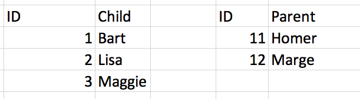
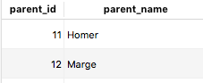
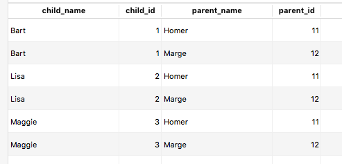
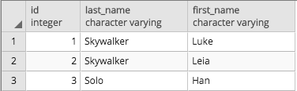
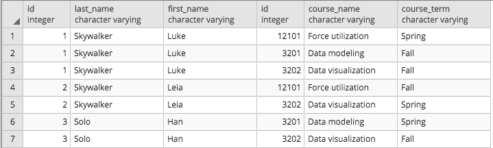
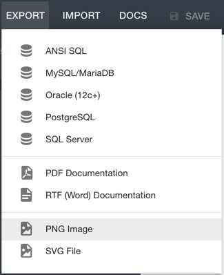

# Module 1, Lesson 2: Data Modeling

## Overview

Today's lesson will focus on data modeling and the best practices for designing a database. The students will learn how to both normalize data and create relationships between database tables. They’ll also learn how to create visualizations of databases by using entity relationship diagrams (ERDs).

## Class Objectives

By the end of today's lesson, the students will be able to:

- Apply data modeling techniques to database design.

- Normalize data.

- Identify data relationships.

- Create visual representations of a database through ERDs.

---

## Activity Outline

| Activity | Time |
| -- | -- | 
| [1. Welcome & Data Normalization](#Section1) | 20 minutes |
| [2. Pet Normalizer](#Section2) | 20 minutes |
| [3. Foreign Keys](#Section3) | 25 minutes |
| [4. Break](#Section4) | 15 minutes |
| [5. Data Relationships](#Section5) | 35 minutes |
| [6. Entity Relationship Diagrams](#Section6) | 55 minutes |
| [7. Module Objectives Review & Assignment Description](#Section7) | 10 minutes |

---

## Instructor Prep

This section covers notes for this lesson and a slideshow for this lesson.

<details>
 <summary><strong>🗒️ Notes for This Lesson</strong></summary>

* Today's lesson will cover **data modeling**, or designing database tables and table relationships before the database itself gets created. A good data model is informed by business processes. With such a data model, data professionals like us can write SQL queries against the database to get the information that we need. This lesson will use SQL to supplement the ideas that you present about data modeling. If any students continue to struggle with SQL basics, encourage them to practice on their own while still focusing on the concepts in this lesson.

* The TAs should be ready to help explain and break down concepts for any students who struggle to grasp the material.

* Remind the students that they can download the files and instructions for the activities by using the AWS links in Canvas. Please send out the files and instructions to any students who haven't downloaded the files for today. 

</details>

### <a name="slideshow"></a> Slideshow

You can find the [Data Modeling](https://docs.google.com/presentation/d/18ZrBP4GoXK-yx2VUN6Z1G-CQd_5JkYXv0aCZAnJysyg/edit?usp=sharing) slides for this lesson on Google Drive.

Remember that the slideshows are for instructor use only. To distribute slide content to the students, please export the slides to a PDF file. You can then send the PDF to the students.

---

## Activities

This lesson plan has seven activities, which the following sections describe.

### 1. <a name="Section1"></a> Welcome & Data Normalization (20 minutes)

<details>
  <summary><strong> 📣 1.1 Instructor Do: Welcome the Class (5 minutes)</strong></summary>

* Welcome the students, and explain that today's lesson will dive into data modeling techniques, such as normalizing data, creating relationships, and conceptualizing database design by using ERDs.

* Open the slides, and explain the class objectives.

</details>

<details>
  <summary><strong> 📣 1.2 Instructor Do: Data Normalization (15 minutes)</strong></summary>

* **File:** [Normalization.md](Activities/01-Ins_Data_Normalization/Solved/Normalization.md)

* Continue with the slideshow, using the slides about data normalization to explain the following:

  * **Data normalization** is the process of restructuring data to a set of defined normal forms.

  * The process of data normalization eliminates data redundancy and inconsistencies.

  * We’ll cover the three main forms of normalization. Note that additional forms of normalization exist.

  * In the **first normal form (1NF)**, each entry in a row contains a single value, and each row is unique.

  * In this example, the table lists the data for each vehicle in a single row. We can normalize the data into 1NF by creating a new row for each performed service.

  * In the **second normal form (2NF), the data is already in 1NF. Additionally, all the nonkey columns are dependent on the table’s primary key.

  * This example has three tables: `Customer`, `Vehicle`, and `Services`. Each uses unique identifiers as IDs.

  * **Transitive dependency** is the reliance of a column value on another column through a third column. The **transitive property** states that if A implies B, and B implies C, we can infer that A implies C. A **dependency** means that one value relies on another, such as city relying on zip code or age relying on birthday. So, a transitive dependency means that a change in one column implies a change in another column.

  * Consider the following columns in the `Vehicle` table: `VIN`, `Customer ID`, and `Model`. If a car (with a particular `VIN`) gets sold to a new customer, the `Customer ID` column will get updated. When the `Customer ID` column changes, the `Model` column also needs updating. A transitive dependency thus exists between the `Model` and `VIN` columns.

  * In the **third normal form (3NF)**, the data is already in 2NF. Additionally, the columns don’t have any transitive dependencies.

  * In 3NF, we divide the `Vehicle` table data into the following three tables: `Vehicle`, `Make`, and `Model`. Each of these tables has a primary key column. 

  * The `ID` column of the `Make` table depends on the `Customer ID` column of the `Vehicle` table. And, the `Make` column of the `Model` table depends on the `ID` column of the `Make` table.

* Explain that 3NF is complex and can take time to fully understand. Encourage the students to learn more about 3NF on their own. This lesson focuses mainly on 1NF and 2NF.

* Slack out [Normalization.md](Activities/01-Ins_Data_Normalization/Solved/Normalization.md) as a cheat sheet for the students before moving on.

</details>

---

### 2. <a name="Section2"></a> Pet Normalizer (20 minutes)

<details>
  <summary><strong>✏️ 2.1 Student Do: Pet Normalizer (15 minutes)</strong></summary>

* Use the next set of slides to explain this activity.

* Explain that the students will practice data normalization skills by using the provided data.

* **Files:**

  * [README.md](Activities/02-Stu_Data_Normalization/README.md)
  
  * [pets.csv](Activities/02-Stu_Data_Normalization/Resources/pets.csv)

* Data source: Data generated by Trilogy Education Services, a 2U, Inc. brand, and is intended for educational purposes only.

</details>

<details>
  <summary><strong>⭐ 2.2 Review: Pet Normalizer (5 minutes)</strong></summary>

* Continue with the slides, and review the activity.

* Open [pets.csv](Activities/02-Stu_Data_Normalization/Resources/pets.csv), and explain the first step of normalization, as follows:

  * Make sure that multiple data points don’t get included in the same column. For columns that contain multiple pets, we need to create a new row for each pet.

  * The [pets_cleaned.csv](Activities/02-Stu_Data_Normalization/Solved/pets_cleaned.csv) CSV file shows the solution.

* In pgAdmin, open [schema.sql](Activities/02-Stu_Data_Normalization/Solved/schema.sql). Go over the code, explaining the following:

  * For 2NF, the data must already be in 1NF. We accomplished that in the previous step.

  * All the columns other than the `ID` column are dependent on the primary key.

  * The `owners` table is dependent on the primary key and contains each owner once. 

  * We next create a `pet_names` table, giving each pet a name and two IDs: one unique `id` for the pet and an `owner_id` that links the pet to its correct owner.

  * Each table has values that depend on the primary key and that don’t repeat in the other table.

  * Finally, we can join the two tables by connecting the `owners` table on `id` and the `pet_names` table on `owner_id`.

* Explain the bonus section of the activity:

  * We create a `service` table and insert the data, each with a unique `service_type` and `id`.

  * We then create a new `pets_name_new` table and add a `service_id` for each pet.

  * We can then join all three tables to replicate the cleaned CSV.

* Answer any questions before moving on.

</details>

---

### 3. <a name="Section3"></a>Foreign Keys (25 minutes)

<details>
  <summary><strong>📣 3.1 Instructor Do: Intro to Foreign Keys (10 minutes)</strong></summary>

* **File:** 

  * [schema.sql](Activities/03-Ins_Foreign_Keys/Solved/schema.sql)

* Use the slides to explain the concept of foreign keys and how we use them to connect tables, as follows:

  * A **foreign key** acts as a link between tables. The foreign key in one table points, or links, to the primary key in a second table.

  * A foreign key also prevents invalid data from getting entered into a column. The data that gets entered must consist of values from the referenced column.

* Slack out [schema.sql](Activities/03-Ins_Foreign_Keys/Solved/schema.sql) so the students can follow along as you review the code, explaining the following steps:

  * First, we create a table named `owners` and set the primary key to `id`&mdash;which will automatically populate and increment with each new entry&mdash;as the following code shows:

    ```sql
    CREATE TABLE owners (
      id SERIAL PRIMARY KEY,
      name VARCHAR(30) NOT NULL
    );
    ```

  * Next, we insert data into the `owners` table and then run a `SELECT` query to check that the data was inserted, as the following code shows:

    ```sql
    INSERT INTO owners (name)
    VALUES
      ('Bob'),
      ('Micaela'),
      ('Aquaman');

    SELECT * FROM owners;
    ```

  * Note that we’ve created a new table and that its primary key is labeled `id`. The `id` values in this table will be unique.

  * Next, we create a table named `animals`. The `FOREIGN KEY (owner_id)` part identifies the `owner_id` column as a foreign key.

  * After identifying the foreign key, we use `REFERENCES owners(id)` to tell the table that `owner_id` references, or links to, the `id` column of the `owners` table, as the following code shows:

    ```sql
    CREATE TABLE animals (
      id SERIAL PRIMARY KEY,
      species VARCHAR(30),
      name VARCHAR(30),
      owner_id INT NOT NULL,
      FOREIGN KEY(owner_id) REFERENCES owners(id)
    );
    ```

  * Finally, we populate the `animals` table with data and then check it by using a `SELECT *` query, as the following code shows:

    ```sql
    INSERT INTO animals (species, name, owner_id)
    VALUES
      ('Dog', 'Spot', 1),
      ('Fish', 'Goldy', 1),
      ('Cat', 'Loki', 2),
      ('Dolphin', 'Jeffrey', 3);

    SELECT * FROM animals;
    ```

  * Notice that we created the `animals` table with a primary key that’s labeled `id`. And, we previously created the `owners` table with a primary key that’s also labeled `id`. But, the `id` values in `animals` are unique to that table and have no relation to the previously created table.

  * Remember that we use `NOT NULL` for any column that requires a value. In this case, we use it for the `owner_id` foreign key, because each animal must reference a row in the `owners` table.

* Recap the following:

  * In the `animals` table, the `id` column is the primary key. And, the `owner_id` column is a foreign key that references the `id` column of the `owners` table.

  * SQL will return an error if an attempt is made to add an `id` value in the `owner_id` column that doesn't exist in the `owners` table.

  * We need to appropriately name foreign key columns to be clear about the data that they refer to.

* Note that the students should now understand how to both create foreign keys and use them to reference data in other tables. To illustrate the importance of foreign keys, supply the following example from the `schema.sql` file that you already slacked out:

  * With foreign keys, we can keep tables consistent and avoid issues that would be caused by inserting, deleting, or updating one table without making the same changes in the other tables.

  * For example, say that we attempt to insert a row into the `animals` table with an `owner_id` value that doesn’t exist as an `id` value in the `owners` table, as the following code shows:

    ```sql
    INSERT INTO animals (species, name, owner_id)
    VALUES ('Otter', 'River', 4);
    ```

  * In this case, SQL will return an error&mdash;because the `owner_id` column is a foreign key that references the `id` column of the `owners` table. And, an `id` value of 4 doesn't exist in the `owners` table, so the `animals` table can't reference it.

  * Say that we next insert a row into the `owners` table that will get an `id` value of 4. We can then insert a row into the `animals` table with an `id` value of 4&mdash;because that corresponds to an `id` value in the `owners` table, as the following code shows:

    ```sql
    INSERT INTO owners (name)
    VALUES
      ('Dave');

    INSERT INTO animals (species, name, owner_id)
    VALUES
      ('Otter', 'River', 4);
    ```

  * Finally, we check that the row was inserted by using a `SELECT * FROM animals` query. The following image shows the result, which includes the new row:

    

* Answer any questions that the students have about foreign keys. Then ask them if they can think of other real-world cases where the use of foreign keys makes sense. Here are two examples:

  * **Employee addresses:** Say that we have a database where multiple tables contain the employee addresses. What happens if an employee address changes? Instead of multiple tables storing the same addresses, we can use an `employee_id` column as a foreign key that references an `employees` table. That way, only the `employees` table ever stores the addresses&mdash;so an address will need updating only in that table.

  * **Client info that’s stored with each order:** A client can have multiple orders. So, what happens if their phone number changes? If we store the phone number with every order, we’ll need to change it for every order. Instead, we can store the phone number only in the `clients` table&mdash;and use a foreign key to reference that table. That way, the phone number exists only in one place and becomes easier to update.

    **Important:** We should never store a piece of data twice in a database. If anyone finds themselves entering the same information into multiple tables, they’ve probably found a perfect opportunity to use foreign keys.

* Emphasize that using foreign keys to build relationships across pieces of data is a feature of relational databases.

</details>

<details>
  <summary><strong>✏️ 3.2 Student Do: Foreign Keys (10 minutes)</strong></summary>

* Use the next set of slides to explain this activity.

* Explain that the students will practice creating and populating tables with foreign keys.

* **Files:**

  * [README.md](Activities/04-Stu_Foreign_Keys/README.md)
    
  * [schema.sql](Activities/04-Stu_Foreign_Keys/Unsolved/schema.sql)

</details>

<details>
  <summary><strong>⭐ 3.3 Review: Foreign Keys (5 minutes)</strong></summary>

* Slack out the following solution file to the students:

  * [schema.sql](Activities/04-Stu_Foreign_Keys/Solved/schema.sql)

* Continue with the slides, and review the activity.

* In pgAdmin, open the `schema.sql` solution file, and then review the code while explaining the following steps:

  * First, we create a table named `customer`, as the following code shows:

    ```sql
    CREATE TABLE customer (
        id SERIAL,
        first_name VARCHAR(30) NOT NULL,
        last_name VARCHAR(30) NOT NULL,
        PRIMARY KEY (id)
    );
    ```

  * Notice that the preceding code adds only the `first_name` and `last_name` columns as values, because the `id` column will automatically get added.

  * Next, we create a table named `customer_email`, as the following code shows:

    ```sql
    CREATE TABLE customer_email (
        id SERIAL,
        email VARCHAR(30) NOT NULL,
        customer_id INTEGER NOT NULL,
        PRIMARY KEY (id),
        FOREIGN KEY (customer_id) REFERENCES customer(id)
    );
    ```

  * In the preceding code, notice that the `customer_id` column is a foreign key that references the `id` column of the `customer` table. So, any inserted data must have an `id` value that exists in the `customer` table.

  * Then, we create the `customer_phone` table&mdash;which references the same column as its foreign key, as the following code shows:

    ```sql
    CREATE TABLE customer_phone (
        id SERIAL,
        phone VARCHAR(30) NOT NULL,
        customer_id INTEGER NOT NULL,
        PRIMARY KEY (id),
        FOREIGN KEY (customer_id) REFERENCES customer(id)
    );
    ```

  * Notice that this inserts data into the `customer_phone` table. Like with the `customer_email` table, the `customer_id` column is a foreign key that references the `id` column of the `customer` table.

* Explain that to test if we have the correct foreign keys, we can attempt to insert a row that has an `id` value of 10. To so, we uncomment and then run the following code:

  ```sql
  INSERT INTO customer_phone(customer_id, phone)
  VALUES
    (10, '555-444-3333');
  ```

  * Point out that SQL returns an error&mdash;because that `id` value doesn’t exist in the `customer` table.

* Finally, explain that we can join all the tables by their IDs.

* Answer any questions before moving on.

</details>

---

### 4. <a name="Section4"></a> Break (15 minutes)

---

### 5. <a name="Section5"></a> Data Relationships (35 minutes)

<details>
  <summary><strong>📣 5.1 Instructor Do: Intro to Data Relationships (15 minutes)</strong></summary>

* Slack out the following files so that the students can follow along during your demonstration:

  * [schema.sql](Activities/05-Ins_Data_Relationships/Solved/schema.sql)

  * [data_relationships.sql](Activities/05-Ins_Data_Relationships/Solved/data_relationships.sql)

* Continue using the slides, and explain that you’ll now cover the types of data relationships: one to one, one to many, and many to many. These form an essential part of data modeling.

* Begin by discussing one-to-one relationships. The example uses members of the Simpson family to illustrate the concept.

* In a one-to-one relationship, each name is associated with one and only one Social Security number. That is, each entry in a column links to only one entry in another column.

  

* Next, discuss one-to-many relationships. We'll continue with the Simpson family example but add Sherlock Holmes and his sidekick, Dr. Watson, to the database.

  

  * This example has two tables. The first table lists only addresses. The second table lists each person's Social Security number and address.

  * As before, one Social Security number is unique to one person.

  * Each person has one address, but each address can be shared by multiple people. The Simpson family has a shared address of 742 Evergreen Terrace. Sherlock and Watson share the 221B Baker Street address.

  * In a one-to-many relationship, each entry in one table can repeat in multiple entries in another table.

  * Ask the students to think of other examples of real-life one-to-many relationships.

  * One example involves purchase orders with a company that sells its products online. Each purchase order has a unique identifying number. And, each customer can have multiple purchase orders. But, each purchase order is associated with one and only one customer.

* Next, discuss many-to-many relationships. Continuing with the Simpson example, we notice three children (Lisa, Bart, and Maggie), and two parents (Homer and Marge).

  

* In this case, we have two tables: one for children and another for parents.

* Each child has multiple parents, and each parent has multiple children. So, each child has a separate row for each parent, and vice versa.

  

* Explain that a many-to-many relationship requires a separate table, called a **junction table**, to show the relationship.

  * Ask the class which many-to-many relationship they might find in an online retailer database, such as Amazon.

  * Each customer can order multiple items, and multiple customers can order each item.

* Demonstrate the creation of a junction table in Postgres by completing the following steps:

  * Open [schema.sql](Activities/05-Ins_Data_Relationships/Solved/schema.sql), and then in pgAdmin, paste the queries from `schema.sql` that create and insert data into the `children` and `parents` tables. The following two images show the two separate tables:

    

    

  * Go through the junction table schema, as the following code shows:

    ```sql
    CREATE TABLE child_parent (
      child_id INTEGER NOT NULL,
      FOREIGN KEY (child_id) REFERENCES children(child_id),
      parent_id INTEGER NOT NULL,
      FOREIGN KEY (parent_id) REFERENCES parents(parent_id),
      PRIMARY KEY (child_id, parent_id)
    );
    ```

    * In the preceding code, notice that the `child_id` and `parent_id` columns both link to the previously created tables as foreign keys.

    * In the preceding code, also notice that the primary key of this `child_parent` table is a **composite key** that’s composed of both the `child_id` and `parent_id` keys. This means that the unique identifier for a row is not a single column but the composite of both columns. Setting this as the primary key, instead of creating a separate primary key, ensures that we won’t include duplicate pairs of `child_id` or `parent_id` values from the referenced tables.

  * Show the junction table, as the following image shows:

    

    * Mention that the first column is the `child_id` column, that the second column is the `parent_id` column, and that we have six rows to cover all the child/parent combinations.

  * Without going into details, show that it’s possible to use `JOIN` in the query to display the data in full, as the following image shows:

    

    * Mention that as the preceding image shows, we have a table consisting of the `child_name`, `child_id`, `parent_name`, and `parent_id` columns.

    * Here’s the code, from `data_relationships.sql`:

      ```sql
      SELECT children.child_name, child_parent_junction.child_id,
      parents.parent_name, child_parent_junction.parent_id
      FROM children
      LEFT JOIN child_parent_junction
      ON child_parent.child_id = children.child_id
      LEFT JOIN parents
      ON child_parent_junction.parent_id = parents.parent_id;
      ```

* Be aware that the students will be interested in trying joins on their own and learning more about them. Assure them that a later lesson will cover them but that they can feel free to experiment if they choose!

* Take a moment to summarize the major points of the activity:

  * We can model data as having one-to-one, one-to-many, and many-to-many relationships.

  * Many-to-many relationships require a junction table.

  * Junction tables use foreign keys to reference the keys in the original tables.

</details>

<details>
  <summary><strong>✏️ 5.2 Student Do: Data Relationships (15 minutes)</strong></summary>

* Use the next set of slides to explain this activity.

* Explain that the students will design a database model.

* **File:**

  * [README.md](Activities/06-Stu_Data_Relationships/README.md)

</details>

<details>
  <summary><strong>⭐ 5.3 Review: Data Relationships (5 minutes)</strong></summary>

* Slack out the following solution files to the students:

  * [schema.sql](Activities/06-Stu_Data_Relationships/Solved//schema.sql)

  * [stu_data_relationships.sql](Activities/06-Stu_Data_Relationships/Solved/stu_data_relationships.sql)

* Continue with the slides, and review the activity.

* Explain that this activity requires creating separate tables for students and courses and then creating a junction table to reflect the many-to-many relationship between the two tables.

* In pgAdmin, paste the schemas for the `students` and `courses` tables from the `schema.sql` file, and then explain the following:

  * We give each table the `id` column as the primary key.

  * We add fields for the required columns to each table.

    **Note:** A **field** is an entry in a column.

  * We populate the tables by using `INSERT` queries and then display the tables. The following two images show the `students` table and the ‘courses` table, respectively, resulting from the data that we inserted:

    

    

* Next, create a  junction table, named `student_courses_junction`, as the following code shows:

  ```sql
  -- Create a junction table.
  CREATE TABLE student_courses_junction (
    student_id INTEGER NOT NULL,
    FOREIGN KEY (student_id) REFERENCES students(id),
    course_id INTEGER NOT NULL,
    FOREIGN KEY (course_id) REFERENCES courses(id),
    course_term VARCHAR NOT NULL,
    PRIMARY KEY (student_id, course_id)
  );
  ```

* Then explain the following:

  * The junction table includes both `student_id` and `course_id` columns, which are references to the previously created tables.

  * Because `student_id` and `course_id` reference those tables, they become the foreign keys.

  * New student or course data can’t be inserted into the `student_courses_junction` table if that data doesn’t currently exist in the `students` or `courses` table.

  * This junction table bridges the two previous tables and shows all the courses that each student has taken.

  * The primary key is a composite of the `student_id` and `course_id` columns.

  * This table also includes a new field, named `course_term`, which contains the term during which a student took a course.

* Query the table to display the result, which the following image shows:

  

  * Point out that in the preceding image, the table has `student_id`, `course_id`, and `course_term` columns, with one row for each student-and-course combination.

* To reinforce the many-to-many relationship, point out that multiple students can take multiple courses.

* For the bonus, briefly explain that we can perform two left joins to retrieve the complete data about each student, as the following code shows:

  ```sql
  SELECT s.id, s.last_name, s.first_name, c.id, c.course_name, j.course_term
  FROM students s
  LEFT JOIN student_courses_junction j
  ON s.id = j.student_id
  LEFT JOIN courses c
  ON c.id = j.course_id;
  ```

  * The following image shows the result of the preceding code:

    

  * Point out that in the preceding image, the table now includes the first and last name of each student.

  * Limit any time spent on questions about joins by stating that the students will learn about them in detail in a later lesson.

</details>

---

### 6. <a name="Section6"></a> Entity Relationship Diagrams (55 minutes)

<details>
  <summary><strong>📣 6.1 Instructor Do: Entity Relationship Diagrams (15 minutes)</strong></summary>

* Slack out the following files so the students can follow along during this demonstration:

  * [pagila-erd.png](Images/pagila-erd.png)

  * [conceptual_schema.txt](Activities/07-Ins_ERD/Solved/conceptual_schema.txt)

  * [logical_schema.txt](Activities/07-Ins_ERD/Solved/logical_schema.txt)

  * [physical_schema.txt](Activities/07-Ins_ERD/Solved/physical_schema.txt)

* Continue using the slides, and explain the following points:

  * An **entity relationship diagram (ERD)** is a visual representation of the entity relationships in a database. Each **entity** is a table in the database.

  * An ERD represents its parts in a specific way. Boxes represent entities, ovals represent attributes, and lines represent relationships. The lines can include different symbols that represent different relationships. ERDs can also include more-complicated information, but the basics will remain the same.

    **Note:** As mentioned earlier, the entities are the tables. And, the **attributes** of a table are its columns of data.

    

  * An ERD defines entities, their attributes, and the data types of the attributes, and it illustrates the overall design of a database.

  * People commonly use the terms **ERD** and **data model** interchangeably. That’s because an ERD describes the table relationships in a potential database&mdash;and thus a model of the database.

  * Three types of ERDs, or data models, exist: conceptual, logical, and physical. A **conceptual data model** is the simplest form. It describes only the entity names and relationships. A **logical data model** expands on the conceptual data model by adding the attributes and defining the primary and foreign keys. A **physical data model** expands on the logical data model by adding the data types of the attributes and specifying any naming conventions.

    

  * The logical and physical data models also display the **cardinality** of the tables, or the direction and number of relationships in each direction, like one to one, one to many, and many to many.

* To break down these concepts further, discuss the following example:

  * In a database, each table is an entity, the columns of data in a table are the attributes; and the data type of each attribute might be Boolean, integer, or varying characters, for example.

  * An ERD visually represents the relationships between entities. With an ERD, we can clearly and concisely join tables and gain a deeper understanding of the data that’s in a database as a whole.

  * We use ERDs to both document existing databases and help with the creation of new databases.

* Open [QuickDBD](https://app.quickdatabasediagrams.com/#/), send the link to the students so that they can follow along with you, and then briefly explain its components, as follows:

  **Note:** If this is the first time that you’re visiting the site, exit the tour, and then clear the text in the dark gray pane on the left side. If the site requires a sign-in, use your GitHub account.

  * The dark gray pane on the left side is where we insert the text that creates the database entities.

  * In this pane, blue text signifies the name of an entity, or table.

  * The white pane on the right side is where the diagram displays&mdash;based on the text in the left pane.

    

  * Once we finalize a diagram, we can export it in many formats via the Export menu.

    

    **Note:** If we select PostgreSQL from the Export menu, QuickDBD will automatically generate the table schemas. But, note that the exported SQL syntax will slightly differ from the traditional SQL syntax that this course teaches.

* With QuickDBD open in your browser, demonstrate how to create a simple conceptual ERD by using the following text:

  ```text
  employee
  -

  zipcode
  -

  employee_email
  -

  owners
  -

  estates
  -

  estate_type
  -

  agents
  -

  regions
  -

  agent_region_junction
  -
  ```

* The following image shows the result:

  

  **Note:** We can move the tables by dragging them.

* Explain that our conceptual ERD now contains entities but doesn’t yet describe any entity relationships. To create abstract relationships between entities, we use the `rel <entity-name>` syntax, as the following text shows:

  ```text
  employee
  rel zipcode
  -

  zipcode
  -

  employee_email
  rel employee
  -

  owners
  -

  estates
  rel owners
  rel estate_type
  rel zipcode
  -

  estate_type
  -

  agents
  -

  regions
  -

  agent_region_junction
  rel agents
  rel regions
  -
  ```

* The following image shows the result:

  

* Remind the class that to transition from the conceptual ERD to a logical ERD, we need to add entity attributes. In QuickDBD, update the current entities with attributes by using the following text:

  ```text
  employee
  rel zipcode
  -
  employee_id
  name
  age
  address
  zip_code

  zipcode
  -
  zip_code
  city
  state

  employee_email
  rel employee
  -
  email_id
  employee_id
  email

  owners
  -
  owner_id
  first_name
  last_name

  estates
  rel owners
  rel estate_type
  rel zipcode
  -
  estate_id
  owner_id
  estate_type
  address
  zip_code

  estate_type
  -
  estate_type_id
  estate_type

  agents
  -
  agent_id
  first_name
  last_name

  regions
  -
  region_id
  region_name

  agent_region_junction
  rel agents
  rel regions
  -
  agent_id
  region_id
  ```

* The following image shows the result:

  

* Explain that the ERD now includes column names but still isn’t a complete logical ERD, because we have a bit more work to do, as follows:

  * We need to add the foreign key relationships to represent the types of entity relationships in the ERD.

  * We need to define the primary keys for the tables. At this point, the `rel <entity-name>` syntax describes only the abstract relationships between tables.

* Explain that in QuickDBD, we can define the primary and foreign keys by using `PK` and `FK`, respectively, after each corresponding attribute name in a table, as the following text shows:

  ```text
  employee
  -
  employee_id PK
  name
  age
  address
  zip_code FK
  ```

* The following syntax points the foreign key definition to the specific column of another table:

  ```text
  employee
  -
  employee_id PK
  name
  age
  address
  zip_code FK - zipcode.zip_code
  ```

  * In the preceding text, in the line that contains `FK - `, the hyphen (`-`) signifies a one-to-one relationship between the `employee` and `zipcode` tables, where each zip code in the `employee` table links to one zip code in the `zipcode` table.

* We can use different symbols to indicate different types of relationships between entities, as the following table shows:
 
  | Symbols | Relationships |
  | --- | --- |
  | - | One to one |
  | -< | One to many |
  | <- | Many to one |
  | >-< | Many to many |
  | -0 | One to zero, or one to one |
  | 0- | Zero to one, or one to one |
  | 0-0 | Zero to zero, zero to one, one to zero, or one to one |
  | -0< | One to zero, or one to many |
  | >0- | Zero to one, or many to one |

* As an example, the `employee_email` table has a many-to-one relationship with the `employee` table via the common `employee_id` (an employee can have multiple email addresses). So, we use the `>-` symbol to describe the relationship, as the following text shows:

  ```text
  employee_email
  -
  email_id PK
  employee_id FK >- employee.employee_id
  email
  ```

* The complete schema for the logical data model is as follows:

  ```text
  employee
  -
  employee_id PK
  name
  age
  address
  zip_code FK - zipcode.zip_code

  zipcode
  -
  zip_code PK
  city
  state

  employee_email
  -
  email_id PK
  employee_id FK >- employee.employee_id
  email

  owners
  -
  owner_id PK
  first_name
  last_name

  estates
  -
  estate_id PK
  owner_id FK - owners.owner_id
  estate_type FK - estate_type.estate_type_id
  address
  zip_code FK - zipcode.zip_code

  estate_type
  -
  estate_type_id PK
  estate_type

  agents
  -
  agent_id PK
  first_name
  last_name

  regions
  -
  region_id PK
  region_name

  agent_region_junction
  -
  agent_id FK >- agents.agent_id
  region_id FK >- regions.region_id
  ```

* The following image shows the ERD with the added primary keys and foreign key relationships:

  

* Explain that to transition the logical ERD to a physical ERD, we add a data type for each column. In QuickDBD, update the current entities with data types by using the following text:

  ```text
  # Physical

  employee
  -
  employee_id INT PK
  name VARCHAR(255)
  age INT
  address VARCHAR(255)
  zip_code INT FK - zipcode.zip_code

  zipcode
  -
  zip_code INT PK
  city VARCHAR(255)
  state VARCHAR(255)

  employee_email
  -
  email_id INT PK
  employee_id INT FK >- employee.employee_id
  email VARCHAR(255)

  owners
  -
  owner_id INT PK
  first_name VARCHAR(255)
  last_name VARCHAR(255)

  estates
  -
  estate_id INT PK
  owner_id INT FK - owners.owner_id
  estate_type VARCHAR(255) FK - estate_Type.estate_type_id
  address VARCHAR(255)
  zip_code INT FK - zipcode.zip_code

  estate_type
  -
  estate_type_id VARCHAR(255) PK
  estate_type VARCHAR(255)

  agents
  -
  agent_id INT PK
  first_name VARCHAR(255)
  last_name VARCHAR(255)

  regions
  -
  region_id INT PK
  region_name VARCHAR(255)

  agent_region_junction
  -
  agent_id INT FK >- agents.agent_id
  region_id INT FK >- regions.region_id
  ```

* The following image shows the result:

  

  * Point out that the physical ERD resembles the logical ERD. But, the physical ERD lists the data types and shows more relationships, such as the many-to-one relationship of `region_id` with `regions.region_id`.

* If the students need a refresher about data relationships, direct them to the documentation on the QuickDBD site by completing the following steps:

  * Select Docs (which appears in the upper part of the window).

    

  * In the Docs pane that appears, select Relationships.

    

  * Note that an explanation of relationships and their symbols appears.

* Open [pagila-erd.png](Images/pagila-erd.png). Point out that each table has a connection to at least one other table&mdash;for example:

  * The `customer` and `customer_list` tables both contain customer ID values.

  * The `customer` and `staff` tables both contain store ID values.

* By understanding where and how entities are related, developers can create more-organized join operations.

</details>

<details>
  <summary><strong>✏️ 6.2 Partner Do: Designing an ERD, Part 1 (15 minutes)</strong></summary>

* Use the next set of slides to explain this activity.

* Explain that the students will work with a partner to first create a conceptual ERD and then update it to a logical ERD.

* **Files:**

  * [README.md](Activities/08-Par_Designing_ERD/README.md)
  
  * [schema.txt](Activities/08-Par_Designing_ERD/Unsolved/schema.txt)

</details>

<details>
  <summary><strong>⭐ 6.3 Review: Designing an ERD, Part 1 (5 minutes)</strong></summary>

* Slack out the following solution file to the students:

  * [schema.txt](Activities/08-Par_Designing_ERD/Solved/schema.txt)

* Continue with the slides, and review the activity.

* Open [QuickDBD](https://app.quickdatabasediagrams.com/#/), and then demonstrate the solution by using the code in the solved `schema.txt` file. Live code the solution while explaining the following:

  * A conceptual ERD contains only basic information, such as the names of the entities and their attributes.

  * Just like when we write code, when we create an ERD, output gets generated. For example, `gym` on one line followed by a hyphen (`-`) on the next line creates the `gym` table name in the ERD, as the following text shows:

    ```text
    gym
    -
    id INTEGER PK
    gym_name VARCHAR
    address VARCHAR
    city VARCHAR
    zipcode VARCHAR
    ```

  * Transitioning a conceptual ERD to a logical ERD requires more information. So, we define the data types, and we establish the primary keys by adding `id` attributes to the entities, as the following text shows for the `trainers` entity:

    ```sql
    trainers
    -
    id INTEGER PK
    first_name VARCHAR
    last_name VARCHAR
    ```

    **Note:** Remember that `PK` stands for primary key.

* Paste the remaining text from `schema.txt` to create the additional tables. The following image shows the final logical ERD:

  

* Ask the students if they created different tables or connections, because lots of possible solutions exist.

* Answer any questions before moving on.

</details>

<details>
  <summary><strong>✏️ 6.4 Partner Do: Designing an ERD, Part 2 (15 minutes)</strong></summary>

* Use the next set of slides to explain this activity.

* Explain that the students will continue designing an ERD for the gym by transitioning the logical ERD that they already created to a physical ERD.

* **Files:**

  * [README.md](Activities/09-Par_ERD/README.md)
  
  * [schema.txt](Activities/09-Par_ERD/Unsolved/schema.txt)

</details>

<details>
  <summary><strong>⭐ 6.5 Review: Designing an ERD, Part 2 (5 minutes)</strong></summary>

* Slack out the following solution files to the students:

  * [schema.txt](Activities/09-Par_ERD/Solved/schema.txt)

  * [designing_erd.sql](Activities/09-Par_ERD/Solved/designing_erd.sql)

* Continue with the slides, and review the activity.

* Open [QuickDBD](https://app.quickdatabasediagrams.com/#/), paste the solution code from the `schema.txt` file, and then explain the following:

  * Transitioning a logical ERD to a physical ERD involves adding the appropriate columns to tables and mapping their relationships.

  * For example, we added several columns to the `members` table so that we could add data relationships. In particular, we added a `gym_id` column as a foreign key (`FK`), establishing a one-to-many relationship by using the one-to-many (`>-`) symbol.

  * We also created a `trainer_id` column so that we could designate the one-to-many relationship between the members and the trainers. Although each member has only one trainer, one trainer can train multiple members, as the following text shows:

    ```text
    gym_id INTEGER FK >- gym.gym_id
    trainer_id INTEGER FK >- trainers.trainer_id
    ```

  * The `trainers` table also has a one-to-many relationship (`>-`), which we created by adding a `gym_id` column to the table. Although each trainer is employed by a single gym, each gym employs many trainers, as the following text shows:

    ```text
    gym_id INTEGER FK >- gym.gym_id
    ```

  * In the `payments` table, we added a one-to-one relationship (`-`) by adding a `member_id` column and linking it to the `members` table, as the following text shows:

    ```text
    member_id INTEGER FK - members.member_id
    ```

* Next, export the schema in PostgreSQL format, and then open it in Visual Studio Code (VS Code).

* In the browser, return to pgAdmin, and create a new database named `gym`. Then complete the following steps:

  * In pgAdmin, create a `gym` database, open the Query Tool, and then paste the newly downloaded SQL code to create the tables that the ERD defines.

  * Run the code, and then check the table creation by using a `SELECT` statement for each table, as the following code shows:

    ```sql
    SELECT * FROM trainers;
    SELECT * FROM members;
    SELECT * FROM gym;
    SELECT * FROM payments;
    ```

* Answer any questions before moving on.

</details>

---

### 7. <a name="Section7"></a> Module Objectives Review & Assignment Description (10 minutes)

<details>
  <summary><strong>📣 7.1 Instructor Do: Review the Module Objectives (5 minutes)</strong></summary>
<br>

* Review this module's objectives:

  * Create a database and tables by using pgAdmin.

  * Define SQL data types, primary keys, and unique values.

  * Load CSV files into a database and query the data.

  * Perform basic SQL queries.

  * Apply data modeling techniques to database design.

  * Normalize data.

  * Identify data relationships.

  * Create visual representations of a database through ERDs.

* Mention that next week, we’ll cover how to write SQL queries to perform data analyses.

* Answer any questions before moving on.

</details>

<details>
  <summary><strong>📣 7.2 Instructor Do: Describe the Assignment (5 minutes)</strong></summary>
<br>

* **Files:**

  * [README.md](../../../02-Assignments/01-Employee_Database_ERD/Instructions/README.md)

  * [CSV files](../../../02-Assignments/01-Employee_Database_ERD/Instructions/data/)

* **Rubrics:**

  * [Instructor grading rubric](https://docs.google.com/spreadsheets/d/1vOY8PZ5xBE3mlzN9L-Rpa0M3mkA-um7XDcGqA4aIdKE/edit?usp=sharing)

  * [Student PDF rubric](../../../02-Assignments/01-Employee_Database_ERD/Instructions/Data_Modeling_Rubric.pdf)

* For the homework assignment, the students will first design tables to hold data from CSV files, and they’ll then import the CSV files into a PostgreSQL database.

* Open [README.md](../../../02-Assignments/01-Employee_Database_ERD/Instructions/README.md), and then go over the content&mdash;which consists of information and instructions for the assignment&mdash;with the class.

</details>

---

Copyright 2022 2U. All Rights Reserved.