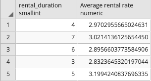

# Module 2, Lesson 1: SQL Queries

## Overview

Today’s lesson will introduce the students to features of Structured Query Language (SQL), like joining tables; writing queries to aggregate, group, and order data; and using subqueries to explore data in more depth.

## Class Objectives

By the end of today's lesson, the students will be able to:

* Combine data from multiple tables.

* Create queries by using aggregate functions.

* Create queries to group and order data.

* Create subqueries to further explore data.

---

## Activity Outline

| Activity | Time |
| -- | -- |
| [1. Welcome & Import of Data](#Section1) | 20 minutes |
| [2. Joins](#Section2) | 40 minutes |
| [3. Aggregate Functions, Aliases, and Grouping](#Section3) | 35 minutes |
| [4. Break](#Section4) | 15 minutes |
| [5. Ordering Data](#Section5) | 35 minutes |
| [6. Subqueries](#Section6) | 35 minutes |

---

## Instructor Prep

This section covers notes for this lesson and a slideshow for this lesson.

<details>
  <summary><strong>🗒️ Notes for This Lesson</strong></summary>

* Today's lesson will mainly use imported datasets, so make sure that the students feel comfortable importing data from CSV files. Note that all the table schemas will be provided along with the CSV files. Any students who don't correctly import this data won’t be able to follow along with the lesson.

* Today's lesson will build on what the students learned in an earlier lesson. And, each activity will combine multiple SQL features. Students who are new to SQL might struggle a bit, but many of the concepts resemble those that they previously learned.

* The TAs should be ready to help any students who either become confused or haven’t correctly imported the data.

Remind the students that they can download the files and instructions for the activities by using the AWS links in Canvas. Please send out the files and instructions to any students who haven't downloaded the files for today. 

</details>

### <a name="slideshow"></a> Slideshow

You can find the [SQL Queries](https://docs.google.com/presentation/d/1uhKLP0EROcl-7vi40nxe367f0vF90NqviHtGEzLZewA/edit?usp=sharing) slides for this lesson on Google Drive.

Remember that the slideshows are for instructor use only. To distribute slide content to the students, please export the slides to a PDF file. You can then send the PDF to the students.

- - -

## Activities

This lesson plan has six activities, which the following sections describe.

### 1. <a name="Section1"></a> Welcome & Import of Data (20 minutes)

<details>
  <summary><strong>📣 1.1 Instructor Do: Welcome the Class (5 minutes)</strong></summary>

* Open the slides, and welcome the students to the class.

* Explain that today's lesson will introduce the students to some of the basic features that SQL makes available. Specifically, the students will combine data from multiple tables and query the tables to retrieve data. 

* Explain the class objectives.

</details>

<details>
  <summary><strong>🎉 1.2 Everyone Do: Pagila Database Creation (15 minutes)</strong></summary>

* Continuing with the slides, explain that today's activities will require the students to import some data into a database. 

* **Files:** 

  * [Resources folder](Activities/01-Evr_Import_Data/Resources)

* Mention that this data was taken from the [Pagila](https://github.com/devrimgunduz/pagila) database. 

  * Pagila is essentially a port of another database, the popular [Sakila Sample Database](https://dev.mysql.com/doc/sakila/en/). The main difference is that Sakila is a MySQL database, but Pagila uses PostgreSQL.

* Compress the `Resources` folder, and then send it out to the students. This folder contains everything that they need to import the data.

* Note that the students have two options for importing the data. The first is the schema option, in which the students import the table data by running a SQL query in pgAdmin. The second is the CSV option, in which the students use the pgAdmin GUI and import each CSV file into its corresponding table in the database. If anyone who chooses the schema option has issues, direct them to the CSV option.

* Lead the students through both options, as the following two subsections describe.

#### Schema Option

* In pgAdmin, create a database named `rental_db`.

* Open the Query Tool for `rental_db`.

* Paste in the content of [pagila-schema.sql](Activities/01-Evr_Import_Data/Resources/pagila-schema.sql), and then run the code. This creates the needed tables.

* Paste in [pagila-insert-data.sql](Activities/01-Evr_Import_Data/Resources/pagila-insert-data.sql), and then run the code. This imports the data into the tables.

  **Note:** This will take a few minutes because of the large amount of data. As long as no errors display, the data will be imported.

#### CSV Option

* In pgAdmin, create a database named `rental_db`.

* Open the Query Tool for `rental_db`.

* Paste in the content of [schema.sql](Activities/01-Evr_Import_Data/Resources/schema.sql), and then run the code. This creates the needed tables.

* Right-click the `actor` table, which appears on the right side, and then select Import/Export.

* In the Import/Export options, import `actor.csv` by completing the following steps:

  * Select the file to import (`actor.csv`).
  * Select the file type (CSV).
  * Set Header to Yes.
  * Set the delimiter (a comma).
  * Click OK.

  **Note:** While the data is being imported, have the TAs ask if any students need help with the import process.

* To confirm that the import succeeded, run `SELECT * FROM actor LIMIT 100;`.

   * Point out that we use an asterisk (`*`) to return the data from all the columns in the table. Mention that using an asterisk is an excellent practice during exploration but that in production code, specifying the columns is the standard practice.


  * **Optional:** Right-click the `actor` table, and then review the first 100 rows to check that the data imported correctly.

* Repeat the preceding three steps for each remaining table and its corresponding CSV file.

</details>

---

### 2. <a name="Section2"></a> Joins (40 minutes)

<details>
  <summary><strong>📣 2.1 Instructor Do: Joins (15 minutes)</strong></summary>

* Continue going through the slides to introduce joins to the class.

* **File:** 
  * [joins.sql](Activities/02-Ins_Joins/Solved/joins.sql)

* Send out `joins.sql` so that any students who want to follow along with your demonstration can do so.

* The students might recall working with merges and joins to combine datasets during the Pandas module. Although SQL vastly differs from Python, it also includes the functionality to join tables.

* To combine one SQL database table to another during a query, we use a `JOIN` statement. In the `JOIN` statement, we need to use matching values in the columns that we specify in both tables.

* For example, to display the first and last names and the address of each staff member, we can combine data from the `staff` and `address` tables, as the following code shows:

  ```sql
  -- Use an inner JOIN to display the first and last names, as well as the address, of each staff member
  SELECT staff.first_name, staff.last_name, address.address
  FROM staff
  INNER JOIN address ON address.address_id = staff.address_id;
  ```

  * Point out that both tables, `staff` and `address`, have matching values in their `address_id` columns. Because the tables have common values, we can join these tables together.

* Note that some students might have advanced knowledge of SQL queries and thus use aliases in their solutions. Let the students know that we’ll be covering aliases in a later activity. For now, the following code shows an advanced solution that uses aliases:

  ```sql
  -- Advanced INNER JOIN solution
  SELECT s.first_name, s.last_name, a.address
  FROM staff as s
  JOIN address as a ON a.address_id = s.address_id;
  ```

* Point out one significant difference between SQL joins and Python joins: in SQL joins, we must use the initial `SELECT` statement to declare the columns that will display after the join. For example, the following image shows the first two rows of the columns that our inner join returned (specifically, the `first_name`, `last_name`, and `address` columns):

    

* With PostgreSQL, we can use five primary types of joins:

  * `INNER JOIN`: Returns the records, or rows, that have matching values in both tables.

  * `LEFT JOIN`: Returns all the records in the left table and any matching records in the right table.

  * `RIGHT JOIN`: Returns all the records in the right table and any matching records in the left table.

  * `CROSS JOIN`: Returns the records where a row of the left table matches a row of the right table. This type of join has the potential to create a huge table.

  * `FULL OUTER JOIN`: Places null values in the columns that don’t match between the two tables&mdash;after an inner join is performed.

* Send out the link to [PostgreSQL - JOINS](https://www.tutorialspoint.com/postgresql/postgresql_using_joins.htm) so that the students can study the content.

* Demonstrate using a `LEFT JOIN` instead of an `INNER JOIN` on our previous code, as the following code shows:

  ```sql
  -- Use an inner JOIN to display the first and last names, as well as the address, of each staff member
  SELECT staff.first_name, staff.last_name, address.address
  FROM staff
  INNER JOIN address ON address.address_id = staff.address_id;

  -- Use a LEFT JOIN to get the first and last names, as well as the address, of each staff member.
  SELECT staff.first_name, staff.last_name, address.address
  FROM staff
  LEFT JOIN address ON address.address_id = staff.address_id;
  ```

  * Point out that we retrieve the same data. That’s because the records in the left table, `staff`, match only two records in the right table, `address`, as the following image shows:

    

* Point out that if we change `LEFT JOIN` to `RIGHT JOIN`, we’ll get all the records in the right table, `address`, and only two matching records in the left table, `staff`, as the following image shows:

  

  * In the preceding image, notice that the entries that don’t have matching values now contain null values.

* Demonstrate the `FULL OUTER JOIN` and the `CROSS JOIN`.

* Answer any questions before moving on.

</details>

<details>
  <summary><strong>👥  2.2 Partner Do: Joining Movies (15 minutes)</strong></summary>

* Continuing with the slides, present this activity to the class.

* Explain that the students will practice using joins by combining data from various tables.

* **Files:**

  * [README.md](Activities/03-Par_Joins/README.md)
  
  * [joining_movies_unsolved.sql](Activities/03-Par_Joins/Unsolved/joining_movies_unsolved.sql)  

</details>

<details>
  <summary><strong>⭐ 2.3 Review: Joining Movies (10 minutes)</strong></summary>

* Continue with the slides, and review the activity.

* **File:**

  * [joining_movies.sql](Activities/03-Par_Joins/Solved/joining_movies_solved.sql)


* Open the `joining_movies_solved.sql` solution file, copy the code, open a new Query Tool, and then paste the code into the editor. Review the code, while explaining the following:

  * Because the selected data comes from more than one table, the naming convention is `<table_name>.<column_name>`. (Alternatively, we can use aliases for `<table_name>`.)

  * We need to determine which table to select data from and which table to join with. Remember that an inner join selects only the data that has matching values in both tables.

  * For the first part of the solution, we want to retrieve all the first and last names and the street address for all the customers. So, we select the data columns that we need from both tables and then specify which columns to connect them by, as the following code shows:

    ```sql
    SELECT customer.first_name, customer.last_name, address.address
    FROM customer
    INNER JOIN address
    ON address.address_id = customer.address_id;
    ```

  * For the second part of the solution, discuss how we can limit the results by using a `WHERE` clause, as the following code shows:

    ```sql
    SELECT customer.first_name, customer.last_name, payment.amount
    FROM customer 
    JOIN payment
    ON customer.customer_id = payment.customer_id
    WHERE payment.amount > 10.00;
    ```

  * For the third part of the solution, we select the data columns that we need from the tables, create three `JOIN` statements, and then limit the search by using a `WHERE` clause, as the following code shows:

    ```sql
    SELECT actor.first_name, actor.last_name, film.title
    FROM actor
    JOIN film_actor
    ON actor.actor_id = film_actor.actor_id
    JOIN film
    ON film.film_id = film_actor.film_id
    WHERE film.title = 'ALTER VICTORY';
    ```

  * For the fourth part of the solution, we use the same approach that we used for the third part. We select the data columns that we need from the tables, create three `JOIN` statements, and then limit the search by using `WHERE` and `AND` clauses. And because of the nature of joins, we use the `SELECT DISTINCT` statement to avoid returning duplicate data, as the following code shows:

    ```sql
    SELECT DISTINCT customer.first_name, customer.last_name, film.title
    FROM customer
    JOIN inventory
    ON customer.store_id = inventory.store_id
    JOIN film
    ON inventory.film_id = film.film_id
    WHERE film.title = 'ALTER VICTORY'
    AND inventory.store_id = 1;
    ```

* Answer any questions before moving on.

</details>

---

### 3. <a name="Section3"></a> Aggregate Functions, Aliases, and Grouping (35 minutes)

<details>
  <summary><strong>📣 3.1 Instructor Do: Aggregate Functions, Aliases, and Grouping (10 minutes)</strong></summary>

* Use the slides to explain aggregate functions, as follows:

  * As with aggregates in Pandas, we can use **aggregate functions** in SQL to perform calculations on a set of values. And, each aggregate function returns a single value.

  * The most commonly used aggregate functions are `AVG`, `COUNT`, `MIN`, `MAX`, and `SUM`.

  * People often combine aggregate functions with `GROUP BY`, `HAVING`, and `SELECT`.

* Send out the following file so that any students who want to follow along with the demonstration can do so:

  * [aggregates.sql](Activities/04-Ins_Aggregates/Solved/aggregates.sql)

* To begin the demonstration, open the `aggregates.sql` solution file. Then In pgAdmin, select the `rental_db` database, and then open the Query Tool.

* Run `SELECT * FROM film;`, and then manually count the number of rows. 

* Run `SELECT COUNT(film_id) FROM film;`, and then explain the following:

  * The `COUNT()` function offers an easier way to count the rows

  * The `COUNT()` function is an aggregate function.

* Explain that with the number of `film_id` entries counted, it's easier to observe that the number of films is 1,000, as the following image shows:

  

  **Note:** The name of the field that `COUNT()` returns is `count bigint`, which doesn't accurately describe the column. Postgres has a way to change the column names and make them more descriptive.

* Run the following code:

  ```sql
  SELECT COUNT(film_id) AS "Total films"
  FROM film;
  ```

* Note that the following image shows the result of running the preceding code:

  

* Explain the following about the preceding code:

  * Using `AS 'Total films'` demonstrates a technique called aliasing.

  * **Aliasing** creates an **alias**, or a new name, for the column.

  * Using an alias doesn’t change the table or the database in any way. But, It offers a convenient way to either review a column or create a shortcut for a column or other data.

* The `COUNT()` function gives us the number of movies. But, it doesn’t give us extra information, like the number of movies that have a specific rating, such as G or PG-13. This is where the `GROUP BY` clause comes into play.

* Run the following code:

  ```sql
  SELECT rating, COUNT(film_id) AS "Total films"
  FROM film
  GROUP BY rating;
  ```

* Explain the following:

  * The `GROUP BY` clause first groups the data by the specified column.

  * We use aggregate functions to get the values for any columns that the `GROUP BY` clause doesn’t include.

  * In this case, the `COUNT()` function counts the number of `film_id` values for each `rating` value. The following image shows the result of running the preceding code:

    

* Explain that we can aggregate data in other ways besides counting. For example, `SUM`, `AVERAGE`, `MIN`, and `MAX` are all valid aggregate functions to apply to the data.

* Ask the class how to query the average rental period for all the movies. To demonstrate this, run the following query:

  ```sql
  SELECT AVG(rental_duration)
  FROM film;
  ```

* To demonstrate how to add an alias to the `AVG()` function, run the following code:

  ```sql
  SELECT AVG(rental_duration) AS "Average rental period"
  FROM film;
  ```

* Put it all together by running the following query, showing how to use `GROUP BY` for the rental duration, get the average rental rate, and give `rental_rate` an alias:

  ```sql
  SELECT rental_duration, AVG(rental_rate) AS "Average rental rate"
  FROM film
  GROUP BY rental_duration;
  ```

  * The following image shows the result of running the preceding code:

    

* Ask a student to explain the query. Here’ the explanation:

  * Movies that can be rented for three days cost an average of $2.83 to rent. Movies that can be rented for four days cost an average of $2.97 to rent, and so on.

* SQL can also return the rows that contain the minimum and the maximum values in a column via `MIN()` and `MAX()`, respectively, as the following code shows:

  ```sql
  -- Find the rows with the minimum rental rate
  SELECT rental_duration, MIN(rental_rate) AS "Min rental rate"
  FROM film
  GROUP BY rental_duration;

  -- Find the rows with the maximum rental rate
  SELECT rental_duration, MAX(rental_rate) AS "Max rental rate"
  FROM film
  GROUP BY rental_duration;
  ```

* Mention that aggregate functions calculate and retrieve data but don’t modify the data. That is, they don’t modify the database.

* Explain that lots more aggregate functions exist that the students can research. Send out the link to [PostgresQL - Useful Functions](https://www.tutorialspoint.com/postgresql/postgresql_useful_functions.htm) for the students to have for future reference.

* Answer any questions before moving on.

</details>

<details>
  <summary><strong>✏️ 3.2 Student Do: Aggregating Movie Data (15 minutes)</strong></summary>

* Continue with the slides to explain this activity.

* Explain that the students will practice writing queries that use aggregate functions, grouping, and aliases.

* **Files:**

  * [README.md](Activities/05-Stu_GregariousAggregates/README.md)
  
  * [gregarious_aggregates_unsolved.sql](Activities/05-Stu_GregariousAggregates/Unsolved/gregarious_aggregates_unsolved.sql)

</details>

<details>
  <summary><strong>⭐ 3.3 Review: Aggregating Movie Data (10 minutes)</strong></summary>

* Send out the following solution file to the students:

  * [gregarious_aggregates_solved.sql](Activities/05-Stu_GregariousAggregates/Solved/gregarious_aggregates_solved.sql)

* In pgAdmin, open the `gregarious_aggregates_solved.sql` solution file, and then review the code while explaining the following:

  * Postgres uses double quotes (`"`) for table and column names and single quotes (`'`) for string constants.

  * The SQL `GROUP BY` clause resembles the Pandas `groupby` operation.

  * A `SELECT` statement without aggregate functions selects only the columns in the `GROUP BY` clause.

* Answer any questions before moving on.

</details>

---

### 4. <a name="Section4"></a> Break (15 minutes)

---

### 5. <a name="Section5"></a> Ordering Data (35 minutes)

<details>
  <summary><strong>📣 5.1 Instructor Do: Order By Aggregate Function Results (10 minutes)</strong></summary>

* In pgAdmin, open [order_by_aggregates.sql](Activities/06-Ins_Order_By/Solved/order_by_aggregates.sql).

* Continue using the slides, and explain ordering the results of using aggregate functions, as follows:

  * Point out that when using an aggregate function, we get the results in a random order. So, how can we find the smallest and largest numerical results?

  * The answer is that Postgres has a clause, named `ORDER BY`, that solves this issue. We add `ORDER BY` toward the end of a query, and by default, it sorts the results in ascending order, as the following code shows:

    ```sql
    SELECT rental_rate, AVG(length) AS "avg length"
    FROM film
    GROUP BY rental_rate
    ORDER BY "avg length";
    ```

  * Postgres adds lots of numbers after the decimal point. To reduce how many it adds, we can use the `ROUND()` function. It takes two parameters as follows: `ROUND(<value>, <number of decimal places>)`. The function then rounds the specified value down to the specified number of decimal places, as the following code shows:

    ```sql
    SELECT rental_rate, ROUND(AVG(length),2) AS "avg length"
    FROM film
    GROUP BY rental_rate
    ORDER BY "avg length";
    ```

  * The `ORDER BY` clause will organize the results in descending order if we add the `DESC` keyword, as the following code shows:

    ```sql
    SELECT rental_rate, ROUND(AVG(length),2) AS "avg length"
    FROM film
    GROUP BY rental_rate
    ORDER BY "avg length" DESC;
    ```

* Answer any questions before moving on.

</details>

<details>
  <summary><strong>✏️ 5.2 Student Do: Ordering Movie Data (15 minutes)</strong></summary>

* Use the slides to introduce this activity.

* Explain that the students will combine `ORDER BY` with other SQL keywords to query and order the tables.

* **Files:**

  * [README.md](Activities/07-Stu_Order_By/README.md)
  
  * [movies_ordered_by_unsolved.sql](Activities/07-Stu_Order_By/Unsolved/movies_ordered_by_unsolved.sql)


</details>

<details>
  <summary><strong>⭐ 5.3 Review: Ordering Movie Data (10 minutes)</strong></summary>

* Send out the following solution file to the students:

  * [movies_ordered_by_solved.sql](Activities/07-Stu_Order_By/Solved/movies_ordered_by_solved.sql)

* Continue with the slides, and review the activity.

* In pgAdmin, open the `movies_ordered_by_solved.sql` solution file, and then review the code while explaining the following:

  * For the first query, we group the `actor` table by `first_name`, using an aggregate function to get the counts, and we create an alias of `actor count`. We then order the query results in descending order by count.

  * For the second query, we use the `ROUND` function to round down the results to two decimal places.

  * For the third query, we add `LIMIT 10` to the end of the query to return the top 10 results.

  * For the bonus, we use `JOIN` to combine the `customer` and `payment` tables on `customer_id`. We then group the results on the first and last names that the join returns. Finally, we sort the results by the total of the amount that each `customer_id` paid, in descending order.

* Answer any questions before moving on.

</details>

---

### 6. <a name="Section6"></a> Subqueries (35 minutes)

<details>
  <summary><strong>📣 6.1 Instructor Do: Introduction to Subqueries (10 minutes)</strong></summary>

* Continue using the slides to begin the discussion of subqueries. Explain that a **subquery** is a query that’s nested inside a larger query.

* Open [subqueries.sql](Activities/08-Ins_Subqueries/Solved/subqueries.sql), and then go through the code with the students, explaining subqueries as follows:

  * Explain that more than one way often exists to accomplish a task in SQL.

  * For example, say that we want to review the inventory of a film named EARLY HOME. One way to do so is to run several queries in succession. In the first query, we can search by title and get the `film_id` number, as the following code shows:

    ```sql
    SELECT title, film_id
    FROM film
    WHERE title = 'EARLY HOME';
    ```

    * Running the preceding code results in a `film_id` of 268. We can now use this information to search for data in the `inventory` table, as the following code shows:

      ```sql
      SELECT *
      FROM inventory
      WHERE film_id = 268;
      ```

      The following image shows the result of running the preceding code:

      

    * The result shows that two copies of this movie exist&mdash;as the two `inventory_id` numbers indicate. Both have a `store_id` of 2, indicating that both copies are located in Store Number 2.

  * At this point, ask the class whether it’s possible to join the preceding two queries into a single query. Then run the following query:

    ```sql
    SELECT i.inventory_id, i.film_id, i.store_id
    FROM inventory i
    JOIN film f
    ON (i.film_id = f.film_id)
    WHERE f.title = 'EARLY HOME';
    ```

  * Note that the students should now begin to feel more comfortable with joins. Explain that we can get the same information in a different way&mdash;specifically, by using a subquery, as the following code shows:

    ```sql
    SELECT *
    FROM inventory
    WHERE film_id IN
    (
      SELECT film_id
      FROM film
      WHERE title = 'EARLY HOME'
    );
    ```

  * Be aware that the students might find the preceding code a bit confusing or intimidating at first. So, start with the inner query, as the following code shows:

    ```sql
    SELECT film_id
    FROM film
    WHERE title = 'EARLY HOME';
    ```

    * The preceding query returns a `film_id` of 268.

    * The next query (that is, the outer query) then does its query according to the result of the inner query.

    * Think of it like this: The inner query essentially creates a one-time, temporary table. The outer query then selects data according to that temporary table.

  * To confirm that the result is correct, place 268 (the result of the subquery) inside the parentheses to replace the subquery, as the following code shows:

    ```sql
    SELECT *
    FROM inventory
    WHERE film_id IN (268);
    ```

    * The preceding code produces the same result as the earlier join, as the following image shows:

      

    * We just simplified the query by first running the nested subquery and then by placing the result into the outer query.

  * Explain that Postgres doesn't necessarily run code in that order. But, it helps us when coding to reduce subqueries to basic queries as building blocks.

  * Send out the link to [Order of execution of a Query](https://sqlbolt.com/lesson/select_queries_order_of_execution), which explains the order of execution that occurs in SQL queries.

  * Mention that although we can often accomplish the same task by using either joins or subqueries, joins tend to get executed faster. So, why should we ever use subqueries?

  * Explain that subqueries are usually more readable for beginners. And, joins are usually more readable for experienced SQL coders, because their queries tend to be more complex.
  
  * Answer any questions before moving on.

</details>

<details>
  <summary><strong>✏️ 6.2 Student Do: Subqueries (15 minutes)</strong></summary>

* Continue with the slides to explain this activity.

* Explain that the students will practice creating subqueries.

* **Files:**

  * [README.md](Activities/09-Stu_Subqueries/README.md)

  * [stu_subqueries_unsolved.sql](Activities/09-Stu_Subqueries/Unsolved/stu_subqueries_unsolved.sql)


</details>

<details>
  <summary><strong>⭐ 6.3 Review: Subqueries (10 minutes)</strong></summary>

* Send out the following solution file to the students:

  * [stu_subqueries_solved.sql](Activities/09-Stu_Subqueries/Solved/stu_subqueries_solved.sql)

* Continue with the slides, and review the activity.

* In pgAdmin, open the `stu_subqueries_solved.sql` solution file, and then review the code as follows:

  * In the first query, we're seeking the names and ID numbers of cities from a given list, as the following code shows:

    ```sql
    SELECT city, city_id
    FROM city
    WHERE city IN ('Qalyub', 'Qinhuangdao', 'Qomsheh', 'Quilmes');
    ```

  * In the second query, we’re seeking all the districts that exist in the cities from the first query. So, we use the first query as a subquery. Specifically, the second query selects each `district` where `city_id` is in the results of the first query, as the following code shows:

    ```sql
    SELECT district
    FROM address
    WHERE city_id IN
    (
      SELECT city_id
      FROM city
      WHERE city IN ('Qalyub', 'Qinhuangdao', 'Qomsheh', 'Quilmes')
    );
    ```

    * In the preceding code, notice that because `district` isn’t available in the `city` table, we have to use `city_id` from the `city` table. It’s `city_id` that allows a connection between `district` and `city`.

  * The bonus adds another level of subqueries. It requires first querying the `city` table and then querying the `address` table. We can then use that information to query the `customer` table, as the following code shows:

    ```sql
    SELECT first_name, last_name
    FROM customer cus
    WHERE address_id IN
    (
      SELECT address_id
      FROM address a
      WHERE city_id IN
      (
        SELECT city_id
        FROM city
        WHERE city LIKE 'Q%'
      )
    );
    ```

* Answer any questions before moving on.

</details>

---
## Reference

Oracle Corporation. (2019). [Sakila Sample Database](https://dev.mysql.com/doc/sakila/en/). Edited by Devrim G&uuml;nd&uuml;z into Pagila. [Pagila](https://github.com/devrimgunduz/pagila)

- - -

Copyright 2022 2U. All Rights Reserved.