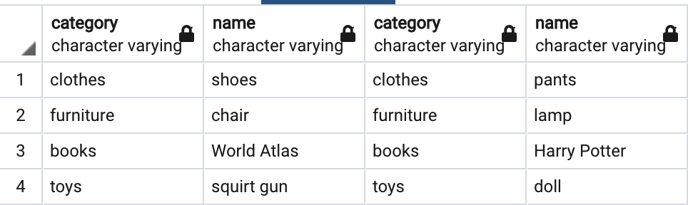
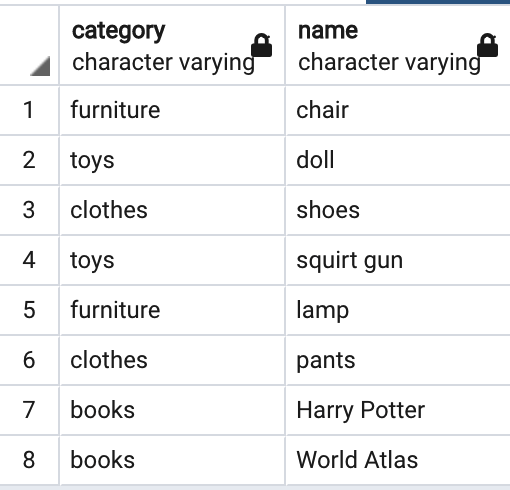
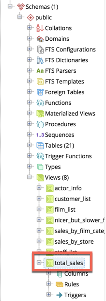
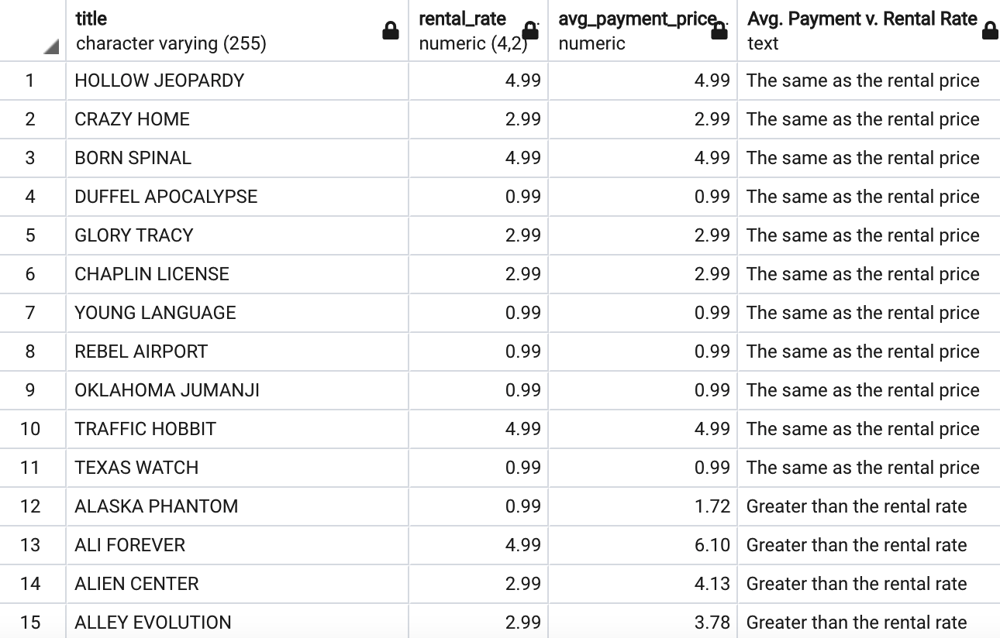
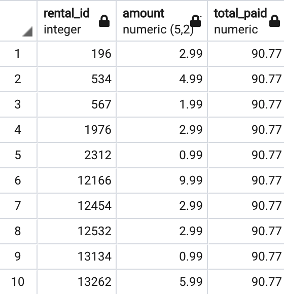
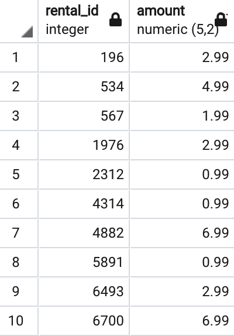
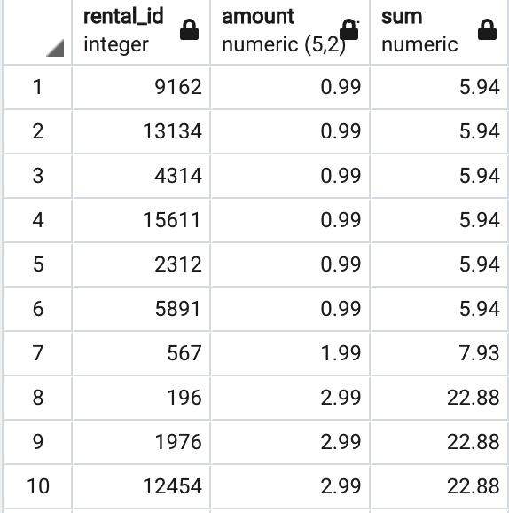
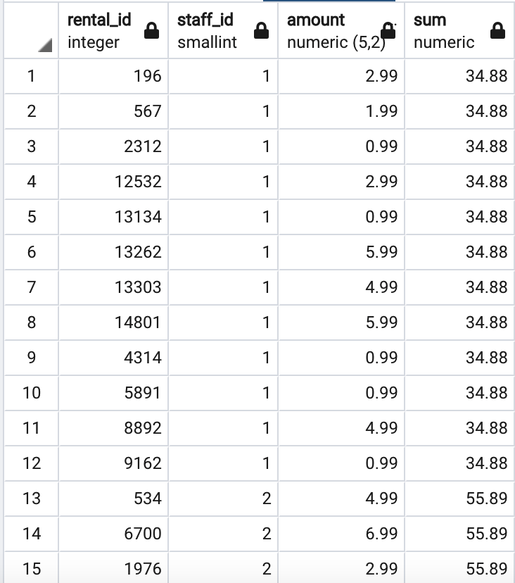
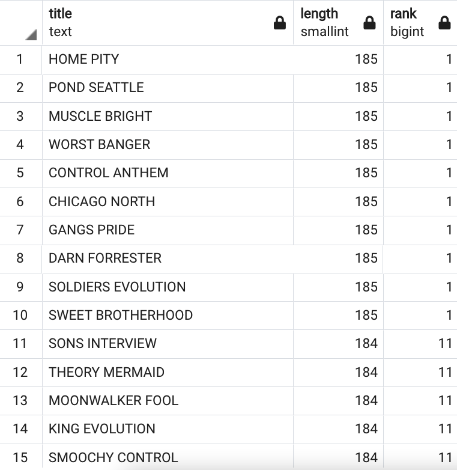
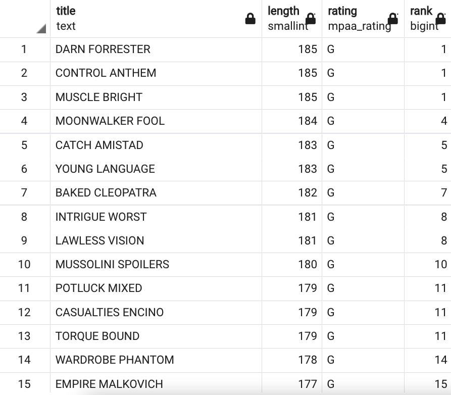

# Module 2, Lesson 2: Advanced SQL Queries

## Overview

In today’s lesson, the students will learn how to write and run advanced SQL queries that use nested subqueries, unions, and window functions and that create views.

## Class Objectives

By the end of today's class, the students will be able to:

* Create advanced subqueries to further explore data.

* Combine data from multiple tables by using unions.

* Create views and run subqueries that use them.

* Create window functions and run queries that use them.

---

## Activity Outline

| Activity | Time | 
| -- | -- | 
| [1. Welcome](#Section1) | 5 minutes |
| [2. Advanced Subqueries](#Section2) | 35 minutes |
| [3. Unions](#Section3) | 35 minutes |
| [4. Break](#Section4) | 15 minutes |
| [5. Views](#Section5) | 40 minutes |
| [6. Window Functions](#Section6) | 40 minutes |
| [7. Review Module Objectives, Assignment, and Assessment](#Section7) | 10 minutes |

---

## Instructor Prep

This section covers notes for this lesson and a slideshow for this lesson.

<details>
  <summary><strong>🗒️ Notes for This Lesson</strong></summary>

* Today's lesson will cover advanced SQL queries. The students will build on what they learned in an earlier lesson, and each activity will combine multiple SQL features. So, make sure that the students feel comfortable with the SQL basics that they learned earlier.

* The TAs should be ready to help any students who become confused with using window statements.

Remind the students that they can download the files and instructions for the activities by using the AWS links in Canvas. Please send out the files and instructions to any students who haven't downloaded the files for today. 

</details>

### <a name="slideshow"></a> Slideshow

You can find the [Advanced SQL Queries](https://docs.google.com/presentation/d/1COfFO6R_H3QUJvyPXkCyhdUJwM6hI8N4sRZGetUfuRA/edit?usp=sharing) slides for this lesson on Google Drive.

Remember that the slideshows are for instructor use only. To distribute slide content to the students, please export the slides to a PDF file. You can then send the PDF to the students.

- - -

## Activities

This lesson plan has seven activities, which the following sections describe.

### 1. <a name="Section1"></a> Welcome (5 minutes)

<details>
  <summary><strong>📣 1.1 Instructor Do: Welcome the Class (5 minutes)</strong></summary>

* Open the slides, and welcome the students to the class.

* Explain that today's lesson will provide an in-depth examination of the advanced features that SQL makes available.

* Explain the class objectives.

</details>

--- 

### 2. <a name="Section2"></a>Advanced Subqueries (35 minutes)

<details>
  <summary><strong>📣 2.1 Instructor Do: Advanced Subqueries (10 minutes)</strong></summary>

* **File:** 

  * [advanced_subqueries.sql](Activities/01-Ins_Advanced_Subqueries/Solved/advanced_subqueries.sql)

* This activity will use the `rental_db` database created in the previous class.

* Send out `advanced_subqueries.sql` so that any students who want to follow along with your demonstration can do so.

* Continue using the slides to introduce advanced subqueries to the class, as follows:

  * So far, the subqueries that we've used have been relatively straightforward. Now, we’ll explore more-complicated examples. But, don’t worry&mdash;we can perform subqueries that have complex nesting by using the same principles that we've already covered.

  * We begin with a question: how many people have rented the film BLANKET BEVERLY?

  * To systematically answer this question, we must first identify the tables that we need for our query. To do so, we’ll use an ERD.

* Send out the link to this [PostgreSQL Sample Database tutorial](http://www.postgresqltutorial.com/postgresql-sample-database/), tell the students to scroll down to the “DVD Rental ER Model” section, and then explain the following:

  * As you learned in an earlier lesson, an ERD shows the connections between the tables.

  * And, an ERD makes it easier to identify the tables that we need and the keys that we’ll use to link our subqueries.

* Tell the students that we need to start with the `customer` table and end with the `film` table. That’s because we want to count the number of customers that have rented a specific film.

* Ask the class which tables and keys will serve as the intermediaries, or bridges, between those two tables. Then explain the following:

  * Start with the `customer` table, and examine its keys. A good place to check is the primary key, which is `customer_id` in this table.

  * The `customer` table has a relationship with the `payment` table, which also contains `customer_id`.

* Begin a class discussion to determine how to formulate the rest of the subquery by using the ERD. Here’s one solution:

  * Connect the `payment` table with the `rental` table by using the `rental_id` key, which these tables have in common.

  * Connect `rental`table to the `inventory` table by using the `inventory_id` key.

  * Connect the `inventory` table to the `film` table by using the `film_id` key, which these tables have in common.

  * In the last subquery, query the BLANKET BEVERLY film title.

* Explain that the following code shows the final query:

  ```sql
  SELECT COUNT(*)
  FROM customer
  WHERE customer_id IN
  (
    SELECT customer_id
    FROM payment
    WHERE rental_id IN
  (
    SELECT rental_id
    FROM rental
    WHERE inventory_id IN
    (
      SELECT inventory_id
      FROM inventory
      WHERE film_id IN
      (
        SELECT film_id
        FROM film
        WHERE title = 'BLANKET BEVERLY'
      )
    )
  )
  );
  ```

  * In the preceding code, `COUNT(*)` counts the number of rows in the entire set of rows. This resembles `SELECT *` selecting all the rows. Specifically, the asterisk (`*`) designates all the rows.

* Run the query. It returns 12&mdash;meaning that 12 people have rented BLANKET BEVERLY.

* Explain that often, multiple ways exist to get this result through different table relationships.

* Answer any questions before moving on.

</details>

<details>
  <summary><strong>✏️ 2.2 Student Do: Mine the Subquery (15 minutes)</strong></summary>

* Continue with the slides to explain this activity.

* Explain that the students will continue to practice writing subqueries. They can work either individually with a partner.

* **Files:**

   * [README.md](Activities/02-Stu_Mine_the_Subquery/README.md)
   
   * [mine_the_subquery_unsolved.sql](Activities/02-Stu_Mine_the_Subquery/Unsolved/mine_the_subquery_unsolved.sql)

</details>

<details>
  <summary><strong>⭐ 2.3 Review: Mine the Subquery (10 minutes)</strong></summary>

* Send out the following solution file to the students:

  * [mine_the_subquery_solved.sql](Activities/02-Stu_Mine_the_Subquery/Solved/mine_the_subquery_solved.sql)

* Continue with the slides, and review the activity.

* Explain that the following code shows a possible solution to the first problem:

  ```sql
  SELECT first_name, last_name
  FROM actor
  WHERE actor_id IN
  (
    SELECT actor_id
    FROM film_actor
    WHERE film_id IN
    (
      SELECT film_id
      FROM film
      WHERE title = 'ALTER VICTORY'
    )
  );
  ```

  * Explain that the best way to proceed is to start with the most specific piece of information and then work our way toward the information that we want. In the preceding code, the innermost subquery retrieves the `film_id` value for the specified film title.

  * We then use this information to retrieve the `actor_id` values which, in turn, are then used to retrieve the names of the actors who appear in the film.

* Explain that the following code shows a possible solution to the second problem:

  ```sql
  SELECT title
  FROM film
  WHERE film_id
  IN (
    SELECT film_id
      FROM inventory
      WHERE inventory_id
      IN (
          SELECT inventory_id
          FROM rental
          WHERE customer_id
          IN (
                SELECT customer_id
                FROM customer
                WHERE first_name = 'PEGGY' AND last_name = 'MYERS'
              )
          )
    );
  ```

  * Explain that as with the first problem, the query in the preceding code begins with the most specific piece of information and then works its way toward the information that we want.

  * We first use the customer name to query the `customer_id` value.

  * We then use the `customer_id` to retrieve the `inventory_id` values from the rentals.

  * Finally, we use the `inventory_id` values to retrieve the `film_id` values which, in turn, enables us to retrieve the relevant film titles.

* Answer any questions before moving on.

</details>

---

### 3. <a name="Section3"></a> Unions (35 minutes)

<details>
  <summary><strong>📣 3.1 Instructor Do: Unions (10 minutes)</strong></summary>

* Continue using the slides to introduce the students to SQL unions.

* **Files**:

  * [unions.sql](Activities/03-Ins_Unions/Solved/unions.sql)

  * [products_schema.sql](Activities/03-Ins_Unions/Solved/products_schema.sql)

  * [toys_games_schema.sql](Activities/03-Ins_Unions/Solved/toys_games_schema.sql) 

* **Note:** The topic of unions is less crucial than some of the others that this lesson covers, so adjust the timing as you prefer.

* Send out `unions.sql`, `products_schema.sql`, and `toys_games_schema.sql` so that any students who want to follow along with your demonstration can do so.

* For the first example that you’ll demonstrate, create a new database named `Miscellaneous_DB`, and then in pgAdmin, run `products_schema.sql` to create the tables. 

* First, remind the students that when we perform joins, we combine data horizontally, which arranges the data into multiple columns.

* Explain that we can also stack data vertically, which arranges the data into multiple rows through an operation called `UNION`.

* For the first example, demonstrate how the results get arranged when we use a join, as the following code shows:

  ```sql
  SELECT po.category, 
    po.name, 
    ps.category, 
    ps.name
  FROM products_sold as ps
  JOIN products_ordered as po
  ON ps.category = po.category;
  ```

  The following image shows the result of running the preceding code:

  

* To retrieve the same information by using a union, we can write `SELECT` statements. But, the `SELECT` statements within the union must involve the same number of columns. Because both tables have the same number of columns, we can combine them in a union, as the following code shows:

  ```sql
  SELECT category, name
  FROM products_sold

  UNION

  SELECT category, name
  FROM products_ordered;
  ```

  The following image shows the result of running the preceding code:

  

* Explain that by default, Postgres excludes duplicate entries from the result. 

* Next, using the `Miscellaneous_DB` database in pgAdmin, run `toys_games_schema.sql`, and then run `schema.sql` to create the tables. Then show the two separate queries by running the following code:

  ```sql
  -- Union of toys and game types
  SELECT toy_id AS id, type
  FROM toys;
  ```

  ```sql
  SELECT game_id AS id, type
  FROM games;
  ```

* Now, show the combined results by running the following code, which creates a union:

  ```sql
  -- Union of toys and game types
  SELECT toy_id AS id, type
  FROM toys

  UNION

  SELECT game_id AS id, type
  FROM games;
  ```

* Explain that we get only four rows of data because the duplicates that fit the criteria get dropped. If we want to display the duplicates, we can use the `UNION ALL` keywords, as the following code shows:

  ```sql
  -- Include duplicate rows
  SELECT toy_id AS id, type
  FROM toys

  UNION ALL

  SELECT game_id AS id, type
  FROM games;
  ```

* Answer any questions before moving on.

</details>

<details>
  <summary><strong>✏️ 3.2 Student Do: Unions (15 minutes)</strong></summary>

* Continue with the slides to explain this activity.

* Explain that the students will practice creating unions by combining data from tables without using joins.

* **Files:**

  * [README.md](Activities/04-Stu_Unions/README.md)
    
  * [stu_unions_unsolved.sql](Activities/04-Stu_Unions/Unsolved/film_unions_unsolved.sql)

</details>

<details>
  <summary><strong>⭐ 3.3 Review: Unions (10 minutes)</strong></summary>

* Send out the following solution file to the students:

  * [stu_unions_solved.sql](Activities/04-Stu_Unions/Solved/film_unions_solved.sql)

* Continue with the slides, and review the activity.

* Explain that solving the first problem requires just the union of the count of rows from `city` and the count of rows `country`, as the following code shows:

  ```sql
  SELECT COUNT(*)
  FROM city
  UNION
  SELECT COUNT(*)
  FROM country;
  ```

* Explain that solving the second problem requires a bit more work. The proposed solution brings together the customer IDs from the `customer` and `customer_list` tables by using `UNION ALL`, as the following code shows

  ```sql
  SELECT customer_id
  FROM customer
  WHERE address_id IN
  (
    SELECT address_id
    FROM address
    WHERE city_id IN
    (
      SELECT city_id
      FROM city
      WHERE city = 'London'
    )
  )
  UNION ALL
  SELECT id
  FROM customer_list
  WHERE city = 'London';
  ```

* In the preceding code, notice that we can narrow down the customer IDs from `customer_list` by using `WHERE city = 'London'`.

* And to retrieve the customer IDs from the `customer` table, we perform subqueries across the `address` and `city` tables.

* Answer any questions before moving on.

</details>

---

### 4. <a name="Section4"></a> Break (15 minutes)

---

### 5. <a name="Section5"></a> Views (40 minutes)

<details>
  <summary><strong>📣 5.1 Instructor Do: Create Views (15 minutes)</strong></summary>

* Continue using the slides to begin the discussion of views. 

**Note:** This activity will use the previously created `rental_db` database.

* **File:** 

  * [create_views.sql](Activities/05-Ins_Create_Views/Solved/create_views.sql)

* Explain that in SQL, a **view** is a virtual table that we can create from either a single table, multiple tables, or another view.

* Mention that we create a view by using the `CREATE VIEW` statement.

* Explain that so far, we’ve used relatively long queries&mdash;especially those that involve joins and subqueries. But, we have a way to save a long query as a name and then run that name as a shortcut.

* Send out the following query, and tell the students run it:

  ````sql
  SELECT s.store_id, SUM(amount) AS Gross
  FROM payment AS p
    JOIN rental AS r
    ON (p.rental_id = r.rental_id)
      JOIN inventory AS i
      ON (i.inventory_id = r.inventory_id)
        JOIN store AS s
        ON (s.store_id = i.store_id)
        GROUP BY s.store_id;
  ````

  * The preceding query is used to monitor the total sales from each store, which a company executive would often want to look up. Notice that we use aliases to reduce each table name to a single letter.

* Explain that instead of having to type the preceding query, we can store it in a view, as the following code shows:

  ```sql
  CREATE VIEW total_sales AS
  SELECT s.store_id, SUM(amount) AS Gross
  FROM payment AS p
  JOIN rental AS r
  ON (p.rental_id = r.rental_id)
    JOIN inventory AS i
    ON (i.inventory_id = r.inventory_id)
      JOIN store AS s
      ON (s.store_id = i.store_id)
      GROUP BY s.store_id;
  ```

  * Point out that the preceding query is identical to the first one&mdash;except for the first line: ‘CREATE VIEW total_sales AS’.

  * Explain that a view was created under the name `total_sales` and that in pgAdmin, created views are located in the left sidebar.

      

  * Explain that the rest of the query follows `AS`.

* Run the query, and then run a query to select everything from the view by using the following code:

  ```sql
  SELECT *
  FROM total_sales;
  ```

  * Point out that using a view simplifies our code.

* Ask a student to guess how we might delete a view. Then delete the preceding view by running the following code:

  ```sql
  DROP VIEW total_sales;
  ```

* Next, send out the following query, and tell the students to run it:

  ```sql
  SELECT f.title, f.rental_rate, p.amount 
  FROM film AS f
    JOIN inventory AS i
    ON (f.film_id = i.film_id)
      JOIN rental AS r
      ON (i.inventory_id = r.inventory_id)
        JOIN payment AS p
        ON (r.rental_id = p.rental_id)
        WHERE p.amount > 0.00
        ORDER BY f.title;
  ```

  * Notice that the preceding query retrieves the price for renting each movie. Also notice that movies that didn’t get rented are entered as `0.00` in the `payment` table and filtered out.

* Store the preceding query as a view, as the following code shows:

  ```sql
  CREATE VIEW film_rental_price AS 
  SELECT f.title, f.rental_rate, p.amount 
  FROM film AS f
    JOIN inventory AS i
    ON (f.film_id = i.film_id)
      JOIN rental AS r
      ON (i.inventory_id = r.inventory_id)
        JOIN payment AS p
        ON (r.rental_id = p.rental_id)
        WHERE p.amount = 0.00
        ORDER BY f.title;
  ```

* Explain that from our new view, we can get the average payment price and compare it to the rental rate for each movie, as the following code shows:

  ```sql
  SELECT title, rental_rate, ROUND(AVG(amount),2) AS avg_payment_price 
  FROM film_rental_price
  GROUP BY title, rental_rate
  ORDER BY title;
  ```

* Explain that we can classify each movie payment price either as greater than or the same as the rental rate by using the `CASE` statement. Explain that the `CASE` statement resembles the `IF-THEN` statement in Excel.

* Send out the following query, and tell the students to run it:

  ```sql
  SELECT title, rental_rate, ROUND(AVG(amount),2) AS avg_payment_price,
    (CASE WHEN AVG(amount) > rental_rate THEN 'Greater than rental rate'
    ELSE 'The same as the rental price' END) AS "Avg. Payment v. Rental Rate"
  FROM film_rental_price
  GROUP BY title, rental_rate
  ORDER BY "Avg. Payment v. Rental Rate" DESC;
  ```

  **Note:** We have no case for the average payment amount being less than the rental rate. 

  * Explain that the preceding query creates a new column, named "Avg. Payment v. Rental Rate". The column entries are 'Greater than rental rate' or `'The same as the rental price'` depending on whether the average payment for a movie is greater than or the same as the rental price.

    

* Explain the following rules of the `CASE` statement:

  * We use the `CASE` statement to set the values in a new column depending on the values in another column.

  * We use `WHEN` with the `CASE` statement to specify the condition to test.

  * The `THEN` statement specifies the action to take if the `WHEN` condition returns `TRUE`.

  * The `ELSE` statement is optional and runs if none of the `WHEN` conditions return `TRUE`.

  * The `CASE` statement ends with an `END` keyword.

* Answer any questions before moving on.

</details>

<details>
  <summary><strong>👥 5.2 Partner Do: A View with a Roomful of Queries (15 minutes)</strong></summary>

* Continue with the slides to explain this activity.

* Explain that the students will work with a partner to practice their join and subquery skills and to build a view.

* **Files:**

  * [README.md](Activities/06-Par_View_Room_Queries/README.md)
  
  * [roomful_of_queries_unsolved.sql](Activities/06-Par_View_Room_Queries/Unsolved/roomful_of_queries_unsolved.sql)

</details>

<details>
  <summary><strong>⭐ 5.3 Review: A View with a Roomful of Queries (10 minutes)</strong></summary>

* Send out the following solution file to the students:

  * [roomful_of_queries_solved.sql](Activities/06-Par_View_Room_Queries/Solved/roomful_of_queries_solved.sql)

* Continue with the slides, and review the activity.

* Explain the first query as follows:

  * To begin, we need two pieces of information&mdash;the title of a film and the number of copies of that film in the inventory&mdash;as the following code shows:

    ```sql
    SELECT title,
    (SELECT COUNT(inventory.film_id)
      FROM inventory
      WHERE film.film_id = inventory.film_id ) AS "Number of Copies"
    FROM film;
    ```

  * To create a view for the results, we add `CREATE VIEW title_count AS` before the preceding query.

  * Finally, we can query the newly created view, named `title_count`, to find the titles for which seven copies exist in the inventory, as the following code shows:

    ```sql
    SELECT title, "Number of Copies"
    FROM title_count
    WHERE "Number of Copies" = 7;
    ```

* Explain the second query as follows:

  * To begin, we can modify the the first query as follows: add the store ID, remove the number of copies of the title from the `SELECT` statement, create a join with the inventory table, group the results by the title and the store ID, and then order the results by the title and number of copies, as the following code shows:

    ```sql
    SELECT  f.title, i.store_id, 
      COUNT(i.film_id) AS "Number of Copies"
    FROM film as f
    JOIN inventory as i
    ON f.film_id = i.film_id
    GROUP BY f.title, i.store_id
    ORDER BY f.title, "Number of Copies";
    ```

  * To create a view for the results, we add `CREATE VIEW title_count AS` before the preceding query.

  * Finally, we can query the newly created view, named `title_count_by_store`, to create a new column, named "Status", that displays the status for the number of copies to order for each movie, as the following code shows:

    ```sql
    SELECT title, store_id,
      (CASE WHEN "Number of Copies" = 2 THEN 'Order 2 more copies'
      WHEN "Number of Copies" = 3 THEN 'Order 1 more copy'
      ELSE 'Okay' END) AS "Status"
    FROM title_count_by_store;
    ```

</details>

---

### 6. <a name="Section6"></a> Window Functions (40 minutes)

<details>
  <summary><strong>📣 6.1 Instructor Do: Window Functions (15 minutes)</strong></summary>

* Continue using the slides, and introduce the students to window functions as follows:

  * Explain that in SQL, a **window function** is defined by the use of the `OVER` clause. Specifically, a window function performs a calculation across all the rows that are related to the current row. But, the rows don’t get grouped into a single output row. Those rows keep their separate identities.

  * We create a window function by using the `OVER` clause. We refer to any function that precedes the `OVER` clause, like `AVG`, as the window function.

  * A window function has two capabilities:

    * Ordering the rows within a partition, when used with the `ORDER BY` clause.

    * Forming groups within a partition, when used with the `PARTITION BY` clause.​

**Note:** This activity will use the previously created `rental_db` database.

* **File:** 

  * [window_functions.sql](Activities/07-Ins_Window_Statements/Solved/window_functions.sql)

* Next, send out `window_functions.sql` so that any students who want to follow along with your demonstration can do so.

* Continue using the slides, and demonstrate the basic syntax of window functions, how to use window functions with aggregate functions, and how to rank results, as follows:

  * Explain that the following code shows the basic syntax for a window function:

    ```sql
    SELECT column1, column2, AVG(column2)
    OVER() AS avg_of_column2
    FROM table;
    ```

    * In the preceding code, the use of the `OVER` clause initiates the window function. In this case, the `OVER` clause specifies that the `AVG` function is the window function. 

  * Explain that we can use the `SUM` window function to calculate the total amount paid by Customer 184 for rentals, as the following code shows:

    ```sql
    SELECT rental_id, amount, SUM(amount)
    OVER () AS total_paid
    FROM payment
    WHERE customer_id = 184;
    ```

    * The following image shows the result of running the preceding code:

      

  * Notice that instead of getting one row with the total, we get the sum calculated for each row. 

  * Explain that without a window function, we’d need to write two queries to get the equivalent result. First, we’d get the amount for each `rental_id` from Customer 184 by using the following code:

    ```sql
    SELECT rental_id, amount 
    FROM payment
    WHERE customer_id = 184
    GROUP BY rental_id, amount
    ORDER BY rental_id;
    ```

    * The following image shows the result of running the preceding code:

      

  * Then, we’d get the total amount paid by Customer 184 by using the following code:

    ```sql
    SELECT SUM(amount)
    FROM payment
    WHERE customer_id = 184;
    ```

    * The following table shows the result of running the preceding code:

    |  |sum<br>numeric |
    |----|--- |
    | 1 | 90.77 | 

  * Next, explain that with the `OVER` clause, we can use any of the following aggregate functions: `AVG`, `COUNT`, `MIN`, `MAX`, and `SUM`. If we apply one of these aggregate functions over a particular window, we call it an **aggregate window function**.

  * Remind the students that the `OVER` clause has two capabilities:

    * Ordering the rows within a partition, when used with the `ORDER BY` clause.

    * Forming groups within a partition, when used with the `PARTITION BY` clause.

  * Demonstrate how to use the `ORDER BY` clause to order the rows on the amount, as the following code shows:

    ```sql
    SELECT rental_id, amount, SUM(amount)
    OVER (ORDER BY amount) 
    FROM payment
    WHERE customer_id = 184;
    ```

    * The following image shows the result of running the preceding code:

      

    * Notice that the preceding query uses the `SUM` window function with the `ORDER BY` clause to calculate the total of the movie rental payments. 

  * Also notice that in the result, the total is partitioned by each amount. For example, the first six rentals are each $0.99. The `SUM` window function calculates the total across all the rows that contain 0.99 and then adds that to the previous total in the "sum" column.

    * If each amount was unique, our "sum" column would display a running total. 

  * Demonstrate that because each "rental_id" value is unique, we can calculate a running total by using the `SUM` window function with the `ORDER BY` clause on the "rental_id" column, as the following code shows:

    ```sql
    SELECT rental_id, amount, SUM(amount)
    OVER (ORDER BY rental_id) 
    FROM payment
    WHERE customer_id = 184;
    ```

  * Next, demonstrate how to use the `PARTITION BY` clause to create groups according to the "staff_id" column, as the following code shows:

    ```sql
    SELECT rental_id, staff_id, amount, SUM(amount)
    OVER (PARTITION BY staff_id) 
    FROM payment
    WHERE customer_id = 184;
    ```

    * The following image shows the result of running the preceding code:

      

    * Notice that the preceding query uses the `SUM` window function with the `PARTITION BY` clause to determine the total of the movie rental payments for each staff member.

  * Explain that with a window function, we can add a rank to a query by using the `RANK` window function with the `ORDER BY` or `PARTITION BY` clause. The query then creates a new column that ranks the results sequentially to each row, as the following code shows:

    ```sql
    SELECT title, length,
      RANK() OVER (ORDER BY length DESC)
    FROM film;
    ```

    * The following image shows the result of running the preceding code:

      

  * Notice that if duplicate values exist, the `RANK` function assigns the same rank to them, and a gap appears in the ranking sequence. That is, the numbering isn’t sequential.

  * Explain that if we want to rank the rows without skipping any, we can use `DENSE_RANK`. If we replace `RANK` in the preceding code with `DENSE_RANK`, we get the following code:

    ```sql
    SELECT title, length,
      DENSE_RANK() OVER (ORDER BY length DESC)
    FROM film;
    ```

  * Finally, demonstrate that we can assign a rank within groups by using both the `PARTITION BY` and `ORDER BY` clauses, as the following code shows:

    ```sql
    SELECT title,
      length,
      rating,
      RANK() OVER (PARTITION BY rating
        ORDER BY length DESC)
    FROM film;
    ```

    * The following image shows the result of running the preceding code:

      

  * Notice that the preceding query uses the `RANK` window function with the `PARTITION BY` and `ORDER BY` clauses to group the results by the film rating, and it then ranks the length of the film within each group&mdash;that is, within each film rating.

* Mention that lots of other window functions exist that the students can research. Send out the link to [PostgreSQL Window Functions: The Ultimate Guide](https://www.postgresqltutorial.com/postgresql-window-function/) for the students to have for future reference.

* Answer any questions before moving on.

</details>

<details>
  <summary><strong>👥 6.2 Partner Do: Power Windows (15 minutes)</strong></summary>

* Continue with the slides to explain this activity.

* Explain that the students will work with a partner to practice writing queries that use window functions.

* **Files:**

  * [power_windows_unsolved.sql](Activities/08-Par-Power_Windows/Unsolved/power_windows_unsolved.sql)

  * [orders.sql](Activities/08-Par-Power_Windows/Unsolved/orders.sql)

  * [README.md](Activities/08-Par-Power_Windows/README.md)

</details>

<details>
  <summary><strong>⭐ 6.3 Review: Power Windows (10 minutes)</strong></summary>

* Send out the following solution file to the students:

  * [power_windows_solved.sql](Activities/08-Par-Power_Windows/Solved/power_windows_solved.sql)

* Continue with the slides, and review the activity.

* Explain the first query as follows: We select the "product_name" and "selling_price" columns and then perform the `SUM` aggregation on "selling_price". The `OVER` clause signals that the `SUM` function is the window function, and we order by the "product_name" column. We then filtered the results for "Baby Products", as the following code shows:

  ```sql
  SELECT product_name, selling_price, SUM(selling_price)
  OVER (ORDER BY product_name)
  FROM orders
  WHERE category = 'Baby Products';
  ```

* Explain the second query as follows: We select the "product_name" and "selling_price" columns and then use `RANK` as the window function. We order the ranks according to the "selling_price" column in descending order, as the following code shows:

  ```sql
  SELECT product_name, 
    selling_price,
    RANK() OVER (ORDER BY selling_price DESC) 
  FROM orders; 
  ```

* Explain the third query as follows: We modify the previous query to also select the "category" column and to use `PARTITION BY` on the "category" column. As before, we order the ranks according to the "selling_price" column in descending order, as the following code shows:

  ```sql
  SELECT product_name, 
    category,
    selling_price,
    RANK() OVER (PARTITION BY category 
          ORDER BY selling_price DESC) 
  FROM orders;
  ```

* Explain the bonus query as follows:

  * First, we select the "category" and "shipping_method" columns, and we use the `COUNT` aggregate function to count the "shipping_method" types.

  * Next, we use the `PARTITION BY` clause to distribute the rows in the results by the "category" column.
    
  * Then, we use the `ORDER BY` clause to sort the rows for each category in descending order by "shipping_method". 

  * Next, we use the `RANK` function to apply a rank to each "shipping_method" entry for each "category" entry.

  * Finally, we group the results by "category" and then by "shipping_method", as the following code shows:

    ```sql
    SELECT category, shipping_method, COUNT(shipping_method),
      RANK() OVER (PARTITION BY category
        ORDER BY COUNT(shipping_method) DESC)
    FROM orders
    GROUP BY category, shipping_method;
    ```

* Answer any questions before moving on.

</details>

---

### 7. <a name="Section7"></a> Module Objectives Review & Assignment Description (10 minutes)

<details>
  <summary><strong>📣 7.1 Instructor Do: Review the Module Objectives (2 minutes)</strong></summary>
<br>

* Review this module's objectives:

  * Combine data from multiple tables.

  * Create queries by using aggregate functions.

  * Create queries to group and order data.

  * Create subqueries to explore data further.

  * Create advanced subqueries to further explore data.

  * Combine data from multiple tables by using unions.

  * Create views and run subqueries that use them.

  * Create window functions and run queries that use them.

* Mention that next week, we’ll learn the extract, transform, and load (ETL) process for data.

* Answer any remaining questions before moving on.

</details>

<details>
  <summary><strong>📣 7.2 Instructor Do: Describe the Assignment (4 minutes)</strong></summary>
<br>

* **Files:**

  * [README.md](../../../02-Assignments/02-Employee_Database_Analysis/Instructions/README.md)

  * [Starter code](../../../02-Assignments/02-Employee_Database_Analysis/Instructions/employee_database_analysis_starter_code.sql)

* **Rubrics:**

* [Instructor grading rubric](https://docs.google.com/spreadsheets/d/1BBuusD7oKLJYggUhvE4OFm9KMLj_sN4nudEN6lB143c/edit?usp=sharing)

* [Student PDF rubric](../../../02-Assignments/02-Employee_Database_Analysis/Instructions/Employee_Database_Analysis_Rubric.pdf)

* Note that for this week's homework assignment, the students will perform a data analysis on the `Employee_DB` database that they created last week.

* Open [README.md](../../../02-Assignments/02-Employee_Database_Analysis/Instructions/README.md), and then go over the content&mdash;which consists of information and instructions for the assignment&mdash;with the class.

</details>
<details>
  <summary><strong>✏️ 7.3 Student Do: Unit 1 Take-Home Assessment (4 minutes)</strong></summary>
<br>

Let the students know that they’ll be quizzed on their knowledge of databases, data modeling, and SQL analysis in the Unit 1 Assessment.

* **Files:**

  * [README.md](../../../03-Assessments/Unit_1_Assessment/README.md)

  * [Datasets](../../../03-Assessments/Unit_1_Assessment/Unsolved/Resources)

  * [Unit_1_Assessment_unsolved.ipynb](../../../03-Assessments/Unit_1_Assessment/Unsolved/Unit_1_Assessment_unsolved.ipynb)

* Open [README.md](./../../03-Assessments/Unit_1_Assessment/README.md), and then go over the content&mdash;which consists of information and instructions for the assessment&mdash;with the class.

</details>

---

Copyright 2022 2U. All Rights Reserved.