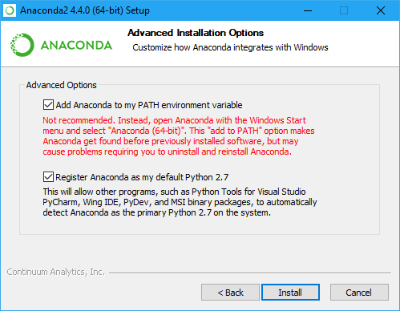

# Install Anaconda for Python

This guide will take you through the Python installation process for both macOS and Windows users.

## Install Anaconda on macOS

1. Go to the [Anaconda Distribution Page](https://www.anaconda.com/distribution/).

2. Click Download, and select the latest Python version. 

3. Follow the steps in the visual installer.

## Install Anaconda on Windows

1. Go to the [Anaconda Distribution Page](https://www.anaconda.com/distribution/).

2. Click Download, and select the latest Python version.

3. Open the installer, and then follow the instructions.

    **Important:** Make sure to select the "Add Anaconda to my PATH environment variable" checkbox.

    