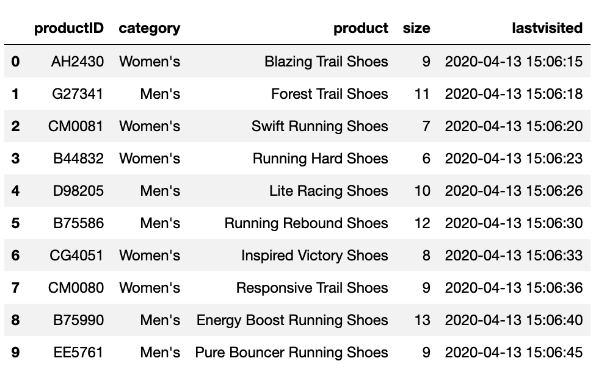

# Module 3 Lesson 1: Extract,Transform, and Load

## Overview

Today’s lesson will introduce the students to the extract, transform, and load (ETL) process and how to move data through a pipeline. They’ll learn how to use Python and Pandas functions, list comprehensions, and regular expressions to extract, clean, and transform data.

## Class Objectives

By the end of today's lesson, the students will be able to:

* Extract data by using Python and Pandas.

* Transform and clean data by using Python and Pandas.

* Parse string data into a Python dictionary.

* Use list comprehensions to make code more readable.

* Use regular expressions to manipulate string data.

## Activity Outline

| Activity | Time |
| -- | -- |
| [1. Welcome, Anaconda Installation Check, and Python Environment Creation](#Section1) | 15 minutes
| [2. Data Transformation and Cleaning](#Section2) | 40 minutes |
| [3. List Comprehensions](#Section3) | 35 minutes |
| [4. Break](#Section4) | 15 minutes |
| [5. Transforming and Cleaning Grocery Orders](#Section5) | 15 minutes |
| [6. Basic Regex Pattern Matching](#Section6) | 25 minutes |
| [7. Wildcards, Sets, and Escaping](#Section7) | 35 minutes |

---

## Instructor Prep

This section covers notes for this lesson and a slideshow for this lesson.

<details>
  <summary><strong>🗒️ Notes for This Lesson</strong></summary>

* Today's lesson will use Jupyter Notebook with Pandas to extract and then transform data&mdash;via Python functions, list comprehensions, and regular expressions. So, make sure that students feel comfortable with using Jupyter Notebook.

* Today's lesson will begin building on the students' data engineering skills&mdash;particularly with ETL. Be prepared to help those students who either are new or have little experience with Python programming.

* Remind the students that they can download the files and instructions for the activities by using the AWS links in Canvas. Please send out the files and instructions to any students who haven't downloaded the files for today.

</details>

### </a> Slideshow

You can find the [ETL](https://docs.google.com/presentation/d/1S5xwpIqXiFHOlmD4moB8oQv8mb7wHZFMnSmQH33g6eg/edit?usp=sharing) slides for this lesson on Google Drive.

Remember that the slideshows are for instructor use only. To distribute slide content to the students, please export the slides to a PDF file. You can then send the PDF to the students.

- - -

## Activities

This lesson has five activities, which the following sections describe.

### 1. <a name="Section1"></a> Welcome, Anaconda Installation Check, and Python Environment Creation (15 minutes)

<details>
  <summary><strong>📣 1.1 Instructor Do: Welcome the Class (5 minutes)</strong></summary>

* Open the slides, and welcome the students to class.

* Let the students know that they'll be switching programming languages from SQL to Python and that they'll use Jupyter Notebook with Pandas to cultivate their ETL skills.

* Explain the class objectives, and point out that today's lesson will dive into the extract and transform steps of the extract, transform, load (ETL) process.

</details>

<details>
  <summary><strong> 🎉 1.2 Everyone Do: Anaconda Installation Check and Python Environment Creation (10 minutes)</strong></summary>

* Explain that you’ll check to make sure that everyone has installed Anaconda and then guide the students through creating the Python environment.

#### Check the Anaconda Installation

* If any students haven't already installed Anaconda on their computers, send out the [Anaconda installation instructions](../1/Installation/Installing_Anaconda.md).

* For students using Windows, make sure that they can open Anaconda Prompt.

* For students using macOS, tell them to open Terminal and then run `conda info`. The following image shows the response that should appear:

  

  In the preceding image, notice that the response includes the version of conda and of Python and the location of Anaconda and the conda environment on your computer.

#### Create the Python Environment

* Explain that a **Python environment** is a subset of dependencies that are grouped together for a specific project. Projects can then use different versions of Python or Python libraries if needed.

* Explain that throughout the course, we’ll need to use Python packages. These packages will ensure that our Python environment has the necessary libraries and that no incompatibilities exist with previously used libraries.

* Send out the [Python environment creation instructions](../1/Installation/Creating_conda_env.md).

* Guide the students through the process of setting up the Python `PythonDataSci` environment by following the instructions in the [Python environment creation instructions](../1/Installation/Creating_conda_env.md), which you just slacked out. All the students should work on their computers along with you.

 </details>

---

### 2. <a name="Section2"></a> Data Transformation and Cleaning (40 minutes)

<details>
 <summary><strong>📣2.1 Instructor Do: Data Transformation and Cleaning (15 minutes)</strong></summary>
  <br>

* **Files:**

  * [Data_Transformation_and_Cleaning.ipynb](Activities/01-Ins_Data_Transformation_and_Cleaning/Solved/Data_Transformation_and_Cleaning.ipynb)

  * [running_shoes.xlsx](Activities/01-Ins_Data_Transformation_and_Cleaning/Resources/running_shoes.xlsx)

* Send out `Data_Transformation_and_Cleaning.ipynb` so that any students who want to follow along with your demonstration can do so.
 
* Continuing with the slides, explain that you'll demonstrate how to transform and clean a dataset by using various Python and Pandas functions.

* Mention that after we’ve transformed and cleaned the dataset, we can load it into a relational database management system (RDBMS), like PostgreSQL.

* Open the `running_shoes.xlsx` file, and the show the students the data, as the following image shows:

  

  In the preceding image, notice that the data appears in comma-delimited rows.

* Mention that the following image shows the dataset after it’s been transformed, cleaned, and imported into the database:

  

  In the preceding image, notice that the data appears in a table with columns.

  **Note:** In this demonstration, you won’t create the table nor import the data into PostgreSQL.

* Open the [Data_Transformation_and_Cleaning.ipynb](Activities/01-Ins_Data_Transformation_and_Cleaning/Solved/Data_Transformation_and_Cleaning.ipynb) file, and then read the `running_shoes.xlsx` file into a DataFrame, as the following code shows:

  ```python
  pd.set_option('max_colwidth', 200)
  orders_df = pd.read_excel("../Resources/running_shoes.xlsx")
  orders_df
  ```

  The following image shows the result of running the preceding code:

  

* Point out that all the data exists in one column, named “Product ID,Category,Product,Size,Last Visited”.

* Explain that we can transform the column name into a list of five elements by using the following code:

  ```python
  import pandas as pd
  # Get the columns into a list.
  shoe_order_cols = orders_df.columns.tolist()
  shoe_order_cols
  ```

  Running the preceding code produces output that consists of all the column names, with each separated from the next by a comma (`,`) separator, as follows:

    ```text
    ['Product ID,Category,Product,Size,Last Visited']
    ```

* Explain that we next use a `for` loop to iterate through the `shoe_order_cols` list, split the elements on the comma, and add each item to a list, as the following code shows:

  ```python
  # Split the column name on the comma to create five elements.
  new_columns = []
  for col in shoe_order_cols:
     new_columns.append(col.split(","))
  print(new_columns[0])
  ```

* Explain that we’ll apply the same transformation to the row values in the DataFrame, as follows:

  * First, we get each row into a list, as the following code shows:

    ```python
    # Get each row into a list.
    shoe_orders_values = orders_df.values.tolist()
    shoe_orders_values
    ```

    The following image shows the result of running the preceding code:

    

  * Next, we split the values of each row in the list on the comma and add the items to a new list, as the following code shows:

    ```python
    # Split the values of each row in the list on the comma and add the items to a new list.
    shoe_orders_list = []
    for item in shoe_orders_values:
       shoe_orders.append(item[0].split(","))
    shoe_orders_list
    ```

    The following image shows the result of running the preceding code:

    

* Explain that we have now two lists: the nested list for the columns and the nested list of row values that we’ll use to create a new DataFrame.

* Explain that we now create a new DataFrame, as the following code shows:

  ```python
  # Create a new DataFrame with the new column names and list of shoe orders
  shoe_orders_df = pd.DataFrame(shoe_orders_df_list, columns=new_columns[0])
  shoe_orders_df
  ```

  The following image shows the result of running the preceding code:

  

* Next, demonstrate an alternative method of creating the `shoe_orders_df` DataFrame, as follows:

  * Using a few lines of code, we can split the row values in the “Product ID,Category,Product,Size,Last Visited” column into five columns on the comma delimiter, as the following code shows:

    ```python
    # Alternative method.
    shoe_orders_df = pd.DataFrame()
    shoe_orders_df[['Product ID', 'Category', 'Product', 'Size', 'Last Visited']] = orders_df['Product ID,Category,Product,Size,Last Visited'].str.split(',', n=5, expand=True)
    shoe_orders_df
    ```

* Mention that next, we can clean the DataFrame.

* Explain that first, we rename the columns to match the table in the database, as the following code shows:

  ```python
  # Rename the columns.
  shoe_orders_df.rename(columns={'Product ID': "productID",
                              'Category': "category",
                              'Product': "product",
                              'Size': "size",
                              'Last Visited': "lastvisited"}, inplace=True)
  shoe_orders_df
  ```

  The following image shows the result of running the preceding code:

  

  Point out that we also had the option to create the column names when we split the data into five columns.

* Explain that next, we remove the word "Size" and the trailing white space from the "size" column, and we then convert the "size" column to the `int64` data type, as the following code shows:

  ```python
  # Remove the word "Size" and trailing whitespace from the "size" column.
  shoe_orders_df["size"]  = shoe_orders_df["size"].str.replace("Size ","")
  # Convert the "size" column to an integer datatype
  shoe_orders_df["size"]  = pd.to_numeric(shoe_orders_df["size"])
  shoe_orders_df
  ```

  The following image shows the result of running the preceding code:

  

  **Note:** Mention that we can also use `shoe_orders_df["size"] = shoe_orders_df["size"].astype('int')` to convert the "size" column data type to the `int64` data type.

* Mention that we can check the data types by using either the `info()` method or `shoe_orders_df.dtypes["size"]`.

* Explain that next, we convert the "lastvisited" column to the `datetime` data type, as the following code shows:

  ```python
  # Convert the "lastvisited" column to a datetime datatype.
  shoe_orders_df["lastvisited"]  = pd.to_datetime(shoe_orders_df["lastvisited"])
  shoe_orders_df.info()
  ```

  The following image shows the result of running the preceding code:

  

* Point out that the final `orders_df` DataFrame has the same column names and data types as the table in the postgreSQL database.

  

* Send out the [Data_Transformation_and_Cleaning.ipynb](Activities/01-Ins_Data_Transformation_and_Cleaning/Solved/Data_Transformation_and_Cleaning.ipynb) file for the students to refer to later.

* Answer any questions before moving on.

</details>

<details>
 <summary><strong>✏️ 2.2 Student Do: Transform and Clean Online Orders (15 minutes)
 </strong></summary>
  <br>

* Continue with the slides to explain this activity.

* Explain that the students will transform and clean a dataset that consists of online orders.

* **Files:**

  * [README.md](Activities/02-Stu_Transform_and_Clean_Online_Orders/README.md)

  * [online_orders.csv](Activities/02-Stu_Transform_and_Clean_Online_Orders/Resources/online_orders.csv)

  * [Transform_and_Clean_Online_Orders_Unsolved.ipynb](Activities/02-Stu_Transform_and_Clean_Online_Orders/Unsolved/Transform_and_Clean_Online_Orders_Unsolved.ipynb)

</details>


<details>
 <summary><strong> ⭐ 2.3 Review: Transform and Clean Online Orders (10 minutes)</strong></summary>
  <br>

* Send out the following solution file to the students:

  * [Transform_and_Clean_Online_Orders_Solved.ipynb](Activities/02-Stu_Transform_and_Clean_Online_Orders/Solved/Transform_and_Clean_Online_Orders_Solved.ipynb)

* Continue with the slides, and review the activity.

* In Jupyter Notebook, open `Transform_and_Clean_Online_Orders_Solved.ipynb` and then review the code while explaining the following:

  * We create the six columns by using `df.columns.to_list()`. Alternatively, we can use `list(df)`.

  * We create a new DataFrame by splitting the row values on the comma delimiter (',') and populating the six columns, as the following code shows:

    ```python
    # Create a new DataFrame and split the data from one column into six columns.
    online_orders_df = pd.DataFrame()
    online_orders_df[['orderId', 'productName', 'category', 'sellingPrice', 'shipping', 'totalPrice']] = orders_df['orderId,productName,category,sellingPrice,shipping,totalPrice'].str.split(',', n=6, expand=True)
    online_orders_df
    ```

  * Next, we convert the "sellingPrice" and "totalPrice" columns to the `float` data type by using the `.astype(float)` method on each column. Alternatively, you can apply that method to both columns at once by using the following code:

    ```python
    online_orders_df[["sellingPrice","totalPrice"]] = online_orders_df[["sellingPrice","totalPrice"]].astype('float')
    ```

  * Next, we create the "shippingPrice" column, as the following code shows:

    ```python
    online_orders_df["shippingPrice"] = online_orders_df["totalPrice"] - online_orders_df["sellingPrice"]
    ```

    Notice that we had to convert the "sellingPrice" and "totalPrice" columns to the `float` data type before we could subtract the values in the columns.

  * Finally, we reorder the columns to get our transformed and cleaned DataFrame, as the following code shows:

    ```python
    online_orders = online_orders_df[['orderId', 'productName', 'category', 'sellingPrice','shippingPrice', 'totalPrice', 'shipping']]
    ```

* Answer any questions before moving on.

</details>

- - -

### 3. <a name="Section3"></a> List Comprehensions (35 minutes)

<details>
 <summary><strong> 📣 3.1 Instructor Do: List Comprehensions (10 minutes)</strong></summary>
  <br>

* **File:**

  * [List_Comprehensions.ipynb](Activities/03-Ins_List_Comprehensions/Solved/List_Comprehensions.ipynb)

* Send out `List_Comprehensions.ipynb` so that any students who want to follow along with your demonstration can do so.

* Continue using the slides, and explain list comprehensions by going through the steps in the following subsections.

  **Note:** In this demonstration, the students will learn the structure of list comprehensions and how to use them effectively.

#### Compare List Creation Methods by Using Python

* Begin by reminding the students that we use a `for` loop to iterate through a Python list and other iterable objects, like dictionaries and tuples, as the following code shows:

  ```python
  # Using a `for` loop to iterate through a list.
  digits = []
  for x in range(10):
     digits.append(x)
  print(digits)
  ```

* Mention that we can produce the same result in a more elegant and compact way by using list comprehensions.

* Explain that a **list comprehension** is a single line of code that creates a new list.

* Explain that the basic syntax of a list comprehension is the following :

  * `[<expression> for <element> in <iterable object>]`

* Further explain that every list comprehension in Python includes three components:
  * **expression:** A method or function call or any other valid expression that returns a value.
  * **element:** The object or value in the list of an iterable object.
  * **iterable object:**A list, set, sequence, generator, or any other object that can return its elements one at a time.

* Explain that the following code converts a `for` loop into a list comprehension:

  ```python
  # Iterating through a list using list comprehensions.
  digits = [x for x in range(10)]
  print(digits)
  ```

  In the preceding code, notice that the three components in the list comprehension are as follows:

    * The expression is the first `x`.
    * The element is the second `x`.
    * The iterable object is `range(10)`.

#### Use List Comprehensions for Mathematical Calculations

* Show the students how to perform mathematical calculations on a list by using a `for` loop and then adding those values to a new list, as the following code shows:

  ```python
  # Create a list using a `for` loop that has a multiple of a number.
  squares = []
  for x in range(10):
     # raise x to the power of 2
     squares.append(x**2)
  print(squares)
  ```

* Explain that we can convert the preceding `for` loop into a list comprehension by using the following code:

  ```python
  # Create a list using list comprehension that has a multiple of a number.
  squares = [x**2 for x in range(10)]
  print(squares))
  ```

#### Use Conditional Expressions with List Comprehensions

* Demonstrate how we can filter data based on a conditional expression by using a list comprehension.

* Explain that the syntax of a list comprehension with a conditional expression is the following:

  * `[<expression> for <element> in <iterable object> if <filter expression>]`

* Explain the following example: if we have a list of dogs that includes their names, ages, and weights, and we want to get only the large dogs, we can use the following list comprehension:

  * `[dog for dog in dogs if dog['weight'] > 30]`

    * In the preceding list comprehension, notice that the four components are as follows:

      * The expression is the first `dog`.
      * The element is the second `dog`.
      * The iterable object is `dogs`.
      * The filter expression is `dog['weight'] > 30`.

    * Notice that we can use the element in the filter expression.

* Explain that to filter the list, we can use a conditional expression in the filter expression. For example, to create a list of even numbers, we can use the following code:

  ```python
  even_numbers = [x for x in range(50) if x % 2 == 0]
  print(even_numbers)
  ```

* Explain that we can also use a conditional expression in the filter expression. For example, to print numbers in lists of even and odd numbers, we can use the following code:

  ```python
  numbers = ['Even' if x %2 == 0 else 'Odd' for x in range(20)]
  print(numbers)
  ```

* Explain that we can also use a list comprehension to filter a list of dictionaries by accessing values inside the dictionaries, as the following code shows:

  ```python
  candies_no_nuts = [candy for candy in candies if candy['has_nuts'] == False]
  print(candies_no_nuts)
  ```

* Further explain that we can make the code easier to read by selecting the name of each value in the dictionary, as the following code shows:

  ```python
  candies_no_nuts = [candy['name'] for candy in candies if candy['has_nuts'] == False]
  print(candies_no_nuts)
  ```

#### Perform String Manipulation by Using List Comprehensions

* Mention that we can also use list comprehensions to filter and modify Python strings.

* Remind the students that in an earlier student activity, the column name was placed in the following list:

  * `['orderId,productName,category,sellingPrice,shipping,totalPrice']`

* Explain that we can use a list expression to split the column name on the comma and place the new column names in a new list, as the following code shows:

  ```python
  # A list that holds the column name.
  columns = ['orderId,productName,category,sellingPrice,shipping,totalPrice']

  # Split the column on the comma and place it in a list.
  column_names = [column.split(",") for column in columns]
  print(column_names[0])
  ```

* Explain that we can identify numbers in a string by using the `isdigit()` method, as the following code shows:

  ```python
  #  User data entered as name and phone number
  user_data = "Elvis Presley 987-654-3210"
  phone_number = [ x for x in user_data if x.isdigit()]
  print(phone_number)
  ```

* Finally, explain that we can perform data cleaning to remove the dollar sign (`$`) from a string value and then convert the string to the `float` data type, as the following code shows:

  ```python
  # List of dollar amounts as string objects.
  totals = ["$94.00", "$68.00", "$122.95", "$128.00", "$96.00", "$119.90", "$93.90", "$113.60", "$89.75", "$106.85"]

  # Convert the dollar amounts to a float data type using list comprehensions.
  new_totals = [(float(total.replace('$',''))) for total in totals]
  print(new_totals)
  ```

* Answer any questions before moving on.

</details>

<details>
 <summary><strong> ✏️ 3.2 Student Do: List Comprehensions (15 minutes)</strong></summary>
  <br>

* Use the slides to introduce this activity.

* Explain that the students will practice using list comprehensions.

* **Files:**

  * [README.md](Activities/04-Stu_List_Comprehensions/README.md)

  * [List_Comprehensions_Unsolved.ipynb](Activities/04-Stu_List_Comprehensions/Unsolved/List_Comprehensions_Unsolved.ipynb)

</details>

<details>
 <summary><strong> ⭐ 3.3 Review: List Comprehensions (10 minutes)</strong></summary>
  <br>

* Send out the following solution file to the students:

  * [List_Comprehensions_Solved.ipynb](Activities/04-Stu_List_Comprehensions/Solved/List_Comprehensions_Solved.ipynb)

* Continue with the slides, and review the activity.

* In Jupyter Notebook, open the `List_Comprehensions_Solved.ipynb` file, and then review the code as follows:

  * Demonstrate that `[x for x in range(100)]` will simply return the original list. Add the `x % 3 == 0` conditional expression, and then explain how it filters the list comprehension.

  * Explain that to make a list of numbers divisible by three or five, we can modify the previous list comprehension by adding an `or` operator followed by `x % 5 == 0`.

  * Point out that in the pets example, we filtered the dictionary on the `type` key and returned the values from the `name` key.

  * Explain that we use `.split(",")` on the expression to create a separate list for each customer that contains their customer ID, name, and email, as the following code shows:

    ```python
    [customer.split(",") for customer in customers]
    ```

  * Explain that to extract the customer ID from each customer, we can modify the previous list comprehension. Specifically, we use list indexing to retrieve the first item in each customer list inside the `int()` constructor, as the following code shows:

    ```python
    [int(customer.split(",")[0]) for customer in customers]
    ```

  * Explain that to split each customer name into a first and a last name, we can modify the list comprehension in the following way: we retrieve the second item in the list and then split that item on the space (" "), as the following code shows:

    ```python
    [customer.split(",")[1].split(" ") for customer in customers]
    ```

* Answer any questions before moving on.

</details>

---

### 4. <a name="Section4"><a name="Break"></a> Break (15 minutes)

---

### 5. <a name="Section5"></a> Transforming and Cleaning Grocery Orders (15 minutes)

<details>
 <summary><strong>🎉 5.1 Everyone Do: Transform and Clean Grocery Orders (15 minutes)</strong></summary>
  <br>

* **Files:**

  * [README.md](Activities/05-Evr_Transform_and_Clean_Grocery_Orders/README.md)

  * [grocery_orders.xlsx](Activities/05-Evr_Transform_and_Clean_Grocery_Orders/Resources/grocery_orders.xlsx)

  * [grocery_suppliers.csv](Activities/05-Evr_Transform_and_Clean_Grocery_Orders/Resources/grocery_suppliers.csv)

  * [Transform_and_Clean_Grocery_Orders_Unsolved.ipynb](Activities/05-Evr_Transform_and_Clean_Grocery_Orders/Unsolved/Transform_and_Clean_Grocery_Orders_Unsolved.ipynb)

* Continuing with the slides, lead the students through this activity.

* Explain that in this activity, the students will get more practice with transforming and cleaning a dataset. They’ll load grocery order data into a DataFrame, transform and clean the data, and then merge the data with another dataset for loading into a database.

* In Jupyter Notebook, open [Transform_Grocery_Orders_Solved.ipynb](Activities/05-Evr_Transform_and_Clean_Grocery_Orders/Solved/Transform_and_Clean_Grocery_Orders_Solved.ipynb), and then live code the solution to show the students how to create the new grocery orders DataFrame with the correct data types, while explaining the following:

  * After we read the data into a DataFrame, we create the new columns by adding the column name to a list and then using a list comprehension to split the list elements on the comma, as the following code shows:

    ```python
    grocery_orders_cols = grocery_orders_df.columns.to_list()
    # Use a list comprehension to split the column name on the comma.
    new_columns = [col.split(",") for col in grocery_orders_cols]
    new_columns[0]
    ```

  * Next, we create a new DataFrame and then split the data from one column into four columns, as the following code shows:

    ```python
    # Get each row into a list.
    grocery_df = pd.DataFrame()
    grocery_df[['upc12', 'item_name', 'cases_ordered', 'last_ordered']] = grocery_orders_df['upc12,item_name,cases_ordered,last_ordered'].str.split(',', n=4, expand=True)
    ```

  * To convert the `upc12` order numbers to integers, we remove the hashtag (`#`) and then convert the string values to integers, as the following code shows:

    ```python
    # Convert the upc12 number to an integer.
    grocery_df["upc12"] = pd.to_numeric(grocery_df["upc12"].str.replace("#",""))
    ```

  * We use the `pd.to_numeric` function to convert the number of cases ordered to an integer, as the following code shows:

    ```python
    # Convert the number of cases ordered to an integer.
    grocery_df["cases_ordered"] = pd.to_numeric(grocery_df["cases_ordered"])
    ```

  * Then, we convert the date from Universal Coordinated Time (UTC) format to `datetime` format, as the following code shows:

    ```python
    # Convert the last_ordered column from UTC to a datetime format.
    from datetime import datetime as dt
    grocery_df["last_ordered"] = pd.to_datetime(grocery_df["last_ordered"], unit='s').dt.strftime('%Y-%m-%d')
    ```

  * Next, we split each value in the "item_name" column into two values, placing those values in the two new columns. We then drop the "item_name" column and reorder the columns, as the following code shows:

    ```python
    # Split the item_name column into two columns, one with the category and the other the item type.
    grocery_df[["category","name"]] = grocery_df["item_name"].str.split(' - ', n=1, expand=True)

    # Drop the "item_name" column.
    grocery_df_clean = grocery_df.drop("item_name", axis=1)

    # Reorder the columns
    grocery_df_clean = grocery_df_clean[['upc12','category', 'name', 'cases_ordered', 'last_ordered']]
    grocery_df_clean
    ```

  * Finally, we read the `grocery_suppliers.csv` data into a DataFrame, check that the data types in both DataFrames match, and then merge the `grocery_df_clean` DataFrame with the `grocery_supplier` DataFrame, as the following code shows:

    ```python
    # Merge the two DataFrames
    grocery_database = grocery_df_clean.merge(grocery_supplier, on='upc12', how='right')
    grocery_database
    ```

    The following image shows the final DataFrame after the merge:

    

    As the preceding image shows, the final DataFrame has seven columns, named “upc12”, “category”, “name”, “cases_ordered”, “last_ordered”, “brand”, and “supplier”.

* Send out the [Transform_Grocery_Orders_Solved.ipynb solution](Activities/05-Evr_Transform_and_Clean_Grocery_Orders/Solved/Transform_and_Clean_Grocery_Orders_Solved.ipynb) file for the students to refer to later.

* Answer any questions before moving on.

</details>

---

### 6. <a name="Section6"></a> Basic Regex Pattern Matching (25 minutes)

<details>
 <summary><strong> 📣 6.1 Instructor Do: Basic Regex Pattern Matching (10 minutes)</strong></summary>
  <br>

* **File:**

  * [BasicRegex_PatternMatching.ipynb](Activities/06-Ins_BasicRegex_PatternMatching/Solved/BasicRegex_PatternMatching.ipynb)

* Send out `BasicRegex_PatternMatching.ipynb` so that any students who want to follow along with your demonstration can do so.

* Note that the goal of this demonstration is to show the students how to find patterns in string data&mdash;like letters, words, numbers, or nonword characters&mdash;by using regular expressions instead of Python string methods.

* Continue using the slides to introduce regular expressions.

* Explain that until now, we’ve used various Python string methods for manipulating string data. But, Python has a more robust tool that we can use to do so: the built-in regular expression module, named `re`.

* Explain that a **regular expression** is a sequence of characters that defines a pattern to be matched in text.

  * **Pro Tip:** A regular expression is also known as a **regex**, **regex pattern**, or **RE**.

* Mention that we’ll use regular expressions to extract string data from the `grocery_orders.xlsx` file that we used earlier.

* Open `BasicRegex_PatternMatchingx.ipynb`, and then go through the code with the students, explaining regex patterns as the following subsections describe.

#### Match Nonword Characters

* After we import the dependencies and load the `grocery_orders.xlsx` file into a DataFrame, we place the column name in a list and store it in a variable, as the following code shows:

  ```python
  # Use a list comprehension to get the columns in a list.
  grocery_orders_cols = grocery_orders_df.columns.to_list()
  grocery_orders_cols[0]
  ```

* Next, we use the `split()` function from the `re` module to split the string data, in `grocery_orders_cols[0]`, on the comma delimiter, (','), as the following code shows:

  ```python
  # Split the item in the list on the comma.
  column_names = re.split(',', grocery_orders_cols[0])
  print(column_names)
  ```

* Next, we replace the comma with two characters: a backslash followed by an uppercase W (`'\W'`), as the following code shows:

  ```python
  # Split the column on the comma using the special sequence, `\W`.
  column_names = re.split('\W', grocery_orders_cols[0])
  print(colum_names)
  ```

  Running the preceding code produces the following result, because we split the list on any nonword character:

  ```text
  ['upc12', 'item_name', 'cases_ordered', 'last_ordered']
  ```

* Explain that a backslash (`\`) is an escape character. An **escape character** signifies that the next character should be considered a string, a literal, or one of the supported special characters.

* Further explain that we use a backslash (`\`) in regular expressions when we want to match a character that’s hard to enter directly. For example, a backslash followed by an uppercase W (`\W`) will match any nonword character, like a comma, but it won't match a letter, digit, or underscore.  Together, the backslash followed by an uppercase W (`\W`) is known as a **special sequence**.

  * The following table defines the regex special sequences:

    | Special Sequence | Meaning |
    | -- | -- |
    | `\w` | Matches any alphanumeric character (a&ndash;z, A&ndash;Z, or 0&ndash;9) or an underscore (`_`). |
    | `\W` | Matches any nonword character. |
    | `\d` | Matches any digit (0&ndash;9). |
    | `\D` | Matches any nondigit. |
    | `\s` | Matches any white space character, which includes the `\t`, `\n`, `\r`, and space characters. |
    | `\S` | Matches any non&ndash;white space character. |
    | `\b` | Matches the boundary (that is, the empty string) at the start and the end of a word (that is, between a `\w` and a `\W` match). |
    | `\B` | Matches where `\b` does not (that is, the boundary of `\w` characters). |

  * For more information about backslash and special character operations, share the link to [Regular Expression HOWTO](https://docs.python.org/3.8/howto/regex.html#) (in the official Python documentation) with the students.

* If we want to split the string on either a comma or an underscore, we can use a backslash followed by an uppercase W, a pipe, and an underscore (`'\W|_'`), where the pipe (`|`) means OR, as the following code shows:

  ```python
  # Split the column on the comma and underscore.
  column_names = re.split('\W|_', grocery_orders_cols[0])
  print(column_names)
  ```

* Next, we retrieve the values from the DataFrame and add them to a list. We then use regular expressions to extract each value from the first row, as the following code shows:

  ```python
  # Get each row into a list.
  grocery_orders_list = grocery_orders_df.values.tolist()

  # Split the values of the first row in the list on the non-word character.
  first_values = re.split('\W', grocery_orders_list[0][0])
  print(first_values)
  ```

  Running the preceding code produces is a list in which the row values from the first row are split on any nonword character, like the number sign (`#`) or a space, as the following output shows:

  ```text
  ['', '1576031803', 'Pasta', '', '', 'Fusilli', '5', '1622507126']
  ```

* Point out that using the backslash and W (`'\W'`) to split the values doesn't achieve the result that we want&mdash;which is to split the list on a comma. Using `split(",")` would achieve that.

* Answer any questions before moving on.

#### Match Digit Characters

* Next, we'll find all the numbers in the first row of values by using the `findall()` function from the `re` module. This function finds all the matches of a pattern in a string and returns the results in a list. The `findall()` function takes two parameters: the pattern and the string.

* To begin, we use the `'[0-9]'` regular expression to get all the numeric characters. Together, the characters `0-9` inside a set of brackets (`[]`) is called a character set. A **character set** is a set of characters that’s enclosed by brackets and that can include letters, numbers, special sequences, and groups. In this case, our regular expression indicates any numeric character from '0' through '9'&mdash;which are the characters inside the brackets&mdash;as the following code shows:

  ```python
  # Find all the numbers,
  numbers_only = re.findall('[0-9]', grocery_orders_list[0][0])
  print(numbers_only)
  ```

  The output consists of every number in the first row of values:

  ```text
  ['1', '5', '7', '6', '0', '3', '1', '8', '0', '3', '5', '1', '6', '2', '2', '5', '0', '7', '1', '2', '6']
  ```

* We can modify the pattern to find more than one digit&mdash;thus including all sequences of numbers&mdash;by adding a plus sign (`+`) after the regular expression, as the following code shows:

  ```python
  # Find one or more numbers together.
  numbers_only = re.findall('[0-9]+', grocery_orders_list[0][0])
  print(numbers_only)
  ```

  Running the preceding code produces the following output:

  ```text
  ['1576031803', '5', '1622507126']
  ```

* And, we can find numbers of only a certain length by adding a number inside braces (`{}`) after the closing bracket (`]`), as the following code shows:

  ```python
  # Find the ten digit numbers.
  ten_digit_numbers = re.findall('[0-9]{10}', grocery_orders_list[0][0])
  print(ten_digit_numbers)
  ```

  Running the preceding code produces the following output:

  ```text
  ['1576031803', '1622507126']
  ```

* Instead of `[0-9]`, we can also use the special sequence that consists of a backslash followed by a lowercase d (`\d`) for digits.

* Answer any questions before moving on.

#### Match Nondigit Characters

* Now, we'll use regular expressions to match "Pasta - Fusilli" in the first row of values.

* First, we can get all the nondigit characters by using one of the following regex patterns: `'[^0-9]'`, `[^\d]`, or `\D`. A caret (`^`) reverses the selection inside the brackets.  We’ll use `'[^0-9]'`, which matches any character that’s not a digit character, as the following code shows:

  ```python
  # Find non-digit characters only.
  non_digit_only = re.findall('[^0-9]', grocery_orders_list[0][0])
  print(non_digit_only)
  ```

  Running the preceding code produces the following output:

  ```text
  ['#', ',', 'P', 'a', 's', 't', 'a', ' ', '-', ' ', 'F', 'u', 's', 'i', 'l', 'l', 'i', ',', ',']
  ```

* By adding a plus sign (`+`) after either `'[^0-9]'` or `\D`, we can find multiple nondigit characters grouped together, as the following code shows:

  ```python
  # Find more than one non-digit character.
  non_digit_only = re.findall('\D+', grocery_orders_list[0][0])
  print(non_digit_only)
  ```

  Running the preceding code produces the following output:

  ```text
  ['#', ',Pasta - Fusilli,', ',']
  ```

* To avoid matching the number sign (`#`), we can modify the regular expression by adding `[^#]` before the nondigit pattern, `'\D+'`, as the following code shows:

  ```python
  text_only = re.findall('[^#]\D+', grocery_orders_list[0][0])
  print(text_only)
  ```

  Running the preceding code produces the following output:

  ```text
  ['3,Pasta - Fusilli,', '5,']
  ```

  Notice that we didn’t get the number sign (`#`), but we did get single-digit numbers and commas.

* We can avoid both the number sign (`#`) and the single digits by replacing the number sign (`#`) with the digit pattern (`\d`) inside the brackets, as the following code shows:

  ```python
  text_only = re.findall('[^\d]\D+', grocery_orders_list[0][0])
  print(text_only)
  ```

  Running the preceding code produces the following output:

  ```text
  [',Pasta - Fusilli,']
  ```

* To avoid getting the comma before “Pasta,” we add a comma after the digit pattern inside the brackets, as the following code shows:

  ```python
  text_only = re.findall('[^\d,]\D+', grocery_orders_list[0][0])
  print(text_only)
  ```

  Running the preceding code produces the following output:

  ```text
  ['Pasta - Fusilli,']
  ```

* Next, we add the same character set (`[^\d,]`) at the end&mdash;that is, after the nondigit special sequence followed by the `\D`special sequence and a plus sign (`\D+`)&mdash;to avoid getting the comma after "Fusilli," as the following code shows:

  ```python
  text_only = re.findall('[^\d,]\D+[^\d,]', grocery_orders_list[0][0])
  print(text_only)
  ```

  Running the preceding code produces the following output:

  ```text
  ['Pasta - Fusilli']
  ```

* We can also use the following regular expression to achieve the same results:

  `[^\d\W]\D+[^\d\W]`

* Now that we have a regular expression to parse the data in the first row of values, we can test it on all the row values by using either a `for` loop or a list comprehension, as the following code shows:

  ```python
  # A for loop.
  for item in grocery_orders_list:
     print(re.findall('[^\d,]\D+[^\d,]', item[0])[0])
  # A list comprehension
  [re.findall('[^\d,]\D+[^\d,]', item[0])[0] for item in grocery_orders_list]
  ```

  Running the preceding code produces the following output:

  ```text
  Pasta - Fusilli
  Cheese - Cottage Cheese
  Beef - Sushi Flat Iron Steak
  Chicken - Ground
  Pasta - Penne Rigate
  Chicken - Wings
  Beef - Texas Style Burger
  Shrimp - Jumbo Gulf
  Cheese - Mozzarella
  Shrimp - Argentina Red
  ```

* Explain that we can use various character sets and punctuation in a regular expression to get the result that we want. Doing so relies on testing, reading the documentation, and doing research to find what works.

* Tell the students that they'll continue to learn how to use regular expressions in the next class.

* Send out the link to [Regular Expression HOWTO](https://docs.python.org/3/howto/regex.html) in the Python documentation for the students to refer to later.

* Answer any questions before moving on.

</details>


<details>
 <summary><strong> 🎉 6.2 Everyone Do: Regex Matching with Pandas (15 minutes)</strong></summary>

* **Files:**

   * [README.md](Activities/07-Evr_Regex_Pandas/README.md)

   * [sherlock.txt](Activities/07-Evr_Regex_Pandas/Unsolved/Resources/sherlock.txt)

   * [Regex_Pandas_Unsolved.ipynb](Activities/07-Evr_Regex_Pandas/Unsolved/Regex_Pandas_Unsolved.ipynb)


* Continuing with the slides, lead the students through this activity.

* Explain that in this activity, the students will use the Pandas `str.contains()` function to find text that contains matching patterns.

* In Jupyter Notebook, open [Regex_Pandas_Solved.ipynb](Activities/07-Evr_Regex_Pandas/Solved/Regex_Pandas_Solved.ipynb), and then live code the solution, making sure to point out the following:

  * After loading a text file into a DataFrame, we set the term to search for and store it in a variable.

  * We use the `str.contains()` function to search the "text" column for any string that contains the word 'Watson', as the following code shows:

    ```python
    p = 'Watson'
    sherlock_df[sherlock_df['text'].str.contains(p)]
    ```

  * We can be more specific with our regex by searching for lines that contain a space after the word 'Watson', as the following code shows:

    ```python
    p = 'Watson\s'
    sherlock_df[sherlock_df['text'].str.contains(p)]
    ```

  * We can also search for a nonword character after 'Watson', as the following code shows:

    ```python
    p = 'Watson\W'
    sherlock_df[sherlock_df['text'].str.contains(p)]
    ```

  * We can add the `\D` special sequence to find all the lines that contain the word 'Watson', followed by a white space character, and then followed by a word character, as the following code shows:

    ```python
    p = 'Watson\s\D'
    sherlock_df[sherlock_df['text'].str.contains(p)]
    ```

  * To find all the names of doctors that include the "Dr." string, we can use the pattern in the following code:

    ```python
    p = 'Dr.\s[A-Za-z]+'
    sherlock_df[sherlock_df['text'].str.contains(p)]
    ```

  * Finding all the book titles that appear in uppercase letters is a bit more challenging, but we can use the pattern in the following code:

    ```python
    p = '\s[A-Z]+\s[A-Z]+\s'
    sherlock_df[sherlock_df['text'].str.contains(p)]
    ```

  * Notice that we’re missing the title of the second book: II. THE RED-HEADED LEAGUE.

  * But, we can add two escape characters followed by a hyphen (`\\-`) within the second set of brackets to enable our search to return all the book titles, as the following code shows:

    ```python
    p = '\s[A-Z]+\s[A-Z\\-]+\s'
    sherlock_df[sherlock_df['text'].str.contains(p)]
    ```

* Answer any questions before moving on.

</details>

---

### 7. <a name="Section7"></a> Wildcards, Sets, and Escaping (35 minutes)

<details>
 <summary><strong> 📣 7.1 Instructor Do: Wildcards, Sets, and Escaping (10 minutes)</strong></summary>

* **File:**

  * [SetsWildcardsAndEscaping.ipynb](Activities/08-Ins_SetsWildcardsEscaping/Solved/SetsWildcardsAndEscaping.ipynb)

* Send out `SetsWildcardsAndEscaping.ipynb` so that any students who want to follow along with your demonstration can do so.

* Continue going through the slides to introduce regex sets, wildcards, and escaping.

* In Jupyter Notebook, open `SetsWildcardsAndEscaping.ipynb` and then run through the code with the students as follows:

  * **Wildcards** allow us to match different types of characters (like letters, digits, or white space characters). For example, the dot wildcard (`.`) allows us to match any character, as the following code shows:

    ```python
    # Find all lines of text that start with any character and then include 'ought' elsewhere in the line.
    p = '.ought'
    sample_df[sample_df['text'].str.contains(p)]]
    ```

  * The backslash followed by a lowercase w (`\w`) is a wildcard that matches any letter, digit, or underscore, as the following code shows:

    ```python
    # Use \w to find any letter, digit, or underscore followed by ought.
    p = '\wought'
    sample_df[sample_df['text'].str.contains(p)]
    ```

  * And as we learned earlier, we can use a backslash followed by an uppercase W (`\W`) to match any character that’s not a letter, digit, or underscore.

  * As we also learned earlier, we can use brackets to match specific characters, which is called a **set**. For example, we can use the `[bfs]` set in `[bfs]ought` to match 'bought', 'fought', and 'sought', as the following code shows:

    ```python
    # Find all lines of text with the strings 'bought', 'fought', and 'sought'.
    p = '[bfs]ought'
    sample_df[sample_df['text'].str.contains(p)]]
    ```

  * To match a character that also happens to be a regular expression character, we use a delimiter, like a period, to match the actual representation and not the regular expression. And, we add a backslash (`\`) as an escape character. For example, to match a period (`.`) in a sentence, we use a backslash followed by a period (`\.`), as the following code shows:

    ```python
    # Find all lines of text with the strings 'bought', 'fought', and 'sought' that end with a period
    # note: we need to escape the period with a backslash.
    p = '[bfs]ought\.'
    sample_df[sample_df['text'].str.contains(p)]]
    ```

* Answer any questions before moving on.

</details>

<details>
 <summary><strong> ✏️ 7.2 Student Do: Wildcards, Sets, and Escaping (15 minutes)</strong></summary>

* Continue with the slides to explain this activity.

* Explain that the students will use regular expressions to find lines of text that meet specific criteria.

* **Files:**

   * [README.md](Activities/09-Stu_SetsWildcardsEscaping/README.md)

   * [alice.txt](Activities/09-Stu_SetsWildcardsEscaping/Resources/alice.txt)

   * [RegexSetsWildcardsEscaping_Unsolved.ipynb](Activities/09-Stu_SetsWildcardsEscaping/Unsolved/RegexSetsWildcardsEscaping_Unsolved.ipynb)

</details>

<details>
 <summary><strong> ⭐ 7.3 Review: Wildcards, Sets, and Escaping (10 minutes)</strong></summary>

* Send out the following solution file to the students:

  * [RegexSetsWildcardsEscaping.ipynb](Activities/09-Stu_SetsWildcardsEscaping/Solved/RegexSetsWildcardsEscaping_Solved.ipynb)

* Continue with the slides, and review the activity.

* On Jupyter Notebook, open the `RegexSetsWildcardsEscaping.ipynb` file, and then review the code while explaining the following:

  * A character set matches any character that’s inside the brackets. So to match 'cat', 'hat', and 'eat', we use the `[che]` set.

  * The period (`.`) is a wildcard that matches any character. So to search for a period itself, we have to escape it with a backslash, as the following code shows:

    ```python
    # Find all lines of text with a word that matches the form "w*ll".
    p = '\Ww.ll\W'
    alice_df[alice_df['text'].str.contains(p)]
    ```

* Answer any questions before ending class.

</details>

---

Copyright 2022 2U. All Rights Reserved.
