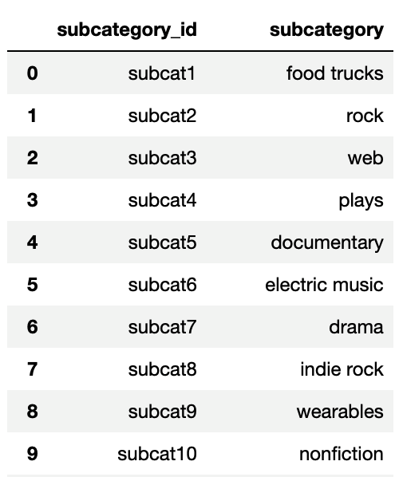
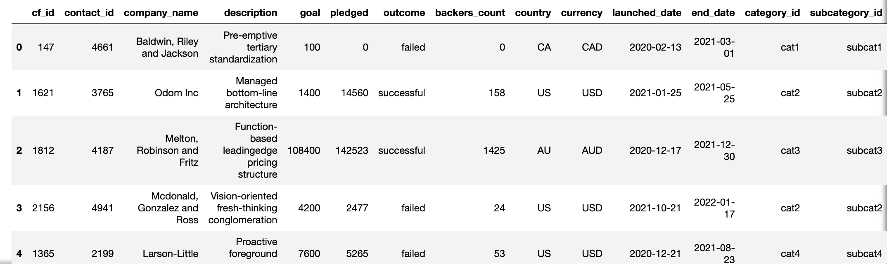

# ETL Mini Project

For this ETL mini project, you’ll work with a partner to practice building an ETL pipeline by extracting and transforming a crowdfunding dataset and then loading the data into a Postgres database.

## Instructions

The instructions for this mini project are divided into the following subsections:

* Create the Category and Subcategory DataFrames
* Create the Campaign DataFrame
* Create the Crowdfunding Database

### Create the Category and Subcategory DataFrames

1. Extract and transform the Excel data to create a category DataFrame that has the following columns:

    * A "category_id" column that has entries going sequentially from "cat1" to "cat*n*", where *n* is the number of unique categories.
    * A "category" column that contains only the category titles.

    The following image shows this category DataFrame:

    

2. Export the category DataFrame as `category.csv`.

3. Extract and transform the Excel data to create a subcategory DataFrame that has the following columns:

    * A "subcategory_id" column that has entries going sequentially from "subcat1" to "subcat*n*", where *n* is the number of unique subcategories.
    * A "subcategory" column that contains only the subcategory titles. 

    The following image shows this subcategory DataFrame:

    

4. Export the subcategory DataFrame as `subcategory.csv`.

### Create the Campaign DataFrame

1. Extract and transform the Excel data to create a campaign DataFrame has the following columns:

    * The "cf_id" column
    * The "contact_id" column
    * The "company_name" column
    * The "blurb" column, renamed to "description"
    * The "goal" column, converted to the `float` data type
    * The "pledged" column, converted to the `float` data type
    * The "outcome" column
    * The "backers_count" column
    * The "country" column
    * The "currency" column
    * The "launched_at" column, renamed to "launch_date" and with the UTC times converted to the `datetime` format. 
    * The "deadline" column, renamed to "end_date" and with the UTC times converted to the `datetime` format
    * The "category_id" column, with unique identification numbers matching those in the "category_id" column of the category DataFrame. 
    * The "subcategory_id" column, with the unique identification numbers matching those in the "subcategory_id" column of the subcategory DataFrame.

    The following image shows this campaign DataFrame:

    

2. Export the campaign DataFrame as `campaign.csv`.

### Create the Crowdfunding Database

1. Inspect the three CSV files, and then sketch an ERD of the tables by using [QuickDBD](http://www.quickdatabasediagrams.com).

2. Use the information from the ERD to create a table schema for each CSV file. 

    **Note:** Remember to specify the data types, primary keys, foreign keys, and other constraints.

3. Save the database schema as a Postgres file, named `crowdfunding_db_schema.sql`.

4. Create a new Postgres database, named `crowdfunding_db`.

5. Using the database schema, create the tables&mdash;in the correct order&mdash;to handle the foreign keys.

6. Verify the table creation by running a `SELECT` statement for each table.

7. Import each CSV file into its corresponding SQL table. 

8. Verify that each table has the correct data by running a `SELECT` statement for each.

## Hints

* Follow the steps in the [Extract_Transform_Mini_Project_Unsolved.ipynb](Unsolved/Extract_Transform_Mini_Project_Unsolved.ipynb) file.

* To split each "category & sub-category" column value into "category" and "subcategory" column values, use `df[["new_column1","new_column2"]] = df["column"].str.split()`. Make sure to pass the correct parameters to the `split()` function.

* To get the unique category and subcategory values from the "category" and "subcategory" columns, create a NumPy array, where the array length equals the number of unique categories from the “category” column and unique subcategories from the “subcategory” column. For information about how to do so, see [numpy.arange](https://numpy.org/doc/stable/reference/generated/numpy.arange.html) in the NumPy documentation.

* To create the category and subcategory identification numbers, use a list comprehension to add the "cat" string or the "subcat" string to each number in the category or the subcategory array, respectively.

* For more information about creating a new Pandas DataFrame, see the [pandas.DataFrame](https://pandas.pydata.org/docs/reference/api/pandas.DataFrame.html) in the Pandas documentation.

* To convert the "goal" and "pledged" columns to the `float` data type, use the `astype()` method.

* To convert the "launch_date" and "end_date" UTC times to the `datetime` format, see the `Transform_Grocery_Orders_Solved.ipynb` activity solution.

* For more information about how to add the "category_id" and "subcategory_id" unique identification numbers to the campaign DataFrame, see the [pandas.DataFrame.merge](https://pandas.pydata.org/docs/reference/api/pandas.DataFrame.merge.html) in the Pandas documentation.

---

Copyright 2022 2U. All Rights Reserved.