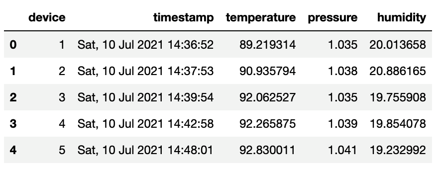

# Module 3, Lesson 2: Transformation and Cleaning with Regular Expressions & ETL Mini Project

## Overview

In today’s lesson, the students will continue learning how to write regular expressions to find patterns in string data. They’ll then apply what they’ve learned to transforming and cleaning data by using regular expressions in an in-class ETL mini project.

## Class Objectives

By the end of today's class, students will be able to:

- Use special characters in regular expressions to extract information.

- Create and use capture groups in regular expressions to extract information.

- Create an ETL pipeline that goes from raw data to a PostgreSQL database.

---

## Activity Outline

| Activity | Time | 
| -- | -- | 
| [1. Welcome](#Section1) | 5 minutes 
| [2. Regex Special Characters](#Section2) | 35 minutes |
| [3. Regex Grouping](#Section3) | 35 minutes |
| [4. Break](#Section4) | 15 minutes |
| [5. Transforming and Cleaning Data with Regex](#Section5) | 15 minutes |
| [6. ETL Mini Project](#Section6) | 65 minutes |
| [7. Review Module Objectives & Assignment](#Section7) | 10 minutes |

---

## Instructor Prep

This section covers notes for this lesson and a slideshow for this lesson.

<details>
  <summary><strong>🗒️ Notes for This Lesson</strong></summary>

* Today's lesson will continue covering the use of regular expressions to find patterns in string data. The students will then apply what they’ve learned about extracting, transforming, and cleaning data to an in-class ETL mini project. For this mini project, they'll perform the extract and transform steps of ETL.

* If any students don't finish the extract and transform steps in class, they’ll need to finish them outside of class. That’s because they need to complete those steps before starting this module’s homework assignment. 

* In the homework assignment, the students will create a database schema, load the data from the ETL mini project into the database, and then query the database. 

* The TAs should be ready to help any students who become confused with either using regular expressions or the ETL mini project.

* Remind the students that they can download the files and instructions for the activities by using the AWS links in Canvas. Please send out the files and instructions to any students who haven't downloaded the files for today.

### <a name="slideshow"></a> Slideshow

You can find the [Transformation and Cleaning with Regular Expressions & ETL Mini Project](https://docs.google.com/presentation/d/10kTsTVPsapH8kYHAiLxD6hgkZ5ZKWy0sLGsaZCJijhM/edit?usp=sharing) slides for this lesson on Google Drive.

Remember that the slideshows are for instructor use only. To distribute slide content to the students, please export the slides to a PDF file. You can then send the PDF to the students.

- - -

</details>

---

## Activities

This lesson plan has seven activities, including the ETL mini project, which the following sections describe.

### 1. <a name="Section1"></a> Welcome (5 minutes)

<details>
  <summary><strong>📣 1.1 Instructor Do: Welcome the Class (5 minutes)</strong></summary>

* Open the slides, and welcome the students to the class.

* Explain that today's lesson will provide a more in-depth examination of regular expressions and that students will then work in class with a partner on an ETL mini project.

* Explain the class objectives.

</details>

--- 

### 2. <a name="Section2"></a>Regex Special Characters (35 minutes)

<details>
 <summary><strong> 📣 2.1 Instructor Do: Regex Special Characters (10 minutes)</strong></summary>

* **Files:**

  * [sherlock.txt](Activities/01-Ins_SpecialCharacters/Resources/sherlock.txt)

  * [SpecialCharacters.ipynb](Activities/01-Ins_SpecialCharacters/Solved/SpecialCharacters.ipynb)

* Continue using the slides to introduce regex special characters to the class.

* Explain that in this activity, you'll demonstrate how to use special characters in regular expressions to provide more options to find patterns in string data.

* In Jupyter Notebook, open `SpecialCharacters.ipynb`, and then go through the code with the students while explaining the following:

  * The question mark (`?`) lets us to match either none or one of the preceding characters. For example, `heard?` matches both 'hear' and 'heard', as the following code shows:

    ```python
    # Find all lines of text that contain hear or heard.
    p = 'heard?'
    sherlock_df[sherlock_df['text'].str.contains(p)]
    ```

  * The asterisk (`*`), allows us to match either none, one, or more than one of the preceding characters. For example, `tell*` matches 'tel', 'tell', and 'telll', as the following code shows:

    ```python
    # Find all lines of text that contain tel or tell.
    p = 'tell*'
    sherlock_df[sherlock_df['text'].str.contains(p)]
    ```

  * The caret (`^`) is a zero-length match for the beginning of a string. It lets us match lines that start with the subsequent expression. For example, `^Watson` matches all the lines that start with 'Watson', as the following code shows:

    ```python
    # Find all lines of text that start with the string 'Watson'.
    p = '^Watson'
    sherlock_df[sherlock_df['text'].str.contains(p)]
    ```

  * The dollar sign (`$`) lets us match lines that end with the preceding expression. For example, `\.$` matches all the lines that end with a period, as the following code shows:

    ```python
    # Find all lines of text that end with a period.
    p = '\.$'
    sherlock_df[sherlock_df['text'].str.contains(p)]
    ```

    **Note:** Remind the students that the backslash (`\`) before a character class is an escape character&mdash;which tells the code to match the character class that comes after the backslash. In this case, that’s the period (`.`).

  * The pipe (`|`) lets us put a conditional expression in our regex expression to match the term that either precedes or follows it, as the following code shows:

    ```python
    # Use | to match lines that end with either a period or a question mark.
    p = '\.$|\?$'
    sherlock_df[sherlock_df['text'].str.contains(p)]
    ```

* Send out the [SpecialCharacters.ipynb](Activities/01-Ins_SpecialCharacters/Solved/SpecialCharacters.ipynb) file for the students to refer to later.

* Answer any questions before moving on.

</details>

<details>
 <summary><strong> ✏️ 2.2 Student Do: Regex Special Characters (15 minutes)</strong></summary>

* Continue with the slides to explain this activity.

* Explain that the students will use special characters to find lines of text that meet specific criteria.

* **Files:**

  * [README.md](Activities/02-Stu_SpecialCharacters/README.md)

  * [alice.txt](Activities/02-Stu_SpecialCharacters/Resources/alice.txt)

  * [SpecialCharacters_Unsolved.ipynb](Activities/02-Stu_SpecialCharacters/Unsolved/SpecialCharacters_Unsolved.ipynb)

</details>

<details>
 <summary><strong> ⭐ 2.3 Review: Regex Special Characters (10 minutes)</strong></summary>

* Send out the following solution file to the students:

  * [SpecialCharacters.ipynb](Activities/02-Stu_SpecialCharacters/Solved/SpecialCharacters_Solved.ipynb)

* Continue with the slides, and review the activity.

* In Jupyter Notebook, open `SpecialCharacters.ipynb`, and then go through the code with the class while explaining the following:

  * To find all the lines that start with the string 'Alice', we use the caret (`^`) before 'Alice'. The matching string will then be the entire line of text that begins with ‘Alice’.

  * Likewise, the dollar sign (`$`) matches the end of an entire line. So, we can find all the lines that end in an exclamation point (`!`) by using an exclamation point followed by a dollar sign (`!$`).

  * Finally, to find the lines that end with either an exclamation point (`!`) or a question mark (`?`), we use the pipe (`|`) between the two special characters ('\?$|!$'). Notice that we need to escape the question mark.

</details>


- - -

### 3. <a name="Section3"></a>Regex Grouping (35 minutes)

<details>
 <summary><strong> 📣 3.1 Instructor Do: Regex Grouping (10 minutes)</strong></summary>

* **File:** 

  * [Groups.ipynb](Activities/03-Ins_Groups/Solved/Groups.ipynb)

* Continue using the slides to introduce the students to regex grouping, as follows:

  * Before getting into grouping, let’s introduce a few more regular expression techniques.

  * A backslash followed by a lowercase s (`\s`) matches a white space character.

  * A number, say 4, insides braces (`{4}`) matches the preceding regular expression 4 times.

  * A number, say 4, followed by a comma, all insides brace (`{4,}`) matches the preceding regular expression 4 or more times.

  * A number (say 4), followed by a comma, a space, and another number (say 6), all inside braces (`{4, 6}`) matches the preceding regular expression between 4 and 6 times (inclusive).

* In Jupyter Notebook, open `Groups.ipynb`, and then go over the code with the students while explaining the following:

  * We already learned that a backslash followed by a lowercase s (`\s`) lets us match a white space character. And, placing a number inside braces lets us match a specific number of occurrences. So, the following code will match the string ‘Holmes’ followed by a space, a word that’s six letters long, and then another space:

    ```python
    # The \s lets us match any white space and {} lets us match exact ranges or characters
    # Here we find Holmes followed by a space then a six letter word then another space.
    p = 'Holmes\s\w{6}\s'
    sherlock_df[sherlock_df['text'].str.contains(p)]
    ```

  * We can also set a range for the number of occurrences, as the following code shows:

    ```python
    # Adding a second number to the {} lets us find a range of characters in word
    # Here it matches all words that have a length of 4 to 6 characters.
    p = 'Holmes\s\w{4,6}\s'
    sherlock_df[sherlock_df['text'].str.contains(p)]
    ```

  * To match the string 'Holmes', followed by a space, followed by a word that’s six or more characters long, we use the following regex capture group: `'Holmes \s*\w{6,}`.

  * Say that we want to further break this down by counting the number of times that each word after 'Holmes' appears. To do so, we create two capture groups. We create a **capture group** by placing characters or regular expressions inside a set of parentheses. The first capture group will match the first occurrence of the word 'Holmes'. The second capture group will match zero or more space characters followed by any word that’s or more characters. We then display the groups as a Pandas DataFrame by using the `extractall()` function, as the following code shows:

    ```python
    # Create capture groups
    p = '(Holmes)(\s*\w{6,})'

    # Extract the groups
    holmes_df = sherlock_df['text'].str.extractall(p)
    holmes_df
    ```

  * It’s important to remember that when we use capture groups, we have to use the `extractall()` function to match the text that we want.

  * The  DataFrame that displays from running the preceding code contains three columns: ”match”,"0" and "1", as follows:

    |    | match | 0 | 1 |
    |----|----|----|----|
    | 34  | 0 | Holmes | lately |
    | 214 | 0 | Holmes | caught |
    | 260 | 0 | Holmes | without |
    | 305 | 0 | Holmes | laughed |
    | 345 | 0 | Holmes | scribbled |
    | 553 | 0 | Holmes | changed |
    | 751 | 0 | Holmes | staggered |
    | 759 | 0 | Holmes | rushed |
    | 798 | 0 | Holmes | coldly |
    | 828 | 0 | Holmes | pulled |

  * By selecting the “1” column and using the `value_counts()` method, we can display the number of times that each word appears, as the following code shows:

    ```python
    # Grab the value counts for each word in the second capture group
    holmes_df[1].value_counts()
    ```

  * We can extract all the words that start with a lowercase or uppercase Z. To do so, we pass the `flags=re.I` parameter to `extractall()`. This tells the regex to ignore the case when matching, as the following code shows:

    ```python
    # extract all words that start with 'z' or 'Z'
    p = '\W(z\w*)\W'
    sherlock_df['text'].str.extractall(p, flags=re.I).dropna()
    ```

  * We can also tell a regex to not match a group by using a question mark followed by a colon, all inside parentheses (`(?:)`). For example, the regex in the following code will match the word 'Holmes' but not group it, and it will group the subsequent word that’s 6 or more letters long:

    ```python
    # Find all the words six letters or longer that come after "Holmes" in the text and count their frequency
    p = '(?:Holmes)(\s*\w{6,})'
    sherlock_df['text'].str.extractall(p, flags=re.I)[0].value_counts()
    ```

  * We can also tell a regex to not match other things. A question mark followed by an exclamation point, all inside parentheses (`(?!)`) is a negative lookahead that says, don't match what follows. For example, `(?!.+ly)` says to not match any character (indicated by the period) that occurs one or more times (indicated by the plus sign) and that ends with 'ly', as the following code shows:

    ```python
    # Find all the words six letters or longer that don't end in "ly" that come after "Holmes"
    # in the text and count their frequency
    p = '(?:holmes)(?!.+ly)(\s*\w{6,})'
    sherlock_df['text'].str.extractall(p, flags=re.I)[0].value_counts()
    ```

* Send out the [Groups.ipynb](Activities/03-Ins_Groups/Solved/Groups.ipynb) file for the students to refer to later.

* Answer any questions before moving on to the student activity.

</details>

<details>
 <summary><strong>✏️  3.2 Student Do: Regex Grouping (15 minutes)</strong></summary>

* Continue with the slides to explain this activity.

* Explain that the students will use capture groups to further refine regex matches.

* **Files** 

  * [README.md](Activities/04-Stu_Groups/README.md)

  * [alice.txt](Activities/04-Stu_Groups/Resources/alice.txt)

  * [RegexGroups_Unsolved.ipynb](Activities/04-Stu_Groups/Unsolved/RegexGroups_Unsolved.ipynb)

</details>

<details>
 <summary><strong> ⭐ 3.3 Review: Regex Grouping (10 minutes)</strong></summary>

* Send out the following solution file to the students:

  * [RegexGroups_Solved.ipynb](Activities/04-Stu_Groups/Solved/RegexGroups_Solved.ipynb) 

* Continue with the slides, and review the activity.

* In Jupyter Notebook, open `RegexGroups_Solved.ipynb`, and then go over the code with the students while explaining the following:

  * The default group in a regex is a capture group. Regexes also have non-capturing groups. A **non-capturing group** is any string or regular expression character that we don’t want to match. To create a non-capturing group, we add a question mark followed by a colon `(?:)` at the beginning of the string or regular expression character. When using a regex to extract substrings, only the substrings in capture groups get extracted. But, that doesn’t make a big difference for matching purposes.

  * To further explain, we use non-capturing groups to find the context for the substrings to extract. For example, say that we want to find the words that come after 'Alice'. That requires using a non-capturing group to find the occurrences of 'Alice'.

  * A negative lookahead group is also a non-capturing group that finds the context for another substring. For example, say that we want to find the words that come after 'Alice' and that don’t end in  'ly'. To do that, we need to add a negative lookahead group that looks ahead of 'Alice' and negates the match if it finds a word ending in 'ly'.

* Answer any questions before moving on.

</details>

---

### 4. <a name="Section4"><a name="Break"></a> Break (15 minutes)

---

### 5. <a name="Section5"></a>Transforming and Cleaning Data with Regex (15 minutes)

<details>
 <summary><strong>🎉 5.1 Everyone Do: Transforming and Cleaning IoT Data (15 minutes)</strong></summary>

* **Files:**

  * [README.md](Activities/05-Evr_Transforming_Cleaning_IoT_Data/README.md)

  * [temp_data.csv](Activities/05-Evr_Transforming_Cleaning_IoT_Data/Unsolved/Resources/temperature_data.csv)

  * [Transforming_Cleaning_IoT_Data_Unsolved.ipynb](Activities/05-Evr_Transforming_Cleaning_IoT_Data/Unsolved/Transforming_and_Cleaning_IoT_Data_Unsolved.ipynb)

* Continuing with the [slideshow](#slideshow), lead the students through this activity.

* Explain that in this activity, the students will combine their skills in data transformation via Python and Pandas methods with those in regular expressions to transform an Internet of Things (IoT) dataset into a DataFrame.

* in Jupyter Notebook, open [Transforming_and_Cleaning_IoT_Data_Solved.ipynb](Activities/05-Evr_Transforming_Cleaning_IoT_Data/Solved/Transforming_and_Cleaning_IoT_Data_Solved.ipynb), and then live code the solution while explaining the following: 

  * We load the `temperature_data.csv` file into a DataFrame, using `sep=","` as the delimiter and `header=None`.

  * Notice that each row is a string object that appears like a dictionary. And, we can use the `json.loads()` method to parse a valid JSON string and convert it to a Python dictionary. We can test this method on the first row, as the following code shows:

    ```python
    # Test extracting the key and values from the first row using json.loads().
    import json
    first_row = temp_data_df.iloc[0][0]
    # Convert the data to a Python dictionary. 
    converted_data = json.loads(first_row)
    for k, v in converted_data.items():
        print(k)
        print(v)
    ```

  * Now, we can iterate through the DataFrame, converting each row to a Python dictionary and using list comprehensions to get the keys and values for each row, as the following code shows:

    ```python
    # Iterate through the DataFrame and extract the keys for the columns and the values for the row data.
    values = []
    column_names = []
    for i, row in temp_data_df.iterrows():
        data = row[0]
        converted_data = json.loads(data)
        # Use a list comprehension to get the keys from the converted data.
        columns = [k for k,v in converted_data.items()]
        # Use a list comprehension to get the values for each row using list comprehension.
        row_values = [v for k, v in converted_data.items()]
        # Append the list of values for each row to a list. 
        columns = [k for k,v in converted_data.items()]
        # Append the keys and list values to a list. 
        column_names.append(columns)
        values.append(row_values)

    # Print out the keys and list of values for each row.
    print(column_names[0])
    print()
    print(values)
    ```

  * We need to use only the first item in the `column_names` list for the columns in the new DataFrame. And, the nested list of values is the correct format for adding data to the new DataFrame, as the following code shows:

    ```python
    # Create a DataFrame with the keys and the columns and the nested list of row values as the data. 
    new_temp_data_df = pd.DataFrame(values, columns=column_names[0])
    new_temp_data_df.head())
    ```

    

  * Next, we'll use the Pandas regex `extract()` function to extract the day of the week from the "timestamp" column and add it to a new column. 

    ```python
    # Extract the day of the week from the timestamp and add it to a new column.
    new_temp_data_df['day'] = new_temp_data_df['timestamp'].str.extract(r'(\D{3})')
    ```

  * Then, we extract the date from the "timestamp" column and add it to a new column.

    ```python
    # Extract the date from the timestamp column and add it to a new column. 
    new_temp_data_df['date'] = new_temp_data_df['timestamp'].str.extract(r'(\d+\s\D{3}\s\d{4})')
    ```

  * And, extract the time of day from the "timestamp" column and add it to a new column.

    ```python
    # Extract the time of day from the timestamp column and add it to a new column. 
    new_temp_data_df['time'] = new_temp_data_df['timestamp'].str.extract(r'(\s\d{2}\W\d{2}\W\d{2})')
    ```

  * Next, we convert the "date" column to the `datetime` format, as the following code shows:

    ```python
    from datetime import datetime as dt
    new_temp_data_df["date"] = pd.to_datetime(new_temp_data_df["date"]).dt.strftime('%Y-%m-%d') 
    new_temp_data_df["date"] = pd.to_datetime(new_temp_data_df["date"])
    ```

  * Finally, after checking the data types, we drop the "timestamp" column and then reorder the columns, as the following code shows:

    ```python
    # Drop the timestamp column.
    temp_data_df_clean = new_temp_data_df.drop(["timestamp"], axis=1)
    # Reorder the columns.
    temp_data_df_clean = temp_data_df_clean[['device','day', 'date', 'time', 'temperature', 'pressure', 'humidity']]
    temp_data_df_clean
    ```

  * The following image shows the final, transformed and cleaned IoT temperature DataFrame:

    

    In the preceding image, notice that the columns appear in the following order: "device", "timestamp", "temperature", "pressure", "humidity".

* Send out the [Transforming_and_Cleaning_IoT_Data_Solved.ipynb solution](Activities/08-Evr_Transforming_Cleaning_IoT_Data/Solved/Transforming_and_Cleaning_IoT_Data_Solved.ipynb) for the students to refer to later.

* Answer any questions before moving on.

</details>

--- 

### 6. <a name="Section6"></a> ETL Mini Project (65 minutes)

<details>
 <summary><strong>📣 6.1 Instructor Do: ETL Mini Project Overview (5 minutes)</strong></summary>

* **File:**

 * [README.md](../2/Activities/06-Par-Mini_ETL_Project/README.md)

* Continue using the slides to introduce the ETL mini project to the class.

* Begin by mentioning that the students will work in pairs.

* Open the `README.md` file, and then go over the content&mdash;which consists of information and instructions for the mini project&mdash;with the class. Make sure to point out the following:

 * First, you’ll extract and transform the data from the Excel files to create three new DataFrames, which you’ll export as CSV files. 

 * Next, you’ll use the information in the three CSV files to create an ERD. You’ll then use the ERD database schema to create a database in PostgreSQL. 

 * Finally, you’ll upload the CSV file data into the database and then query the three tables to verify that the data was uploaded. 

* Answer any questions before moving on.

</details>

<details>
 <summary><strong>👥 6.2 Partner Do: ETL Mini Project (60 minutes)</strong></summary>

* Continue with the slides to explain this activity.

* Explain that the students will work with a partner to practice building an ETL pipeline by extracting and transforming a crowdfunding dataset and then loading the data into a PostgreSQL database.

* **Files** 

  * [README.md](Activities/06-Par-Mini_ETL_Project/README.md)

  * [Resources](Activities/06-Par-Mini_ETL_Project/Unsolved/Resources/)

  * [Extract_Transform_Mini_Project_Unsolved.ipynb](Activities/06-Par-Mini_ETL_Project/Unsolved/Extract_Transform_Mini_Project_Unsolved.ipynb)

</details>

---

### 7. <a name="Section7"></a> Review Module Objectives & Assignment (10 minutes)

<details>
  <summary><strong>📣 7.1 Instructor Do: Review the Module Objectives (5 minutes)</strong></summary>
<br>

* Review this module’s objectives:

  * Extract data by using Python and Pandas. 

  * Transform and clean data by using Python and Pandas.

  * Parse string data into a Python dictionary.

  * Use list comprehensions to make code more readable.

  * Use regular expressions to manipulate string data.

  * Use special characters in regular expressions to extract information.

  * Create and use capture groups in regular expressions to extract information.

  * Create an ETL pipeline that goes from raw data to a PostgreSQL database.

* Mention that next week, we’ll learn about big data, Apache Hadoop, and Apache MapReduce. 

* Answer any remaining questions before moving on.

</details>

<details>
  <summary><strong>📣 7.2 Instructor Do: Review the Assignment (5 minutes)</strong></summary>
<br>

* **Files:**

  * [README](../../../02-Assignments/03-ETL/Instructions/README.md)

  * [contacts.xlsx](../../../02-Assignments/03-ETL/Instructions/Resources/contacts.xlsx)

  * [Extract_Transform_Load_Assignment_Starter_Code.ipynb](../../../02-Assignments/03-ETL/Instructions/Extract_Transform_Load_Assignment_Starter_Code.ipynb)

  * [Crowdfunding_analysis_starter.sql](../../../02-Assignments/03-ETL/Instructions/Crowdfunding_analysis_starter.sql)

* **Rubrics:**

* [Instructor grading rubric](https://docs.google.com/spreadsheets/d/10hGjOqvYLp_pn4NOfautCkazZF6nLHmOfUdBdPgFpDQ/edit?usp=sharing)

* [Student PDF rubric](../../../02-Assignments/03-ETL/Instructions/Crowdfunding_ETL_Rubric.pdf)

* Note that for this week's homework assignment, the students will extract and transform the data from the `contacts.xlsx` file from the ETL mini project, create a table schema, and then load the transformed data into the `Crowdfunding_DB` database. They'll then perform a data analysis on the database.

* Open [README](../../../02-Assignments/03-ETL/Instructions/README.md), and then go over the content&mdash;which consists of information and instructions for the assignment&mdash;with the class.

</details>

---

Copyright 2022 2U. All Rights Reserved.