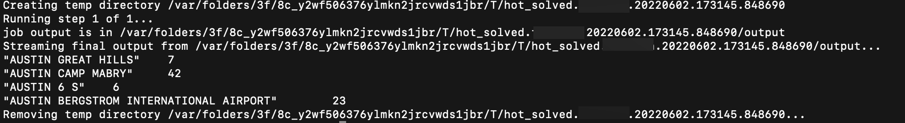
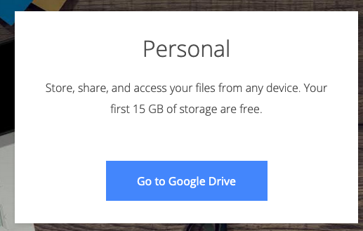
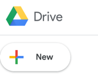
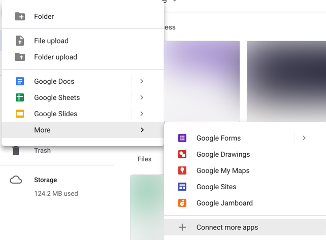
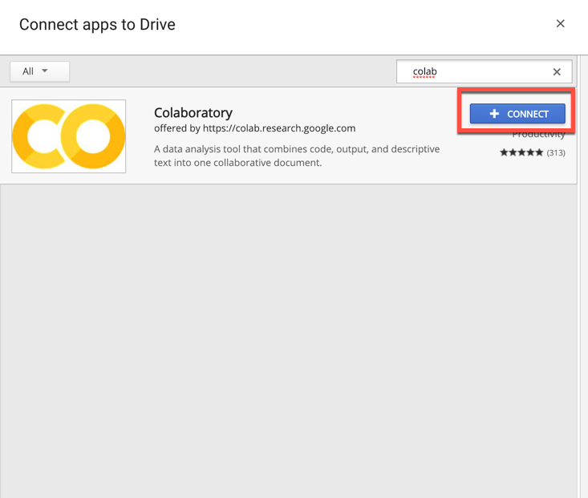
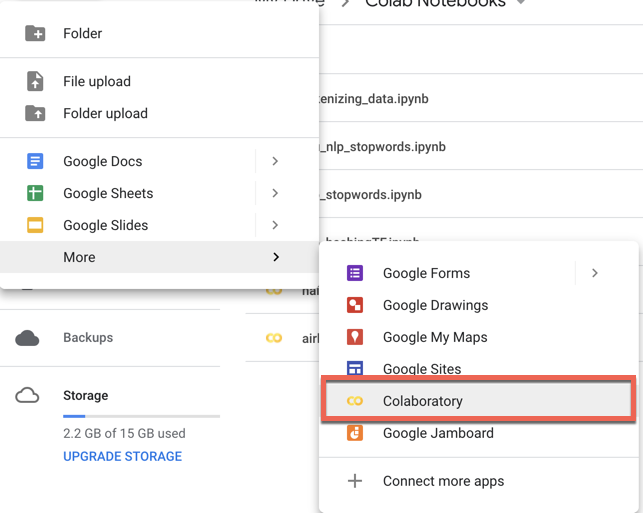
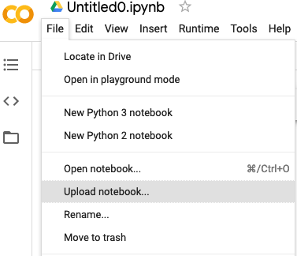

# Module 4, Lesson 1: Introduction to Big Data

## Lesson Overview

Today’s lesson will introduce the students to big data. First, they'll learn how to identify the parts of the Apache Hadoop ecosystem. Then, they'll learn how to write Python scripts that implement the Apache MapReduce programming model. Next, they’ll learn the differences between the Apache Hadoop and Apache Spark environments. Finally, they'll learn how to create a DataFrame by using PySpark.

## Class Objectives

By the end of today's lesson, the students will be able to:

- Identify the parts of the Hadoop ecosystem.

- Write a Python script that implements the MapReduce programming model.

- Identify the differences between the Hadoop and Spark environments.

- Create a DataFrame by using PySpark.

---

## Activity Outline

| Activity | Time | 
| -- | -- | 
| [1. Welcome](#Section1) | 5 minutes |
| [2. Intro to Big Data](#Section2) | 10 minutes |
| [3. MapReduce with MRJob](#Section3) | 30 minutes |
| [4. MRJob with Python](#Section4) | 40 minutes |
| [5. Break](#Section5) | 15 minutes |
| [6. Spark Overview and Google Colab Setup](#Section6) | 30 minutes |
| [7. PySpark DataFrame Basics](#Section7) | 50 minutes |

---

## Instructor Prep

This section covers notes for this lesson and a slideshow for this lesson.

<details>
  <summary><strong>🗒️ Notes for This Lesson</strong></summary>

* Today’s lesson will primarily focus on familiarizing the students with MapReduce, Hadoop, and Spark. It will cover basic MapReduce concepts, and the students will get the opportunity to write a Python script that implements MapReduce. The students will get set up with Spark and learn how to use PySpark with external databases.

* Today’s lesson is intended to help the students understand the basics of PySpark and to prepare them for the next three classes, which cover Spark SQL and Spark optimization.

* Because MapReduce and Spark are newer concepts for the students, some might struggle with parts of the setup and the basic functions. So, feel free to spend extra time as needed and where you think is best.

* The TAs should be ready to help explain and break down concepts for any students who struggle to grasp the material.

* Remind the students that they can download the files and instructions for the activities by using the AWS links in Canvas. Please send out the files and instructions to any students who haven't downloaded the files for today.

</details>

---

### <a name="slideshow"></a> Slideshow

You can find the [Introduction to Big Data](https://docs.google.com/presentation/d/1Snzph1Gh9m_xkoGOUkoPhT6uFa5x3jYjVT0Go1JfYBs/edit?usp=sharing) slides for this lesson on Google Drive.

Remember that the slideshows are for instructor use only. To distribute slide content to the students, please export the slides to a PDF file. You can then send the PDF to the students.

---

## Activities

This module has seven activities, which the following sections describe.

### 1. <a name="Section1"></a> Welcome (5 minutes)

<details>
  <summary><strong>📣 1.1 Instructor Do: Welcome the Class (5 minutes)</strong></summary>

* Open the slides, and welcome the students to class.

* Let the students know that today's lesson will begin the “Big Data and Spark” unit. 

* Explain the class objectives, and point out that today’s lesson will serve as an introduction to big data and how to use Hadoop (specifically, mrjob) and Spark (specifically, PySpark and Spark SQL) to map and reduce big datasets.

</details>

--- 

### 2. <a name="Section2"></a> Intro to Big Data (10 minutes)

 <details>
  <summary><strong>📣 2.1 Instructor Do: Intro to Big Data (10 minutes)</strong></summary>
  <br>

* Note that In this activity, the students will learn about big data. You’ll cover what big data is, just how big it is, what the four Vs of big data are, and which technologies we'll use to process big data. The students might use some of these skills in their careers, so it's important that they understand all these basics. Today's class will cover a few of the most popular big data technologies, including Hadoop (specifically, mrjob) and Spark (specifically, PySpark and Spark SQL).

* Continue going through the slides to introduce big data to the class.

* Explain that **big data** refers to a large amount of structured, unstructured, or semi-structured data that’s received at a fast rate, that’s received with the utmost accuracy, and that needs to be processed at a high capacity. Continue explaining big data as follows:

  * Large datasets have been on the rise since the inception of the internet. But, what’s a large dataset? And, just how big is big data? 

  * In the late 1990s, the term “big data” referred to any information that filled more than a gigabyte. Today, big data can range from hundreds of gigabytes to exabytes of data. To give us an idea of just how big these amounts are, the following table lists data sizes along with an example of what each size might contain:

    | Size | Example | 
    |----|----|
    | One kilobyte (KB) | A paragraph in a text document |
    | One megabyte (MB) | A small novel |
    | One gigabyte (GB) | Either about 10,000 rows in a CSV file or one low-definition streamed movie |
    | One terabyte (TB) | About 500 hours worth of videos on the internet |
    | One petabyte (PB) | About 11,000 high-definition movies |
    | One exabyte (EB) | About 11 million high definition movies |

    **Note:** Netflix has about 100 petabytes worth of stored videos across the world.

  * Generally, we consider a dataset to be big data if it’s too large for an operational database. An **operational database** allows users to modify, retrieve, and manage data in real time. Operational databases might include those for payroll records, customer information, and employee data.

  * Because no clear line exists between big data and a regular dataset, we sometimes find it hard to identify the right tools for the job.

  * With big data, we generally can't use the wrong tool for the job. But, using a tool like MapReduce or Spark might be unnecessary if we need to process only a few lines of data.

  * Those tools can process data that’s much, much bigger.

  * So, using a tool like Hadoop or Spark might be extreme for a specific job. Some employers might want you to use Spark because it’s a fantastic tool. But, it’s not necessarily the best tool for the job if only a small amount of data exists.

* Explain the four Vs of big data:

  * **Volume:** The size of the data.

  * **Velocity:** The rate at which the data is received.

  * **Variety:** The diversity of the data: structured, unstructured, or semi-structured.

  * **Veracity:** The uncertainty of the data. That is, how accurate is the data? Does it include errors, abnormalities, or biases?

* Share the technologies that we can use when dealing with big data, as follows:

  * Several technologies exist that we can use when dealing with big data. But, Apache Hadoop is one that’s commonly used to process big data. Hadoop was developed as part of an open-source project within the Apache Software Foundation.

  * **Hadoop** is an open-source framework for big data. It consists of several components.

  * The **Hadoop Distributed File System (HDFS)** enables the efficient and cheap storage of large quantities of data across multiple servers while minimizing the risk of data loss.

  * **Hive** is a SQL-like query tool for big data.

  * **MapReduce** simultaneously processes vast amounts of multi-terabyte datasets in large clusters, or on multiple servers, in a fault-tolerant manner.

  * To understand MapReduce with an analogy, imagine that you want to know the number of books that a library contains. You can divide this problem into two tasks. The first is counting the books, which corresponds to the mapping part. The second is tallying all the results, which corresponds to the reducing part.

  * Hadoop has several other components, too. Remember that Hadoop is a suite of tools that’s designed to meet the challenges of processing large amounts of data.

* Tell the students that they’ll practice these skills in the upcoming activities.

* Answer any questions before moving on.

 </details>

---

### 3. <a name="Section3"></a> MapReduce with MRJob (30 minutes)

<details>
  <summary><strong>📣 3.1 Instructor Do: MapReduce with MRJob (10 minutes)</strong></summary>
  <br>

* Note that you’ll now present a deeper dive into MapReduce. Although Spark is typically a more popular choice, the students might use MapReduce in their careers. So, it’s important that they understand both the context and the role of MapReduce in big data.

* Continue going through the slides to introduce MapReduce with MRJob to the class, as follows:

  * We’ll take our first dip into the vast ocean that is big data through MRJob. **MRJob** is a Python library that people can use to locally prototype MapReduce jobs.

  * Let’s learn what a MapReduce job is and what it’s used for.

  * Google created MapReduce with the initial purpose of indexing all the information on the internet. Now, people use MapReduce as a way to distribute and process the data in a cluster. Basically, a MapReduce job divides the input data into chunks, which the map tasks process in a parallel manner.

  * **Mapping** means splitting up data, preprocessing it, and then converting it into key-value pairs.

  * **Reducing** means aggregating the results.

  * Consider the following example use case for MapReduce:

    * Imagine that our organization collects temperature data every day of the year for a city in the United States. This implies that for a particular year, we'll have 365 files&mdash;each of which contains a list of temperatures for each day. The day temperature data forms key-value pairs.

  * We can use MapReduce to find many aggregations. But, one example is the average maximum temperature for each day over all the days in the dataset.

* Answer any questions before moving on.

</details>

<details>
  <summary><strong>✏️ 3.2 Student Do: MapReduce Use Cases (10 minutes)</strong></summary>
<br>

* Continue with the slides to explain this activity.

* Explain that the students will find common use cases of MapReduce. Being able to research and learn about other common use cases is an important skill to have in their careers.

**File:**

  * [README.md](Activities/01-Stu_MapReduceUseCases/README.md)

</details>

<details>
  <summary><strong>⭐ 3.3 Review: MapReduce Use Cases (10 minutes)</strong></summary>
<br>

* Continue with the slides, and review the activity.

* Open the [README.md](Activities/01-Stu_MapReduceUseCases/Solved/README.md) solution, and then share some possible use cases of MapReduce with the students.

* Make sure to do the following:

  * Ask the students which use cases they found.

  * Discuss the use cases that the solution file supplies.

* Answer any questions before moving on.

</details>

---

### 4. <a name="Section4"></a> MRJob with Python (40 minutes)

<details>
  <summary><strong>🎉 4.1 Everyone Do: MRJob with a CSV File (15 minutes)</strong></summary>
<br>

* **Files:**

  * [hot_solved.py](Activities/02-Evr_MrJob_CSV/Solved/hot_solved.py)

  * [austin_weather_2017.csv](Activities/02-Evr_MrJob_CSV/Resources/austin_weather_2017.csv)

* Continuing with the slides, lead the students through this activity.

* Explain that in an earlier activity, the students learned about real-life use cases for MapReduce. Now, they’ll learn how to implement MapReduce by using MRJob. And although PySpark tends to be more popular in the data engineering and data science fields, it's important to learn the context of MapReduce and how to implement it. 

* Explain that in this activity, we'll use MRJob with a CSV file to count the number of hot days in Austin, Texas.

* Remind the students that MapReduce is intended to distribute and process large data files.

* Tell the students that MRJob is a Python package that we can use to locally test our MapReduce code on our own computers. And, people often refer to MapReduce code as **MapReduce jobs**. 

* Send out the link to [Writing your first job](https://mrjob.readthedocs.io/en/latest/guides/quickstart.html#writing-your-first-job) in the MRJob documentation. Then have the students install MRJob into their PythonDataSci conda environments by running the following command:

  ```text
  pip install mrjob
  ````

* Tell the students to open the `austin_weather_2017.csv` file.

* Open [hot_solved.py](Activities/02-Evr_MrJob_CSV/Solved/hot_solved.py), and then live code the solution, making sure to point out the following:

  * First, we import the `MRJob` class, as the following code shows:

    ```python
    from mrjob.job import MRJob
    ```

  * Next, we create a class named `Hot_days` that inherits the `MrJob` class, as the following code shows:

    ```python
    class Hot_Days(MRJob):
    ```

  * In the `mapper` function, we split each line in the CSV file on the comma (",") and save the values in the array to the following variables: `station`, `name`, `state`, `date`, `snow`, `tmax`, and `tmin`, as the following code shows:

    ```python
    def mapper(self, key, line):
        (station, name, state, date, snow, tmax, tmin) = line.split(",")
    ```

  * Then, we use a conditional statement to find the days when the temperature was greater than or equal to 100 degrees, as the following code shows:

    ```python
    if tmax and int(tmax) >= 100:
        yield name, 1
    ```
 
    * Because some lines of data don't have a value for `tmax`, we need to ensure that its value isn’t "none" in the conditional statement.

    * We read in the `tmax` value as a string but must convert it to an integer before we can compare it with 100.

    * If `tmax` passes the condition, we yield the name of the station where the temperature was recorded and 1. The `yield` statement produces a sequence of key-value pairs that get passed to the `reducer` function..

  * The `reducer` function takes three arguments: `self` and the key-value pairs from the `mapper` function output. We can name the key-value pairs anything we want. In this case, we use `name` for the name of the station and `hot` for the hot days. Inside the `reducer` function, we aggregate the sum of the days for which it was over 100 degrees for each location, as the following code shows:

    ```python
    def reducer(self, name, hot):
        yield name, sum(hot)
    ```

  * Next, let’s find out how to get all the days with a temperature that was greater than or equal to 100 degrees for all the weather stations in Austin, Texas.

  * In Terminal (on macOS) or Git Bash (on Windows), navigate to the `02-Evr_MrJob_CSV` folder, and then run the following command: 

    ```text
    python Solved/hot_solved.py austin_weather_2017.csv
    ```

    Notice that we use the `python` command to run the `hot_solved.py` file. Then, we must add the name of the file that we want to run our `HotDays` class on. The following image shows the result of running our command:

    

    As the preceding image shows, four weather stations in Austin recorded days with a temperature that was greater than or equal to 100 degrees. And, the output lists each of those weather station names along with the number of days that each recorded a hot temperature.

* Answer any questions before moving on. 

</details>

<details>
  <summary><strong>✏️ 4.2 Student Do: Snow in Austin (15 minutes)</strong></summary>
  <br>

* Continue with the slides to explain this activity.

* Explain that the students will use MRJob to return the days when it snowed in Austin, Texas.

**Files:**

  * [README.md](Activities/03-Stu_Austin_Snow/README.md)

  * [austin_weather_2017.csv](Activities/03-Stu_Austin_Snow/Resources/austin_weather_2017.csv)

</details>

<details>
  <summary><strong>⭐ 4.3 Review: Snow in Austin (10 minutes)</strong></summary>
  <br>

* Send out the following solution files to the students:

  * [snow.py](Activities/03-Stu_Austin_Snow/Solved/snow.py)

  * [bonus.py](Activities/03-Stu_Austin_Snow/Solved/bonus.py)

* Continue with the slides, and review the activity.

* Open `snow.py`, and then review the code (while answering any questions that arise) as follows:

  **Note:** Ask for a student volunteer to describe each part of the code.

  * In the mapper, we split on the comma (",") and save the respective variables.

  * The `if` statement checks for data in the `snow` variable, converts it to the `float` data type, and checks if the value is greater than zero.

  * If the value is greater than zero, the mapper yields the date and 1.

  * The reducer should yield the date and the maximum from the list of 1s. That way, we’ll produce only one date with a 1. If we used `sum`, we’d return all the dates with a number representing the number of stations that recorded snow data on that date.

* The solution code is as follows:

  ```python
  from mrjob.job import MRJob


  class Snow_days(MRJob):

      def mapper(self, key, line):
          (station, name, state, date, snow, tmax, tmin) = line.split(",")
          if snow and float(snow) > 0:
              yield date, 1

      def reducer(self, date, snow):
          yield date, max(snow)


  if __name__ == "__main__":
      Snow_days.run()
  ```

* Answer any remaining questions about MapReduce, MRJob, or this activity.

* Next, review the `bonus.py` solution, as follows:

  * This time, we yield the date and the amount of snow from the mapper.

  * When the reducer yields `max(snow)`, it finds the maximum amount of snow on that date.

  * The solution code is as follows:

    ```python
    from mrjob.job import MRJob


    class Snow_days(MRJob):

        def mapper(self, key, line):
            (station, name, state, date, snow, tmax, tmin) = line.split(",")
            if snow and float(snow) > 0:
                yield date, 1

        def reducer(self, date, snow):
            yield date, max(snow)


    if __name__ == "__main__":
        Snow_days.run()
    ```

* Answer any questions before moving on.

</details>

---

### 5. <a name="Section5"></a> Break (15 minutes)

---

### 6. <a name="Section6"></a> Spark Overview and Google Colab Setup (30 minutes)

 <details>
  <summary><strong>📣 6.1 Instructor Do: Spark Overview (10 minutes)</strong></summary>
  <br>

* **Files:**

  * [spark_dataframe_basics.ipynb](Activities/04-Ins_Pyspark_DataFrames_Basics/Solved/Data_Transformation_and_Cleaning.ipynb)

  * [food.csv](Activities/04-Ins_Pyspark_DataFrames_Basics/Resources/food.csv)

* Send out `spark_dataframe_basics.ipynb` so that any students who want to follow along with your demonstration can do so.

* Continuing with the slides, explain that you'll provide an overview of Spark to the class, including its background and why it was developed.

* Introduce Spark by explaining the following:

  * MapReduce was an amazing leap forward for handling massive amounts of data, but it was still slow. So, the AMPLab group at UC Berkeley came up with the idea of storing data in Resilient Distributed Datasets (RDDs) and using memory instead of disk space. That improved the speed by 100 times.

    * Although AMPLab developed Spark, they later donated it to the Apache Software Foundation&mdash;which now maintains it. That’s why you might find it called Apache Spark, just like you might find Hadoop called Apache Hadoop.

  * As Spark evolved to its current version, 3.x, the direct use of RDDs was simplified by the use of datasets and DataFrames. 

  * Spark can be programmed in Scala, Python, Java, R, and SQL. It has a rich ecosystem and is very scalable.

    * We'll use PySpark, which allows us to interface with the RDDs in Spark by using the Python API. 

  * Spark uses in-memory computation instead of a disk-based solution. That means it has a limited need to read or write data from disks.

  * Spark has two other components: Spark SQL and Spark Streaming. We'll learn more about Spark SQL later in this course.

* Answer any questions before moving on.

 </details>

 <details>
  <summary><strong>🎉 6.2 Everyone Do: Set Up Google Colab (20 minutes)</strong></summary>
  <br>

* Continuing with the slides, lead the students through this activity.

* Explain that the students will set up Google Colab so that they can begin to program Spark code.

* Introduce Google Colab as follows:

  * **Google Colaboratory**, or **Google Colab**, is a tool that we can use to run Spark jobs&mdash;without having to do all the setup on our computers.

  * In your future careers, you might not use Google Colab as your environment very often. But, it offers a fantastic place to learn and practice.

  * In your future careers, you’ll more often set up Spark to run on your local computer or use a vendor that provides Spark capability.

  * In today’s lesson, we’ll use cloud-based Jupyter notebooks to run Spark. Specifically, we’ll use Google Colab Jupyter notebooks, which are Google-hosted Jupyter notebooks.

  * These Google Colab Jupyter notebooks allow for an easier installation of Spark and the use of cloud computing power.

* Note that the students will each need a Google account to use these notebooks. If anyone doesn’t already have such an account, encourage them to sign up now.

#### Set Up Google Colab

To set up Google Colab, instruct the students to follow along on their computers, and then complete the following steps:

1. Go to [Welcome To Colaboratory](https://colab.research.google.com/notebooks/welcome.ipynb).

2. Once you have a Google account set up, go to [Google drive](https://www.google.com/drive/), and then select the “Go to Google Drive” button.

    

3. Notice that My Drive displays. Select the New button. (Note that we’re going to add the Google Colaboratory application to our folders.)

    

4. Scroll down, and then select “Connect more apps.”

      

    * In the “Search apps” box, enter "colab" (without the quotation marks), and then press Enter to search for the Colaboratory application.

      

    * Select the Colaboratory application.

5. Select the New button, select More, and then select Colaboratory to create a Colab notebook.

    

6. Notice that a new tab opens with a new notebook. And, the functionality resembles that of Jupyter Notebook, but now, everything is hosted online.

7. Be aware that we can upload notebooks directly to Colab. To upload the [spark_dataframe_basics.ipnyb](Activities/04-Ins_Pyspark_DataFrames_Basics/Solved/spark_dataframe_basics.ipynb) file, complete the following steps:

    * In the Colab notebook that you just opened, on the File menu, select “Upload notebook.”

      

    *  Select the `spark_dataframe_basics.ipnyb` file to upload it to the `Colaboratory` folder. Alternatively, you can click the file on your computer and then place it in the `Colaboratory` folder.

8. Note that when you upload notebooks, their location in Google Drive defaults to the `Colaboratory` folder. But, you can move them to any folder in your Google Drive.

* Answer any questions before moving on.

</details>

---

### 7. <a name="Section7"></a> PySpark DataFrame Basics (50 minutes)

<details>
  <summary><strong>📣 7.1 Instructor Do: PySpark DataFrame Basics (20 minutes)</strong></summary>
  <br>

* Explain that the students will now learn how to use the Python API for Spark (PySpark) and how to write PySpark code. PySpark tends to be more popular than the Scala API for Spark because of the popularity of Python.

* Introduce PySpark and how to write PySpark code as follows:

  * When using Colab, each time that you open a new notebook, you need to install Spark and create a Spark session.

* Note that next, you’ll demonstrate how to use PySpark.

#### PySpark Demonstration

1. In Colab, open [spark_dataframe_basics.ipnyb](Activities/04-Ins_Pyspark_DataFrames_Basics/Solved/spark_dataframe_basics.ipynb).

2. Explain the first two code blocks as follows:

    * The first block of code might seem challenging. But, it just installs Spark into our Colab environment. That takes only a few seconds and saves us from the trouble of locally configuring Spark.

      **Important:** Spark constantly gets updated. So, the version in the code might be outdated. If you run into an issue with installing Spark, go to the [Index of /spark](http://www.apache.org/dist/spark/) to find the most current version, and then update the version in the variable. You’ll need to update this for all your notebooks. 

    * The second block of code starts a new Spark session and names it `DataFrameBasics`, as the following code shows:

      ```python
      # Start Spark session
      from pyspark.sql import SparkSession
      spark = SparkSession.builder.appName("DataFrameBasics").getOrCreate()
      ```

    * A **Spark session** is a way for you to control your Spark application. Before interacting with Spark, you need to start a session and name the app. You can use any name, but it’s recommended to associate the app name with what you’re working on.

    * You’ll need to run these two blocks of code with every new notebook that will use Spark. Only the app name will change.

3. Note that we’ve now installed Spark in the notebook and started a session.

4. Explain that we can manually create a DataFrame by using the `createDataFrame` function, as the following code shows:

    ```python
    # Create DataFrame manually
    dataframe = spark.createDataFrame([
                                      (0, "Here is our DataFrame"),
                                      (1, "We are making one from scratch"),
                                      (2, "This will look very similar to a Pandas DataFrame")
    ], ["id", "words"])

    dataframe.show()
    ```

#### Reading From Amazon S3 Buckets

1. Explain that next, you'll demonstrate how to read an external file from an Amazon Simple Storage Service (S3) data storage bucket by using PySpark.

2. Mention that accessing data from external sources is something that data engineers and data scientists do:

    * Data engineers extract data from external sources, transform the data, and load the transformed data in a database. 

    * Data scientists use statistics and machine learning algorithms on the transformed data to extract meaning from data and interpret it.

3. Introduce S3 as follows:

    * **S3** is a service from Amazon Web Services (AWS) that we can use to store files in the cloud.

    * A **bucket** is like a separate folder where we can store files. Buckets generally help keep files organized.

    * We can access the files in S3 buckets in various ways. Today, we’ll practice directly reading in files from S3 buckets as part of our PySpark code.

4. Explain that Colab can read datasets directly from the cloud rather than from local files. For example, Colab reads data from an S3 bucket in the following code:

    ```python
    # Read in data from S3 Buckets
    from pyspark import SparkFiles
    url = "https://2u-data-curriculum-team.s3.amazonaws.com/nflx-data-science-adv/week-4/food.csv"
    spark.sparkContext.addFile(url)
    df = spark.read.csv(SparkFiles.get("food.csv"), sep=",", header=True)
    ```

5. Explain that like Pandas, Spark has a way to read in data and store it as a DataFrame. Spark DataFrames conceptually resemble Pandas DataFrames. But with Spark, the data is distributed.

    * Spark DataFrames organize data in a column-and0row format, where each column represents a variable, and each row represents a data point.

    * Spark DataFrames take in data from various sources, apply transformations, and collect and display data.

    * When JSON data gets loaded, the schema might not always be correct. So, Spark allows for importing types and manually setting the schema.

    * Accessing and manipulating data in Spark resembles doing so in Pandas.

6. Explain that a `StructField` takes the column name, defines the data type, and takes a Boolean. This is necessary because JSON files need to have the schema manually set. 

    * Spark uses the `show()` method to display data from DataFrames.

    * Spark can access a DataFrame in many ways.

7. Explain that we can manipulate columns by using the `withColumn()` method, and then demonstrate how to manipulate the "newprice" column, as the following code shows:

    ```python
    # Add new column
    dataframe.withColumn('newprice', dataframe['price']).show()
    ```

8. Explain that we can also rename columns by using the `withColumnRenamed()`method, and then demonstrate how to rename the "price" column, as the following code shows:

    ```python
    # Update column name
    dataframe.withColumnRenamed('price','newerprice').show()
    ```

9. Explain that we can make a list from columns by using the `collect()` method, as the following code shows:

    ```python
    # Collecting a column as a list
    dataframe.select("price").collect()
    ```

10. Demonstrate how to use the `toPandas()` method to convert a PySpark DataFrame to a Pandas DataFrame, as the following code shows:

    ```python
    import pandas as pd
    pandas_df = dataframe.toPandas()
    ```

    Mention that we should do this only for summarized or aggregated subsets of the original Spark DataFrame. 

11. Send out the link to the [PySpark Documentation](http://spark.apache.org/docs/latest/api/python/index.html) in the official Spark documentation for the students to further explore on their own.

12. Answer any questions before moving on.

</details>

<details>
  <summary><strong>✏️ 7.2 Student Do: Demographic DataFrame Basics (20 minutes)</strong></summary>
  <br>

* Continue with the slides to explain this activity.

* Explain that the students will use PySpark DataFrame basics to analyze demographic data.

**Files:**

  * [README.md](Activities/05-Stu_Pyspark_DataFrames_Basics/README.md)

  * [demographics.ipynb](Activities/05-Stu_Pyspark_DataFrames_Basics/Unsolved/demographics.ipynb)

  * [demographics.csv](Activities/05-Stu_Pyspark_DataFrames_Basics/Resources/demographics.csv)

</details>

<details>
  <summary><strong>⭐ 7.3 Review: Demographic DataFrame Basics (10 minutes)</strong></summary>
  <br>

* Send out the following solution file to the students:

  * [demographics.ipynb](Activities/05-Stu_Pyspark_DataFrames_Basics/Solved/demographics.ipynb) 

* Continue with the slides, and review the activity.

* In Google Colab, open `demographics.ipynb`, and then review the code (while answering any questions that arise) as follows:

  * We install Spark and start a Spark session.

  * We store the URL to the data in a variable.

  * Spark adds the file with `spark.sparkContext.addFile(url)`.

  * We use Spark to read in the data, which is comma separated and includes the header, as the following code shows:

    ```python
    spark.read.csv(SparkFiles.get("demographics.csv"), sep=",", header=True)
    ```

  * We use `df.columns` to observe the list of column names.

  * We get a summary of the DataFrame columns by using the `show()` method, which resembles the `head()` method in Pandas.

  * We use `describe()` and `printSchema()` to show the schema.

  * We can select specific columns to use with `describe`.

  * We can rename the "Salary" column by using `withColumnRenamed`.

  * We can add a new "Salary" column that multiplies each "Salary (1k)" column by 1,000.

* Answer any questions before moving on.

</details>

---

Copyright 2022 2U. All Rights Reserved.