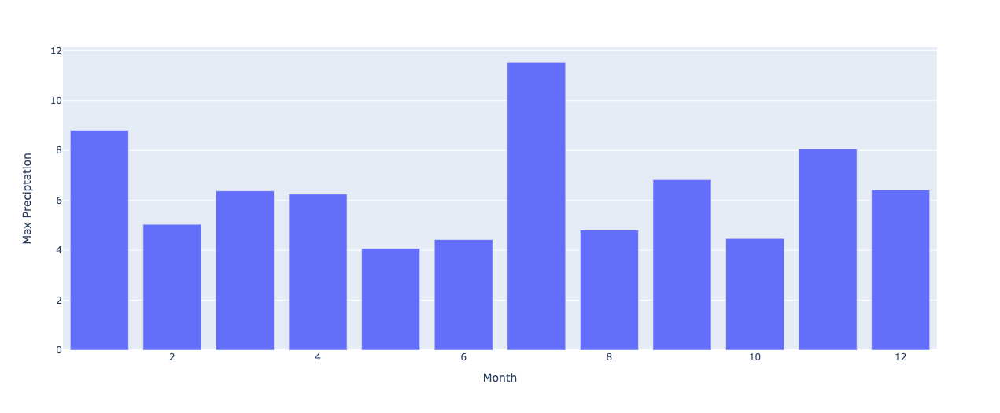
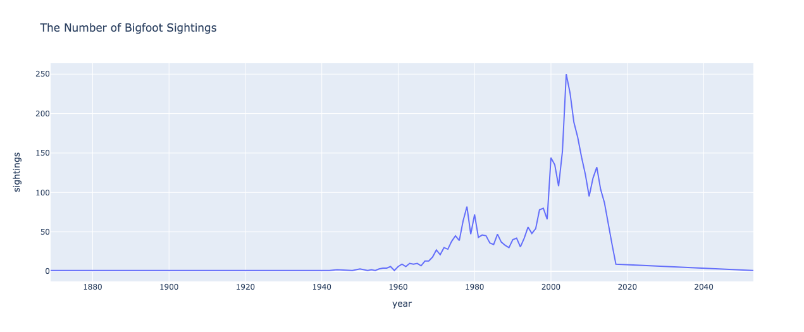

# Module 4 Lesson 2: Querying Big Data with PySpark

## Overview

In today’s lesson, the students will first learn how to group, aggregate, filter, and order data. They'll then learn how to parse and format date timestamps by using Spark. Finally, they'll learn how to write and use functions to avoid repeating code and to make their code more readable.

## Class Objectives

By the end of today's class, students will be able to:

- Apply grouping and aggregation functions to a dataset by using Spark.

- Filter and order a DataFrame by using Spark.

- Parse and format date timestamps by using Spark.

- Write and use functions to avoid repeating code and to make the code more readable.

---

## Activity Outline

| Activity | Time |
| -- | -- |
| [1. Welcome](#Section1) | 5 minutes
| [2. Grouping and Aggregating Data](#Section2) | 40 minutes |
| [3. Ordering and Filtering Data](#Section3) | 35 minutes |
| [4. Break](#Section4) | 15 minutes |
| [5. Reading and Plotting Time Series](#Section5) | 30 minutes |
| [6. Writing and Using Functions](#Section6) | 45 minutes |
| [7. Review Module Objectives & Assignment](#Section7) | 10 minutes |

---

## Instructor Prep

This section covers notes for this lesson and a slideshow for this lesson.

<details>
  <summary><strong>🗒️ Notes for This Lesson</strong></summary>

* Today’s lesson will primarily focus on the basics of Spark and on preparing the students for next week, which will cover Spark SQL and Spark optimization. It will then cover how to write and use functions. That’s so the students can learn to avoid repeating their code for tasks and to make their code more readable.

* Because Spark is a newer concept for the students, some might struggle with the setup work. So, feel free to spend extra time as needed and where you think is best.

* Remind the students that they can download the files and instructions for the activities by using the AWS links in Canvas. Please send out the files and instructions to any students who haven't downloaded the files for today.

</details>

---

### </a> Slideshow

You can find the [Querying Big Data with PySpark](https://docs.google.com/presentation/d/1AWc0QuTBrpSylTHw69GCCl0eVc6pTAZ4Y0sMeRe_Phk/edit?usp=sharing) slides for this lesson on Google Drive.

Remember that the slideshows are for instructor use only. To distribute slide content to the students, please export the slides to a PDF file. You can then send the PDF to the students.

---

## Activities

This module has seven activities, which the following sections describe.

### 1. <a name="Section1"></a> Welcome (5 minutes)

<details>
  <summary><strong>📣 1.1 Instructor Do: Welcome the Class (5 minutes)</strong></summary>

* Open the slides, and welcome the students to class.

* Explain that today's lesson will first cover the basics of Spark and that the students will then learn to filter and order data in a Spark DataFrame and to work with time series data.

* Explain that then, the students will learn about writing and using functions and do so in an activity. Tell them that they’ll need to use functions in their homework assignment.

* Explain the class objectives

</details>


### 2. <a name="Section2"></a> Grouping and Aggregating Data (40 minutes)

<details>
  <summary><strong>📣 2.1 Instructor Do: PCard Transactions (15 minutes)</strong></summary>
<br>

* Continue using the slides to introduce grouping and aggregation functions to the class, as follows:

  * **Note:** Remind the students that the `groupBy()` function and the aggregation functions in PySpark perform the same function when used with Python Pandas and SQL.

  * We use the `groupBy()` function to group rows together, based on specific columns.

  * PySpark makes several aggregation functions available. Here are a few:

    * `avg()`

    * `countDistinct()`

    * `count()`

    * `first()`

    * `last()`

    * `max()`

    * `min()`

  * In PySpark, we need to combine the `groupBy()` function with an aggregation function to return the rows that we want.

#### Instructor Demonstration: PCard Transactions

* **File:**

  * [PCardTransactions.ipynb](Activities/01-Ins_PCardTransactions/Solved/PCardTransactions.ipynb)

* Continue using the slides, and explain that you'll demonstrate how to analyze a dataset of purchase card (PCard) transactions from the state of Oklahoma.

* Explain that you'll first demonstrate how to partition results into groups by using the PySpark `groupBy` function. You’ll then demonstrate how to perform calculations on the groups by using aggregation functions.

* Open `PCardTransactions.ipynb`, and and then go over the code with the students while explaining the following:

  * We start by importing the dependencies, installing Spark and Java, and initializing Spark for the environment, as the following code shows:

    ```python
    # Activate Spark in our Colab notebook.
    import os
    # Find the latest version of spark 3.0  from http://www.apache.org/dist/spark/ and enter as the spark version
    # For example: 'spark-3.2.2'
    spark_version = 'spark-3.2.2'
    # spark_version = 'spark-3.<enter version>'
    os.environ['SPARK_VERSION']=spark_version

    # Install Spark and Java
    !apt-get update
    !apt-get install openjdk-11-jdk-headless -qq > /dev/null
    !wget -q http://www.apache.org/dist/spark/$SPARK_VERSION/$SPARK_VERSION-bin-hadoop3.2.tgz
    !tar xf $SPARK_VERSION-bin-hadoop3.2.tgz
    !pip install -q findspark

    # Set Environment Variables
    os.environ["JAVA_HOME"] = "/usr/lib/jvm/java-11-openjdk-amd64"
    os.environ["SPARK_HOME"] = f"/content/{spark_version}-bin-hadoop3.2"

    # Start a SparkSession
    import findspark
    findspark.init()
    ```

  * We then read the `PCardTransactions.csv` file from the S3 bucket, as the following code shows:

    ```python
    # Read in data from S3 Buckets
    from pyspark import SparkFiles
    url = "https://2u-data-curriculum-team.s3.amazonaws.com/nflx-data-science-adv/week-4/pcard_transactions.csv"
    spark.sparkContext.addFile(url)
    df = spark.read.csv(SparkFiles.get("pcard_transactions.csv"), sep=",", header=True)

    # Show DataFrame
    df.show()
    ```

  * Next, we run `groupby` on the "Agency Name" column, as the following code shows:

    ```python
    df.groupBy('Agency Name')
    ```

  * Next, we’ll need to use the "Amount" column, which currently holds strings. We need to convert them to the `float` type.

  * To do so, we can use the `withColumn()` and the `cast()` functions.

  * We’ll use `AmountUpdated` as the DataFrame to run `groupBy` on. First, we change the datatype of the "Amount" column to `float`, as the following code shows:

    ```python
    amountUpdated = df.withColumn("Amount", df["Amount"].cast('float'))
    ```

  * Now, we can get the maximum amount spent per transaction, grouped by agency name, as the following code shows:

    ```python
    amountUpdated.groupBy('Agency Name').max().show()
    ```

  * Next, we get the sum of all the PCard transactions, grouped by agency name, as the following code shows:

    ```python
    amountUpdated.groupBy('Agency Name').sum().show()
    ```

  * Besides by using an aggregation function, we can aggregate data by using the `agg()` function. Either way is suitable.

  * To use the `agg()` function, we add the parameter that describes which aggregation we want to apply.

  * Specifically, we want to get the sum of all the PCard Transactions, grouped by agency name, as the following code shows:

    ```python
    agency_groups = amountUpdated.groupBy('Agency Name')
    agency_groups.agg({'Amount':'Sum'}).show()
    ```

  * Using the `Avg` parameter, we can get the average amount, grouped by agency name, as the following code shows:

    ```python
    agency_groups.agg({'Amount':'Avg'}).show()
    ```

  * Using the `count` parameter, we can get the count of transactions, grouped by agency name, as the following code shows:

    ```python
    agency_groups.agg({'Amount':'count'}).show()
    ```

  * Next, we’ll find out how to get the maximum transaction per cardholder last name.

   * First, we need to run `groupby` on the "CardHolder Last Name" column, and then we can use the `Max` parameter to get the maximum transaction per cardholder last name, as the following code shows:

    ```python
    lastname_groups = amountUpdated.groupBy('CardHolder Last Name')
    lastname_groups.agg({'Amount':'Max'}).show()
    ```

  * Finally, we get the average transaction amount per cardholder last name, as the following code shows:

    ```python
    lastname_groups.agg({'Amount':'Avg'}).show()
    ```
* Send out the [PCardTransactions.ipynb](Activities/01-Ins_PCardTransactions/Solved/PCardTransactions.ipynb) file for the students to refer to later.

* Answer any questions before moving on.

* Data Source: [Purchase Card (PCard) Fiscal Year 2014](https://data.world/oklahoma/purchase-card-fiscal-year).

</details>

<details>
  <summary><strong>✏️ 2.2 Student Do: Retail Transactions (15 minutes)</strong></summary>
<br>

* Continue with the slides to explain this activity.

* Explain that the students will practice using the `groupBy()` and `agg()` functions with the Retail Transaction Data dataset. Understanding how these functions work is important, because that’s another step toward being able to transform data into various forms. They’ll use this skill on a regular basis in their careers.

* Send out the link to [PySpark Cheat Sheet](https://github.com/kevinschaich/pyspark-cheatsheet) to the students.

**Files:**

  * [README.md](Activities/02-Stu_RetailTransactions/README.md)

  * [RetailTransactions_unsolved.ipynb](Activities/02-Stu_RetailTransactions/Unsolved/RetailTransactions_unsolved.ipynb)

  * [retail_transactions.csv](Activities/02-Stu_RetailTransactions/Resources/retail_transactions.csv)

* Data Source: [Retail Transaction Data](https://www.kaggle.com/regivm/retailtransactiondata?select=Retail_Data_Transactions.csv).

</details>

<details>
  <summary><strong>⭐ 2.3 Review: Retail Transactions (10 minutes)</strong></summary>
<br>

* Send out the following solution file to the students:

  * [RetailTransactions_solved.ipynb](Activities/02-Stu_RetailTransactions/Solved/RetailTransactions_solved.ipynb)

* Continue with the slides, and review the activity.

* Open `RetailTransactions_solved.ipynb`, and then go through the code with the class while explaining the following:

  * With the `groupBy()` function, we can group data points by a specific column.

  * With the `agg()` function, we can group, or aggregate, numeric columns in various ways&mdash;like by the averages, summations, maximum and minimum values of the group, total number of rows for each group, and distinct rows for each group.

* Answer any questions before moving on.

</details>

---

### 3. <a name="Section3"></a> Ordering and Filtering Data (35 minutes)

<details>
  <summary><strong>📣 3.1 Instructor Do: Spark DataFrame Operations (10 minutes)</strong></summary>
<br>

* **Files:**

  * [spark_filtering_solved.ipynb](Activities/03-Ins_Spark_DataFrames_Filtering/Solved/spark_filtering_solved.ipynb)

  * [wine.csv](Activities/03-Ins_Spark_DataFrames_Filtering/Resources/wine.csv)

* Continue using the slides to introduce Spark DataFrame Operations to the class.

* Note that you'll demonstrate how to order and filter a DataFrame by using PySpark and Spark SQL functions.

* Mention that ordering and filtering data is a common practice among data engineers. That’s because sometimes, they don't want to use all the data in a dataset. Or, they might want to have the data sorted in a specific way.

* Introduce ordering and filtering data by explaining the following:

  * Spark can order a DataFrame via the `orderBy()` function.

  * We pass in the column name and use either `asc()` for ascending order or `desc()` for descending order.

  * We can use the `filter()` function to further manipulate the data.

* In Colab, open `spark_filtering_solved.ipynb`, and then go through the code with the students while explaining the following:

  * We can order the data on a specific column in either ascending or descending order, as the following code shows:

    ```python
    # Order a DataFrame by ascending values
    df.orderBy(df["points"].asc()).show(5)

    # Order a DataFrame by descending values
    df.orderBy(df["points"].desc()).show(5)
    ```

  * Spark can also import other specific functions, like `avg()`, which gets the average value of the column that was passed to it, as the following code shows:

    ```python
    # Import average function
    from pyspark.sql.functions import avg
    df.select(avg("points")).show()
    ```

* We can use the `filter()` function to further manipulate the data, like we do with the SQL `WHERE` clause. We’ll use it to filter for all the wine with a price that’s less than $20, as the following code shows:

    ```python
    # Using filter
    df.filter("price<20").show()
    ```

  * We can choose the exact columns by combining the `select()` function with `filter()`, as the following code shows:

    ```python
    # Filter by price on certain columns
    df.filter("price<20").select(['points','country', 'winery','price']).show()
    ```

  * Like Pandas, Spark can compare multiple conditions, as follows:

    * We use an ampersand (`&`) to mean AND.
    * We use a pipe (`|`) to mean OR.
    * We use a tilde (`~`) to mean NOT.

  * To demonstrate filtering on multiple conditions, we’ll get the items that cost more than $80 and less than $200, as the following code shows:

    ```python
      # Filter on the price column for items less than 200 dollars and greater than 80 dollars.
      df.filter( (df["price"] < 200) | (df['points'] > 80) ).show()
    ```

* Send out the [spark_filtering_solved.ipynb](Activities/03-Ins_Spark_DataFrames_Filtering/Solved/spark_filtering_solved.ipynb) file for the students to refer to later.

* Answer any questions before moving on.

</details>

<details>
  <summary><strong>✏️ 3.2 Student Do: Filtering Demographic Data with Spark (15 minutes)</strong></summary>
<br>

* Continue with the slides to explain this activity.

* Explain that the students will use PySpark to filter a demographic dataset and then use Spark SQL functions to analyze the data.

* **Files:**

  * [README.md](Activities/04-Stu_Spark_DataFrames_Filtering/README.md)

  * [demographics_filtered_unsolved.ipynb](Activities/04-Stu_Spark_DataFrames_Filtering/Unsolved/demographics_filtered_unsolved.ipynb)

  * [demographics.csv](Activities/04-Stu_Spark_DataFrames_Filtering/Resources/demographics.csv)

</details>

<details>
  <summary><strong>⭐ 3.3 Review: Filtering Demographic Data with Spark (10 minutes)</strong></summary>
<br>

* Send out the following solution file to the students:

  * [demographics_filtered_solved.ipynb](Activities/04-Stu_Spark_DataFrames_Filtering/Solved/demographics_filtered_solved.ipynb)

* Continue with the slides, and review the activity.

* In Colab, open `demographics_filtered_solved.ipynb`, and then go over the code with the students while explaining the following:

  * We use the `orderBy()` function with `desc()` to get the occupations and salaries in descending order.

  * We omit `desc()` to get the values in ascending order.

  * We can import functions like `mean()` and apply them to our columns. In this case, doing so creates an aggregate view named `avg(Salary)`.

  * We can apply the `min()` and `max()` functions to the "Salary" column.

  * We use a filter to get all the occupations that have salaries greater than $80,000.

  * We use `groupBy()` with an aggregation function to get the average age and average height by academic degree type.

* Answer any questions before moving on.

</details>

---

### 4. <a name="Section4"></a> Break (15 minutes)

---

### 5. <a name="Section5"></a> Reading and Plotting Time Series (30 minutes)

<details>
  <summary><strong> 📣 5.1 Instructor Do: Spark DataFrame Dates (10 minutes)</strong></summary>

* **Files:**

  * [spark_dates.ipynb](Activities/05-Ins_Spark_DataFrames_Dates/Solved/spark_dates.ipynb)

  * [rainfall.csv](Activities/05-Ins_Spark_DataFrames_Dates/Resources/rainfall.csv)

* Continue using the slides to introduce the students to Spark DataFrame dates.

* Explain that you'll demonstrate how to convert a date to a timestamp and how to plot time series data.

* Mention that the ability to convert a date to a timestamp is an important skill for a data engineer. That’s because after the conversion, we can query the data by using Spark SQL built-in functions.

* Import [spark_dates.ipynb](Activities/05-Ins_Spark_DataFrames_Dates/Solved/spark_dates.ipynb) into Colab, and then go over the code with the students while explaining the following:

  * To avoid errors when reading the data, we tell Spark to infer the schema, as the following code shows:

    ```python
    inferSchema=True
    ```

  * We commonly encounter various date and timestamp formats. Luckily, Spark provides a functions library that includes date and timestamp conversion functions.

  * We import the `year()` function, which we can use to select the year from a timestamp column, as the following code shows:

    ```python
    # Import date time functions
    from pyspark.sql.functions import year

    # Show the year for the date column
    df.select(year(df["date"])).show()
    ```

  * We can now create a new column that stores only the year, as the following code shows:

    ```python
    # Save the year as a new column
    df = df.withColumn("year", year(df['date']))
    df.show()
    ```

  * With the new column, we can now group by year and find the average precipitation, as the following code shows:

    ```python
    # Find the average precipitation per year
    averages = df.groupBy("year").avg()
    averages.orderBy("year").select("year", "avg(prcp)").show()
    ```

  * We can do the same with the `month()` function, except this time, we’ll use the `max()` function.

  * We first import the `month()` function and then get the month of the year from the "Date" column for each weather station, as the following code shows:

    ```python
    # Import the month function to get the month from the "Date" column.
    from pyspark.sql.functions import month
    df.select(month(df['Date'])).show()
    ```

  * Next, we add the "month" column to the DataFrame, as the following code shows:

    ```python
    # Add a column, "month" to the DataFrame.
    df = df.withColumn("month", month(df['date']))
    df.show()
    ```

  * Finally, we can get the maximum precipitation for each month, as the following code shows:

    ```python
    # Get the maximum precipitation for each month.
    maxes = df.groupBy("month").max()
    maxes.orderBy("month").select("month", "max(prcp)").show()
    ```

  * With the Pandas DataFrame, we can use Plotly to create a bar graph of the data, as the following image shows:

    

* Send out the [spark_dates.ipynb](Activities/05-Ins_Spark_DataFrames_Dates/Solved/spark_dates.ipynb) file for the students to refer to later.

* Answer any questions before moving on.

</details>

<details>
  <summary><strong>🎉 5.2 Everyone Do: Plotting Bigfoot Data (20 minutes)</strong></summary>

* **Files**

  * [README.md](Activities/06-Evr_Spark_DataFrames_Dates/README.md)

  * [bigfoot_unsolved.ipynb](Activities/06-Evr_Spark_DataFrames_Dates/Unsolved/bigfoot_unsolved.ipynb)

* Continuing with the slides, lead the students through this activity.

* Explain that in this activity, the students will first use Spark and Pandas to clean a bigfoot time series dataset, and they’ll then create a plot.

* Import `bigfoot_solved_unsolved.ipynb` into Colab, and then live code the solution while explaining the following:

  * First, we import the functions that we need to handle the year-date conversion.

  * Then, we create a DataFrame with only the year by using the `year()` function, as the following code shows:

    ```python
    # Create a new DataFrame with the column Year
    df.select(year(df["timestamp"])).show()
    ```

  * We can now use the `year()` function to create a new column, named "year", from the timestamp, as the following code shows:

    ```python
    # Save the year as a new column
    df = df.withColumn("year", year(df['timestamp']))
    df.show()
    ```

  * We can then use that "year" column to group, count, and order the sightings per year.

  * Finally, we convert the aggregated data to a Pandas DataFrame for visualization, as the following image shows:

    

* Answer any questions before moving on.

</details>

---
### 6. <a name="Section6"></a> Writing and Using Functions (45 minutes)

<details>
  <summary><strong>📣 6.1 Instructor Do: Functions (15 minutes)</strong></summary>
<br>

* **File:**

  * [functions.py](Activities/07-Ins_Functions/Solved/functions.py)

* Explain that in this activity, you'll demonstrate how to write and use functions to avoid repeating code and to make the code more readable.

* Send out `functions.py` so that any students who want to follow along with your demonstration can do so.

* Continue using the slides to introduce the students to functions, as follows:

  * Functions let us reuse blocks of code.

  * In Python, a function begins with the `def` keyword , then has a unique name for the function, then has a set of parentheses, and then ends with a colon (`:`). We can add parameters for the function inside the set of parentheses, or we can leave the parentheses empty.

  * Here’s a simple function definition with no parameters:

    ```python
    # Basic function definition
    def name(parameters):
      # Code goes here

    # A simple function definition with no parameters
    def show():
      print(f"Hi!")
    ```

  * We run, or **call**, a function by using the name of the function with the set of parentheses, as the following code shows:

    ```python
    # To run the code in a function, we use the name of the function with the parentheses
    show()
    ```

* Open `functions.py`, and then go through the code with the students while explaining the following:

  * We can consider a parameter as a variable that gets passed to the function, and we can have more than one parameter.

  * It’s important to note that the order of the parameters is significant, as the following code shows:

    ```python
    # Functions can have more than one parameter
    def make_quesadilla(protein, topping):
      quesadilla = f"Here is a {protein} quesadilla with {topping}"
      print(quesadilla)


    # Supply the arguments (values) when calling the function
    make_quesadilla("beef", "guacamole")
    make_quesadilla("chicken", "salsa")

    # @NOTE: Order is important when supplying arguments!
    make_quesadilla("sour cream", "beef")
    ```

  * We can also specify default parameters for the function to use if none get passed when the function is called, as the following code shows:

    ```python
    # We can also specify default values for parameters
    def make_quesadilla(protein, topping="sour cream"):
      quesadilla = f"Here is a {protein} quesadilla with {topping}"
      print(quesadilla)


    # Make a quesadilla using the default topping
    make_quesadilla("chicken")

    # Make a quesadilla with a new topping
    make_quesadilla("beef", "guacamole")
    ```

  * A function can return a value that can be saved and used, as the following code shows:

    ```python
    # Functions can return a value
    def square(number):
      return number * number


    # You can save the value that is returned
    squared = square(2)
    print(squared)
    ```

  * You can also print the return value of a function.

    ```python
    # You can also just print the return value of a function
    print(square(2))
    print(square(3))
    ```

* Answer any questions before moving on.

</details>

<details>
  <summary><strong>✏️ 6.2 Student Do: Writing and Using Functions (20 minutes)</strong></summary>
<br>

* Continue with the slides to explain this activity.

* Explain that the students will repurpose the code that created the bigfoot plot by writing a function that re-creates the bigfoot plot.

* **Files**

  * [README.md](Activities/08-Stu_Writing_Using_Functions/README.md)

  * [bigfoot_functions_unsolved.ipynb](Activities/08-Stu_Writing_Using_Functions/Unsolved/bigfoot_functions_unsolved.ipynb)

</details>

<details>
  <summary><strong>⭐ 6.3 Review: Writing and Using Functions (10 minutes)</strong></summary>
<br>

* Send out the following solution file to the students:

  * [bigfoot_functions_solved.ipynb](Activities/08-Stu_Writing_Using_Functions/Solved/bigfoot_functions_solved.ipynb)

* Continue with the slides, and review the activity.

* In Colab, open `bigfoot_functions_solved.ipynb`, and then go over the code with the students while explaining the following:

  * We first install Ploty while installing Spark.

  * We then create a Spark session.

  * We then read in the data.

  * We then import the dependencies, including Pandas, Ploty, and the Spark SQL functions that we'll need to handle the year-date conversion.

  * Next, we define our function, adding `df` as a parameter, as the following code shows:

    ```python
    def bigfoot_plot(df):
    ```

  * Next, we start to write the inside of the function. Specifically, we create a new variable to add the "year" column by using the `withColumn()` and `year()` functions, as the following code shows:

    ```python
     def bigfoot_plot(df):
       new_df = df.withColumn("year", year(df['timestamp']))
    ```

  * Next, we continue to write the inside of the function. Specifically, we get the total number of bigfoot sightings per year, as the following code shows:

    ```python
     def bigfoot_plot(df):
       new_df = df.withColumn("year", year(df['timestamp']))
       counts = new_df.groupBy("year").count()
    ```

  * Next, we convert the Spark DataFrame to a Pandas DataFrame, as the following code shows:

    ```python
     def bigfoot_plot(df):
       new_df = df.withColumn("year", year(df['timestamp']))
       counts = new_df.groupBy("year").count()
       pandas_df = counts.orderBy("year").select("year", "count").toPandas()
    ```

  * Next, we clean the Pandas DataFrame and rename the columns, as the following code shows:

    ```python
    def bigfoot_plot(df):
      new_df = df.withColumn("year", year(df['timestamp']))
      counts = new_df.groupBy("year").count()
      pandas_df = counts.orderBy("year").select("year", "count").toPandas()
      pandas_df = pandas_df.dropna()
      pandas_df = pandas_df.rename(columns={"count": "sightings"})
    ```

  * Next, we plot the number of sightings for each year, as the following code shows:

    ```python
    def bigfoot_plot(df):
      new_df = df.withColumn("year", year(df['timestamp']))
      counts = new_df.groupBy("year").count()
      pandas_df = counts.orderBy("year").select("year", "count").toPandas()
      pandas_df = pandas_df.dropna()
      pandas_df = pandas_df.rename(columns={"count": "sightings"})
      fig = px.line(pandas_df, x="year", y="sightings", title='The Number of Bigfoot Sightings')
    ```

  * Finally, we return the plot by adding a `return` statement with `fig.show()`, as the following code shows:

    ```python
    def bigfoot_plot(df):
      new_df = df.withColumn("year", year(df['timestamp']))
      counts = new_df.groupBy("year").count()
      pandas_df = counts.orderBy("year").select("year", "count").toPandas()
      pandas_df = pandas_df.dropna()
      pandas_df = pandas_df.rename(columns={"count": "sightings"})
      fig = px.line(pandas_df, x="year", y="sightings", title='The Number of Bigfoot Sightings')
      return fig.show()
    ```

* Once you’ve entered all the code in the `bigfoot_plot()` function, run the cell.

* In a new cell, call the `bigfoot_plot()` function with the original Spark DataFrame as the parameter, as the following code shows:

  ```python
  bigfoot_plot(df)
  ```

* Point out to the students that the `return` statement is a special statement that we can use inside a function to send the result of the function&mdash;in this case, the bigfoot plot&mdash;back to the caller.

* Answer any questions before moving on.

</details>

---

### 7. <a name="Section7"></a> Module Objectives Review & Assignment Description (10 minutes)

<details>
  <summary><strong>📣 7.1 Instructor Do: Review the Module Objectives (5 minutes)</strong></summary>
<br>

* Review this module’s objectives:

  * Identify the parts of the Hadoop ecosystem.

  * Write a Python script that implements the MapReduce programming model.

  * Identify the differences between the Hadoop and Spark environments.

  * Create a DataFrame by using PySpark.

  * Apply grouping and aggregation functions to a dataset by using Spark.

  * Filter and order a DataFrame by using Spark.

  * Parse and format date timestamps by using Spark.

  * Write and use functions to avoid repeating code and to make the code more readable.

* Mention that next week, we’ll learn about Spark SQL and Spark optimization

* Answer any questions before moving on.

</details>

<details>
  <summary><strong>📣 7.2 Instructor Do: Describe the Assignment (5 minutes)</strong></summary>
<br>

* **Files:**

  * [README](../../../02-Assignments/04-Big_Data/Instructions/README.md)

  * [Amazon_Video_Game_Reviews_starter_code.ipynb](../../../02-Assignments/04-Big_Data/Instructions/Amazon_Video_Game_Reviews_starter_code.ipynb)

* **Rubrics:**

* [Instructor grading rubric](https://docs.google.com/spreadsheets/d/1kQGfzfxky5Fhed5xE56aaDOzHLxrkBvzYKDtqGKFNoA/edit?usp=sharing)

* [Student PDF rubric](../../../02-Assignments/04-Big_Data/Instructions/Amazon_Video_Game_Reviews_Rubric.pdf)

* Note that for this week's homework assignment, the students will use their knowledge of Spark and of how to write functions to determine the total number of video game reviews from each customer. They'll then filter the original Spark DataFrame to determine the number of 1-, 2-, 3-, 4-, and 5-star video game reviews from each customer.

* Open [README](../../../02-Assignments/04-Big_Data/Instructions/README.md), and then go over the content&mdash;which consists of information and instructions for the assignment&mdash;with the class.

</details>

---

Copyright 2022 2U. All Rights Reserved.
