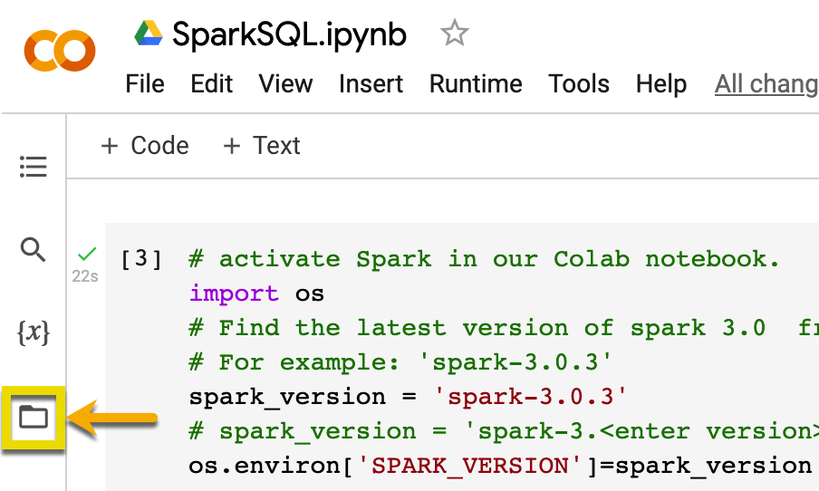
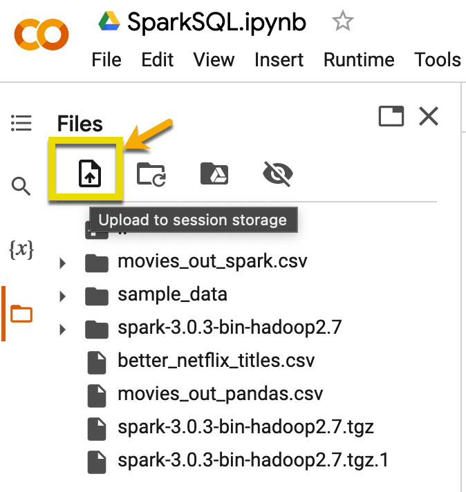
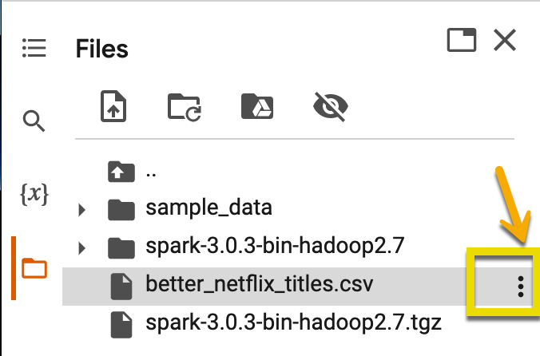
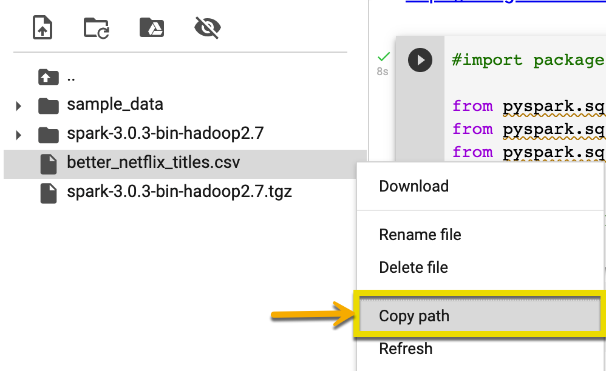
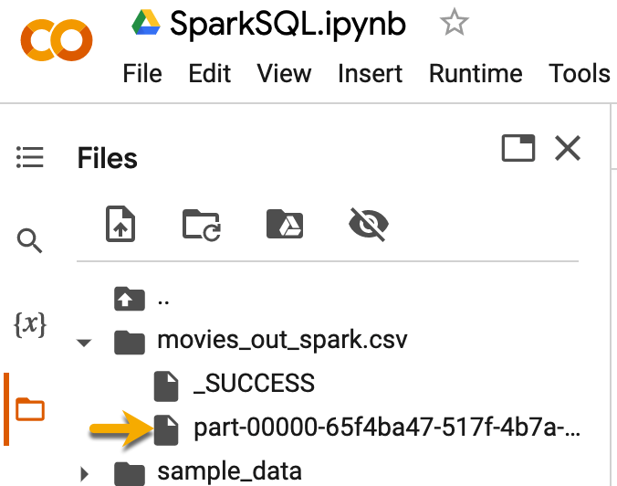

# Module 5, Lesson 1: Advanced PySpark

## Lesson Overview

Today’s lesson will introduce the students to the advanced features of PySpark. First, they'll create temporary views to run Spark SQL queries. Then, they'll combine PySpark and Spark SQL to run queries. Finally, they'll combine what they’ve learned from earlier lessons with Spark SQL to join and transform data.

## Class Objectives

By the end of today's lesson, the students will be able to:

* Use temporary tables to prepare data for SQL.

* Describe how the SQL API interacts with data.

* Combine PySpark and SQL to run queries.

* Create a full workflow from start to finish by using PySpark and Spark SQL.

---

## Activity Outline

| Activity | Time |
| -- | -- |
| [1. Welcome](#Section1) | 5 minutes |
| [2. Creating Spark Temporary Tables](#Section2) | 40 minutes |
| [3. Spark SQL: Combining Spark with SQL](#Section3) | 50 minutes |
| [4. Break](#Section4) | 15 minutes |
| [5. Using Spark SQL to Create Joins](#Section5) | 70 minutes |

---

## Instructor Prep
This section covers notes for this lesson and a slideshow for this lesson.

<details>
<summary><strong>🗒️ Notes for This Lesson</strong></summary>

* Spark offers several ways to process data&mdash;specifically, R, Scala, Python, Java, and SQL. Today’s lesson will focus on Python and SQL. It will use Spark to ingest data but PySpark or Spark SQL for additional processing.

* The students who are more familiar with Python than SQL might want to drift back to PySpark. Explain to all the students that the chief advantage of this Spark feature is allowing us to choose the language that we feel the most comfortable with. Later, they can choose the language that they like. But, today’s lesson will focus on SQL.

* Today’s lesson brings together many of the concepts that we’ve covered so far. As you go through the lesson, point out how SQL gets used.

* The TAs should be ready to help explain and break down concepts for any students who struggle to grasp the material.

* Remind the students that they can download the files and instructions for the activities by using the AWS links in Canvas. Please send out the files and instructions to any students who haven't downloaded the files for today.

</details>

---

### </a> Slideshow

You can find the [Advanced PySpark](https://docs.google.com/presentation/d/1mYqe5AwJli9e9Lzfste840Sngc4cRneA_asnP5pw44I/edit?usp=sharing) slides for this lesson on Google Drive.

Remember that the slideshows are for instructor use only. To distribute slide content to the students, please export the slides to a PDF file. You can then send the PDF to the students.

---

## Activities

This lesson has five activities, which the following sections describe.

### 1. <a name="Section1"></a> Welcome (5 minutes)

<details>
  <summary><strong>📣 1.1 Instructor Do: Welcome the Class (5 minutes)</strong></summary>

* Open the slides, and welcome the students to class.

* Let the students know that they’ll learn another way to write Spark code: Spark SQL.

* Mention that one of the primary goals of the Spark development team is to make Spark easy to use for people in various roles. And, almost every data professional is familiar with SQL.

* Mention that the Spark engine has a query optimization engine, Catalyst optimizer, which does the heavy-lifting by performing the necessary optimizations to generate the most efficient execution plan of your Spark job.

* Mention that we’ll both rewrite some of our earlier activities and write new ones with fresh data.

* Explain the class objectives.

</details>

---

### 2. <a name="Section2"></a> Creating Spark Temporary Tables (40 minutes)

<details><summary><strong>📣 2.1 Instructor Do: Creating a Temporary Table (15 minutes)</strong></summary>
<br>

* Continue going through the slides to introduce Spark temporary tables to the class.

* Explain that one of the many advantages of Spark is the ability to write code against it by using various APIs&mdash;all of which perform in a similar way. And, you’ll now introduce the students to creating a temporary table, which is the first step in using the Spark SQL API.

* A **temporary table** provides a way to load a Spark table into memory that helps queries run faster. People also refer to a temporary table as a **temporary view**, or a **temp view**. We’ll use all three terms interchangeably.

* Once we load a temporary table, we can apply SQL statements to produce rapid query results.

* It’s important to differentiate a global temp view from a local temp view.

* To do so, we’ll discuss the Spark Application and the Spark Session.

* When you define Spark on your system, you first create a Spark Application. A **Spark Application** can hold one to many Spark jobs, views, and Sessions.

* All the Sessions in that Spark Application can access a **global temp view**.

* Until the application is stopped or the table is explicitly removed, a global temp view remains accessible to all parts of the application.

* We create a global temp view by using the following method:

  `df.createOrReplaceGlobalTempView(\<viewName\>)`

* Other jobs or sessions can’t access a **local temp view**. This can be helpful when we want to limit the scope of a session to a specific task.

* We create a local temp view by using the following method:

  `df.createOrReplaceTempView(\<viewName\>)`

#### Creating a Temporary Table

* **File:**

  * [TemporaryViews.ipynb](Activities/01-Ins_TemporaryViews/Solved/TemporaryViews.ipynb)

* Send out `TemporaryViews.ipynb` so that any students who want to follow along with your demonstration can do so.

* Continuing with the slides, explain that you’ll create a temporary view. And to do so, you’ll use data gathered from the following FiveThirtyEight story: [The Ultimate Halloween Candy Power Ranking](https://fivethirtyeight.com/videos/the-ultimate-halloween-candy-power-ranking/)

* Go to [Colab](https://colab.research.google.com/notebooks/welcome.ipynb), and then create a new notebook.

* Import and open `TemporaryViews.ipynb`.

* In Colab, connect to Spark.

* Go through the code with the students while explaining the following:

  * First, we import the necessary packages and create a Spark Session.

  * For this demonstration, we’ll read data directly from a GitHub repo.

    * This is a two-step process. First, we pull the file to our local environment. Then, we load it into a Spark DataFrame.

  * Next, we create a temporary view by using PySpark. A view in Spark stores metadata in the catalog that’s used for the query, or in the DataFrame that we’re storing the metadata in. We create a temporary view by running the `createOrReplaceTempView()` function on our Spark DataFrame. We use the alias of the view as the argument. An **alias** is how we want to later refer to the view in our SQL code. In this case, we use `candy` as the alias, as the following code shows:

    `candy_data.createOrReplaceTempView('candy')`

  * Next, we run the following example SQL scripts to demonstrate that the view is working:

    * `spark.sql("SELECT * FROM candy LIMIT 10").show()`

    * `spark.sql("SELECT * FROM candy ORDER BY winpercent DESC LIMIT 10").show()`

    * `spark.sql("SELECT * FROM candy WHERE chocolate==1 AND caramel==1 ORDER BY sugarpercent ASC").show()`

  * Finally, this is how to write a SQL query and then pass it to the `sql()` function:

    ```sql
    query = """(SELECT * FROM candy
    WHERE chocolate==1 AND caramel==1
    ORDER BY sugarpercent ASC)"""
    spark.sql(query).show()
    ```

    Notice that by using triple quotes (`"""`), we can nicely format our SQL code on multiple lines.

</details>

<details><summary><strong>✏️ 2.2 Student Do: Amazon Vine Temporary View (15 minutes)</strong></summary>
<br>

* Continue with the slides to explain this activity.

* Explain that the students will import an Amazon Vine dataset, create a temporary table, and then use Spark SQL to run queries on the temporary table.

**Files:**

* [README.md](Activities/02-Stu_Amazon_Vine_TemporaryView/README.md)

* [Amazon_Vine_Temporary_View_unsolved.ipynb](Activities/02-Stu_Amazon_Vine_TemporaryView/Unsolved/Amazon_Vine_Temporary_View_unsolved.ipynb)

</details>

<details><summary><strong>⭐ 2.3 Review: Amazon Vine Temporary View (10 minutes)</strong></summary>
<br>

* Send out the following solution files to the students:

  * [Amazon_Vine_Temporary_View_solved.ipynb](Activities/02-Stu_Amazon_Vine_TemporaryView/Solved/Amazon_Vine_Temporary_View_solved.ipynb)

* Continue with the slides, and review the activity.

* In Colab, open `Amazon_Vine_Temporary_View_solved.ipynb`, and then review the code while explaining the following:

  * We first create a temporary view named `music_df.createOrReplaceTempView('music')`.

  * To answer the first question, we use Spark SQL to query the temporary view to return the first 10 product titles for all the 5-star ratings, as the following code shows:

      ```sql
      spark.sql("SELECT product_title FROM music WHERE star_rating==5 LIMIT 10").show()
      ```

  * To answer the second question, we modify the previous query by adding the "review_body" column and changing the "star_rating" value, as the following code shows:

    ```sql
    spark.sql("SELECT product_title, review_body FROM music WHERE star_rating==1").show()
    ```

  * To answer the third and final question, we build a SQL query that gets the "customer_id" values and that aggregates those values by using `count` to get the number of reviews for each customer ID. We then use `GROUP BY` on the "customer_id" column and `ORDER BY` on `count(customer_id)` in descending order, as the following code shows:

    ```sql
    query = """(SELECT customer_id, count(customer_id)
    FROM music
    GROUP BY customer_id
    ORDER BY count(customer_id) DESC)"""
    ```

* Answer any questions before moving on.

</details>

---

### 3.<a name="Section3"></a> Combining PySpark with Spark SQL (50 minutes)

<details>
<summary><strong>📣 3.1 Instructor Do: Combining PySpark with Spark SQL (20 minutes)</summary></strong>
<br>

* Continue with the slides to introduce combining PySpark with Spark SQL to the class, as follows:

  * Now that you’re familiar with both the PySpark and Spark SQL frameworks, it’s time to bring them together to provide some flexibility when querying data.

  * One of the best features of the Spark framework is that we can easily switch between querying styles and languages.

  * The Spark infrastructure is built to accommodate dedicated Spark users, SQL enthusiasts, and Python programmers alike.

  * Regardless of which language or part of the Spark infrastructure we prefer, the performance of all the parts of the Spark infrastructure is the same.

    * The Spark engine optimizes the execution plan for your job, or query, based on what you're doing and not on which language you’re using.

    * While coding in Spark, people commonly switch between languages.

#### Instructor Demonstration: Combining PySpark with Spark SQL

* **Files:**

  * [SparkSQL.ipynb](Activities/03-Ins_SparkSQL/Solved/SparkSQL.ipynb)

  * [better_netflix_titles.csv](Activities/03-Ins_SparkSQL/Resources/better_netflix_titles.csv)

  * **Note:** This dataset is from [Kaggle's Netflix Movies and TV Shows dataset](https://www.kaggle.com/datasets/shivamb/netflix-shows).

* Send out `SparkSQL.ipynb` so that any students who want to follow along with your demonstration can do so.

* Continuing with the slides, demonstrate combining PySpark with Spark SQL, as follows:

  * In Colab, open `SparkSQL.ipynb`. (Alternatively, you can paste each cell into a new Colab Jupyter notebook.)

  * Upload the `better_netflix_titles.csv` into the Colab environment, as follows:

    * In the navigation pane, click the folder button.

      

    * Click the "Upload to session storage" button (which has a file icon with an upward-pointing arrow).

      

    * Select the file that you want to upload.

  * Set up the Spark environment, as the following code shows:

     ```python
     # Activate Spark in our Colaboratory notebook.
      import os
      # Find the latest version of spark 3.0  from http://www.apache.org/dist/spark/ and enter as the spark version
      # For example: 'spark-3.2.2'
      spark_version = 'spark-3.2.2'
      # spark_version = 'spark-3.<enter version>'
      os.environ['SPARK_VERSION']=spark_version

      # Install Spark and Java
      !apt-get update
      !apt-get install openjdk-11-jdk-headless -qq > /dev/null
      !wget -q http://www.apache.org/dist/spark/$SPARK_VERSION/$SPARK_VERSION-bin-hadoop3.2.tgz
      !tar xf $SPARK_VERSION-bin-hadoop3.2.tgz
      !pip install -q findspark

      # Set Environment Variables
      os.environ["JAVA_HOME"] = "/usr/lib/jvm/java-11-openjdk-amd64"
      os.environ["SPARK_HOME"] = f"/content/{spark_version}-bin-hadoop3.2"

      # Start a SparkSession
      import findspark
      findspark.init()
     ```

  * Use PySpark to read in the file, as follows:

    * Click the three dots to the right of the file.

      

    * Then, SELECT "Copy path".

      


    * Paste the path into the `csv()` function call, and for now, infer the schema, as the following code shows:

      ```python
      df = spark.read.csv("/content/better_netflix_titles.csv", header=True, inferSchema=True)
      ```

      The preceding code tells Spark to guess which data types to use and what the column names will be by peeking at the data. We’ll cover this in more depth later today.

  * Once we have our DataFrame, we can create the temporary view, as the following code shows:

    ```python
    df.createOrReplaceTempView('movies')
    ```

     Remember that the name of the view should make sense for the data.

  * We can now use any SQL code that we like, such as the following:

    ```python
    spark.sql("""SELECT show_id,
    type,
    title,
    country,
    TO_DATE(date_added, 'MMMM d, yyyy')
    AS date_added,
    release_year,
    rating,
    duration
    FROM movies
    WHERE date_added IS NOT null AND type='Movie'""").show(10)
    ```

    **Instructor Note:** The notebook has additional examples. Demonstrate whichever ones you like.

  * Write the data to disk, as the following code shows:

    ```python
    out_df.write.csv('movies_out_spark.csv')
    ```

    * Because Spark stores the data in partitions, it also writes the data in partitions.

    * Spark always stores these partitions in a folder that has the same name as the file. And, that folder often contains many subfolders or files.

    * The partition folder will contain one or more files that start with `part-`. Those are CSV files. Often, they're not optimal for human-friendly reading, but we can download them to our computer.

    * For this demonstration, the files will exist in a folder named `movies_out_spark.csv`.

      

  * The easiest workaround from having the part file output is to export the data to Pandas and then write a CSV file, as the following code shows:

    ```python
    out_df.toPandas().to_csv('movies_out_pandas.csv')
    ```

  * That technique forces the data to the main node and is recommended only if we’ve filtered or aggregated the data to a reasonable size. The technique isn’t recommended for larger datasets that are unfiltered or not aggregated.

    **Caution:** Converting a Spark DataFrame to a Pandas DataFrame forces all the partitioned data back to the main node and will cause performance issues if the data is more than that node can handle.

* Answer any questions before moving on.

</details>

<details>

<summary><strong>✏️ 3.2 Student Do: Earn a Medal in Spark SQL (20 minutes)</summary></strong>
<br>

* Continue with the slides to explain this activity.

* Explain that the students will evaluate a dataset that contains Olympic athlete data by using Spark SQL.

**Files:**

  * [README.md](Activities/04-Stu-Olympic_Medals/README.md)

  * [Olympic_Analysis_Unsolved.ipynb](Activities/04-Stu-Olympic_Medals/Unsolved/Olympic_Analysis_Unsolved.ipynb)

  * [athlete_events.csv](Activities/04-Stu-Olympic_Medals/Resources/athlete_events.csv)

* Data Source: Modified from [120 years of Olympic history: athletes and results | Kaggle](https://www.kaggle.com/heesoo37/120-years-of-olympic-history-athletes-and-results)

</details>

<details>

<summary><strong>⭐ 3.3 Review: Earn a Medal in Spark SQL (10 minutes)</strong></summary>
<br>

* Send out the following solution file to the students:

  * [Olympic_Analysis_Solved.ipynb](Activities/04-Stu-Olympic_Medals/Solved/Olympic_Analysis_Solved.ipynb)

* Continue with the slides, and review the activity.

* In Colab, open `Olympic_Analysis_Solved.ipynb`, and then review the solution while explaining the following:

  * Notice how we handle quoted strings within a column by using the options `quote="\"", escape="\"` while reading in the file.

  * After creating a temporary view, we want to get the number of distinct sports that were played in the most recent summer Olympics in the dataset (that is, in 2016). To do so, we first query for the sports that were played in 2016, as the following code shows:

    ```sql
    SELECT count(distinct sport) FROM games WHERE year=2016
    ```

  * Next, we get the number of distinct sports that were played in the 2012 Olympics, as the following code shows:

    ```sql
    SELECT count(distinct sport) FROM games WHERE year=2012
    ```

  * Then, we write a SQL query to get the distinct sports in the 2016 Olympics that were not in the 2012 Olympics, as the following code shows:

    ```sql
    SELECT DISTINCT sport
    FROM games
    WHERE year=2016 AND sport NOT IN
      (SELECT DISTINCT sport
      FROM games
      WHERE year=2012)
    ```

  * For the second question, we want to get the sports that have been played since the first summer Olympics. To do so, we first find the year of the earliest Olympics, as the following code shows:

    ```python
    spark.sql("""SELECT min(year) FROM games""").show()
    ```

  * Next, we get the sports that were played in the earliest Olympic games, as the following code shows:

    ```python
    spark.sql("""
    SELECT
    DISTINCT sport
    FROM games
    WHERE year=1896""").show()
    ```

  * Finally, we write a query with a `JOIN` statement for the years 1896 and 2016, as the following code shows:

    ```python
    spark.sql("""
    SELECT
      DISTINCT a.sport
      FROM games a
      JOIN
          (SELECT DISTINCT sport FROM games WHERE year=1896) b
      ON
      a.sport=b.sport
    WHERE a.year=2016""").show()
    ```

  * For the third question, we want to get the top five Olympic gold medal winners. To do so, we use the following query:

    ```python
    spark.sql("""
      SELECT
          Name,
          medal,
          count(*) as medalCount
      FROM games
      WHERE medal ='Gold' GROUP BY Name, medal
      ORDER BY medalCount desc
      LIMIT 5
      """).show(truncate=False)

  * Finally, we want to get the top five silver and bronze medal winners. To do so, we modify the preceding query by substituting "Gold" with "Silver" and "Bronze".

  * To export the top five top gold medalists to a CSV file, we modify the previous code by adding the `toPandas()` method to the query and then exporting the DataFrame  as the following code shows:

    ```sql
    import pandas as pd

    pandas_df=spark.sql("""
    SELECT
      Name,
      medal,
      count(*) as medalCount
    FROM games
    WHERE medal ='Gold' GROUP BY Name, medal
    ORDER BY medalCount desc
    LIMIT 5
    """).toPandas()

    pandas_df.to_csv('top5Gold.csv')
    ```

* Answer any questions before moving on.

</details>

---

### 4. <a name="Section4"></a> Break (15 minutes)

---

### 5. <a name="Section5"></a> Using Spark SQL to Create Joins (70 minutes)

<details>
<summary><strong>📣 5.1 Instructor Do: Importing and Reviewing Files in Spark SQL (25 minutes) </strong></summary>
<br>

* Continue going through the slides to introduce importing and reviewing files in Spark SQL to the class, as follows:

  * Now that we can work interchangeably between basic PySpark and Spark SQL functions, we’ll learn how to optimize our workflows by combining core Spark, Python, and SQL.

  * When we import data by using Spark, we can boost the performance by providing a schema instead of by inferring the schema from the source. The time saved by doing so can be significant, depending on the size of the source files.

  * Once we’ve imported a file into Spark, we can convert the table into a view and then use Spark SQL to query and transform the data.

  * Regarding temporary views, Spark SQL doesn’t limit us to simple queries. We can also group, filter, and join temporary views without compromising performance.

* Explain that you’ll next demonstrate importing and reviewing files in Spark SQL. But instead of importing data from a CSV file or an S3 bucket, you’ll do so from Google Drive.

#### Instructor Demonstration: importing and Reviewing Files in Spark SQL

* **Files:**

  * [ImportView_SparkSQL.ipynb](Activities/05-Ins_Import_and_View_SparkSQL/Solved/ImportView_SparkSQL.ipynb)

  * [employee_data.csv](Activities/05-Ins_Import_and_View_SparkSQL/Resources/employee_data.csv)

  * [JobRole_lookup.csv](Activities/05-Ins_Import_and_View_SparkSQL/Resources/JobRole_lookup.csv)

* Send out `ImportView_SparkSQL.ipynb` so that any students who want to follow along with your demonstration can do so.

* Continuing with the slides, demonstrate combining PySpark with Spark SQL, as follows:

1. In Colab, open [ImportView_SparkSQL.ipynb](Activities/05-Ins_Import_and_View_SparkSQL/Solved/ImportView_SparkSQL.ipynb).

2. Start by activating Spark in our Colaboratory notebook as the following code shows:

    ```python
    # Activate Spark in our Colaboratory notebook.
    import os
    # Find the latest version of spark 3.0  from http://www.apache.org/dist/spark/ and enter as the spark version
    # For example: 'spark-3.2.2'
    spark_version = 'spark-3.2.2'
    # spark_version = 'spark-3.<enter version>'
    os.environ['SPARK_VERSION']=spark_version

    # Install Spark and Java
    !apt-get update
    !apt-get install openjdk-11-jdk-headless -qq > /dev/null
    !wget -q http://www.apache.org/dist/spark/$SPARK_VERSION/$SPARK_VERSION-bin-hadoop3.2.tgz
    !tar xf $SPARK_VERSION-bin-hadoop3.2.tgz
    !pip install -q findspark

    # Set Environment Variables
    os.environ["JAVA_HOME"] = "/usr/lib/jvm/java-11-openjdk-amd64"
    os.environ["SPARK_HOME"] = f"/content/{spark_version}-bin-hadoop3.2"

    # Start a SparkSession
    import findspark
    findspark.init()
    ```

3. Import the Spark dependencies and start the Spark Session as the following code shows:

    ```python
    # Import the Spark dependencies.
    from pyspark.sql import SparkSession
    from pyspark.sql import Row
    from pyspark.sql.types import StructType,StructField, StringType, IntegerType

    # Create a SparkSession
    spark = SparkSession.builder.appName("SparkSQL").getOrCreate()
    ```

4. Connect to your Google Drive as the following code shows:

    ```python
    from google.colab import drive
    drive.mount('/content/drive')
    ```

    * You will get a pop-up message that asks you to sign in to your Google account and link your Google Drive.

    * Create a "Data" folder in your Google Drive and add the `employee_data.csv` and `JobRole_lookup.csv` to the "Data" folder.

5. Select the files from your Drive and copy the file path.

    


    

6. Assign the file paths to variables, as the following code shows:

    ```python
    # You have to include the full link to the csv file containing your dataset.
    employee_data_filePath='/content/drive/MyDrive/Data/employee_data.csv'
    # Create a DataFrame with your data.
    lookup_Jobrole_filePath='/content/drive/MyDrive/Data/JobRole_lookup.csv'
    ```

7. Have Spark read in the file without inferring the schema and instead reading in the file header, as the following code shows:

    ```python
    # If your data has a header you can have Spark retrieve it
    # And, we can also save a step by printing the Schema too.
    employee_df=(spark.read
              .option("header","true")
              .csv(employee_data_filePath)
                          )

    employee_df.printSchema()
    #Better but notices it's all strings so let's do one more thing
    ```

8. Repeat reading in the file, but this time, have Spark infer the schema, as the following code shows:

    ```python
    # Read with headers and "infer" schema
    employee_df=(spark.read
              .option("header","true")
              .option("inferSchema", "true")
              .csv(employee_data_filePath)
              )

    employee_df.printSchema()
    # This gives us a much better output.
    # Note: this isn't always enough, there may be times when you have to define the schema or even convert the data types after reading.
    # You will get much better load performance if you provide a schema.
    ```

    * Note that when Spark can’t infer a data type for a column, it defaults to the `String` data type.

    * Also note that although inferring the schema is convenient, it’s often not the best option for performance&mdash;particularly with larger tables.

9. This time, define the schema by using `StructType` and `StructField`.

    * Explain that we can think of a `StructType` object as a collection or list of `StructField` objects. We use a `StructType` object to programmatically specify the schema to the DataFrame&mdash;thus creating a complex nested structure of columns. With `StructField`, we can define the column names, column data types, and null and Boolean columns.

    * Explain that in situations where speed is important, properly defining the schema before reading in the file will save both load time and, if the inferred schema was incorrect, troubleshooting time.

    * Here’s the code:

      ```python
      # Here we have defined the schema of the spark DataFrame we intend to build from the csv.
      empSchema= StructType(
                              [StructField("Age",  IntegerType(), True),
                                      StructField("Attrition",  StringType(), True),
                                      StructField("BusinessTravel",  StringType(), True),
                                      StructField("DailyRate",  IntegerType(), True),
                                      StructField("Department",  StringType(), True),
                                      StructField("DistanceFromHome",  IntegerType(), True),
                                      StructField("Education",  IntegerType(), True),
                                      StructField("EducationField",  StringType(), True),
                                      StructField("EmployeeCount",  IntegerType(), True),
                                      StructField("EmployeeNumber",  IntegerType(), True),
                                      StructField("EnvironmentSatisfaction",  IntegerType(), True),
                                      StructField("Gender",  StringType(), True),
                                      StructField("HourlyRate",  IntegerType(), True),
                                      StructField("JobInvolvement",  IntegerType(), True),
                                      StructField("JobLevel",  IntegerType(), True),
                                      StructField("JobRole",  IntegerType(), True),
                                      StructField("JobSatisfaction",  IntegerType(), True),
                                      StructField("MaritalStatus",  StringType(), True),
                                      StructField("MonthlyIncome",  IntegerType(), True),
                                      StructField("MonthlyRate",  IntegerType(), True),
                                      StructField("NumCompaniesWorked",  IntegerType(), True),
                                      StructField("Over18",  StringType(), True),
                                      StructField("OverTime",  StringType(), True),
                                      StructField("PercentSalaryHike",  IntegerType(), True),
                                      StructField("PerformanceRating",  IntegerType(), True),
                                      StructField("RelationshipSatisfaction",  IntegerType(), True),
                                      StructField("StandardHours",  IntegerType(), True),
                                      StructField("StockOptionLevel",  IntegerType(), True),
                                      StructField("TotalWorkingYears",  IntegerType(), True),
                                      StructField("TrainingTimesLastYear",  IntegerType(), True),
                                      StructField("WorkLifeBalance",  IntegerType(), True),
                                      StructField("YearsAtCompany",  IntegerType(), True),
                                      StructField("YearsInCurrentRole",  IntegerType(), True),
                                      StructField("YearsSinceLastPromotion",  IntegerType(), True),
                                      StructField("YearsWithCurr7",  IntegerType(), True)
                              ]
      )


      # Here we are reading in the file with the defined schema.
      employee_df=(spark.read
                .option("header","true")
                .schema(empSchema)
                .csv(employee_data_filePath)
                )

      employee_df.printSchema()
      ```

10. Before getting to the SQL code, remind the students how we’d filter and join the data by using standard PySpark code:

    ```python
    # Let's look at example of querying our data with PySpark.
    employee_df.show()

    # Let's do a simple filter using PySpark.
    employee_df.filter(employee_df.Education==1).show()

    # Let's sum up the DailyRate by JobLevel and make sure our output column as an easy to read name.
    (employee_df.groupby("JobLevel")
            .sum("DailyRate")
            .withColumnRenamed("sum(DailyRate)","totalRate")
            .show()
    )
    ```

11. Create a temp view, named `example`, of the DataFrame and make it ready for SQL, as the following code shows:

    ```python
    # Now let's take our DataFrame and tell Spark that we want to be able to query it with SQL
    # To do this we are going to chain our DataFrame .createOrReplaceTempView(<temptableName>).
    employee_df.createOrReplaceTempView('employee')
    ```

12. Remind the students that we can now query the data with SQL statements by using the `spark.sql()` function, as the following code shows:

    ```python
    # This permits us the ability to query our DataFrame using standard ANSI SQL.
    spark.sql("SELECT * FROM employee").show()
    ```

13. Demonstrate PySpark filtering like you did in Step 7, but this time, use SQL code:

    ```python
    # Now let's do a simple filter using PySpark.
    # Using this example from above:
    # employee_df.filter(employee_df.Education==1).show() we write:
    spark.sql("""
    SELECT * FROM employee
    WHERE Education =1
    """).show()

    # And, this example:
    # (employee_df.groupby("JobLevel")
    #           .sum("DailyRate")
    #           .withColumnRenamed("sum(DailyRate)","totalRate")
    #           .show()
    # )
    # is written as follows:

    spark.sql("""
    select JobLevel, sum(DailyRate) as totalRate
    from employee
    group by 1""").show()
    ```

14. Next, show how we query  the lookup table with SQL. First we create the lookup table.

    ```python
    # Let's read in a lookup table for the JobRole column.
    lookupRole_df=(spark.read
                  .option("header","true")
                  .option("inferSchema","true")
                  .csv(lookup_Jobrole_filePath)
                  )

    # Verify the schema looks okay.
    lookupRoleDF.printSchema()
    ```

15. Then, we perform a join in PySpark to combine the `employee_df` and `lookupRole_df` views, as the following code shows:

    ```python
    # Create our temp view
    lookupRoleDF.createOrReplaceTempView('RoleLookup')

    # This is definitely our lookup table
    spark.sql("SELECT * FROM RoleLookup").show()

    # Then, we join the employee_df and lookupRole_df views.
    joined_df=employee_df.join(lookupRole_df, employee_df.JobRole==lookupRole_df.role_id)
    joined_df.show()
    ```

   * Explain that a PySpark join resembles the Pandas `.merge()` function.

16. Finally, we perform the same join by using Spark SQL, as the following code shows:

    ```python
    # And, finally we can create our final DataFrame using SQL.
    Sql_joined_df=spark.sql("""
    select a.*, roleName
    from example a
      Inner join
        RoleLookup b
          on a.JobRole=b.role_id""").show()
    ```

* Answer any questions before moving on.

</details>

<details>
<summary><strong>✏️ 5.2 Student Do: Airline Departures (30 minutes)</summary></strong>
<br>

* Continue with the slides to explain this activity.

* Explain that the students will use Spark SQL to extract data from an external source, define the schema for the data, create a temporary table, and determine which airport has the most departures. This will require them to use Spark SQL to join data. They’ll thus get a direct comparison of working in PySpark by using core Spark with working in Spark SQL.

**Files**

  * [README.md](Activities/06-Stu-Airline_Departures/README.md)

  * [05-Stu-Joining_with_SparkSQL/JoiningSparkSQL_Unsolved.ipynb](Activities/06-Stu-Airline_Departures/Unsolved/Airline_Departures_Unsolved.ipynb)

* Data sources:

  [airport codes](https://raw.githubusercontent.com/databricks/LearningSparkV2/master/databricks-datasets/learning-spark-v2/flights/airport-codes-na.txt)

  [departures and delays](https://raw.githubusercontent.com/databricks/LearningSparkV2/master/databricks-datasets/learning-spark-v2/flights/departuredelays.csv)

</details>

<details>
    <summary><strong> ⭐ 5.3 Review: Airline Departures (15 minutes)</summary></strong>
<br>

* Send out the following solution file to the students:

   * [Airline_Departures_Solved.ipynb](Activities/06-Stu-Airline_Departures/Solved/Airline_Departures_Solved.ipynb)

* Continue with the slides, and review the activity.

* In Colab, open `Airline_Departures_Solved.ipynb`, and then review the solution while noting the following:

  * Although the code performs several complex actions, the students should feel familiar with all of them after observing your demonstration.

  * One of the first places that they might struggle with is defining the schema, as the following code shows:

    ```python
    codesSchema= StructType(
    [StructField("City", StringType(), True),
    StructField("State", StringType(), True),
    StructField("Country", StringType(), True),
    StructField("Iata", StringType(), True)]
    )
    ```

  * It's important for them to understand that the "date" column doesn’t have the format that Spark expects for a date, so we will initially define it with `StringType()`. But, the other types are straightforward, as the following code shows:

    ```python
    depart_schema=StructType(
    [StructField("date", StringType(), True),
    StructField("delay", IntegerType(), True),
    StructField("distance", IntegerType(), True),
    StructField("origin", StringType(), True),
    StructField("destination", StringType(), True)]
    )
    ```

  * After creating the views, we join the two views using SQL. The following code shows one solution:

    ```python
    sql_depByAir="""
    SELECT d.origin AS origin_Airport, c.city, c.State, count(*) AS origin_departures
    FROM departures d
    JOIN
      codes c
      ON d.origin= c.Iata
    GROUP BY origin_Airport, c.city, c.State
    ORDER BY origin_departures DESC"""
    ```

* Answer any questions before ending class.

</details>

---

Copyright 2022 2U. All Rights Reserved.
