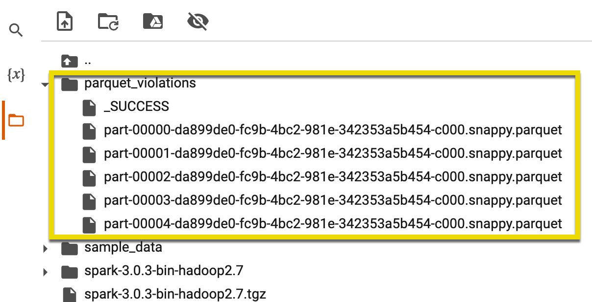
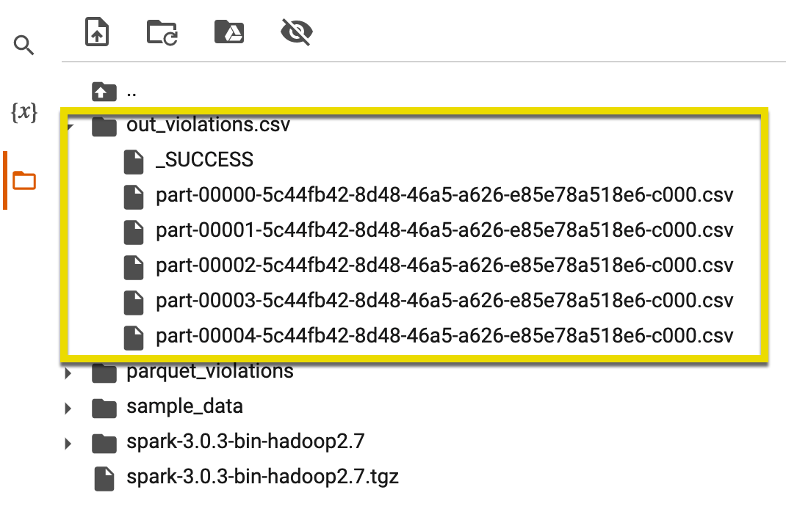
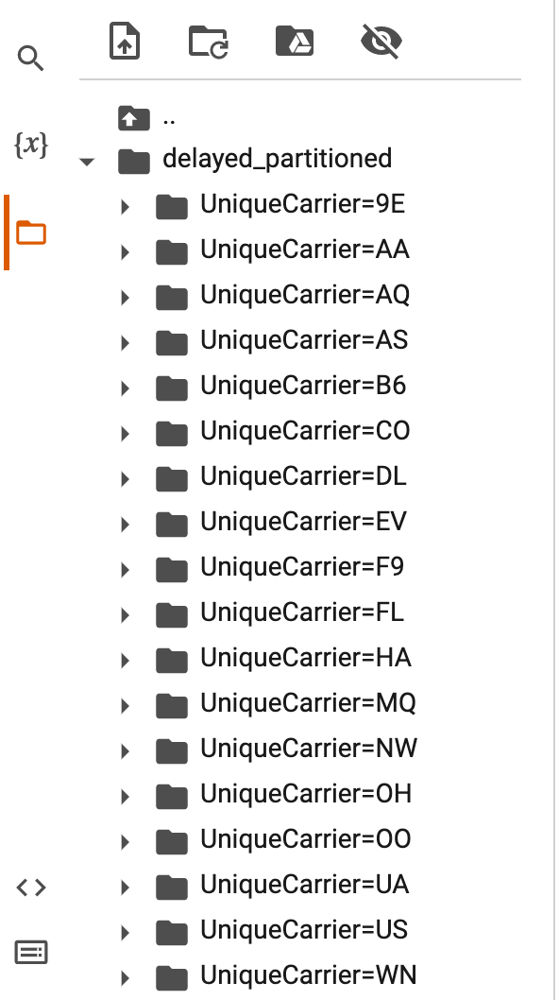

# Module 5, Lesson 2: Storage, Partitioning, and Caching

## Lesson Overview

In today's class, you'll learn how to store data in parquet format and partition the parquet data to optimize query execution times, then you'll practice caching data and determine optimal query execution times between partitioned and cached data.  

## Class Objectives

By the end of class, students will be able to:

* Compare the file storage types (other than tabular) that work the best for Spark.

* Understand how partitioning affects Spark performance.

* Explain the cause of shuffling and limit it when possible.

* Identify when caching is the best option.

* Explain how to broadcast a lookup table, and force it when it doesn't happen automatically.

* Set the shuffle partitions to an appropriate value and demonstrate how to cache data.

---

 ## Activity Outline

| Activity | Time | 
| -- | -- | 
| [1. Welcome](#Section1) | 5 minutes |
| [2. Optimizing Spark - Data Storage](#Section2) | 45 minutes |
| [3. Optimizing Spark - Partitioning](#Section3) | 45 minutes |
| [4. Break](#Section4) | 15 minutes |
| [5. Optimizing Spark - Shuffling](#Section5) | 15 minutes |
| [6. Optimizing Spark - Caching](#Section6) | 45 minutes |
| [7. Review Module Objectives & Assignment](#Section7) | 10 minutes |

---

## Instructor Prep

<details>
  <summary><strong>🗒️ Notes for This Lesson</strong></summary>

* Today's class will focus on how to optimize the environment to get the most from Spark.

* You will start today's class by discussing the optimal way to store data for Spark and move on to partitioning, and how partitioning further optimizes your reads. 

* Then you'll cover two other effective optimizations: shuffling and caching. There is no student do for shuffling, but you will explain what causes shuffling and why we want to limit it when possible.  We will also touch on broadcasting lookups.  

* The section on caching is long, but the concepts are fairly straight forward.  If you can fit your lookup into memory, your queries will be faster!

* The TAs should be ready to help explain and break down concepts for any students who struggle to grasp the material.

* Remind the students that they can download the files and instructions for the activities by using the AWS links in Canvas. Please send out the files and instructions to any students who haven't downloaded the files for today.

</details>

---

### </a> Slideshow

You can find the [Storage, Partitioning, and Caching](https://docs.google.com/presentation/d/1diLnPsWyGkpOaPKqJKmoKPEZqPwcAAHYkcfFOeRmQM0/edit?usp=sharing) slides for this lesson on Google Drive.

---

## Activities

This lesson has three activities, which the following sections describe.

### 1. <a name="Section1"></a> Welcome (5 minutes)

<details>
  <summary><strong>📣 1.1 Instructor Do: Welcome Class (5 minutes)</strong></summary>

* Open the slides and welcome the students and explain that today we will learn how to optimize data storage to improve Spark performance.  

* Go over the learning objectives for today's class.

</details>

---

### 2. <a name="Section2"></a> Optimizing Spark - Data Storage (45 minutes)

<details>
    <summary><strong> 📣 2.1 Instructor Do: Introducing Parquet (20 minutes)</strong></summary>
<br>

* In this activity, you will show students how to write data to parquet and how reading parquet data can improve query runtime. In addition, we will explore the file structure of parquet data by examining the Google Colab **File** section where parquet stores data.

* Continue through the slides to present this activity to the class.

* Explain to students that while Spark will always partition data across nodes, or workers, there are strategies for optimizing data storage that *greatly* improve Spark performance and reduce costs.

* Remind the students that we interface with the Resilient Distributed Datasets (RDD) in Spark using an API, like the Python API when we use PySpark. 

  * An RDD is a table in a database and can hold any type of data. Spark stores data in RDD on different partitions in memory as an object across the jobs, which increases computation time, compared to storing the data on a hard disk. 
  
  * When Spark loads data from a CSV file it will distribute the data through different nodes. Each node will then assign rows of the CSV file to a partition. When we query the data using a Spark API, every value has to be read from each partition. 

  * Computation times for datasets less than a few gigabytes is not greatly affected since the maximum size of a partition is 128Mb. But, when you are storing terabyte or larger datasets it is better to store the data in a parquet format to increase query optimization.  

* Parquet is a split-table in columnar format that works well in distributed storage like HDFS, AWS S3, and Azure data lake storage (ADLS).
  
  * **Columnar** refers to how the data is stored. Columnar stores each column value of a row separately, with a reference to all of its columns.
  
  * This allows you to query and filter a single column and return only the selected columns in your query with great efficiency, and reduces the amount of reading Spark performs.

  * Parquet is widely used in data analytics with Spark, because it greatly reduces query runtime.

  * Parquet will also help when **inferring the schema**. To infer the schema in parquet requires a one-time pass, while CSV and JSON require a pass of *all* of the data.
  
    *  Remember: Best practice is to state your schema prior to load. We recommend doing so.

#### Parquet Demonstration

* **File:**

  * [Read_and_Write_Parquet.ipynb](Activities/01-Ins_DataStorage/Solved/Read_and_Write_Parquet.ipynb)

* Send out `Read_and_Write_Parquet.ipynb` so that any students who want to follow along with your demonstration can do so.

* Continuing with the slides and demonstrate creating parquet as follows:

1. In Colab, open [Read_and_Write_Parquet.ipynb](Activities/01-Ins_DataStorage/Solved/Read_and_Write_Parquet.ipynb)/.

2. Start by activating Spark in our Colaboratory notebook as the following code shows:

      ```python
      import os
      # Find the latest version of spark 3.0  from http://www.apache.org/dist/spark/ and enter as the spark version
      # For example: 'spark-3.2.2'
      spark_version = 'spark-3.2.2'
      # spark_version = 'spark-3.<enter version>'
      os.environ['SPARK_VERSION']=spark_version

      # Install Spark and Java
      !apt-get update
      !apt-get install openjdk-11-jdk-headless -qq > /dev/null
      !wget -q http://www.apache.org/dist/spark/$SPARK_VERSION/$SPARK_VERSION-bin-hadoop3.2.tgz
      !tar xf $SPARK_VERSION-bin-hadoop3.2.tgz
      !pip install -q findspark

      # Set Environment Variables
      os.environ["JAVA_HOME"] = "/usr/lib/jvm/java-11-openjdk-amd64"
      os.environ["SPARK_HOME"] = f"/content/{spark_version}-bin-hadoop3.2"

      # Start a SparkSession
      import findspark
      findspark.init()
      ```
   
3. Import the necessary dependencies and create your Spark Session.
         
      ```python
      # Import packages
      from pyspark.sql import SparkSession
      # Import the time module so we can time our queries.
      import time

      # Create a SparkSession
      spark = SparkSession.builder.appName("SparkSQL").getOrCreate()
      ```
   
   * Point out that we imported a new package, `time`, to time our queries and compare the execution time between methods.

4. In this example, we will read a large CSV from S3.

      ```python
      # Read in data from S3 Bucket
      from pyspark import SparkFiles
      url = "https://2u-data-curriculum-team.s3.amazonaws.com/nflx-data-science-adv/week-5/NYC_Building_Violations.csv"
      spark.sparkContext.addFile(url)
      df = spark.read.csv(SparkFiles.get("NYC_Building_Violations.csv"), sep=",", header=True)
      df.show()
      ```
    
    * The dataset is from the [NYC Open Data portal](https://data.cityofnewyork.us/Housing-Development/DOB-Violations/3h2n-5cm9)

5. Get a summary of the data.

      ```python
      # Get a summary of the data.
      df.summary().show()
      ```

6. Create a view with our DataFrame and run a query and determine the runtime in minutes.

      ```python
      # Let's create a view with our DataFrame and run SQL that will sum up the boroughs by the type of violation.
      # We can output the time this step runs in seconds
      # Because we are timing the executions, remember to run twice to eliminate the "load time" from the discussion

      df.createOrReplaceTempView('violations')
      start_time = time.time()

      spark.sql("""select VIOLATION_TYPE, sum(BORO) from violations group by 1""").show()

      print("--- %s seconds ---" % (time.time() - start_time))
      ```

   * Below is the temporary view and the output in seconds for the second execution.


      |   VIOLATION_TYPE   |sum(CAST(BORO AS DOUBLE))|
      |--------------------| ------------------------|
      |LL10/80-LOCAL LAW...|                   3609.0|
      |LL11/98-LOCAL LAW...|                   9285.0|
      |HVIOS-NYCHA ELEV ...|                    969.0|
      |P-PLUMBING       ...|                  29480.0|
      |ACH1-(NYCHA) - EL...|                   4949.0|
      |LANDMRK-LANDMARK ...|                   5599.0|
      |LL5-LOCAL LAW 5/7...|                   1363.0|
      |IMD-IMMEDIATE EME...|                     13.0|
      |B-BOILER         ...|                  17042.0|
      |FISP-FACADE SAFET...|                   6889.0|
      |EGNCY-EMERGENCY  ...|                  12607.0|
      |ES-ELECTRIC SIGNS...|                  18378.0|
      |                null|                    148.0|
      |L1198-LOCAL LAW 1...|                  10656.0|
      |HBLVIO-HIGH PRESS...|                  14628.0|
      |BENCH-FAILURE TO ...|                 110285.0|
      |RWNRF-RETAINING W...|                   4007.0|
      |FISPNRF-NO REPORT...|                  21017.0|
      |LL2604-PHOTOLUMIN...|                    679.0|
      |LL2604S-SPRINKLER...|                   1513.0|

      ```txt
      --- 9.231749773025513 seconds ---
      ```
   
   * Try to run this code block twice, so we can ignore the overhead "load time" that Colab requires when accessing data for the first time. We only want to compare access times, not load times.
   
7. Write the data out in parquet format.

      ```python
      # Write out the data in parquet format
      # Note: This is pretty much the same as writing out to a csv.  
      # We are telling Spark to overwrite all of the data if it already exists
      df.write.parquet('parquet_violations',mode='overwrite')
      ```

8. Click the folder icon in the notebook to expose the folders and files that are stored in your Colab environment. Notice that a new folder is present with the same name as your parquet file (`parquet_title_basic`).
   
      

   * Inside of the new folder, you will find `part-*.parquet` files and a `_SUCCESS` file.
   
   * The `_SUCCESS` file is created when Spark creates a parquet folder.
   
   * The `part-*` files are binary files that store your compressed data in columnar format.
   

9.  Read your newly created parquet data back into Spark.

      ```python
      # Read in our new parquet formatted data
      p_df=spark.read.parquet('parquet_violations')
      ```
    
10. Create a temp view of your parquet DataFrame.

      ```python
      # A parquet formatted DataFrame has all the same methods as a row-based DataFrame
      # We can convert the DataFrame to a view
      p_df.createOrReplaceTempView('p_violations')
      ```
    
11. Run the same SQL query from Step 7, using the timer to demonstrate the speed pickup with parquet.

      ```python
      # Run the same sql as above.  (Note: If you have small datasets it IS possible that times may be very close.)
      # Because we are timing the executions, remember to run twice to eliminate the "load time" from the discussion.

      start_time = time.time()
      spark.sql("""select VIOLATION_TYPE, sum(BORO) from p_violations group by 1""").show()
      print("--- %s seconds ---" % (time.time() - start_time))
      ```

    * **Note:** This SQL example uses a *very* small file, and the speed pickup would be much more noticeable in a larger set.

12. **Optional:** You can show here that writing your DataFrame out to CSV will look like parquet. But, parquet is a binary compressed file format, while the CSV `part` files are actually just CSVs cut into multiple parts.

      ```python
      # Writing out a csv file from Spark will also create a folder with "part" files.
      # These files are not binary or compressed and in reality are just normal csv files broken into partitions.
      # You can see the folder 'out_violations.csv' in the file explorer to the left of the notebook.
      df.write.csv('out_violations.csv')
      ```
     

* Answer any questions before moving on.

</details> 

<details>
<summary><strong> ✏️ 2.2 Student Do: Practicing Parquet (15 minutes)</strong></summary>
<br>

In this activity, students will practice retrieving data from a AWS S3 storage bucket, store data in parquet format, and execute queries on parquet data using Spark. This activity will allow students to further practice using Spark on the popular storage format. 

#### Files:

  * [README.md](Activities/02-Stu_PracticingParquet/README.md)

  * [Austin_311_Public_Data.csv](https://2u-data-curriculum-team.s3.amazonaws.com/nflx-data-science-adv/week-5/Austin_311_Public_Data.csv)

  * [Practicing_Parquet_Unsolved.ipynb](Activities/02-Stu_PracticingParquet/Unsolved/Practicing_Parquet_Unsolved.ipynb)


</details>

<details>
<summary><strong> ⭐ 2.3 Review: Practicing Parquet (10 minutes)</strong></summary>
<br>

* Open the [Practicing_Parquet_Solved.ipynb](Activities/02-Stu_PracticingParquet/Solved/Practicing_Parquet_Solved.ipynb) notebook in Google Colab.

* Walk through and review the assignment with the students, answering any questions along the way. 

</details>

---

### 3. <a name="Section3"></a> Optimizing Spark - Partitioning (45 minutes)

<details>
    <summary><strong> 📣 3.1 Instructor Do: All the data must play its "part" (20 minutes)</strong></summary>
<br>

Now that students know how easy it is to store data in parquet format, show them how to partition data stored in parquet. Then you'll demonstrate how each change results in performance improvements when querying the data. Remind the students that the improvements may not be as noticeable on this dataset compared to a real-world big dataset.

* After getting our data into a parquet format, the next step is to determine and set up how the data is partitioned. 
  
* Remind the students that a partition distributes the work across a network cluster and divides the task into smaller parts to reduce memory requirements for each node, thus lowering cloud computing costs.
  
*  **Partition is the main unit of parallelism in Apache Spark.** In other words, without partitioning, Spark is very limited in its ability to perform tasks concurrently.
  
* The size of the partitions plays a significant role in the performance of our Spark queries. 
  
   *  Many small partitions will perform poorly, while well-distributed partitions will yield the best results.
  
*  By default, the size of the partition will max out at 128Mb.
  
   * We can change this setting by altering the Spark config setting: `spark.files.maxPartitionBytes`.
  
* While Spark can partition our data automatically, ideally we want to partition our data on a well-distributed key, based on our intended usage.
  
* It is important to try to keep partitions close to the same size to avoid skew (more data in one partition).

#### Parquet Partition Demonstration

* **File:**

  * [Parquet_Partitions.ipynb](Activities/03-Ins_Partitioning/Solved/Parquet_Partitions.ipynb)

* Send out `Parquet_Partitions.ipynb` so that any students who want to follow along with your demonstration can do so.

* Continuing with the slides and demonstrate partitioning with parquet as follows:

1. In Colab open [Parquet_Partitions.ipynb](Activities/03-Ins_Partitioning/Solved/Parquet_Partitions.ipynb).

2. Activate Spark and start a Spark Session as the following code shows:

      ```python
      # Activate Spark in our Colab notebook.
      import os
      # Find the latest version of spark 3.0  from http://www.apache.org/dist/spark/ and enter as the spark version
      # For example: 'spark-3.2.2'
      spark_version = 'spark-3.2.2'
      # spark_version = 'spark-3.<enter version>'
      os.environ['SPARK_VERSION']=spark_version

      # Install Spark and Java
      !apt-get update
      !apt-get install openjdk-11-jdk-headless -qq > /dev/null
      !wget -q http://www.apache.org/dist/spark/$SPARK_VERSION/$SPARK_VERSION-bin-hadoop3.2.tgz
      !tar xf $SPARK_VERSION-bin-hadoop3.2.tgz
      !pip install -q findspark

      # Set Environment Variables
      os.environ["JAVA_HOME"] = "/usr/lib/jvm/java-11-openjdk-amd64"
      os.environ["SPARK_HOME"] = f"/content/{spark_version}-bin-hadoop3.2"

      # Start a SparkSession
      import findspark
      findspark.init()
      ```

3. Load the Delayed Flights data from the S3 drive. The Delayed Flights data comes from [data.world](https://data.world/data-society/airlines-delay) and contains flight data.

      ```python
      # Read in data from S3 Bucket
      from pyspark import SparkFiles
      url = "https://2u-data-curriculum-team.s3.amazonaws.com/nflx-data-science-adv/week-5/DelayedFlights.csv"
      spark.sparkContext.addFile(url)
      df = spark.read.csv(SparkFiles.get("DelayedFlights.csv"), sep=",", header=True)
      df.show()
      ```

4. Now, create a temporary view with our DataFrame.

      ```python
      # Create a temporary view
      df.createOrReplaceTempView('delays')
      ```

5. We will execute SQL against the data as it is stored by default (row based).

      ```python
      # Run a SQL query that groups the data on UniqueCarrier
      # Note that the time functions will track the time it takes to load and run the data
      # We are only interested in the time it takes to run, so run this cell twice.
      start_time = time.time()

      spark.sql("""select UniqueCarrier,sum(CRSElapsedTime), count(*) from delays group by 1""").show()

      print("--- %s seconds ---" % (time.time() - start_time))
      ```

6. Write out the data in parquet format.

      ```python
      # Write out the data in parquet format
      df.write.parquet('parquet_delayed',mode='overwrite')
      ```

      * We are telling Spark to overwrite all of the data if it already exists.     

7. Read the new parquet formatted data back in.

      ```python
      # Read in our new parquet formatted data
      p_df=spark.read.parquet('parquet_delayed')
      ```

8. The next two cells will create a view and run the same SQL. Note the time difference.

    * **Note:** Remember to run twice, and if the difference is not significant, explain that this is due to the small DataFrame.

      ```python
      # A parquet formatted DataFrame has all the same methods as a row-based DataFrame
      # We can convert the DataFrame to a view
      p_df.createOrReplaceTempView('p_delays')

      start_time = time.time()

      spark.sql("""select UniqueCarrier, count(*) from p_delays group by 1""").show()

      print("--- %s seconds ---" % (time.time() - start_time))

      # Here is another sample
      start_time = time.time()

      spark.sql("""select UniqueCarrier,sum(CRSElapsedTime), count(*) from p_delays group by 1""").show()

      print("--- %s seconds ---" % (time.time() - start_time))
      ```

9. Now, let's partition our data by UniqueCarrier.

      ```python
      # Partition our data by UniqueCarrier
      df.write.partitionBy("UniqueCarrier").mode("overwrite").parquet("delayed_partitioned")
      ```

10. Click on the folder at the left edge of the Colab screen. Then, click on the `delayed_partitioned` folder to demonstrate how Spark stored the data by the partition key:

       

11. Read the new parquet, partitioned data back into a Spark DataFrame.

      ```python
      # Read in our new parquet formatted data
      p_df_p=spark.read.parquet('delayed_partitioned')
      ```

12. Create the temporary view from our new DataFrame, and query the data on the partition key. Compare the performance to that of previous queries.

      ```python
      # Convert the DataFrame to a view
      p_df_p.createOrReplaceTempView('p_delays_p')

      # Query the partitioned data on the partition key
      start_time = time.time()

      spark.sql("""select UniqueCarrier, count(*) from p_delays_p group by 1""").show()

      print("--- %s seconds ---" % (time.time() - start_time))
      ```

13. Now, run an aggregate query on the new DataFrame using the partition key. Compare the performance of the aggregate query versus that of previous queries.

      ```python
      # Grouping by partition key and aggregating data
      start_time = time.time()

      spark.sql("""select UniqueCarrier,sum(CRSElapsedTime) from p_delays_p group by 1""").show()

      print("--- %s seconds ---" % (time.time() - start_time))
      ```

14. Point out that using partitioned DataFrames makes queries perform noticeably faster even than parquet DataFrames. Remind the students that for bigger datasets, this improved performance is even more pronounced. 

15. Run a few more queries to further emphasize the performance boost of properly partitioned parquet data. 

      ```python
      # Another query filtering on the key
      start_time = time.time()
      spark.sql("""Select UniqueCarrier, sum(DepDelay) as total_delayed from p_delays_p where UniqueCarrier='US' group by 1""").show()
      print("--- %s seconds ---" % (time.time() - start_time))

      # Same query as above against the parquet (non-partitioned) data
      start_time = time.time()
      spark.sql("""Select UniqueCarrier, sum(DepDelay) as total_delayed from p_delays where UniqueCarrier='US' group by 1""").show()
      print("--- %s seconds ---" % (time.time() - start_time))

      # Here is a query that doesn't use the partition key at all (against the parquet data)
      start_time = time.time()
      spark.sql("""Select distinct UniqueCarrier, TailNum from p_delays where TailNum='N712SW' """).show()
      print("--- %s seconds ---" % (time.time() - start_time))

      # Here is a query that doesn't use the partition key at all (against the partitioned parquet data)
      start_time = time.time()
      spark.sql("""Select distinct UniqueCarrier, TailNum from p_delays_p where TailNum='N712SW' """).show()
      print("--- %s seconds ---" % (time.time() - start_time))
      ```
* Answer any questions before moving on.

</details>

<details>
<summary><strong> ✏️ 3.2 Student Do: Writing to Parquet (15 minutes)</strong></summary>
<br>

In this activity the students will import data into Spark DataFrames and then partition the data into parquet format. Then, they'll compare the performance of SparkSQL queries in order to practice implementing parquet partitions.

**Files:**

  * [README.md](Activities/04-Stu_Partitioning/README.md)

  * [DelayedFlights.csv](https://2u-data-curriculum-team.s3.amazonaws.com/nflx-data-science-adv/week-5/DelayedFlights.csv)

  * [Practicing_Partitions_Unsolved.ipynb](Activities/04-Stu_Partitioning/Unsolved/Practicing_Partitions_Unsolved.ipynb)

</details>

<details>
<summary><strong> ⭐ 3.3 Review: Writing to Parquet (10 minutes)</strong></summary>
<br>

* Open the [Practicing_Partitions_Solved.ipynb](Activities/04-Stu_Partitioning/Solved/Practicing_Partitions_Solved.ipynb) notebook in Google Colab.

* Walk through and review the assignment with the students, answering any questions along the way. Be sure to cover the following talking points:

    * The performance of the partitioned versus non-partitioned parquet format may be unexpected to some students. The partitioned data performed worse when calculating the total distance and flight count for each origin and destination combination. 

    * Most likely, this is because there are too many partitions for the size of the dataset. However, the performance was very similar. 
 
    * When we compare the performance of filtering data on the partition field versus the non-partitioned field, there is a noticeable hit in performance. This is because if we do not use the partitioned field, each node must pull in the entire dataset to perform the filter query versus each partition. 

</details>

---

### 4. <a name="Section4"></a> Break (15 minutes)

---

### 5. <a name="Section5"></a> Optimizing Spark - Shuffling (15 minutes)

<details>
    <summary><strong> 📣 5.1 Instructor Do: Shuffling Performance Costs (15 minutes)</strong></summary>
<br>

In this activity, we want to take a few minutes to caution students on the performance costs of shuffling in Spark. Although shuffling cannot be avoided, we can make the students more aware of the conditions that cause shuffling in order to make them more mindful when designing their queries. 

* Shuffling is when the data required for processing, transforming, joining or aggregating resides on different partitions.  

* When shuffling, Spark pulls the data from memory to disk, then copies the data from one partition to another.

  * Oftentimes these partitions exist on different nodes causing both disk traffic and network traffic. 

Shuffling is impossible to avoid completely, but there are ways to keep shuffling at a minimum.

* First, aggregations by partition (i.e. `group by <partitioned column>`) will not shuffle data.

* Next, if a table is small enough, we can "broadcast" it to every node. Broadcasting a smaller table will also eliminate shuffling when joining with the broadcasted table.

    * Broadcasting copies the smaller table to every node allowing the join to happen on the node and not forcing the data to shuffle to a new node.
    
    * Broadcasting will happen on any table less than 10Mb by default
      
      * This can be changed by setting the `spark.sql.autoBroadcastJoinThreshold` variable to a different size
      
      * Changing this setting to -1 will stop all automatic broadcasting.

* We can also eliminate shuffling if we filter input data earlier in the program rather than later.

* Lastly, when Spark shuffles, it creates new partitions based on specific settings. Therefore, if we reduce the number of shuffle partitions, we reduce the disk and network burden.

  * Spark has a setting `spark.sql.shuffle.partitions` that by default is set to 200 partitions, which is too large for smaller workloads and should be reduced using the following code:

      - `spark.conf.set("spark.sql.shuffle.partitions", num)`
  
  * A good rule of thumb is to set the `num` argument as two times the number of cores in your environment.  This is not a hard and fast rule.


</details>

---

### 6. <a name="Section6"></a> Optimizing Spark - Caching (45 minutes)

<details>
    <summary><strong> 📣 6.1 Instructor Do: Caching (20 minutes)</strong></summary>
<br>

In this activity we cover how to create a better workflow to avoid shuffling by using broadcast and caching. Although this activity may be far reaching for some students and requires more complex SQL, many of these concepts are a combination of topics we have already covered and put together in the final arc of our data engineering module!

* Caching is a great option when data will be used for subsequent queries AND it's small enough to fit in memory.

* Caching puts the data into memory and persists in memory until either (a) the system needs the memory or (b) the developer uncaches the data.

* Once we are done with a cached table, it is important to remove it from the cache as soon as possible in order to open up resources for other queries or even more caching!

* Caching can significantly improve performance in our Spark workflows.

* However caching is not an ultimate solution for performance increases:

  * Do not use cache when DataFrames are too large to fit in memory.

  * Do not use cache on DataFrames that will not be read frequently as it can impair performance of other queries. 
  

#### Caching Demonstration

* **File:**

  * [Cache_Broadcast.ipynb](Activities/05-Ins_Cache/Solved/Cache_Broadcast.ipynb)

* Send out `Cache_Broadcast.ipynb` so that any students who want to follow along with your demonstration can do so.

* Continuing with the slides and demonstrate partitioning with parquet as follows:

1. In Colab open [Cache_Broadcast.ipynb](Activities/05-Ins_Cache/Solved/Cache_Broadcast.ipynb) .

2. Activate Spark and start and create a Spark Session as the following code shows:

    ```python 
    # Activate Spark in our Colab notebook.
    import os
    # Find the latest version of spark 3.0  from http://www.apache.org/dist/spark/ and enter as the spark version
    # For example:
    spark_version = 'spark-3.2.2'
    # spark_version = 'spark-3.<enter version>'
    os.environ['SPARK_VERSION']=spark_version

    # Install Spark and Java
    !apt-get update
    !apt-get install openjdk-11-jdk-headless -qq > /dev/null
    !wget -q http://www-us.apache.org/dist/spark/$SPARK_VERSION/$SPARK_VERSION-bin-hadoop3.2.tgz
    !tar xf $SPARK_VERSION-bin-hadoop3.2.tgz
    !pip install -q findspark

    # Set Environment Variables
    os.environ["JAVA_HOME"] = "/usr/lib/jvm/java-11-openjdk-amd64"
    os.environ["SPARK_HOME"] = f"/content/{spark_version}-bin-hadoop3.2"

    # Start a SparkSession
    import findspark
    findspark.init()

    # Import packages
    from pyspark.sql import SparkSession
    import time

    # Create a SparkSession
    spark = SparkSession.builder.appName("SparkSQL").getOrCreate()
    ```
   
3. Connect to your Google drive. 

    ```python 
    from google.colab import drive
    drive.mount('/content/drive')
    ```

  * There will be a pop-up asking you permission to connect. After you grant permission, upload the [airportCodes.csv](Activities/05-Ins_Cache/Resources/airportCodes.csv) file to your drive. 


4. Import the `DelayedFlights.csv`, and the lookup table [airportCodes.csv](Activities/05-Ins_Cache/Resources/airportCodes.csv), and load each into a DataFrame. 

  * **Note:**  If students have trouble accessing their Google drive they can use the following ASW S3 link: [airportCodes.csv](https://2u-data-curriculum-team.s3.amazonaws.com/nflx-data-science-adv/week-5/airportCodes.csv).

    ```python 
    # Read in data from S3 Bucket
    from pyspark import SparkFiles
    url = "https://2u-data-curriculum-team.s3.amazonaws.com/nflx-data-science-adv/week-5/DelayedFlights.csv"
    spark.sparkContext.addFile(url)
    df = spark.read.csv(SparkFiles.get("DelayedFlights.csv"), sep=",", header=True)
    # we are going to do a lookup here as well so upload the airportCodes.csv file from you Resources directory 
    df_lookup=spark.read.csv('/content/airportCodes.csv', sep=',', header=True)
    ```

   * Next, join the airport code data to the delayed flight data to add the city of origin and destination.

5. Recall that the default shuffle partition is 200.  We want to bring that down to a reasonable size for both our data and our Spark cluster. Four is reasonable for a free Colab environment.

    ```python
    spark.conf.set("spark.sql.shuffle.partitions", 4)
    ```

6. Display the lookup data and explain that we will join the airportCode to the Origin and Destination (Dest) columns in our delayed flights data.  This will give us the City, State values of each airport.

    ```python
    # Let's take a look at our delayed flight data.
    df.show()

    # And, our new lookup table data.
    df_lookup.show()
    ```

7. Create temporary views for each DataFrame.

    ```python
    # Create temporary views for each of our DataFrames
    df.createOrReplaceTempView('delayed')
    df_lookup.createOrReplaceTempView('lookup')
    ```

8. While we are not telling Spark to broadcast the joined table, it will broadcast it anyway since it is less then the default 10MB.  All lookup tables will be broadcast if less than 10MB.  This first query simply joins our new lookup data to our delayed flights table.  This value of 10 MB is configurable based on your environment.

    ```python
    # This first query simply joins our new lookup data to our delayed flights table
    # By default Spark does a broadcast join when the Join table is < 10MB.  This is configurable
    # but since our table is VERY small, it will auto-broadcast. 

    start_time = time.time()

    spark.sql("""
    select a.Year,
    a.Month,
    a.DayofMonth,
    a.DayOfWeek,
    a.DepTime,
    a.CRSDepTime,
    a.ArrTime,
    a.CRSArrTime,
    a.UniqueCarrier,
    a.FlightNum,
    a.TailNum,
    a.ActualElapsedTime,
    a.CRSElapsedTime,
    a.AirTime,
    a.ArrDelay,
    a.DepDelay,
    a.Origin,
    b.City as Origin_City,
    a.Dest,
    c.City as Dest_City,
    a.Distance,
    a.TaxiIn,
    a.TaxiOut,
    a.Cancelled,
    a.CancellationCode,
    a.Diverted,
    a.CarrierDelay,
    a.WeatherDelay,
    a.NASDelay,
    a.SecurityDelay,
    a.LateAircraftDelay from  delayed a 
      inner join lookup b
        on a.Origin=b.airportCode
      inner join lookup c
        on a.Dest=c.airportCode
    """).show()

    print("--- %s seconds ---" % (time.time() - start_time))
    ```

9. Add the Broadcast hint to the SQL query, and rerun the query. The execution times should be similar to the previous run time.

    ```python
    # Here we have added the hint to Broadcast the lookup table.  
    start_time = time.time()

    spark.sql("""
    select /*+ BROADCAST(lookup) */ 
    a.Year,
    a.Month,
    a.DayofMonth,
    a.DayOfWeek,
    a.DepTime,
    a.CRSDepTime,
    a.ArrTime,
    a.CRSArrTime,
    a.UniqueCarrier,
    a.FlightNum,
    a.TailNum,
    a.ActualElapsedTime,
    a.CRSElapsedTime,
    a.AirTime,
    a.ArrDelay,
    a.DepDelay,
    a.Origin,
    b.City as Origin_City,
    a.Dest,
    c.City as Dep_City,
    a.Distance,
    a.TaxiIn,
    a.TaxiOut,
    a.Cancelled,
    a.CancellationCode,
    a.Diverted,
    a.CarrierDelay,
    a.WeatherDelay,
    a.NASDelay,
    a.SecurityDelay,
    a.LateAircraftDelay from delayed a 
      inner join lookup b
        on a.Origin=b.airportCode
      inner join lookup c
        on a.Dest=c.airportCode
    """).show()

    print("--- %s seconds ---" % (time.time() - start_time))
    ```

10. In the following SQL query we'll be attempting to push the cluster a bit more to see if we get meaningful improvements.
        
    ```python 
    # In this SQL query, we are trying to give the cluster some work to do.  We are creating a CTE that joins the two tables together and then does some aggregations by averaging the delays.

    start_time = time.time()

    spark.sql("""
    with allColumns
    (select /*+ BROADCAST(lookup) */ 
    a.Year,
    a.Month,
    a.DayofMonth,
    a.DayOfWeek,
    a.DepTime,
    a.CRSDepTime,
    a.ArrTime,
    a.CRSArrTime,
    a.UniqueCarrier,
    a.FlightNum,
    a.TailNum,
    a.ActualElapsedTime,
    a.CRSElapsedTime,
    a.AirTime,
    a.ArrDelay,
    a.DepDelay,
    a.Origin,
    b.City as Origin_City,
    a.Dest,
    c.City as Dep_City,
    a.Distance,
    a.TaxiIn,
    a.TaxiOut,
    a.Cancelled,
    a.CancellationCode,
    a.Diverted,
    a.CarrierDelay,
    a.WeatherDelay,
    a.NASDelay,
    a.SecurityDelay,
    a.LateAircraftDelay from  delayed a 
      inner join lookup b
        on a.Origin=b.airportCode
      inner join lookup c
        on a.Dest=c.airportCode
    )
    select Origin_City, avg(ArrDelay) avgDelay from allColumns group by 1
    """).show()

    print("--- %s seconds ---" % (time.time() - start_time))
    ```
    
   *  In this SQL query we are using a CTE and aggregating one of the Delay times.
  
   *  **Note:** In the demo, we left the "Broadcast".

11. Demonstrate how to cache a temporary view using Spark SQL using the following code:

    ```python
    # Here we are using SparkSQL to cache our table
    # Note: when we use SparkSQL to cache a table, the table is immediately cached (no lazy evaluation), when using PySpark it will not be cached until an action is run.
    spark.sql("cache table delayed")
    ```
12. Run the following code to verify that a table is cached.  If the table is cached the output should return `True`.

    ```python
    # This command checks that our table is cached
    # It will return True if it is cached.
    spark.catalog.isCached("delayed")
    ```

13. Run the same SQL query from Step 10 and you should notice an improvement.

    ```python
    # Running the same query with the data cached, should greatly improve the run time.

    start_time = time.time()

    spark.sql("""
    with allColumns
    (select /*+ BROADCAST(lookup) */ 
    a.Year,
    a.Month,
    a.DayofMonth,
    a.DayOfWeek,
    a.DepTime,
    a.CRSDepTime,
    a.ArrTime,
    a.CRSArrTime,
    a.UniqueCarrier,
    a.FlightNum,
    a.TailNum,
    a.ActualElapsedTime,
    a.CRSElapsedTime,
    a.AirTime,
    a.ArrDelay,
    a.DepDelay,
    a.Origin,
    b.City as Origin_City,
    a.Dest,
    c.City as Dep_City,
    a.Distance,
    a.TaxiIn,
    a.TaxiOut,
    a.Cancelled,
    a.CancellationCode,
    a.Diverted,
    a.CarrierDelay,
    a.WeatherDelay,
    a.NASDelay,
    a.SecurityDelay,
    a.LateAircraftDelay from delayed a 
      inner join lookup b
        on a.Origin=b.airportCode
      inner join lookup c
        on a.Dest=c.airportCode
    )
    select Origin_City, avg(ArrDelay) avgDelay from allColumns group by 1
    """).show()

    print("--- %s seconds ---" % (time.time() - start_time))
    ```
    
14. Next, uncache the table so that it frees up memory.

    ```python
    spark.sql("uncache table delayed")
    ```

15. Confirm that the table is "uncached" using the following code. If the table is uncached the output should return `False`.

    ```python
    spark.catalog.isCached("delayed")
    ```

* Answer any questions before moving on. 

</details>

<details>
<summary><strong>🎉 6.2 Everyone Do: Cache is King! (25 minutes)</strong></summary>
<br>

* Continue through the slides to present this activity to the class.

* In this activity the students will import three datasets, practice creating partitions, filter the data, and create temporary views of the three datasets. Then, they'll write queries to join three datasets, and determine the execution times of the queries. Finally, they'll cache your data and compare query execution times with the cached data. 

* Send out the following file and instructions:

* **Files:**

  * [README.md](Activities/06-Evr_Cache/README.md)

  * [Cache_Broadcast_Unsolved.ipynb](Activities/06-Evr_Cache/Unsolved/Cache_Broadcast_Unsolved.ipynb)

* Review the instructions with the students, then open up the [Cache_Broadcast_Solved.ipynb](Activities/06-Evr_Cache/Solved/Cache_Broadcast_Solved.ipynb) notebook in Google Colab, and do a live walk through making sure to point out the following:

1. Connect to Spark in Colab, import packages, create a Spark session, set the shuffle partitions at 4.

  * A good rule of thumb with `shuffle.partitions` is two times the number of cores in your Spark cluster. 

    ```python
    # Import packages
    from pyspark.sql import SparkSession
    import time

    # Create a SparkSession
    spark = SparkSession.builder.appName("SparkSQL").getOrCreate()

    # The default shuffle partition is 200.  We want to bring that down to a reasonable size for both our data and our Spark cluster 4 is reasonable for a free Colab 
    spark.conf.set("spark.sql.shuffle.partitions", 4)
    ```
2. Import the `DelayedFlights.csv`, `cities500.txt`, and the  `airportCodes.csv` files into DataFrames.

    ```python
    # Read in data from S3 Bucket
    from pyspark import SparkFiles
    url = "https://2u-data-curriculum-team.s3.amazonaws.com/nflx-data-science-adv/week-5/DelayedFlights.csv"
    spark.sparkContext.addFile(url)
    df = spark.read.csv(SparkFiles.get("DelayedFlights.csv"), sep=",", header=True)

    # Create a lookup table for the 500 cities. 
    url_cities='https://2u-data-curriculum-team.s3.amazonaws.com/nflx-data-science-adv/week-5/cities500.txt'
    spark.sparkContext.addFile(url_cities)
    df_lookup_geo = spark.read.csv(SparkFiles.get("cities500.txt"), sep="\t", header=True)

    # Create a lookup table for the airport codes. 
    url_airportCodes ='https://2u-data-curriculum-team.s3.amazonaws.com/nflx-data-science-adv/week-5/airportCodes.csv'
    spark.sparkContext.addFile(url_airportCodes)
    df_lookup_codes = spark.read.csv(SparkFiles.get("airportCodes.csv"), sep=",", header=True)
    ```

    * **Note:** The `DelayedFlights.csv` file is comma-delimited, while the `cities500.txt` file is tab-delimited. Be sure to declare the separator when importing both data sets.

3. Take a moment to display all three tables so the students can look at the data. 

4. Next, filter the airport codes Spark DataFrame to only contain those whose `country` equals `USA`. 

    ```python
    # Filter the airport codes to only contain rows whose `country` equals `USA`
    df_lookup_city_name=df_lookup_codes.filter("country='USA'")
    df_lookup_city_name.show(5)
    ```

5. Filter the latitude and longitude DataFrame to only contain the `name`,`latitude`,`longitude`,`admin1_code` fields and rows whose `country_code` equals `US`.

    ```python
    # Filter the latitude and longitude DataFrame to only contain the 'name','latitude','longitude','admin1_code' fields and rows whose `country_code` equals `US`
    df_lookup_geo=df_lookup_geo.select('name','latitude','longitude','admin1_code').filter("country_code='US'")
    df_lookup_geo.show(5)
    ```
  
  * Filtering could have been done using SQL instead of doing it here. However. it is good practice to filter your data reasonably early in your session.

6. Create temp views for all three Spark DataFrames. Be sure to call the delayed flight view as `delayed`, the latitude and longitude view as `lookup_geo` and the airport code view as `lookup_city`.

    ```python
    # Create temporary views for each of our DataFrames
    df.createOrReplaceTempView('delayed')
    df_lookup_city_name.createOrReplaceTempView('lookup_city')
    df_lookup_geo.createOrReplaceTempView('lookup_geo')
    ```

7. Next, walk through the process of adding the origin and destination `City` from the `lookup_city` view, like we did in the instructor demonstration, and the `origin_latitude`, `origin_longitude`, `dest_latitude` and `dest_longitude` fields from the joined temporary views.

  * As you go through the queries, point out that it is possible that they are not seeing much of an improvement.  This is due to the size of the data.  Larger data would definitely benefit from these steps.

    ```python
    # First, join the airport codes lookup table to the delayed flight DataFrame 
    # and add the city of origin and destination like we did in the instructor demo.  

    start_time = time.time()

    spark.sql("""
    select a.Year,
    a.Month,
    a.DayofMonth,
    a.DayOfWeek,
    a.DepTime,
    a.CRSDepTime,
    a.ArrTime,
    a.CRSArrTime,
    a.UniqueCarrier,
    a.FlightNum,
    a.TailNum,
    a.ActualElapsedTime,
    a.CRSElapsedTime,
    a.AirTime,
    a.ArrDelay,
    a.DepDelay,
    a.Origin,
    b.City as Origin_City,
    a.Dest,
    c.City as Dest_City,
    a.Distance,
    a.TaxiIn,
    a.TaxiOut,
    a.Cancelled,
    a.CancellationCode,
    a.Diverted,
    a.CarrierDelay,
    a.WeatherDelay,
    a.NASDelay,
    a.SecurityDelay,
    a.LateAircraftDelay from delayed a 
      inner join lookup_city b
        on a.Origin=b.airportCode
      inner join lookup_city c
        on a.Dest=c.airportCode
    """).show()

    print("--- %s seconds ---" % (time.time() - start_time))
    ```

8. Next, we are going to add the `origin_latitude` and `origin_longitude` fields by joining the `lookup_geo` view to the `lookup_city` view and the delayed flight DataFrame. 

    * **Note**:  The two lookup views do not have matching columns, so we must be mindful what names are used when joining both views together.

  * To make sure that the city names match on the `lookup_city` view and the `lookup_geo` view we have to add the following code in our inner join:

    ```sql
    on split(b.City,',')[0]=geo.name and trim(split(b.City,',')[1])=geo.admin1_code
    ```

    * This code will split the "City" column in the `lookup_city` view on the comma and match the first item with the city name from the `lookup_geo` view as the alias `geo`. Then trim any trailing space from the "City" column in the `lookup_city` view and set it equal to the "admin1_code" column in the `lookup_geo` view. 

    ```python
      start_time = time.time()

      spark.sql("""
      select a.Year,
      a.Month,
      a.DayofMonth,
      a.DayOfWeek,
      a.DepTime,
      a.CRSDepTime,
      a.ArrTime,
      a.CRSArrTime,
      a.UniqueCarrier,
      a.FlightNum,
      a.TailNum,
      a.ActualElapsedTime,
      a.CRSElapsedTime,
      a.AirTime,
      a.ArrDelay,
      a.DepDelay,
      a.Origin,
      b.City as Origin_City,
      geo.latitude as Origin_latitude,
      geo.longitude as Origin_longitude,
      a.Dest,
      c.City as Dest_City,
      a.Distance,
      a.TaxiIn,
      a.TaxiOut,
      a.Cancelled,
      a.CancellationCode,
      a.Diverted,
      a.CarrierDelay,
      a.WeatherDelay,
      a.NASDelay,
      a.SecurityDelay,
      a.LateAircraftDelay from delayed a 
        inner join lookup_city b
          on a.Origin=b.airportCode
        inner join lookup_city c
          on a.Dest=c.airportCode
        inner join lookup_geo geo
      on split(b.City,',')[0]=geo.name and trim(split(b.City,',')[1])=geo.admin1_code
      """).show()

      print("--- %s seconds ---" % (time.time() - start_time))
    ```

9. Finally, we are going to add the `dest_latitude` and `dest_longitude` fields by joining the `lookup_geo` view again as another alias, `geo_dest`. 

    ```python
      start_time = time.time()

      spark.sql("""
      select a.Year,
      a.Month,
      a.DayofMonth,
      a.DayOfWeek,
      a.DepTime,
      a.CRSDepTime,
      a.ArrTime,
      a.CRSArrTime,
      a.UniqueCarrier,
      a.FlightNum,
      a.TailNum,
      a.ActualElapsedTime,
      a.CRSElapsedTime,
      a.AirTime,
      a.ArrDelay,
      a.DepDelay,
      a.Origin,
      b.City as Origin_City,
      geo.latitude as Origin_latitude,
      geo.longitude as Origin_longitude,
      a.Dest,
      c.City as Dest_City,
      geo_dest.latitude as Dest_latitude,
      geo_dest.longitude as Dest_longitude,
      a.Distance,
      a.TaxiIn,
      a.TaxiOut,
      a.Cancelled,
      a.CancellationCode,
      a.Diverted,
      a.CarrierDelay,
      a.WeatherDelay,
      a.NASDelay,
      a.SecurityDelay,
      a.LateAircraftDelay from delayed a 
        inner join lookup_city b
          on a.Origin=b.airportCode
        inner join lookup_city c
          on a.Dest=c.airportCode
        inner join lookup_geo geo
      on split(b.City,',')[0]=geo.name and trim(split(b.City,',')[1])=geo.admin1_code
        inner join lookup_geo geo_dest
          on c.City=concat(geo_dest.name,', ',geo_dest.admin1_code)
      """).show()

      print("--- %s seconds ---" % (time.time() - start_time))
    ```

10. Use the same SQL query as in Step 9, but this time add a "Broadcast" hint for either the `lookup_geo` or `lookup_city` views and run your query again.

  * Was there any change in the runtime of the query? Why or why not?

11. Use the same SQL query as in Step 10, but this time use an aggregate function (i.e. `avg()`, `sum()`, etc.) on some of the fields from the `delayed` flights view.
   
  * Add enough aggregate functions to increase the runtime of your SparkSQL query. 

12. Use SparkSQL to cache your largest table, the `delayed` temporary view.

13. Verify that you successfully cached your table using the `spark.catalog.isCached()` method.

14. Once again, rerun your aggregating SparkSQL query from Step 11. Note the runtime.

  * Did caching decrease the runtime of your SparkSQL query? Why or why not?

15. Cache one of the lookup tables.

16. Run the query from Step 11 again. You should continue to see improvement.

17. Uncache anything that you have previously cached.

18. Verify that nothing is cached using the `spark.catalog.isCached()` method.

* Download the `Cache_Broadcast_Solved.ipynb` Colab notebook and send it out to the students.

* Answer any questions before moving on. 

</details>

---

### 7. <a name="Section7"></a> Review Module Objectives & Assignment (10 minutes)

<details>
  <summary><strong>📣 7.1 Instructor Do: Review the Module Objectives (5 minutes)</strong></summary>
<br>

* Review this module’s objectives:

  * Compare the file storage types (other than tabular) that work the best for Spark.
  
  * Understand how partitioning affects Spark performance.
  
  * Explain the cause of shuffling and limit it when possible.
  
  * Identify when caching is the best option.
  
  * Explain how to broadcast a lookup table, and force it when it doesn't happen automatically.
  
  * Set the shuffle partitions to an appropriate value and demonstrate how to cache data.

* Remind students that they will start their midterm project next week. 

* Answer any remaining questions before reviewing this week's assignment.

</details>

<details>
  <summary><strong>📣 7.2 Instructor Do: Describe the Assignment (5 minutes)</strong></summary>
<br>

* **Files:**

  * [README](../../../02-Assignments/05-Optimizing_PySpark-1/Instructions/README.md)

  * [home_sales_revised.csv](../../../02-Assignments/05-Optimizing_PySpark-1/Instructions/Resources/home_sales_revised.csv)

  * [Home_Sales_starter_code.ipynb](../../../02-Assignments/05-Optimizing_PySpark-1/Instructions/Home_Sales_starter_code.ipynb)

* **Rubrics:**

* [Instructor grading rubric](https://docs.google.com/spreadsheets/d/1J84Myou6VwYbtuQrsgKUoNyKkr0uvUVEj9mizoTcjDs/edit?usp=sharing)

* [Student PDF rubric](../../../02-Assignments/05-Optimizing_PySpark-1/Instructions/Home_Sales_rubric.pdf)

* Note that for this week's assignment, the students will use their knowledge of SparkSQL to determine key metrics about a home sales data, then you'll use Spark to create temporary views, partition the data, cache and uncache a temporary table, and verify that the table has been uncached.

* Open [README](../../../02-Assignments/05-Optimizing_PySpark-1/Instructions/README.md), and then go over the content&mdash;which consists of information and instructions for the assignment&mdash;with the class.


</details>

---

Copyright 2022 2U. All Rights Reserved.