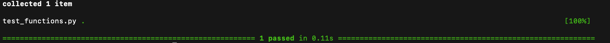
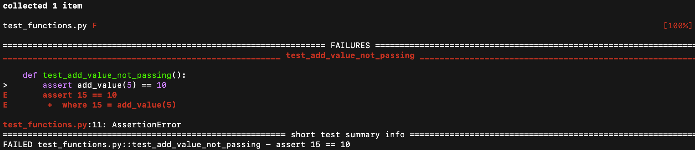
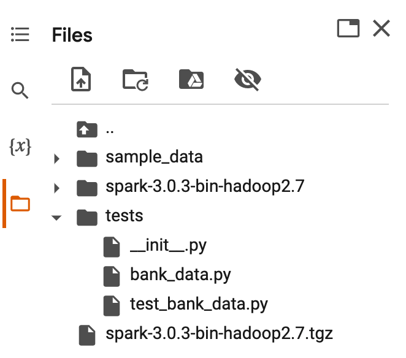
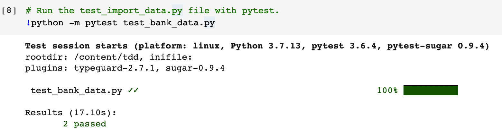
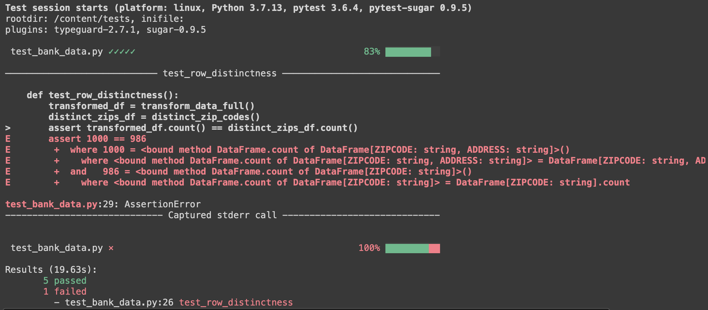

# Module 6, Lesson 1: PyTesting and Linters

## Lesson Overview

This week, students will learn about testing code using PyTest. First, they'll learn how to create a basic PyTest script using functions and run the test in the command line. Then, they'll learn to write and test code in Google Colab, where they will create a script to test PySpark and Spark SQL code. Next, they'll be shown how to write PyTest code to test an ETL pipeline. Finally, we will demonstrate why linters are beneficial and how to use them to write better code.

## Class Objectives

By the end of today's class, students will be able to:

* Explain why testing your code can be beneficial.
* Create basic PyTest functions to test your code.
* Write PyTest code tests against an ETL pipeline.
* Use code linters to find and fix issues and errors.

---

## Activity Outline

| Activity | Time |
| -- | -- |
| [1. Welcome](#Section1) | 5 minutes |
| [2. Testing with PyTest](#Section2) | 55 minutes |
| [3. PySpark Pipeline PyTesting](#Section3) | 50 minutes |
| [4. Break](#Section4) | 15 minutes |
| [5. Linting with PyLint](#Section5) | 50 minutes |
| [6. Review Objectives & End Class](#Section6) | 5 minutes |

---

## Instructor Prep

<details>
<summary><strong>🗒️ Instructor Notes</strong></summary>

* Today's lesson will focus on writing test cases using PyTest. Now, that the students are familiar with creating a data pipeline writing test cases against that pipeline is a very important step to ensure that the pipeline is working as it should end&mdash;to&mdash;end. 

* Students may question the importance of testing code, but this is one of those steps they don't want to miss.

* Students will need to shift their mindset slightly when writing code, as we will focus on writing test cases today.

* This unit will use some datasets and code that students may have used previously, but we will put a different twist on them in order to teach PyTest and Linters.

</details>

---

### </a> Slideshow

You can find the [PyTesting and Linters](https://docs.google.com/presentation/d/1OANF6E65Gk-AYJyLjHoU8J11PoCRvOQLS6vzFGSAmm4/edit?usp=sharing) slides for this lesson on Google Drive.

Remember that the slideshows are for instructor use only. To distribute slide content to the students, please export the slides to a PDF file. You can then send the PDF to the students.

---

## Activities

This module has four activities, which the following sections describe.

### 1. <a name="Section1"></a> Welcome (5 minutes)

<details>
  <summary><strong>📣 1.1 Instructor Do: Welcome Class (5 minutes)</strong></summary>

* Welcome the students and explain that today we will learn how to write tests against their code, and how to check for programming and stylistic errors and bugs in code using linters.

* In a previous module we learned to write a function to read a file into a DataFrame and then transform the data based on the requirements.  Today, the students will learn to write tests to make sure that the code, i.e., functions, does what it is supposed to do.

* Writing tests and using linters is a common practice among software developers. Tests help teams control the scope of each task assigned to a developer and allows them to write less code. It helps them save time looking over the code to find errors, and checks to make sure that other team members are doing their part in code development. Linters help developers and teams achieve a more readable, maintainable, and a consistent style of code to avoid stylistic errors and determine what is and is not code.

* Open the slides and welcome the students to class.

* For some of the activities, we'll revisit activities in previous modules to demonstrate the importance of testing code and using linters.

</details>

---


### 2. <a name="Section2"></a> Testing with PyTest (55 minutes)


<details><summary><strong>📣 2.1 Instructor Do: Introduction to Testing with PyTest (10 minutes)</strong></summary>
<br>

* Continue through the slides to present this activity to the class.

* Oftentimes in the development world, we will want to test our code to ensure that all of our components are working correctly. Testing our code allows us to test if, functionally, each component works as intended.

* Let the students know that in today’s lesson we'll be testing code by writing and executing functions.

* Ask students if they can think of  reasons for using functions to test code.

* After taking a couple answers, fill in any reasons they may have missed:
    * We can test any part of the code.
    * We can test for anything that code is supposed to do.
    * We can reuse components of our code as many times as we'd like, and therefore reduce the amount of times we are duplicating work.

* Share with students that they can make their tests as complex or as simple as they would like, but generally a good rule is to test each function that you develop.

#### PyTest

* Explain to students that there are multiple testing frameworks available to them, but this week will be focusing on PyTest.because it is one of the more popular code testing packages available for Python.

* PyTest allows us to be able to test simple functions all the way up to much more complex functions. For this class, we will just be getting acclimated with PyTest and won't be testing anything extremely complex.

* In this lesson, we’ll dive deeper into how we can test different pieces of code and how you can write your code in such a way that it is "testable."

* The PyTest module should have been installed during the Anaconda installation.  Have the students check to see that they have `pytest` installed by typing and running the following command, `pytest --version`. If it is not installed, install it using `pip install pytest`.

</details>

<details>
<summary><strong>📣 2.2 Instructor Do: Creating a PyTest Function (15 Minutes)</summary></strong>
<br>

* Continue through the slides to present this activity to the class.

* In this activity the students will learn how to write their first test to use on a function that adds two numbers which result in a specific value.

* Send out the following file:

* **File:**

    * [test_functions.py](Activities/01-Ins_PyTest_Function/Solved/test_functions.py)

* Open the `test_functions.py` file in VS Code and go over the following function with the students.

    ```python
    def add_value(int_value):
        return int_value + 10
    ```

    * The `add_value()` function above takes the `int_value` parameter, which is a number, then the function will add 10 to the parameter and return the value back to the function.
    * For instance if our `int_value` was 100, the `add_value()`function would return a value of 110.

* We are going to write a few test functions here to demonstrate how we can test the `add_value()` function.

* Walk students through the following demonstration:

    * The first function that we will write to test the `add_value()` function is `test_add_value_passing()`.

    * Just like all Python functions, we’ll define it first.

        ```python
        def test_add_value_passing():
        ```

    * Point out that it is a best practice to name the testing function by prepending `test_` to the original function name, and appending `_passing` to the end of the function to indicate that the function should pass.

    * Next we create the function body.

        ```python
        def test_add_value_passing():
            assert add_value(5) == 15
        ```

    * Point out that PyTest uses the `assert` statement to evaluate a subsequent conditional statement.

    * Explain that when testing in PyTest, you can only get one of two results: the function either passes or it doesn’t. With the `assert` statement, we’re saying the condition we’re testing should be either `True` (it passes) or `False` (it fails). Therefore, your conditional statement should always be something that can be evaluated as `True` or `False`.
        * For example, we could say `assert 1=1` and PyTest would evaluate that as `True`.
        * We can also say `assert 1=2` and PyTest would evaluate that as `False`.
        * In our case, we’re asking PyTest "Is it true that when we input the integer 5 into `add_value()`function, a value of 15 is returned (since 5 + 10 = 15)?"

* Next, demonstrate to the students how to test the `add_value()` function using the `test_add_value_passing()` function.
    * On the computer navigate to the folder containing the `test_functions.py` file, then type and run the following command, `pytest test_functions.py`, which is going to use the `pytest` module to execute the `test_functions.py` file.
    * **Note:** For students using Windows, have them navigate to the file using their Anaconda Prompt, and students using Mac have them navigate to the file using the terminal.

* Show students that the test passed.

    

* Explain that the second function we will write is `test_add_value_not_passing()`. This function will show a failing result. Doing this helps us ensure that our function doesn’t just pass when it should pass, it also fails when it should fail.

* Walk students through the following demonstration:
    * Comment out the code for the `test_add_value_passing()` function.
    * Add the `test_add_value_not_passing()` function to the `test_functions.py` file.
    * Inside the `test_add_value_not_passing()` function, we add the condition we believe should fail.

    ```python
    def test_add_value_not_passing():
        assert add_value(5) == 10
    ```

* Run the `test_add_value_not_passing()` function using the same command `pytest test_functions.py`.

    * Show students that this test failed.

        

* Uncomment the `test_add_value_passing()` function and fix the assert statement by changing the `==` to `!=` and re-run this test suite.

* Your test suite should look like the following:

    ```python
    # Function to be tested
    def add_value(int_value):
        return int_value + 10

    # First test function that will assert that add_value(5) equals 15, this will pass
    def test_add_value_passing():
        assert add_value(5) == 15

    # Second test function that will assert that add_value(5) equals 10, this will fail
    def test_add_value_not_passing():
        assert add_value(5) != 10
    ```

* Show students that the test suite has two passing tests.

* Answer any questions before moving on.

</details>

<details>

<summary><strong>✏️ 2.3 Student Do: Hello PyTest (20 Minutes)</summary></strong>
<br>

In this activity, students are tasked with writing test functions against two functions provided in the starter code.

* **Files:**

    * [README.md](Activities/02-Stu_Hello_PyTest/README.md)

    * [test_functions.py](Activities/02-Stu_Hello_PyTest/Unsolved/test_hello_unsolved.py)

</details>

<details>

<summary><strong>⭐ 2.4 Review: PyTest Testing (10 minutes)</strong></summary>
<br>

* Continue with the slides, and review the activity.

* Send out [test_hello_solved.py](Activities/02-Stu_Hello_PyTest/Solved/test_hello_solved.py) to the students.

* Open `test_hello_solved.py`, and walk through the code with students.

    * Explain that `function_one()` accepts a value and makes sure it is a string with the `value: str` parameter. Then, it finds the length of the string, multiplies the length by five, and returns the value.

        ```python
        def function_one(value: str):
            return_value = len(value) * 5
            return return_value
        ```

    * Explain that `function_two()` also accepts a value as a string, then removes the "e" in a given string.

        ```python
        def function_two(value: str):
            return_value = value.replace('e', '')
            return return_value
        ```

* Next, show that the first test function, `test_function_one()`, will test if the length of the word `hello` multiplied by five equals 25.

    ```python
    def test_function_one():
        assert function_one("hello") == 25
    ```

* And, the second test function, `test_function_two()`, will test if the "e" is removed from "hello."

    ```python
    def test_function_two():
        assert function_two("hello") == 'hllo'
    ```

* Run the `test_hello_solved.py` function in the command line to show that both tests pass.

* Answer any questions before moving on.

</details>

---

### 3. <a name="Section3"></a> PySpark Pipeline PyTesting (50 minutes)

<details>
<summary><strong>📣 3.1 Instructor Do: Bank Data Testing (20 minutes) </strong></summary>
<br>

* **File:**

  * [Bank_Data_testing.ipynb](Activities/03-Ins_Bank_Data_Tests/Solved/Bank_Data_testing.ipynb)

* Send out `Bank_Data_testing.ipynb` so that any students who want to follow along with your demonstration can do so.

* Explain to students that we are going to run our PyTests in Google Colab.

* Remind the students that Google Colab is running the code on Google's cloud servers. When we build our test suite we are going to emulate how software developers test their code in an environment that contains all the necessary dependencies.

1.  Open `Bank_Data_testing.ipynb` in Colab.

2. Start by initializing your Spark session and connecting your Google Drive to the notebook.

   ```python
    # Activate Spark in our Colab notebook.
    import os
    # Find the latest version of spark 3.0  from http://www.apache.org/dist/spark/ and enter as the spark version
    # For example: 'spark-3.2.2'
    spark_version = 'spark-3.2.2'
    # spark_version = 'spark-3.<enter version>'
    os.environ['SPARK_VERSION']=spark_version

    # Install Spark and Java
    !apt-get update
    !apt-get install openjdk-11-jdk-headless -qq > /dev/null
    !wget -q http://www.apache.org/dist/spark/$SPARK_VERSION/$SPARK_VERSION-bin-hadoop3.2.tgz
    !tar xf $SPARK_VERSION-bin-hadoop3.2.tgz
    !pip install -q findspark

    # Set Environment Variables
    os.environ["JAVA_HOME"] = "/usr/lib/jvm/java-11-openjdk-amd64"
    os.environ["SPARK_HOME"] = f"/content/{spark_version}-bin-hadoop3.2"
   ```

3. Next, install `pytest` and `pytest-sugar`. `pytest-sugar` will make the output of our tests look nice.

    ```python
    # Install pytest and pytest-sugar to make our output look nice.
    !pip install -q pytest pytest-sugar
    ```

4. Then, we'll create a folder, `tests` in our content folder in Google drive with the following code:

    ```python
    # Create and navigate to the tests directory.
    from pathlib import Path
    if Path.cwd().name != 'tests':
        %mkdir tests
        %cd tests
    # Show the current working directory.
    %pwd
    ```

5. Then, we'll write a `__init__.py` file to the `tests` directory. This will allow us to run the test functions that we'll add to the directory.

    ```python
    # Create a  __init__.py file that will contain that will be used to run our functions.
    # This file will be stored in our pwd (/content/tests)
    %%file __init__.py
    pass
    ```

6. Next, we'll create a `bank_data.py` file that will contain the code we want to test and store it in our `tests` folder. We are doing this because PyTest requires a file for testing.

    ```python
    # Create a bank_data.py file that will contain the import_data function.
    # This file will be stored in our pwd (/content/tests).
    %%file bank_data.py
    ```

7. Then, we'll import `findspark()`, other dependencies, and run the `import_data()` function that imports our `zip_bank_data.csv` file from a S3 bucket.

    ```python
    # Import findspark() and initialize.
    import findspark
    findspark.init()

    # Import other dependencies.
    from pyspark import SparkFiles
    from pyspark.sql import SparkSession
    spark = SparkSession.builder.appName("sparkBankData").getOrCreate()

    # Create the import_data function.
    def import_data():
        url = "https://2u-data-curriculum-team.s3.amazonaws.com/nflx-data-science-adv/week-6/zip_bank_data.csv"
        spark.sparkContext.addFile(url)
        df = spark.read.csv(SparkFiles.get("zip_bank_data.csv"), sep=",", header=True)
        df.createOrReplaceTempView('zip_bank_data')

        return df
    ```

8. In the next cell create a `test_bank_data.py` file to hold our two test functions in the `tests` folder, and then import the `import_data()` function from the `bank_data.py` file.

    ```python
    # Create a test_bank_data.py file that will contain the the two test functions.
    # This file will be stored in our pwd (/content/tdd).
    %%file test_bank_data.py

    # From the bank_data.py file and import the import_data function.
    from bank_data import import_data
    ```
9. Finally, we'll add our two test functions. One that tests that there are 1000 rows, and one that test that there are 9 columns.

    ```python
    def test_row_count_before_transform():
        df = import_data()
        assert df.count() == 1000

    def test_column_count_before_transform():
        df = import_data()
        assert len(df.columns) == 9
    ```

10. After entering these functions, pause to check for understanding. Ask students to walk you through each example. What is each part of the function doing?

    * Take the time to address and correct misconceptions.

11. After running the test suite,  show the students that the tests folder we created in step 4 contains three files.

    

    * Let the students know that they can check the contents of these files by double-clicking on them.


12. In the final cell, we'll run the `test_bank_data.py` file using `pytest`.

    ```python
    # Run the test_import_data.py file with pytest.
    !python -m pytest test_bank_data.py
    ```

    * The output of this should return that two tests have passed.

        


13. Tell the students: Now that we've tested the first two functions, let's transform our data slightly and see how that impacts our test functions.

    * Below the `import_data()` function, uncomment the `transform_data()` function. This function is going to return only the first 10 rows of data from the "ZIPCODE" and "ADDRESS" columns.

        ```python
        def transform_data():
        transformed_df = spark.sql("""
        SELECT
            ZIPCODE,
            ADDRESS
        FROM ZIP_BANK_DATA
        LIMIT 10
        """)

        return transformed_df
        ```

    * Explain to students that since the `transform_data()` function is changing the number of columns and rows in our original dataset, we can use the _not equal_ operator to ensure that our dataset has actually been transformed.


        ```python
        def test_row_count_after_transform():
        df = transform_data()
        assert df.count() != 1000

        def test_column_count_after_transform():
            df = transform_data()
            assert len(df.columns) != 9
        ```

    * Ask the students how they would change the test functions to make sure that the tests pass?

    * After fielding answers, uncomment the following functions in our test suite.

    * **Important:** Make sure to import the `transform_data` function before running the test suite, or you will get a `NameError` and the `def test_row_count_after_transform()` and `def test_column_count_after_transform()` functions will fail.

    * After executing the test suite, and running the `pytest`, we now have four tests that have passed.

14. Next, check to see what columns are in our transformed DataFrame.

    * Point out that since we are only selecting "ZIPCODE" and "ADDRESS", we can use `df.schema.names` to return the columns in DataFrame in a list. Then, we'll use the `assert` operator to ensure that our columns in our DataFrame equal `['ZIPCODE', 'ADDRESS']`.

    * In the test suite, uncomment the `test_columns_in_transformed_df()` function test and run the `pytest` again.

    ```python
    def test_columns_in_transformed_df():
        df = transform_data()
        assert df.schema.names == ['ZIPCODE', 'ADDRESS']
    ```

    * When we run the PyTest, our output shows that we have five tests that have passed.

15. Now let’s say we want to ensure that specific zip codes have been included in our dataset. We can create one more function to test that.

    * Uncomment the `transform_data_full()` and the `distinct_zip_codes()` functions below the `transform_data()` function. Explain that we look for these distinct zip codes using the following code and rerun the cell.

    ```python
    def transform_data_full():
    transformed_df = spark.sql("""
    SELECT
        ZIPCODE,
        ADDRESS
    FROM ZIP_BANK_DATA
    """)

    return transformed_df


    def distinct_zip_codes():
    distinct_zips = spark.sql("""
    SELECT DISTINCT
        ZIPCODE
    FROM ZIP_BANK_DATA
    """)

    return distinct_zips
    ```

    * Now that we have our distinct zip codes, we can compare this information to the original DataFrame to see if it has distinct rows or if there are duplicates.

    * In the test suite, uncomment `test_row_distinctness()` function as the following code shows:

    ```python
    def test_row_distinctness():
        transformed_df = transform_data_full()
        distinct_zips_df = distinct_zip_codes()
        assert transformed_df.count() == distinct_zips_df.count()
    ```

    * **Important:** Make sure to import the `transform_data_full` and `distinct_zip_codes` functions before running the test suite.

    * Rerun the test suite and run the PyTest. Point out that five test have passed and one has failed. The test that failed let's us know that there are 14 duplicate rows in the DataFrame.

    * Let the students know that they would investigate further look into those rows or remove them.

    

* Now that students have seen a working example of tests against PySpark functions, they will get an opportunity to practice it themselves.

* Answer any questions before moving on.

</details>

<details>
<summary><strong>🎉 3.2 Everyone Do: Heart Health Testing (30 minutes)</summary></strong>
<br>

In this activity, students will be writing PyTests on the transformation of a heart health dataset.

* **Files:**

    * [README.md](Activities/04-Stu_Heart_Health_Testing/README.md)

    * [Heart_Health_unsolved.ipynb](Activities/04-Stu_Heart_Health_Testing/Unsolved/Heart_Health_unsolved.ipynb)


* Start by opening the `Heart_Health_unsolved.ipynb` in Colab and have the students code along.

* Remind students that the objective is to test two different PySpark transformation functions.

* Have the students install and import Spark and other dependencies, and create the `__init__.py` file.

* Next, import the data into PySpark using the `import_data()` function, which will create a new temporary view called `HEART_HEALTH` we will use to query for our transformations.

    ```python
    def import_data():
        url = "https://2u-data-curriculum-team.s3.amazonaws.com/nflx-data-science-adv/week-6/heart_health.csv"
        spark.sparkContext.addFile(url)
        df = spark.read.csv(SparkFiles.get("heart_health.csv"), sep=",", header=True)
        df.createOrReplaceTempView('HEART_HEALTH')

        return df
    ```

* In the next cell, add the first test function, `test_row_count_source()`. Point out to the students that this function may look somewhat trivial at first, it is very important to understand what is happening here. This function is the first call to the `import_data()` function. Without this call to import the data, the transformation functions would not work at all.

    ```python
    def test_row_count_source():
        df = import_data()
        assert df.count() == 799
    ```

* We'll also test how many columns are in the source dataset by using the `test_column_count_source()` function.

    ```python
    def test_column_count_source():
        df = import_data()
        assert len(df.columns) == 9
    ```

* Have the students execute the test suite and PyTest. The output should indicate that two tests have passed.

* Answer any questions before moving on.

* Next, let the student's know that we'll transform the data. First, we'll add the `get_states()` function after the `test_column_count_source()` function.  The `get_states()` function will get the distinct states in the `HEALTH_HEALTH` temporary table.

    ```python
    def get_states():
        transformed_df = spark.sql("""
        SELECT DISTINCT
            STATE
        FROM HEART_HEALTH
        """)

        return transformed_df
    ```

* In our test suite we'll create a ``test_get_states()` function to ensure that we are only getting the "STATE" column returned.

    ```python
    def test_get_states():
        df = get_states()
        assert df.schema.names == ['STATE']
    ```

* And, we can also test that we are only getting five distinct states back after the transformation.

    ```python
    def test_row_count_get_states():
        df = get_states()
        assert df.count() == 5
    ```

* Remind the students to import the `get_states` function before running the test suite.

* Have the students execute the `get_states()` function, the test suite, and PyTest. The output should indicate that four tests have passed.

* Answer any questions before moving on.

* Next, mention to the students we are going transform our data to retrieve only the states with an average death rate over 400. Add, `get_states_with_above_avg_death_rate()` function below the `get_states()` function.

    ```python
    def get_states_with_above_avg_death_rate():
        transformed_df = spark.sql("""
        SELECT
            STATE,
            AVG(Death_Rate)
        FROM HEART_HEALTH
        GROUP BY STATE
        HAVING AVG(Death_Rate) > 400
        """)

        return transformed_df
    ```

* In our test suite, we'll test to see if the column count and the row count of the transformation above using these two functions.

    ```python
    def test_row_count_avg_death_rate():
        df = get_states_with_above_avg_death_rate()
        assert df.count() == 5


    def test_column_count_avg_death_rate():
        df = get_states_with_above_avg_death_rate()
        assert len(df.columns) == 2
    ```

* And, we'll write one more test to see if any states were removed because they had death rate lower than 400 using the `test_get_states_vs_avg_death_rate_count()` function.

    ```python
    def test_get_states_vs_avg_death_rate_count():
        df_get_states = get_states()
        df_avg_death_rate = get_states_with_above_avg_death_rate()
        assert df_get_states.count() == df_avg_death_rate.count()
    ```

* Remind the students to import the `get_states_with_above_avg_death_rate` function before running the test suite.

* Have the students execute the `test_row_count_avg_death_rate()` and the `test_column_count_avg_death_rate()` functions, the test suite, and PyTest. The output should indicate that four seven tests have passed.

* Answer any questions before moving on.

</details>

---

### 4. <a name="Section4"></a> Break (15 minutes)

---

### 5. <a name="Section5"></a> Linting with PyLint (50 minutes)


<details>
<summary><strong>📣 5.1 Instructor Do: Bank Data Linters (25 minutes) </strong></summary>
<br>

* **File:**

  * [Bank_Data_Pylint_solved.ipynb](Activities/05-Ins_Bank_Data_Linters/Solved/Bank_Data_Pylint_solved.ipynb)

* Send out `Bank_Data_Pylint_solved.ipynb` so that any students who want to follow along with your demonstration can do so.

* Explain to students that we will next be looking into ways that they can make their code more readable, maintainable, and have a consistent style to avoid stylistic errors, and ensure that their code will pass.

* One of the ways you can do this is by using a linter. A linter is a tool that helps us improve our overall code quality and make our code more readable to others.

* Explain to students that you can have two different types of linters&mdash;one is logical, the other is stylistic.

    * Logical linting looks at the logic of your code and determines if there is anything fundamentally incorrect.

    * Stylistic linting looks at the style of your code and determines if it meets a certain standard.

* When you use a linter, your code is ranked 0 through 10. The output from a linter will provide you with a warning, if you resolve them in the early stages you may avoid future errors.

    * **Note**: Generally speaking, most employers will have a linting system in Github to determine the quality of your code and can reject your code if it doesn't meet a certain standard. Generally, a score of over 7.0 is suitable.

* For this activity, you will use the `bank_data_testing.ipynb` file from a previous activity to practice using the PyLint linting suite.

1.  Open `Bank_Data_Pylint_solved.ipynb` in Colab.

2. Start by initializing your Spark session and connecting your Google Drive to the notebook.

3. Run all the code to transform the data.

4. Next, install PyLint by using the following command in Colab.

    ```python
    !pip install pylint
    ```

5. Next, run Pylint on the `bank_data.py` file that stored in the Google Drive using the following code:

    ```python
    !python -m pylint bank_data.py
    ```

     * The output returns a number of stylistic issues and import errors that can be corrected.

        ```text
        ************* Module tests.bank_data
        bank_data.py:2:36: C0303: Trailing whitespace (trailing-whitespace)
        bank_data.py:6:28: C0303: Trailing whitespace (trailing-whitespace)
        bank_data.py:11:34: C0303: Trailing whitespace (trailing-whitespace)
        bank_data.py:13:0: C0301: Line too long (105/100) (line-too-long)
        bank_data.py:13:0: W0311: Bad indentation. Found 2 spaces, expected 4 (bad-indentation)
        bank_data.py:14:0: W0311: Bad indentation. Found 2 spaces, expected 4 (bad-indentation)
        bank_data.py:15:0: W0311: Bad indentation. Found 2 spaces, expected 4 (bad-indentation)
        bank_data.py:16:0: W0311: Bad indentation. Found 2 spaces, expected 4 (bad-indentation)
        bank_data.py:18:0: W0311: Bad indentation. Found 2 spaces, expected 4 (bad-indentation)
        bank_data.py:48:0: C0304: Final newline missing (missing-final-newline)
        bank_data.py:1:0: C0114: Missing module docstring (missing-module-docstring)
        bank_data.py:7:0: E0401: Unable to import 'pyspark' (import-error)
        bank_data.py:7:0: C0413: Import "from pyspark import SparkFiles" should be placed at the top of the module (wrong-import-position)
        bank_data.py:8:0: E0401: Unable to import 'pyspark.sql' (import-error)
        bank_data.py:8:0: C0413: Import "from pyspark.sql import SparkSession" should be placed at the top of the module (wrong-import-position)
        bank_data.py:12:0: C0116: Missing function or method docstring (missing-function-docstring)
        bank_data.py:15:2: C0103: Variable name "df" doesn't conform to snake_case naming style (invalid-name)
        bank_data.py:20:0: C0116: Missing function or method docstring (missing-function-docstring)
        bank_data.py:31:0: C0116: Missing function or method docstring (missing-function-docstring)
        bank_data.py:41:0: C0116: Missing function or method docstring (missing-function-docstring)

        -----------------------------------
        Your code has been rated at 0.00/10
        ```

    * Take some time to go over the following parts of the output.
        * The first part is the file name, `bank_data.py`.
        * After the file name is the line and the space where the issue is located. `2:36` refers to the 36th space on the line 2.
        * Next, is the Pylint code number, `C0303`, followed by the message error, `Trailing whitespace (trailing-whitespace)`.

    * Send out the [PyLint documentation link](https://pylint.pycqa.org/en/latest/index.html) so the students can search for the code issue and find out how to fix them.

6. Next, open the [bank_data.py](Activities/05-Ins_Bank_Data_Linters/Solved/bank_data.py) file in VS Code. Or, you can download the `bank_data.py` from your Google Drive and open it up in VS Code.

    * Show the students that the first issue in the `bank_data.py` file is a trailing whitespace after the `# Import findspark() and initialize.`, which is the 36th space on line 2.

    * Point out that many of the issues are stylistic issues and should be easy to fix. However, the issue on line 13, `Line too long (105/100) (line-too-long)` is referring to the URL. Although we can't fix this issue, we can silence it.

7. First, fix the all the trailing whitespace errors and indentation errors in the Colab Jupyter notebook.

8. Next, show the students how to silence the `Line too long (105/100) (line-too-long)` error.

    * Add `# pylint: disable=C0301` just before `# Create the import_data function.`

        ```python
        # pylint: disable=C0301
        ## Create the import_data function.
        def import_data():
        ```

    * Then, rename the original DataFrame `bank_data_df` instead of `df`.

9. Rerun all the code in the cell where you fixed the issues and rerun `pylint` on the `bank_data.py` file.

    * The output says our code was rated at 1.00 and shows fewer issues.

        ```text
        ************* Module tests.bank_data
        bank_data.py:47:0: C0304: Final newline missing (missing-final-newline)
        bank_data.py:1:0: C0114: Missing module docstring (missing-module-docstring)
        bank_data.py:7:0: E0401: Unable to import 'pyspark' (import-error)
        bank_data.py:7:0: C0413: Import "from pyspark import SparkFiles" should be placed at the top of the module (wrong-import-position)
        bank_data.py:8:0: E0401: Unable to import 'pyspark.sql' (import-error)
        bank_data.py:8:0: C0413: Import "from pyspark.sql import SparkSession" should be placed at the top of the module (wrong-import-position)
        bank_data.py:12:0: C0116: Missing function or method docstring (missing-function-docstring)
        bank_data.py:19:0: C0116: Missing function or method docstring (missing-function-docstring)
        bank_data.py:30:0: C0116: Missing function or method docstring (missing-function-docstring)
        bank_data.py:40:0: C0116: Missing function or method docstring (missing-function-docstring)

        ------------------------------------------------------------------
        Your code has been rated at 1.00/10 (previous run: 0.00/10, +1.00)
        ```

10. Refresh the "tests" folder in your Google Drive and download the `bank_data.py` file and open up the file in VS Code to show the students where the issues are located.

11. Next, let's fix some more issues.

    * Let's start with the first issue, `Final newline missing (missing-final-newline)`. Ask students how they would fix this issue?
        * **Answer:** Add a newline at the end of the file.

    * In the Google Colab add a new line after `return distinct_zips`.

    * Next, fix the `Missing module docstring (missing-module-docstring)` issues at the beginning of the file by adding the following docstring comments the Google Drive file as the following code shows:

        ```python
        """Import the dependencies"""
        import findspark
        findspark.init()
        from pyspark import SparkFiles
        from pyspark.sql import SparkSession
        spark = SparkSession.builder.appName("sparkBankData").getOrCreate()
        ```

    * Next, we'll address all of the `C0116` issues. These are issues for all of our functions, so we'll add a docstring comment to our functions as the following code shows:
        * Explain to students that comments should be descriptive enough for someone to pick up your code and understand what the function accomplishes.

    ```python
        def import_data():
            """
            Imports data from S3.
            """
            url = "https://2u-data-curriculum-team.s3.amazonaws.com/nflx-data-science-adv/week-6/zip_bank_data.csv"
            spark.sparkContext.addFile(url)
            bank_data_df = spark.read.csv(SparkFiles.get("zip_bank_data.csv"), sep=",", header=True)
            bank_data_df.createOrReplaceTempView('zip_bank_data')
            return bank_data_df

        def transform_data():
            """
            Transforms the first 10 lines of the bank data
            """
            transformed_df = spark.sql("""
            SELECT
                ZIPCODE,
                ADDRESS
            FROM ZIP_BANK_DATA
            LIMIT 10
            """)
            return transformed_df

        def transform_data_full():
            """
            Transforms all of the bank data
            """
            transformed_df = spark.sql("""
            SELECT
                ZIPCODE,
                ADDRESS
            FROM ZIP_BANK_DATA
            """)
            return transformed_df

        def distinct_zip_codes():
            """
            Gets the distinct zip codes.
            """
            distinct_zips = spark.sql("""
            SELECT DISTINCT
                ZIPCODE
            FROM ZIP_BANK_DATA
            """)
            return distinct_zips

    ```

12. Rerun all the code in the cell where you fixed the issues and rerun `pylint` on the `bank_data.py` file.

    * The output says our code was rated at 4.00. Fixing the docstring issues really improved our overall score.

        ```text
        ************* Module tests.bank_data
        bank_data.py:5:0: E0401: Unable to import 'pyspark' (import-error)
        bank_data.py:5:0: C0413: Import "from pyspark import SparkFiles" should be placed at the top of the module (wrong-import-position)
        bank_data.py:6:0: E0401: Unable to import 'pyspark.sql' (import-error)
        bank_data.py:6:0: C0413: Import "from pyspark.sql import SparkSession" should be placed at the top of the module (wrong-import-position)

        ------------------------------------------------------------------
        Your code has been rated at 4.00/10 (previous run: 1.00/10, +3.00)
        ```

    * Finally, let's fix the final issues by disabling `(import-error)` and `(wrong-import-position)` issues as the following code shows:

        ```python
        from pyspark import SparkFiles # pylint: disable=E0401, C0413
        from pyspark.sql import SparkSession # pylint: disable=E0401, C0413
        ```

13. Rerun all the code in the cell where you fixed the issues and rerun `pylint` on the `bank_data.py` file.

    * Now, our code is rated `10.00/10`.

* Send out the final solution files to the students and answer any questions before moving on.

</details>

<details>
<summary><strong>✏️ 5.2 Student Do: Heart Health Linters (15 minutes)</summary></strong>
<br>

In this activity the students will look at the heart health code from a previous activity and make improvements so that it passes the linter.

* [README.md](Activities/06-Stu_Heart_Health_Linters/README.md)

* [Heart_Health_PyLint_unsolved.ipynb](Activities/06-Stu_Heart_Health_Linters/Unsolved/Heart_Health_PyLint_unsolved.ipynb)

</details>

<details>
    <summary><strong>⭐ 5.3 Review: Heart Health Linters (10 minutes)</summary></strong>
<br>

* Continue with the slides, and review the activity.

* Send out [Heart_Health_PyLint_solved.ipynb](Activities/06-Stu_Heart_Health_Linters/Solved/Heart_Health_PyLint_Solved.ipynb) to the students.

* Open `Heart_Health_PyLint_solved.ipynb`, and walk through the changes that were needed.

* Explain that the following issues were found in the code by PyLint:

    ```text
    heart_health.py:7:0: C0301: Line too long (106/100) (line-too-long)
    heart_health.py:72:0: C0304: Final newline missing (missing-final-newline)
    heart_health.py:1:0: C0114: Missing module docstring (missing-module-docstring)
    heart_health.py:1:0: E0401: Unable to import 'pyspark' (import-error)
    heart_health.py:2:0: E0401: Unable to import 'pyspark.sql' (import-error)
    heart_health.py:6:0: C0116: Missing function or method docstring (missing-function-docstring)
    heart_health.py:9:4: C0103: Variable name "df" doesn't conform to snake_case naming style (invalid-name)
    heart_health.py:14:0: C0116: Missing function or method docstring (missing-function-docstring)
    heart_health.py:24:0: C0116: Missing function or method docstring (missing-function-docstring)
    heart_health.py:37:0: C0116: Missing function or method docstring (missing-function-docstring)
    heart_health.py:38:4: C0103: Variable name "df" doesn't conform to snake_case naming style (invalid-name)
    heart_health.py:43:0: C0116: Missing function or method docstring (missing-function-docstring)
    heart_health.py:44:4: C0103: Variable name "df" doesn't conform to snake_case naming style (invalid-name)
    heart_health.py:48:0: C0116: Missing function or method docstring (missing-function-docstring)
    heart_health.py:49:4: C0103: Variable name "df" doesn't conform to snake_case naming style (invalid-name)
    heart_health.py:54:0: C0116: Missing function or method docstring (missing-function-docstring)
    heart_health.py:55:4: C0103: Variable name "df" doesn't conform to snake_case naming style (invalid-name)
    heart_health.py:59:0: C0116: Missing function or method docstring (missing-function-docstring)
    heart_health.py:60:4: C0103: Variable name "df" doesn't conform to snake_case naming style (invalid-name)
    heart_health.py:64:0: C0116: Missing function or method docstring (missing-function-docstring)
    heart_health.py:65:4: C0103: Variable name "df" doesn't conform to snake_case naming style (invalid-name)
    heart_health.py:69:0: C0116: Missing function or method docstring (missing-function-docstring)
    ```

* The student's should make the following corrections to resolve the linting issues and get a score of 10.00/10 for this code.

    * And the comment, `# pylint: disable=C0301` underneath the `def import_data()` function.

    * Add a new line to the end of the file.

    * Add a docstring at the top of the module and for each function.

    * Change the name of the `df` variable to something that has the snake_case to resolve the `Variable name "df" doesn't conform to snake_case naming style (invalid-name)` issue.

    * Add the comment `# pylint: disable=E0401, C0413` to ignore the `(import-error)`.

* Answer any questions before moving on.

</details>

- - -

### 6. <a name="Section6"></a> Review Objectives & End Class (5 minutes)

<details>
<summary><strong>📣 6.1 Instructor Do: Answer Questions (5 minutes)</strong></summary>
<br>

* Review today's objectives:

    * Explain why testing your code can be beneficial.

   * Create basic PyTest functions to test your code.

    * Write PyTest code tests against an ETL pipeline.

    * Use code linters to find and fix issues and errors.

Make sure to answer any lingering questions students may have.

</details>

---

Copyright 2022 2U. All Rights Reserved.
