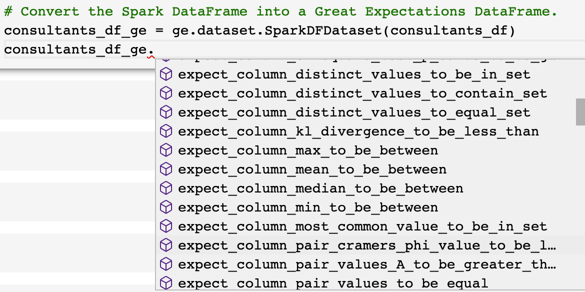
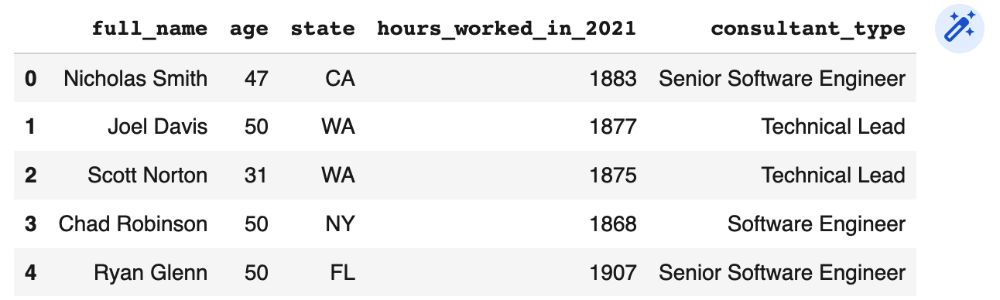
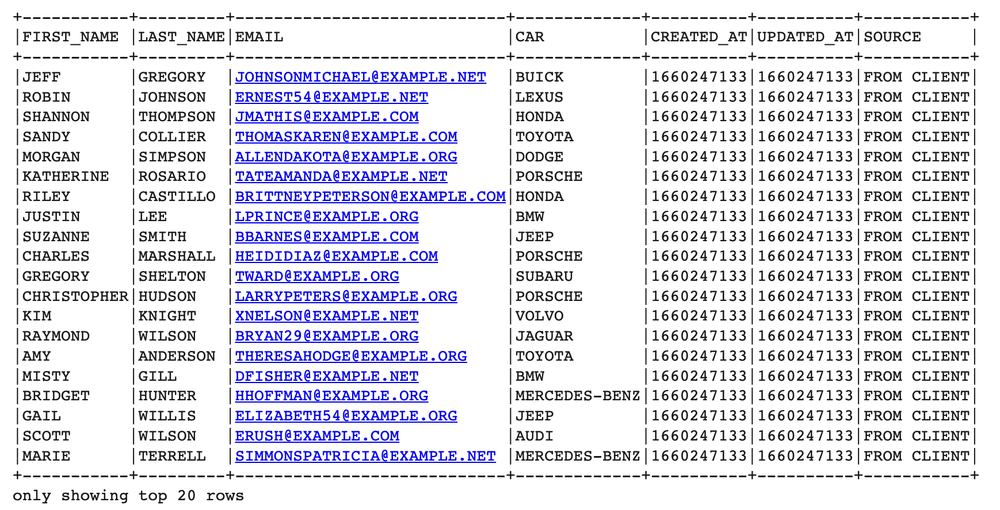

# Module 6, Lesson 2: Data Quality with PySpark

## Overview

Today's class will introduce the concept of data quality and using a data quality tool called Great Expectations. We will begin by explaining why data quality is important and what Great Expectations is. Once we are familiar with both of those, we'll start creating data quality tests using PySpark and Great Expectations. After that, we'll design and implement a data quality test with PySpark and then add data quality tests in a data pipeline.

## Class Objectives

By the end of today's class, students will be able to:

* Explain why having good data quality is important.

* Demonstrate how to create a Great Expectations data quality test.

* Identify when to add a data quality tests in code.

* Write a full data pipeline using Great Expectations.

## Activity Outline

| Topic | Time |
| -- | -- |
| [1. Welcome](#Section1) | 5 minutes |
| [2. Intro to Data Quality](#Section2) | 20 minutes |
| [3. Data Quality with Great Expectations](#Section3) | 45 minutes |
| [4. Break](#Section4) | 15 minutes |
| [5. Heart Health Transformation Quality Testing](#Section5) | 40 minutes |
| [6. Employee Great Expectations Pipeline](#Section6) | 45 minutes |
| [7. Review Module Objectives & Assessment](#Section7) | 10 minutes |


## Instructor Prep

<details>
<summary><strong>🗒️  Instructor Notes</strong></summary>

* Many organizations deal with large data quality issues, which can be preventable by taking a proactive approach to identifying and resolving the issues.

* Students that have enjoyed the SQL and PySpark lessons so far, should find this lesson to be both engaging and interesting. Students will flex their knowledge of both SQL and PySpark to resolve data quality issues using the data quality tool, Great Expectations. Explain to the students that if they can learn how to identify and resolve these data quality issues, it will be a differentiator in the marketplace.

* This lesson intends to extend what students have already learned in the previous PySpark week. We will combine our knowledge of data pipelines and PySpark to create data pipelines that check the quality of the data as it flows through the pipeline.


</details>

---

### </a> Slideshow

You can find the [Data Quality with PySpark](https://docs.google.com/presentation/d/1E1KNI18RnWJDJvYLqCF0sRMxQDYq9E7D7WXLszi7_hk/edit?usp=sharing) slides for this lesson on Google Drive.

Remember that the slideshows are for instructor use only. To distribute slide content to the students, please export the slides to a PDF file. You can then send the PDF to the students.

---

## Activities

This module has three activities, which the following sections describe.

### 1. <a name="Section1"></a> Welcome (5 minutes)

<details>
  <summary><strong>📣 1.1 Instructor Do: Welcome Class (5 minutes)</strong></summary>

* Open the slides, and welcome the students to class.

* Begin by reminding students that the previous lesson focused on testing and improving the quality of their code.  In today's lesson the students will learn how to test and improve the quality of their data using an industry standard tool, Great Expectations, which allows teams to write and execute tests against their data pipeline.

* We will revisit some of our previous activities and show how we can test the quality of those datasets as well as use new datasets that will help us learn how to test data quality.

* We are also going to create a full data pipeline with data quality tests.

</details>

---

### 2. <a name="Section2"></a> Intro to Data Quality (20 minutes)

<details><summary><strong>📣 2.1 Instructor Do: Introduction to Data Quality (10 minutes)</strong></summary>
<br>

* Ask students if they have any ideas for how a business might end up with lower-quality data. Pause to take some answers.

* Share one reason with students: oftentimes businesses will need to ingest data from various external sources. Here are a few to mention:

  * APIs such as social networking sites, financial, or operational.

  * Files from external vendors. For example, you work for a company and your HR provider needs to send you a report everyday of new employees for your data lake.

* The above examples represent a subsection of data that we don't have a lot of control over. Whoever is providing you the data controls the quality of those datasets.

  * Explain to students why this is important. As the saying goes, "Garbage in, garbage out." In other words, if you use poor quality data to gain insights, you’re likely to make poor quality decisions. So having clean data is critical if you want to be able to provide value to your stakeholders.

* Mention to students that data quality issues come in all shapes and sizes. Here are a few data quality issue examples to share with students:

  * **Incorrect data types**: you were expecting a list of zip codes as string values, but they arrived as integer values.

  * **Incorrect number of columns**: you were expecting the dataset to have the following columns;street, city, and state, but you received the following columns instead; street, city, state, and zip code.

  * **Incorrect order of columns**: you expected the dataset to have the following columns: street, city, state, but you received the following columns instead: city, state, and street.

  * **Incorrect number of rows expected** you expected to get over 1,000 rows, but you received less than 1,000.

* Data quality issues can affect specific business rules. For example, the business requires all states to be abbreviated, and if they are not, that could be a violation of the business rules the stakeholders agreed upon.

* Explain to students that while there are some issues that are out of our hands with data quality, there are steps we can take to prevent data of poor quality being processed and we can notify stakeholders of these sorts of issues when they hit a certain predetermined threshold.

</details>

<details><summary><strong>📣 2.2 Instructor Do: Introduction to Great Expectations (10 minutes)</strong></summary>
<br>

* Point out to the students that now we know what constitutes a data quality issue, let's discuss what tools we can use to fix them.

* There are a few different popular data quality tools out there, but the one we’re going to use today is Great Expectations. Explain what this tool is and why data teams use it:

  * Great Expectations is an open-source testing tool used by data engineering and data science teams to validate and document their data to maintain data quality and improve communication among team members.

  * It is popular and widely used because of its readable Python methods that can be used with Pandas and PySpark.

* Great Expectations contains built-in tests where teams can make assumptions about their data and prove or disprove their assumptions by using the tests. For example, if you are ingesting data and the columns are different, then you can make the business decision, or assertion, to reject or continue to ingesting the file.

  * These assertions are the "expectations" that one can use to test data quality. For example, we can assert that a "Date" column exists when we import data from an external source with the following code:

    ```python
    expect_column_to_exist('Date')
    ```

    * Point out to the students that we could write a PyTest to test that the schema has a "Date" column, but this test would be more time consuming.

* Another advantage of Great Expectations is that it provides you with a library of Expectations for testing data so that you don't need to think up your own. We will look at a handful these Expectations in today's activities.

* Let the students know that Great Expectations is often used on the command line or Jupyter Notebooks, but we'll be using Great Expectations with Google Colab and install it using `!pip install great_expectations`.

* Send students the link to [Great Expectations](https://greatexpectations.io) and the [Great Expectations tutorial](https://docs.greatexpectations.io/docs/tutorials/getting_started/tutorial_overview).

* Answer any questions before moving on.

</details>

---

### 3.<a name="Section3"></a> Data Quality with Great Expectations (45 minutes)

<details>
<summary><strong>📣 3.1 Instructor Do: Consultants Data Quality (20 Minutes)</summary></strong>
<br>

* **Files:**

  * [consultants.csv](Activities/01-Ins_GE_Consultants/Resources/consultants.csv).

* Continuing with the slides and lead the students through this activity.

* Explain to the students that we will practice using Great Expectations by testing the quality of the `consultants.csv` dataset that contains information on technical consultants who’ve worked on various projects for a company.

* We are going to test the following characteristics about this dataset:

  * The number of columns in the dataset.

  * The number of rows in the dataset.

  * The order of the columns in the dataset.

  * If the distinct values in a column are in a specific set.

* First, open [consultants.ipynb](Activities/01-Ins_GE_Consultants/Solved/consultants.ipynb) in Google Colab.

1. Begin by installing Spark and Java, set the environment variables, and initializing Spark.

2. Next, install great expectations.

    ```python
    !pip install great_expectations
    ```

3. Import `SparkSession` and `great_expectations`, then create and start a Spark session as the following code shows:

    ```python
    # Import SparkSession and great expectations
    from pyspark.sql import SparkSession
    import great_expectations as ge

    # Create a SparkSession
    spark = SparkSession.builder.appName("SparkSQL").getOrCreate()
    # Start Spark session
    from pyspark import SparkFiles
    ```

4. Next, upload the `consultants.csv` file to Google Drive and read the `consultants.csv` file into a DataFrame as the following code shows:

    ```python
    # Read the data into a DataFrame.
    consultants_df = spark.read.csv('/content/consultants.csv', sep=',', header=True)
    consultants_df.show()
    ```

5. Share with students that to work with Great Expectations, we'll need to convert the Spark `consultants_df` DataFrame into a Great Expectations DataFrame as the following code shows:

    ```python
    # Convert the Spark DataFrame into a Great Expectations DataFrame.
    consultants_df_ge = ge.dataset.SparkDFDataset(consultants_df)
    ```

    * Point out that we can see all the functions for Great Expectations DataFrame by adding a period after `consultants_df_ge` and pressing enter.

      

    * Let the students know that we'll be using some of these functions in today's lesson to test the quality of our data.

6. Select the `.head()` function to show the first five rows of the DataFrame.

      

7. Now that we've got the DataFrame created, let's create our first quality test! We’ll start by asserting that the number of columns in the dataset is "3" by using the following Expectations function, `expect_table_column_count_to_equal()`, as the following code shows:

    ```python
    # Test that there are 3 columns in the DataFrame.
    print(consultants_df_ge.expect_table_column_count_to_equal(3))
    ```

    * The output from running the code is a nested JSON object.

      ```text
      {
        "exception_info": {
          "raised_exception": false,
          "exception_traceback": null,
          "exception_message": null
        },
        "result": {
          "observed_value": 5
        },
        "success": false,
        "expectation_config": {
          "expectation_type": "expect_table_column_count_to_equal",
          "meta": {},
          "kwargs": {
            "value": 3,
            "result_format": "BASIC"
          }
        },
        "meta": {}
      }
      ```

   * Point out the how to determine if the test passed or failed by going over the following fields of the JSON object; `result`, `success`, and `expectations_config` keys.

      * The value associated with the `"result"` key is `"observed_value": 5` and tells us that the true number of columns is "5".

      * The value associated with the `"success"` key is `false` and tells us let's us that our expectation failed.

      * The value associated with the `"expectations_config"` key informs us of the test we ran `"expectation_type": "expect_table_column_count_to_equal"` and what value `"value": 3`, we used for the test.

  * Now change the number of columns to five so that our test passes as the following code shows:

    ```python
    print(consultants_df_ge.expect_table_column_count_to_equal(5))
    ```

   * When we execute our code the test passes.

      ```text
      {
        "result": {
          "observed_value": 5
        },
        "meta": {},
        "exception_info": {
          "raised_exception": false,
          "exception_traceback": null,
          "exception_message": null
        },
        "success": true,
        "expectation_config": {
          "expectation_type": "expect_table_column_count_to_equal",
          "kwargs": {
            "value": 5,
            "result_format": "BASIC"
          },
          "meta": {}
        }
      }
      ```

8. Next, we're going to test if the DataFrame has correct number of rows by using the `expect_table_row_count_to_equal()` Expectations function as the following code shows:

    ```python
    # Test that there are 8831 rows in the DataFrame.
    print(consultants_df_ge.expect_table_row_count_to_equal(8831))
    ```

   * The following output shows that this test passed.

    ```text
    {
        "result": {
          "observed_value": 8831
        },
        "meta": {},
        "exception_info": {
          "raised_exception": false,
          "exception_traceback": null,
          "exception_message": null
        },
        "success": true,
        "expectation_config": {
          "expectation_type": "expect_table_row_count_to_equal",
          "kwargs": {
            "value": 8831,
            "result_format": "BASIC"
          },
          "meta": {}
        }
      }
    ```

9. Next, run a test to determine if the columns are in the correct order using the Expectations function `expect_table_columns_to_match_ordered_list()`. We'll need to provide columns in the order in which they appear in the DataFrame in the form of a list as the argument as the following code shows:

    ```python
    # Test that the columns are in the correct order in the DataFrame.
    print(consultants_df_ge.expect_table_columns_to_match_ordered_list(['full_name',
                                                                        'age',
                                                                        'state',
                                                                        'hours_worked_in_2021',
                                                                        'consultant_type']))
    ```

    * The output from running the code indicates that our test passed because the columns are in the correct order.


10. Now, we are going to test that one of our columns, `consultant_type` contains specific values by using the Expectations function, `expect_column_values_to_be_in_set()` where the first argument is the column name, `consultant_type`, and the second argument is a list of values we expect that the column will contain as the following code shows:

    ```python
    # Test that the consultant_type column contains four job type values.
    print(consultants_df_ge.expect_column_values_to_be_in_set('consultant_type', ['Senior Software Engineer',
                                                                                  'Technical Lead',
                                                                                  'Software Engineer',
                                                                                  'Technical Architect']))
    ```

   * The output from running the code indicates that our test passed. If any of the columns did not have these job types then the test would have failed.

      ```text
        {
        "success": true,
        "meta": {},
        "exception_info": {
          "raised_exception": false,
          "exception_traceback": null,
          "exception_message": null
        },
        "expectation_config": {
          "meta": {},
          "kwargs": {
            "column": "consultant_type",
            "value_set": [
              "Senior Software Engineer",
              "Technical Lead",
              "Software Engineer",
              "Technical Architect"
            ],
            "result_format": "BASIC"
          },
          "expectation_type": "expect_column_values_to_be_in_set"
        },
        "result": {
          "element_count": 8831,
          "missing_count": 0,
          "missing_percent": 0.0,
          "unexpected_count": 0,
          "unexpected_percent": 0.0,
          "unexpected_percent_total": 0.0,
          "unexpected_percent_nonmissing": 0.0,
          "partial_unexpected_list": []
          }
        }
      ```

      * Point out that in the `"result"` JSON object we see more information than we have up to this point. This additional information tells us more about the quality of the data.

      * Go over the following parts of the `"result"` JSON object:
        * The row count, `"element_count"`, is 8,831.
        * The number of missing values, `"missing_count"`, is zero. If one or more rows had a missing value then this would be greater than zero.
        * The `"unexpected_count"` is zero. If a title had been misspelled in one or more rows then this would be greater than zero.
        * If the any rows didn't have a value then the `"missing_percent"` would be greater than zero.
        * If any rows had an unexpected count, then the `"unexpected_percent"` and `"unexpected_percent_total"` would be greater than zero, and the `"partial_unexpected_list"` would contain those unexpected values.

* Explain to students that they will have an opportunity to practice using Expectations in the next activity.

* Send out the [consultants.ipynb](Activities/01-Ins_GE_Consultants/Solved/consultants.ipynb) file to the students.

* Answer any questions before moving on.

</details>

<details>

<summary><strong>✏️ 3.2 Student Do: Student Testing Data in Great Expectations (15 Minutes)</summary></strong>
<br>

In this activity, the students will write Great Expectations tests against a dataset.

* **Files:**

   * [README.md](Activities/02-Stu_GE_Students/README.md)

   * [students.csv](Activities/02-Stu_GE_Students/Resources/students.csv)

   * [students_unsolved.py](Activities/02-Stu_GE_Students/Unsolved/students_unsolved.ipynb)


</details>

<details>

<summary><strong>⭐ 3.3 Review: Student Testing Data in Great Expectations (10 minutes)</strong></summary>
<br>

*  Send out the following solution file to the students:

  * [students_solved.ipynb](Activities/02-Stu_GE_Students/Solved/students_solved.ipynb)

* Continue with the slides, and review the activity.

* Open `students_solved.ipynb` in Colab, and then go through the code with the class while explaining the following:

  * A Great Expectations DataFrame is created as the following code shows:

    ```python
    # Convert the Spark DataFrame into a Great Expectations DataFrame.
    students_df_ge = ge.dataset.SparkDFDataset(students_df)
    students_df_ge.head()
    ```

  * We test that the Great Expectations DataFrame has the correct number of columns as the following code shows:

    ```python
    # Check that the DataFrame has the correct number of columns.
    print(students_df_ge.expect_table_column_count_to_equal(7))
    ```

  * We test that the Great Expectations DataFrame has the correct number of rows as the following code shows:

    ```python
    # Check that the DataFrame has the correct number of rows.
    print(students_df_ge.expect_table_row_count_to_equal(1000))
    ```

  * We test that the columns in the Great Expectations DataFrame are in the correct order using the `expect_table_columns_to_match_ordered_list` function as the following code shows:

    ```python
    # Test that the columns are in the order they are supposed to be.
    print(students_df_ge.expect_table_columns_to_match_ordered_list(['student_id',
                                                                    'student_name',
                                                                    'gender',
                                                                    'grade',
                                                                    'school_name',
                                                                    'reading_score',
                                                                    'math_score']))
    ```

* We test that the data in the "grade" column contains the following values "9th", "10th", "11th" using the `expect_column_values_to_be_in_set()` function as the following code shows:

    ```python
    # Test that the values in the grade column are in the set 9th, 10th, 11th, and 12th.
    print(students_df_ge.expect_column_values_to_be_in_set('grade', ['9th',
                                                                    '10th',
                                                                    '11th',
                                                                    '12th']))
    ```

* For the bonus, we can test that the "math_score" column datatype is an "InterType" using the `expect_column_values_to_be_of_type` function as the following code shows:

    ```python
    # Bonus: Test that the values in the math_score column are an integer datatype.
    print(students_df_ge.expect_column_values_to_be_of_type('math_score', 'IntegerType'))
    ```

* Answer any questions from students before moving on.

</details>

---

### 4. <a name="Section4"></a> Break (15 minutes)

---

### 5. <a name="Section5"></a> Heart Health Transformation Quality Testing (40 minutes)


<details>
<summary><strong>🎉 5.1 Everyone Do: Great Expectations Quality Test Placement (15 minutes) </strong></summary>
<br>

* **Files**

  * [README.md](Activities/03-Evr_GE_Org_Data/README.md)

  * [orgs.csv](Activities/03-Evr_GE_Org_Data/Resources/orgs.csv)

  * [org_data_unsolved.ipynb](Activities/03-Evr_GE_Org_Data/Unsolved/org_data_unsolved.ipynb)

* Continuing with the slides, lead the students through this activity.

* Explain that in this activity we will be focusing on where to implement data quality tests with Great Expectations.

  * Import `org_data_unsolved.ipynb` into Colab, import the dependencies, install Spark and Java, set the environment variables, and initialize Spark, and read in the `orgs.cvs` file into a Spark DataFrame.

  * Create a Great Expectations DataFrame.

    ```python
    # Create the Great Expectations DataFrame
    orgs_df_ge = ge.dataset.SparkDFDataset(orgs_df)
    orgs_df_ge.head()
    ```

    * Point out to the students that it is a best practice write test against the DataFrame after ingesting the data.

  * In the following code we are going to retrieve only the value from the `"success"` key for the Expectations of column and row count, and matching columns. This will determine if we should continue with any downstream transformation.


    ```python
    # Retrieve the values from the "success" fields for the column and row count and matching columns.
    result = []
    result.append(orgs_df_ge.expect_table_column_count_to_equal(8)['success'])
    result.append(orgs_df_ge.expect_table_row_count_to_equal(337)['success'])
    result.append(orgs_df_ge.expect_table_columns_to_match_ordered_list(['EIN',
                                                                  'ORGANIZATION',
                                                                  'TYPE',
                                                                  'ACTIVITY',
                                                                  'ASSET_AMOUNT',
                                                                  'INCOME_AMOUNT',
                                                                  'REVENUE_AMOUNT',
                                                                  'STATE'])['success'])
    print(result)
    ```

    * The output from running the code is `[True, True, True]`, which informs us that the column and row count, and matching columns are correct.

  * Next, explain to the students know that we are going to transform the data and run a test to make sure that the table columns match and the column "TYPE" contains the value `School Organization` in the transformed DataFrame.

    * To do so, we'll write a function that creates a temporary view, `orgs`, from the "orgs_df" DataFrame, create a transformed DataFrame from the temporary view by retrieving only the rows that contain the value, `School Organization`, from the "TYPE" column using Spark SQL, then we'll convert the transformed DataFrame into a Great Expectations DataFrame as the following code shows:

      ```python
      # Create a temporary view and transform the temporary view to retrieve only the "School Organization" values from the "TYPE" column.
      def transform_data():
          orgs_df.createOrReplaceTempView('orgs')

          transformed_df = spark.sql(
              """
              SELECT
                ORGANIZATION,
                TYPE,
                ACTIVITY,
                STATE
              FROM ORGS
              WHERE TYPE = 'School Organization'
              """
          )

          transformed_df = ge.dataset.SparkDFDataset(transformed_df)
          return transformed_df
      ```

  * Next, we'll write a conditional expression as the following code shows:
    * If the first tests failed, then the pipeline does not transform any data.

    * If the first test passed, then we call the `transform_data()` function and perform the following tests against the transformed DataFrame:
      * Test if the columns match an ordered list.
      * Test if the values from the "TYPE" column are `School Organization`.

    ```python
    # Run tests against the transformed DataFrame if the column and row count,
    # and matching columns are correct in the original DataFrame.
    if False in result:
      print("Failed")
    else:
      transformed_df = transform_data()
      transformed_result = []
      transformed_result.append(transformed_df.expect_table_columns_to_match_ordered_list(['ORGANIZATION',
                                                                                          'TYPE',
                                                                                          'ACTIVITY',
                                                                                          'STATE'])['success'])
      transformed_result.append(transformed_df.expect_column_values_to_be_in_set('TYPE', ['School Organization'])['success'])

    ```

    * Point out that if the column and row count, and matching columns were incorrect in the original DataFrame then the data would not be transformed. However, we know that the values in the `result` list are `[True, True, True]`, which means we can test that the transformed DataFrame columns will match an ordered list, and the values in the "TYPE" column are `School Organization`.

  * Finally, we determine if the transformation passed or failed using a conditional expression as the following code shows:

    ```python
    # Determine if the transformation passed or failed.
    if False in transformed_result:
      print('Failed')
    else:
      print('success')
    ```

    * The output tells us that transformation was a success.

* Answer any questions before moving on.

</details>

<details>
<summary><strong>✏️ 5.2 Student Do: Heart Health Great Expectations Tests (15 minutes)</summary></strong>
<br>

In this activity, students are will be writing Great Expectations tests against the Heart Health dataset and a transformed version of the dataset.

* **Files:**

  * [README.md](Activities/04-Stu_GE_Heart_Health/README.md)

  * [heart_health.csv](Activities/04-Stu_GE_Heart_Health/Resources/heart_health.csv)

  * [GE_heart_health_unsolved.ipynb](Activities/04-Stu_GE_Heart_Health/Unsolved/GE_heart_health_unsolved.ipynb)


</details>

<details>
    <summary><strong>⭐ 5.3 Review: Heart Health Great Expectations Test (10 minutes)</summary></strong>
<br>

*  Send out the following solution file to the students:

  * [GE_heart_health_solved.ipynb](Activities/04-Stu_GE_Heart_Health/Solved/GE_heart_health_solved.ipynb)

* Continue with the slides, and review the activity.

* Open `GE_heart_health_solved.ipynb` in Colab and import all the packages, upload the `heart_health.csv` file, and read the data into a Spark DataFrame, then go through the rest of the code with the class while explaining the following:

  * First we create a Great Expectations DataFrame as the following code shows:

    ```python
    # Create the Great Expectations DataFrame
    heart_health_df_ge = ge.dataset.SparkDFDataset(heart_health_df)
    heart_health_df_ge.head()
    ```


  * Next, we retrieve the values from the `"success"` fields using the Expectations that the row count is equal to 799, and that the "State" column contains the following values, `New York', 'Texas', 'California', 'Ohio', 'Washington'` as the following code shows:

    ```python
    # Retrieve the "success" fields for the column and row count.
    result = []
    result.append(heart_health_df_ge.expect_table_row_count_to_equal(799)['success'])
    result.append(heart_health_df_ge.expect_column_values_to_be_in_set('State', ['New York',
                                                                          'Texas',
                                                                          'California',
                                                                          'Ohio',
                                                                          'Washington'])['success'])
    print(result)
    ```

  * In our function to transform the original "heart_health_df" DataFrame, we create a temporary view, `'heart_health'` and then select the "State" and "LocationDesc" columns where the state is `'New York'` as the following code shows:

    ```python
    # Transform the heart_health_df DataFrame and retrieve the "State" and "LocationDesc" columns where the state is `'New York'.
    def transform_data():
      heart_health_df.createOrReplaceTempView('heart_health')

      transformed_df = spark.sql(
          """
          SELECT
            State,
            LocationDesc
          FROM heart_health
          WHERE State = 'New York'
          """
      )

      transformed_df = ge.dataset.SparkDFDataset(transformed_df)
      return transformed_df
    ```

  * Finally, explain to students that the last code block allows us to drive if the pipeline completes or not. By having data quality tests throughout the pipeline we can stop the pipeline if quality degrades at a specific point. Remind students that there is no right or wrong way to create data quality tests, the more the better though.

    ```python
    # Run tests against the transformed DataFrame if the column and row count are correct in the original DataFrame.
    if False in result:
      print("Failed")
    else:
      transformed_df = transform_data()
      transformed_result = []
      transformed_result.append(transformed_df.expect_column_values_to_be_in_set('State', ['New York'])['success'])
      transformed_result.append(transformed_df.expect_column_values_to_not_be_in_set('State', ['Texas', 'California', 'Ohio', 'Washington']))
      transformed_result.append(transformed_df.expect_table_row_count_to_be_between(1, 500))

      if False in transformed_result:
        print('Failed')
      else:
        print('success')
    ```

* Answer any questions the student might have before moving on.

</details>

- - -

### 6. <a name="Section6"></a> Employee Great Expectations Pipeline (45 minutes)

<details>
<summary><strong>📣 6.1 Instructor Do: Cleaning Up Customer Data (15 minutes) </strong></summary>
<br>

* **Files:**

  * [customer_data.csv](Activities/05-Ins_GE_Customer_Data/Resources/customer_data.csv)

  * [customers.ipynb](Activities/05-Ins_GE_Customer_Data/Solved/customers.ipynb)

* Continuing with the slides and lead the students through this activity.

* In the previous activities we learned how to direct the actions of a data pipeline using the results of data quality tests. Now we’ll learn the next step; figuring out what we can do with records that need to be fixed before we push them to a database table.

* Start by opening the [customers.ipynb](Activities/05-Ins_GE_Customer_Data/Solved/customers.ipynb) notebook and walk students through the code.

* After reading the Spark DataFrame it into a Great Expectations DataFrame, we'll write a test to determine that each column doesn't contain null value as the following code shows:

  ```python
  # Test that each column doesn't contain null values.
  for column in ['id', 'first_name', 'last_name', 'email', 'car']:
    print(customer_df_ge.expect_column_values_to_not_be_null(column=column)['success'])
  ```

  * The output from running the code informs us that the "email" and "car" columns contain null values, since the Boolean value for these columns is `False`

    ```text
    True
    True
    True
    False
    False
    ```

* Next, we'll write a function that removes the null values from a temporary view and saves the null values to a parquet file as the following code shows:

  ```python
    # Use a function to remove the null values from a temporary view and saves them to a parquet file.
    def separate_nulls():
      # Create a temporary view
      customer_df.createOrReplaceTempView('customers')
      # Use Spark SQL to retrieve all the null values form the temporary view.
      transformed_df = spark.sql(
          """
          SELECT
            *
          FROM customers
          WHERE car IS NULL OR email IS NULL
          """
      )
      # Add the null values to a new temporary view that we'll reference later.
      transformed_df.createOrReplaceTempView('removed_customers')
      # Write the null values to a parquet file.
      transformed_df.write.mode("overwrite").parquet("customers_null_car_or_email")
      print("Null values have been found and written to a temporary view, `removed_customers` and a parquet file,'customers_null_car_or_email'.")
    ```

  * Take a moment to review each part of the `separate_nulls()` function and check for understanding.
    * First, we create a temporary view, `customers`.
    * Using Spark SQL we select all the data where there are null values in the "email" and "car" columns and save the results to the "transformed_df" DataFrame.
    * Next, we write the data in the "transformed_df" DataFrame to a second temporary view. `removed_customers`.
    * And, we write the data in the "transformed_df" DataFrame to a parquet file in case we need to use the data for further analysis.
    * Finally, we add a print statement that to let others know where the data in the "transformed_df" DataFrame is located.

* Now we can use the `separate_nulls()` function to clean our data.

* Now, we'll write tests to verify that the "email" and "car" columns in the original Great Expectations DataFrame do not have null values. If the tests fail, then we'll call the `separate_nulls()` function to clean the Spark DataFrame as the following code shows:

  ```python
  # Retrieve the "success" fields for the "email" and "car" columns.
  result = []
  result.append(customer_df_ge.expect_column_values_to_not_be_null('email')['success'])
  result.append(customer_df_ge.expect_column_values_to_not_be_null('car')['success'])
  # If the "success" results are False then call the separate_null() function.
  # If there are no null values print "success".
  if False in result:
    separate_nulls()
  else:
    print("success")
  ```

* Next, we'll create a function to transform the `customers` temporary view for all the "ids" that are not in the `removed_customers` temporary view as the following code shows:

  ```python
    # Use a function to transform the customers temporary view if the id not in the removed_customers.temporary view.
    def transform_data():
      transformed_df = spark.sql(
          """
          SELECT
            UPPER(first_name) AS FIRST_NAME,
            UPPER(last_name) AS LAST_NAME,
            UPPER(email) AS EMAIL,
            UPPER(car) AS CAR,
            UNIX_TIMESTAMP() AS CREATED_AT,
            UNIX_TIMESTAMP() AS UPDATED_AT,
            'FROM CLIENT' AS SOURCE
          FROM customers
          WHERE id not in (select id from removed_customers)
          """
      )
      return transformed_df
  ```

  * Take a moment to review the Spark SQL code for the `transform_data()` function:
    * All the column names will be changed to uppercase.
    * A new column, "CREATED_AT", is created that contains a UNIX timestamp when the DataFrame was created.
    * A second new column, "UPDATED_AT", is created that contains a UNIX timestamp when the DataFrame was updated, which will be the same time as the "UPDATED_AT" column. If any columns need to be modified then the timestamp will need to be changed as well.
    * A third new column, "SOURCE", is created that contains the source of the data, which is the client.

  * Share with students that it is good practice to include metadata fields when ingesting data so that they can keep track of the source and when it was ingested or modified.

* Now, we call the `transform_data()` function and then convert the DataFrame to a Great Expectations DataFrame and retrieve the "success" field where there are no null values in the "EMAIL", "CAR", "CREATED_AT", "UPDATED_AT", and "SOURCE" columns. If there are no null values then we'll write the transformed data to a parquet file as the following code shows:

  ```python
  # Call the transformation function and convert the transformed DataFrame into a Great Expectations DataFrame
  transformed_df = transform_data()
  transformed_df_ge = ge.dataset.SparkDFDataset(transformed_df)
  # Retrieve the "success" fields for the all the modified columns in the transformed DataFrame.
  transformed_result = []
  transformed_result.append(transformed_df_ge.expect_column_values_to_not_be_null('EMAIL')['success'])
  transformed_result.append(transformed_df_ge.expect_column_values_to_not_be_null('CAR')['success'])
  transformed_result.append(transformed_df_ge.expect_column_values_to_not_be_null('CREATED_AT')['success'])
  transformed_result.append(transformed_df_ge.expect_column_values_to_not_be_null('UPDATED_AT')['success'])
  transformed_result.append(transformed_df_ge.expect_column_values_to_not_be_null('source')['success'])
  # If the "success" field is 'False' print "Failed", if not then write the transformed DataFrame to a parquet file.
  if False in transformed_result:
    print('Failed')
  else:
    transformed_df.write.mode("overwrite").parquet("customers")
    print("Success: Wrote the transformed data to a parquet file, 'customers'.")
  ```
  * Point out that we could also write the results to any type of file or SQL database.

* For the last step, check that the parquet file, `customers`, contains the transformed data.

  ```python
  # Read in our customers parquet data
  customers_p_df=spark.read.parquet('customers')
  customers_p_df.show(truncate=False)
  ```

    

* Send out the [customers.ipynb](Activities/05-Ins_GE_Customer_Data/Solved/customers.ipynb) file to the students.

* Share with students that they will have the opportunity to practice these sorts of pipelines in the next activity.

* Answer any questions before moving on.

</details>

<details>
<summary><strong>👥 6.2 Groups Do: Employee Great Expectations Pipeline (20 minutes)</summary></strong>
<br>

In this activity, the students will work in groups of two or three and create a data pipeline that removes the null values and transforms the data to include metadata.

* **Files:**

  * [README.md](Activities/06-Grp_Employee_GE_Pipeline/README.md)

  * [attrition.csv](Activities/06-Grp_Employee_GE_Pipeline/Resources/attrition.csv)

  * [GE_attrition_solved.ipynb](Activities/06-Grp_Employee_GE_Pipeline/Unsolved/GE_attrition_unsolved.ipynb)


</details>

<details>
    <summary><strong>⭐ 6.3 Review: Employee Great Expectations Pipeline(10 minutes)</summary></strong>
<br>

*  Send out the following solution file to the students:

  * [GE_attrition_solved.ipynb](Activities/06-Grp_Employee_GE_Pipeline/Solved/GE_attrition_solved.ipynb)

* Continue with the slides, and review the activity.

* Open `GE_attrition_solved.ipynb` in Colab and import all the packages, upload the `attrition.csv` file, and read the data into a Spark DataFrame, and then convert the Spark DataFrame, then go through the rest of the code and highlight the following steps:

  * First, we get the column names from the Spark DataFrame and save them to a list.

    ```python
    # Save the column names to a list.
    columns = employees_df.schema.names
    print(columns)
    ```

  * After we create the Great Expectations DataFrame, we check to see if any of the columns in the Great Expectations DataFrame as the following code shows:

    ```python
    # Test that each column doesn't contain null values. If a column does contain null values print out the column name.
    results = []
    for column in columns:
      results.append(employees_df_ge.expect_column_values_to_not_be_null(column=column)['success'])
    false_index = results.index(False)
    print(columns[false_index])
    ```

      * Before moving briefly explain that we iterate through the `columns` list and get the result from the "success" field for each column and save the value to the `results` list. Then, we find the indices of the list elements in the `results` list that are `False`, and use the indices to find the columns in the DataFrame that have null values.

      * Point out that there was only one column that had null values, the "Over18" column.

  * Then we write a the `clean_data()` function that creates a temporary view called `employees` and select the rows in the "Over18" column that are null, the values in the "attrition" column are "Yes", the values in the "StandardHours" column are less than 80, and the values in the "Age" column are less than 18 from the `employees` temporary view. Then, save the results as a new temporary view, `removed_employees`, and a parquet file, `removed_employees_parquet`, as the following code shows:

    ```python
    # Use a function to remove the null values and bad data from a temporary view and save the data with null values to a parquet file.
    def clean_data():
      employees_df.createOrReplaceTempView('employees')
      employee_null_df = spark.sql(
          """
          SELECT
            *
          FROM employees
          WHERE Over18 IS NULL
                OR Attrition == "Yes"
                OR StandardHours < 80
                OR Age < 18
          """
      )
      employee_null_df.createOrReplaceTempView('removed_employees')
      employee_null_df.write.mode("overwrite").parquet("removed_employees_parquet")
      print("Bad records found and written to a temporary view, 'removed_employees', and parquet , 'removed_employees_parquet'.")
    ```

  * Next, we retrieve the success fields for the columns that meet the criteria in the `clean_data()` function. If the columns meet the criteria then we call the `clean_data()` function as the following code shows:

    ```python
    # Retrieve the "success" fields for the columns that meet the criteria in the clean_data() function.
    result = []
    result.append(employees_df_ge.expect_column_values_to_not_be_null('Over18')['success'])
    result.append(employees_df_ge.expect_column_values_to_be_in_set('Attrition', ['Yes'])['success'])
    result.append(employees_df_ge.expect_column_values_to_be_between('StandardHours', 0, 80)['success'])
    result.append(employees_df_ge.expect_column_values_to_be_between('Age', 0, 18)['success'])
    # If the columns meet the criteria call the clean_data() function.
    if False in result:
      clean_data()
    else:
      print("success")
    ```

    * Go over the Expectations that are used for each data quality test and check for understanding.
    * The columns meet the criteria and the data in the the `employees` temporary view was cleaned.

  * Next, we check to see if the `removed_employees_parquet` contains the correct data and number of rows, 247, as the following code shows:

    ```python
    # Read in our customers parquet data
    removed_employees_df=spark.read.parquet('removed_employees_parquet')
    removed_employees_df.show(truncate=False)
    # Get the number of rows.
    removed_employees_df.count()
    ```

  * The next steps are to create a transformation function and then run a data quality test on the transformed DataFrame. To transform the data in the `employees` temporary view we select the 13 columns from the `employees` temporary view that are not in the `removed_employees` temporary view, and create three new columns as the following code shows:

    ```python
    # Use a function to transform the employees temporary view if the id is not in the removed_employees.
    def transform_data():
      transformed_df = spark.sql(
          """
          SELECT
            id,
            Attrition,
            BusinessTravel,
            DailyRate,
            Department,
            JobRole,
            HourlyRate,
            MonthlyIncome,
            MonthlyRate,
            OverTime,
            PercentSalaryHike,
            PerformanceRating,
            StandardHours,
            UNIX_TIMESTAMP() AS Created_At,
            UNIX_TIMESTAMP() AS Updated_at,
            'From Client' AS Source
          FROM employees
          WHERE id not in (select id from removed_employees)
          """
      )
      return transformed_df
      ```

  * For the last step, we call the `transform_data()` function, create a new Great Expectations DataFrame from the `transformed_df` DataFrame, and then run the following data quality tests; there are 16 columns, the "Source", "Created_At" and "Updated_At" columns don't contain null values, the "Attrition" column has only "No" values, and the "StandardHours" column has values between 80 and 150. If the "success" field is `True` we write the transformed data to a parquet file, `employee_parquet` as the following code shows:

    ```python
    # Call the transformation function and convert the transformed DataFrame into a Great Expectations DataFrame
    transformed_df = transform_data()
    transformed_df_ge = ge.dataset.SparkDFDataset(transformed_df)
    # Retrieve the "success" fields for the transformed DataFrame.
    transformed_result = []
    transformed_result.append(transformed_df_ge.expect_table_column_count_to_equal(16)['success'])
    transformed_result.append(transformed_df_ge.expect_column_values_to_not_be_null('Source')['success'])
    transformed_result.append(transformed_df_ge.expect_column_values_to_not_be_null('Created_At')['success'])
    transformed_result.append(transformed_df_ge.expect_column_values_to_not_be_null('Updated_At')['success'])
    transformed_result.append(transformed_df_ge.expect_column_values_to_be_in_set('Attrition', ['No'])['success'])
    transformed_result.append(transformed_df_ge.expect_column_values_to_be_between('StandardHours', 80, 150)['success'])
    # If the "success" field is 'False' print "Failed", if not then write the transformed DataFrame to a parquet file.
    if False in transformed_result:
      print('Failed')
    else:
      transformed_df.write.mode("overwrite").parquet("employee_parquet")
      print("Success: Wrote the transformed data to a parquet file, 'employee_parquet'")
    ```

  * Finally, we check to see if the `employee_parquet` contains the correct data and number of rows, 1,203, as the following code shows:

    ```python
    # Read in our customers parquet data
    employees_df=spark.read.parquet('employee_parquet')
    employees_df.show(truncate=False)
    # Get the number of rows.
    print(employees_df.count())
    ```

* Answer any questions before moving on.


</details>

---

### 7. <a name="Section7"></a> Review Module Objectives & Assessment (10 minutes)

<details>
<summary><strong>📣 7.1 Instructor Do: Instructor Do: Review the Module Objectives  (5 minutes)</strong></summary>
<br>

* Review this module's objectives:

  * Explain why testing your code can be beneficial.

  * Create basic PyTest functions to test your code.

  * Write PyTest code tests against an ETL pipeline.

  * Use code linters to find and fix issues and errors.

  * Explain why having good data quality is important.

  * Demonstrate how to create a Great Expectations data quality test.

  * Identify when to add a data quality tests in code.

  * Write a full data pipeline using Great Expectations.

Make sure to answer any lingering questions students may have.

</details>

<details>
  <summary><strong>✏️ 7.2 Student Do: Unit 2 Take-Home Assessment (5 minutes)</strong></summary>
<br>

Let the students know that they’ll be quizzed on their knowledge of Big Data, Spark SQL, PySpark, PyTest, and Great Expectations in the Unit 2 Assessment.

* **Files:**

  * [README.md](../../../03-Assessments/Unit_2_Assessment/README.md)

  * [Unit_2_Assessment_unsolved.ipynb](../../../03-Assessments/Unit_2_Assessment/Unsolved/Unit_2_Assessment_unsolved.ipynb)

* Open [README.md](../../../03-Assessments/Unit_2_Assessment/README.md), and then go over the content&mdash;which consists of information and instructions for the assessment&mdash;with the class.

</details>

---

Copyright 2022 2U. All Rights Reserved.
