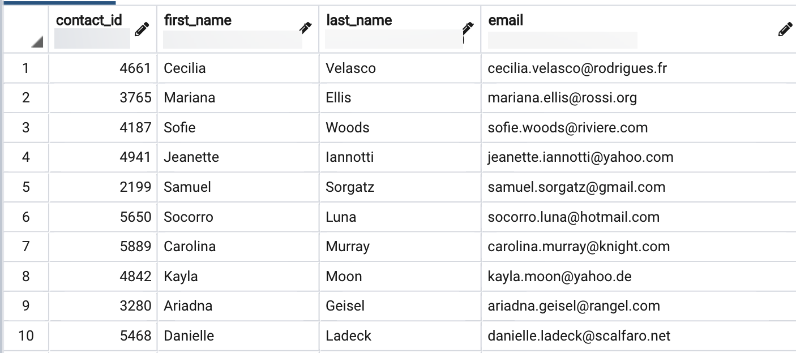

# ETL Homework: Crowdfunding ETL

For this assignment, you’ll use Python, Pandas, Jupyter Notebook, and either Python dictionary methods or regular expressions to extract and transform the contact information from a CSV file. When doing so, you’ll create a DataFrame that you’ll export as a CSV file. Then, you'll use the CSV file data to create an ERD and a table schema. Next, you’ll add the new table to the `crowdfunding_db` database that you created in the ETL mini project. Finally, you’ll upload the CSV file data and perform a data analysis by using SQL queries.

## Before You Begin

1. Create a new repository, named `Crowdfunding_ETL`, for this homework assignment.

    **Important:** Don’t add this assignment to an existing repository.

2. Clone the `Crowdfunding_ETL` repository to your computer.

## Instructions

1. Rename the `Extract_Transform_Load_Assignment_Starter_Code.ipynb` file to `Extract_Transform_Load_Assignment.ipynb`.

2. Choose one of the following two options for extracting and transforming the data from the `contacts.xlsx` file:

    * **Option 1:** Use Python dictionary methods.

    * **Option 2:** Use regular expressions.

3. If you chose Option 1, complete the following steps:

    * Import the `contacts.xlsx` file into a DataFrame.
    * Iterate through the DataFrame, converting each row to a dictionary. 
    * Iterate through each dictionary, doing the following:
      * Extract the dictionary values from the keys by using a Python list comprehension.
      * Add the values for each row to a new list. 
    * Create a new DataFrame that contains the extracted data. 
    * Split each "name" column value into a first and a last name, and place each in a new column.
    * Clean and then export the DataFrame as `contacts.csv`.

4. If you chose Option 2, complete the following steps:

    * Import the `contacts.xlsx` file into a DataFrame. 
    * Extract the "contact_id", "name", and "email" columns by using regular expressions.
    * Create a new DataFrame with the extracted data.
    * Convert the "contact_id" column to the integer type.
    * Split each "name" column value into a first and a last name, and place each in a new column.
    * Clean and then export the DataFrame as `contacts.csv`.

5. Check that your final DataFrame resembles the one in the following image:

    

    In the preceding image, notice that the DataFrame contains four columns: “contact_id”, “first_name”, “last_name”, and “email”.

6. Using your campaign [QuickDBD](http://quickdatabasediagrams.com) diagram, create a `contacts` table.

    **Note:** Make sure that each column has the appropriate data type, that a primary and a foreign key exist, and that the foreign key references the relevant table.

7. Save the crowdfunding relationship diagram as `crowdfunding_db_relationships.png` and the updated schema as a PostgreSQL file, named `crowdfunding_db_schema.sql`.

8. Copy the `crowdfunding_db_schema.sql` code, paste it into the pgAdmin Query Tool, and then run the query to create the `contacts` table with the appropriate foreign key constraints.

9. In the `crowdfunding_db` database, refresh your schema to confirm that the `contacts` table got created. 

10. Import the `contacts.csv` file data into the `contacts` table. 

11. To check the import, in the Query Tool, enter `SELECT * FROM contacts;`, and then run the query. The first 10 rows of the `contacts` table should match the following image:

    

12. Rename the `Crowdfunding_analysis_starter.sql` file to `Crowdfunding_database_analysis.sql`, and then perform the following queries:

    * Retrieve number of projects for each outcome, in descending order and grouped by outcome.
    * Display the percentage of the goal amount, in descending order, along with the campaign outcome, the total goal, and the pledged amounts, grouped by campaign outcome.
    * Display the percentage of the goal amount, in descending order, along with the category name, the total goal, and the pledged amounts, grouped by category name.
    * Display the percentage of the goal amount, in descending order, along with the subcategory name, the total goal, and the pledged amounts, grouped by subcategory name.
    * For the live projects, create a table that contains the first name, last name, and email address of each contact and that contains the amount left to reach the goal, in descending order. (This is because you need to send an email to the contacts for all the live projects to let them know how much of their goal amount is left.)

13. Upload the following to your `Crowdfunding_ETL` GitHub repository:

    * The `Extract_Transform_Load_Assignment.ipynb` file
    * All four CSV files, including the `contacts.csv` file
    * The ERD logical diagram, saved as `crowdfunding_db_relationships.png`
    * The database schema, saved as `crowdfunding_db_schema.sql`
    * The SQL queries, saved as `Crowdfunding_database_analysis.sql`

## Grading Requirements

This assignment will be evaluated against the rubric and assigned a grade according to the following table:

| Grade | Points |
| --- | --- |
| High Pass | 90 or more |
| Pass | 70&ndash;89 |
| Fail | 1&ndash;69 |
| Incomplete | 0 |

## Submission

Before you submit your assignment, check your work against the rubric to make sure that you’re meeting the requirements.

To submit your assignment for grading in Canvas, click Start Assignment, click the Website URL tab, add the URL of your `Crowdfunding_ETL` GitHub repository, and then click Submit. If you’d like to resubmit your work, communicate with your instructional team to request another opportunity to improve your grade.

---

Copyright 2022 2U. All Rights Reserved.